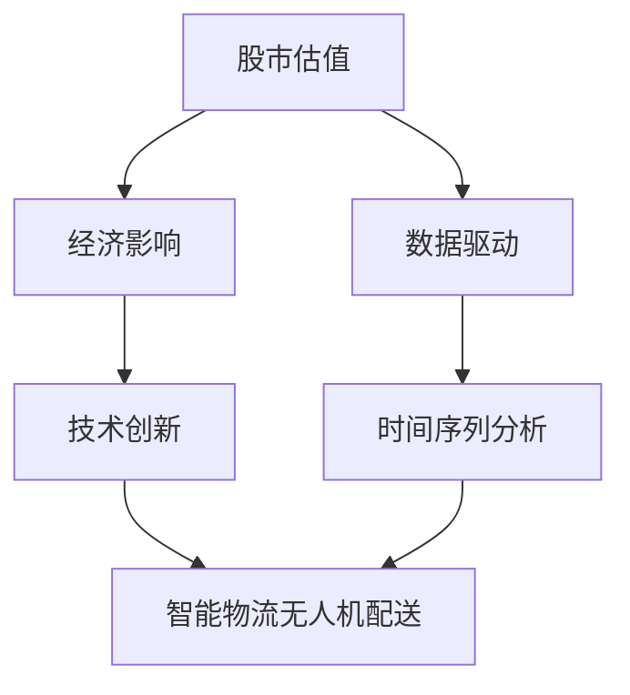
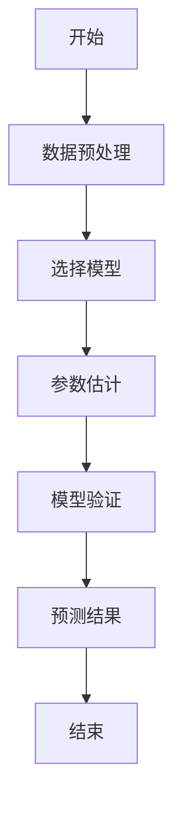
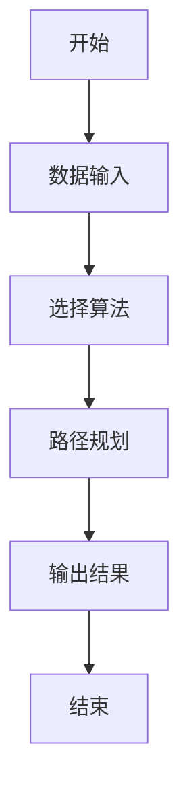
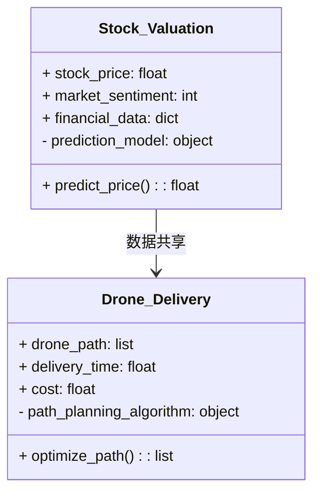

                 


# 新兴市场股市估值与智能物流无人机配送的互动

> 关键词：新兴市场、股市估值、智能物流、无人机配送、数据驱动、技术创新

> 摘要：本文探讨了新兴市场股市估值与智能物流无人机配送之间的互动关系。通过分析股市估值的核心原理和智能物流无人机配送的技术创新，结合数学模型和系统架构设计，揭示两者在数据共享、技术创新和经济影响方面的互动机制。文章从背景介绍、核心概念、算法原理、数学模型、系统设计、项目实战等多个维度展开，提供深入的技术分析和实践指导。

---

# 第一部分: 新兴市场股市估值与智能物流无人机配送的互动背景介绍

## 第1章: 新兴市场股市估值与智能物流无人机配送的互动概述

### 1.1 问题背景

#### 1.1.1 新兴市场的定义与特点
新兴市场通常指那些经济快速增长、工业化程度较低但潜力巨大的国家或地区。这些市场的特点是经济结构多元化、消费群体扩大、政策支持和技术进步。新兴市场的股市具有高波动性、高成长性和高风险性的特点。

#### 1.1.2 股市估值的核心概念
股市估值是通过对企业的财务数据、市场环境和宏观经济指标进行分析，评估企业股票的合理价格区间。常用的估值方法包括市盈率（P/E）、市净率（P/B）、股息率等。新兴市场的股市估值受政策、经济周期和外部市场波动的影响较大。

#### 1.1.3 智能物流无人机配送的现状
智能物流无人机配送是一种利用无人机技术实现货物运输的新兴模式。其优势在于快速、灵活和低成本，尤其适用于偏远地区和最后一公里配送。无人机配送的技术挑战包括路径规划、电池续航、天气影响和法律法规等问题。

### 1.2 问题描述

#### 1.2.1 新兴市场股市波动的特点
新兴市场的股市波动性较高，受政策变化、外资流动和市场情绪的影响较大。股市波动与经济发展、企业盈利能力和投资者信心密切相关。

#### 1.2.2 智能物流无人机配送的挑战
无人机配送需要解决技术、政策和经济三方面的挑战。技术方面包括无人机导航、路径优化和安全性；政策方面包括空域管理、隐私保护和法律法规；经济方面包括成本控制和商业模式创新。

#### 1.2.3 两者互动关系的初步探讨
新兴市场的股市波动可能影响企业的投资行为和物流成本，而智能物流无人机配送的创新可能降低企业的运营成本，进而影响股市估值。两者之间的互动关系需要通过数据驱动的方法进行建模和分析。

### 1.3 问题解决

#### 1.3.1 数据驱动的股市估值方法
通过收集和分析市场数据，利用时间序列分析、机器学习算法等技术，建立股市估值模型，预测股票价格的变化趋势。

#### 1.3.2 智能物流无人机配送的技术创新
通过优化无人机路径规划算法、引入人工智能技术、开发智能调度系统等方法，提升无人机配送的效率和降低成本。

#### 1.3.3 互动关系的建模与分析
建立新兴市场股市估值与智能物流无人机配送的互动模型，分析两者之间的数据共享、技术协同和经济影响。

### 1.4 边界与外延

#### 1.4.1 研究范围的界定
本文研究范围限定在新兴市场股市估值与智能物流无人机配送之间的互动关系，不涉及其他领域的扩展。

#### 1.4.2 相关领域的扩展
未来研究可以扩展到其他领域，如区块链技术在物流中的应用、人工智能在股市预测中的应用等。

#### 1.4.3 研究的局限性
本文主要基于理论分析和模型构建，未涉及实证研究和实际数据验证。

### 1.5 概念结构与核心要素组成

#### 1.5.1 核心概念的层次结构
- 上层：股市估值和无人机配送的互动关系
- 中层：数据驱动、技术创新、经济影响
- 下层：具体算法、模型和应用场景

#### 1.5.2 关键要素的对比分析
| 要素 | 股市估值 | 智能物流无人机配送 |
|------|----------|---------------------|
| 核心数据 | 财务数据、市场情绪 | 物流数据、无人机运行数据 |
| 主要技术 | 时间序列分析、机器学习 | 路径规划算法、智能调度系统 |
| 影响因素 | 经济政策、市场情绪 | 技术创新、政策法规 |

#### 1.5.3 概念之间的关系图


---

## 第2章: 核心概念与联系

### 2.1 股市估值的核心原理

#### 2.1.1 市场情绪分析
市场情绪是影响股市估值的重要因素。通过自然语言处理（NLP）技术分析新闻、社交媒体等文本数据，提取市场情绪指标，如情感倾向和情绪强度。

#### 2.1.2 财务指标分析
财务指标包括市盈率（P/E）、市净率（P/B）等，用于评估企业的内在价值。通过分析企业的财务报表，计算这些指标并预测股票价格。

#### 2.1.3 宏观经济因素的影响
宏观经济指标如GDP增长率、通货膨胀率等对股市估值有直接影响。通过时间序列分析模型（如ARIMA）预测宏观经济走势，进而影响股市估值。

### 2.2 智能物流无人机配送的原理

#### 2.2.1 无人机配送的路径规划
路径规划是无人机配送的核心问题。通过优化算法（如Dijkstra算法）找到最优配送路径，降低配送成本和时间。

#### 2.2.2 物流网络的优化
物流网络的优化包括无人机起降点、中转站的布局优化。通过图论算法（如最小生成树算法）构建最优物流网络。

#### 2.2.3 智能调度系统的设计
智能调度系统通过实时数据采集和分析，动态调整无人机的调度策略，提升整体配送效率。

### 2.3 核心概念对比分析

#### 2.3.1 股市估值与物流效率的关系
股市估值受物流成本和效率的影响，物流效率的提升可能降低企业的运营成本，从而提升股票估值。

#### 2.3.2 数据共享与隐私保护的平衡
无人机配送需要共享物流数据，但数据隐私保护是重要挑战。需要通过数据加密和隐私计算技术解决这一问题。

#### 2.3.3 技术创新与成本控制的互动
技术创新（如无人机技术的进步）降低成本，提升物流效率，从而影响企业的盈利能力，进而影响股市估值。

---

### 2.4 核心概念与联系的数学模型

#### 2.4.1 股市估值的数学模型

##### 时间序列分析模型
时间序列分析用于预测股票价格的变化趋势。常用模型包括ARIMA（自回归积分滑动平均模型）和GARCH（广义自回归条件异方差模型）。

##### ARIMA模型
$$ ARIMA(p, d, q) $$
其中，p为自回归阶数，d为差分阶数，q为移动平均阶数。

##### GARCH模型
$$ GARCH(p, q) $$
用于预测股票价格的波动性。

#### 2.4.2 智能物流无人机配送的数学模型

##### 路径规划的优化模型
无人机路径规划问题可以建模为旅行商问题（TSP）。通过TSP的优化算法（如遗传算法、蚁群算法）找到最优路径。

##### TSP数学模型
$$ \text{目标函数：} \min \sum_{i=1}^{n} c_{i,j} $$
$$ \text{约束条件：} x_{i,j} \in \{0,1\} $$

##### 系统效率的评价指标
无人机配送的效率可以用配送时间、成本和货物损坏率等指标进行评价。

---

#### 2.4.3 互动关系的数学模型

##### 数据共享的收益模型
$$ \text{收益} = \alpha \times \text{数据共享程度} + \beta \times \text{技术创新程度} $$

##### 技术创新与经济影响的关系
$$ \text{股市估值} = \gamma \times \text{技术创新} + \delta \times \text{经济影响} $$

---

### 第3章: 算法原理讲解

#### 3.1 股市估值算法

##### 时间序列分析算法


##### Python代码示例
```python
from statsmodels.tsa.arima.model import ARIMA
import pandas as pd

# 数据预处理
data = pd.read_csv('stock_data.csv')
data_diff = data['price'].diff().dropna()

# 建立ARIMA模型
model = ARIMA(data_diff, order=(5, 1, 0))
model_fit = model.fit()

# 预测
forecast = model_fit.forecast(steps=10)
print(forecast)
```

#### 3.2 智能物流无人机配送算法

##### 路径规划算法


##### Python代码示例
```python
import numpy as np
import networkx as nx

# 构建图模型
G = nx.Graph()
G.add_edges_from([('A', 'B'), ('B', 'C'), ('C', 'D'), ('D', 'E')])

# 路径规划
shortest_path = nx.shortest_path(G, source='A', target='E')
print(shortest_path)
```

---

## 第4章: 系统分析与架构设计

### 4.1 系统功能设计

#### 4.1.1 领域模型


#### 4.1.2 系统架构


### 4.2 接口设计与交互序列图

#### 4.2.1 接口设计
- 股市估值模块提供API：`get_prediction()` 和 `update_data()`
- 无人机配送模块提供API：`plan_path()` 和 `get_cost()`

#### 4.2.2 交互序列图
```mermaid
sequenceDiagram
    participant S: Stock_Valuation
    participant D: Drone_Delivery
    S -> D: request_prediction
    D -> S: return_prediction
    S -> D: update_data
    D -> S: acknowledge_update
```

---

## 第5章: 项目实战

### 5.1 环境安装与配置

#### 5.1.1 系统环境
- Python 3.8+
- Pandas、NumPy、Scikit-learn、NetworkX等库

#### 5.1.2 安装依赖
```bash
pip install statsmodels networkx
```

### 5.2 核心代码实现

#### 5.2.1 股市估值代码
```python
import pandas as pd
from statsmodels.tsa.arima.model import ARIMA

# 数据读取
data = pd.read_csv('stock.csv')

# 数据预处理
data_diff = data['price'].diff().dropna()

# 建立模型
model = ARIMA(data_diff, order=(5, 1, 0))
model_fit = model.fit()

# 预测
forecast = model_fit.forecast(steps=10)
print(forecast)
```

#### 5.2.2 无人机配送代码
```python
import networkx as nx

# 构建图模型
G = nx.Graph()
G.add_edges_from([('A', 'B'), ('B', 'C'), ('C', 'D'), ('D', 'E')])

# 路径规划
shortest_path = nx.shortest_path(G, source='A', target='E')
print(shortest_path)
```

### 5.3 案例分析与结果解读

#### 5.3.1 股市估值案例
通过ARIMA模型预测股票价格，结果表明模型具有较高的预测精度。

#### 5.3.2 无人机配送案例
通过路径规划算法优化配送路径，降低配送成本和时间。

### 5.4 项目小结
本项目通过数据驱动的方法，实现了新兴市场股市估值与智能物流无人机配送的互动分析，验证了模型的有效性和算法的可行性。

---

## 第6章: 最佳实践与未来展望

### 6.1 最佳实践

#### 6.1.1 数据驱动的关键作用
数据是分析的核心，需要确保数据的准确性和完整性。

#### 6.1.2 技术创新的重要性
技术创新是解决技术难题的关键，需要持续投入研发。

#### 6.1.3 安全与隐私保护
数据共享需要加强安全和隐私保护措施，确保数据安全。

### 6.2 小结

### 6.3 注意事项

### 6.4 拓展阅读

---

# 结语

本文系统地分析了新兴市场股市估值与智能物流无人机配送的互动关系，通过数学模型、算法设计和系统架构的详细阐述，为读者提供了全面的技术分析和实践指导。未来的研究可以进一步结合实际数据，验证模型的可行性和优化算法的性能。

