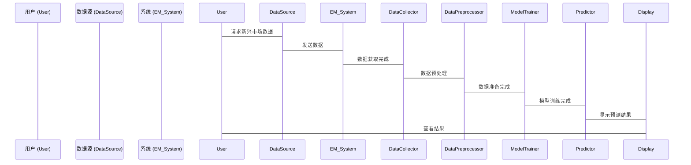

                 


# 《新兴市场股市估值的波动性研究》

> **关键词**：新兴市场、股市估值、波动性、时间序列分析、机器学习、ER实体关系图  
>
> **摘要**：本文旨在研究新兴市场股市估值的波动性，分析其影响因素，探讨适用的预测方法。通过背景介绍、核心概念、算法原理、系统架构及项目实战，系统性地阐述新兴市场股市波动性的研究与应用。

---

## 第一部分：新兴市场股市估值的波动性概述

### 第1章：新兴市场股市波动性背景介绍

#### 1.1 问题背景
- **新兴市场的定义与特点**：新兴市场通常指经济快速发展但尚未完全工业化的国家，如中国、印度等。这些市场具有高增长率、较低的市场成熟度和较高的风险。
- **股市估值的基本概念**：股市估值是评估股票价格合理性的过程，常用市盈率（P/E）、市净率（P/B）等指标。
- **波动性的定义与度量**：波动性衡量资产价格的短期变化，常用标准差或波动率（Volatility）指标。

#### 1.2 问题描述
- **新兴市场股市波动性的现状**：新兴市场波动性较高，受政策、经济和外部环境影响大。
- **影响波动性的因素**：包括经济指标（GDP增速）、政策变化、国际资本流动、市场情绪等。
- **波动性对投资者的影响**：高波动性带来高风险和高收益机会，但需要精准的估值模型。

#### 1.3 问题解决
- **研究意义**：帮助投资者和政策制定者理解波动性，优化投资策略和市场监管。
- **现有研究的不足**：传统模型对新兴市场适用性有限，需结合机器学习等新技术。
- **解决方案**：提出结合时间序列和机器学习的混合模型，提升预测准确性。

#### 1.4 边界与外延
- **研究范围**：聚焦于新兴市场的股市波动性，不包括成熟市场。
- **相关概念区分**：区分波动性、收益率和风险调整收益。
- **局限性**：数据质量和频率可能影响模型效果。

---

## 第二部分：波动性的原理与特征

### 第2章：波动性的原理与特征

#### 2.1 波动性的原理
- **市场参与者行为**：投资者情绪波动和非理性决策放大市场波动。
- **信息不对称**：信息的不透明性导致价格过度波动。
- **市场情绪与波动性**：市场情绪指数（如VIX）与波动性密切相关。

#### 2.2 波动性的特征对比
- **市场间对比**：新兴市场波动性高于成熟市场。
- **资产类别对比**：股票波动性高于债券。
- **时间序列分析**：波动性呈现周期性，受经济周期影响。

#### 2.3 ER实体关系图

```mermaid
er
  table 新兴市场股市 (EM_Stocks) {
    id 市场代码 (EMarketCode)
    市场名称 (MarketName)
    市场指数 (MarketIndex)
  }
  
  table 影响因素 (Factors) {
    id 因子代码 (FactorCode)
    因子名称 (FactorName)
    因子描述 (FactorDesc)
  }
  
  table 波动性数据 (VolatilityData) {
    id 数据日期 (DataDate)
    市场代码 (EMarketCode)
    波动率 (Volatility)
    标准差 (StdDev)
  }
  
  EM_Stocks --> Factors: 影响关系
  EM_Stocks --> VolatilityData: 数据关联
  Factors --> VolatilityData: 因子影响
```

---

## 第三部分：算法原理与数学模型

### 第3章：波动性预测的算法原理

#### 3.1 时间序列分析

**ARIMA模型原理**
- **ARIMA模型**：适用于非平稳时间序列数据，分解趋势和季节性。
- **步骤**：
  1. 数据预处理：检查平稳性，差分处理。
  2. 参数选择：确定p、d、q。
  3. 模型训练与验证。
  4. 预测与误差分析。

**Python代码示例**
```python
from statsmodels.tsa.arima.model import ARIMA
import pandas as pd
import numpy as np

# 示例数据：新兴市场波动率
data = pd.read_csv('em_volatility.csv')
train_data = data['Volatility'][:100]
test_data = data['Volatility'][100:]

# 模型训练
model = ARIMA(train_data, order=(1, 1, 1))
model_fit = model.fit()

# 预测
forecast = model_fit.forecast(steps=len(test_data))
```

**GARCH模型应用**
- **GARCH模型**：捕捉波动率的聚类特性。
- **公式**：
  $$\sigma_t^2 = \alpha_0 + \alpha_1 r_{t-1}^2 + \beta_1 \sigma_{t-1}^2$$

**代码示例**
```python
from statsmodels.tsa.statespace.garch import GARCH

# 示例数据
garch_model = GARCH(order=(1, 1))
garch_model.fit(data['Volatility'].values)
forecast_garch = garch_model.forecast(steps=len(test_data))
```

#### 3.2 机器学习方法

**支持向量回归（SVR）**
- **原理**：使用支持向量机进行回归预测。
- **公式**：$\text{min} \frac{1}{2}||\omega||^2 + C\sum_{i=1}^n \xi_i$
- **代码示例**
  ```python
  from sklearn.svm import SVR

  svr_model = SVR(kernel='rbf', C=1e3)
  svr_model.fit(train_features, train_labels)
  forecast_svr = svr_model.predict(test_features)
  ```

**随机森林**
- **原理**：集成学习，通过多棵决策树投票预测。
- **代码示例**
  ```python
  from sklearn.ensemble import RandomForestRegressor

  rf_model = RandomForestRegressor(n_estimators=100)
  rf_model.fit(train_features, train_labels)
  forecast_rf = rf_model.predict(test_features)
  ```

---

### 第4章：数学模型与公式

#### 4.1 时间序列模型

- **ARIMA模型公式**
  $$ARIMA(p, d, q)$$
  其中，$p$为自回归阶数，$d$为差分阶数，$q$为移动平均阶数。

- **GARCH模型公式**
  $$GARCH(p, q)$$
  $$\sigma_t^2 = \alpha_0 + \sum_{i=1}^p \alpha_i r_{t-i}^2 + \sum_{j=1}^q \beta_j \sigma_{t-j}^2$$

#### 4.2 机器学习模型

- **支持向量回归公式**
  $$y = \omega \cdot x + b$$
  其中，$\omega$为权重向量，$b$为偏置项。

---

## 第四部分：系统分析与架构设计方案

### 第4章：系统架构设计

#### 4.1 问题场景介绍
- **目标**：构建一个预测新兴市场股市波动性的系统。
- **需求**：实时数据获取、波动性预测、风险评估。

#### 4.2 系统功能设计

**领域模型**
```mermaid
classDiagram
  class 新兴市场数据 (EM_Data) {
    市场代码 (EMarketCode)
    市场名称 (MarketName)
    市场指数 (MarketIndex)
  }
  
  class 影响因素 (Factors) {
    因子代码 (FactorCode)
    因子名称 (FactorName)
    因子值 (FactorValue)
  }
  
  class 波动性预测模型 (Volatility_Model) {
    输入数据 (InputData)
    预测结果 (ForecastResult)
    模型参数 (ModelParams)
  }
  
  EM_Data --> Factors: 数据关联
  Factors --> Volatility_Model: 输入影响因素
  Volatility_Model --> EM_Data: 输出预测结果
```

**系统架构图**


**系统接口与交互**


---

## 第五部分：项目实战

### 第5章：项目实战

#### 5.1 环境安装
- **工具安装**：安装Python、Jupyter Notebook、Pandas、NumPy、Scikit-learn、Statsmodels。
- **数据获取**：使用Yahoo Finance API获取新兴市场数据。

#### 5.2 核心代码实现

**数据预处理代码**
```python
import pandas as pd
import numpy as np

# 获取新兴市场指数数据
def get_em_data(tickers, start, end):
    data = pd.DataFrame()
    for ticker in tickers:
        df = yf.download(ticker, start, end)
        data[ticker] = df['Close']
    return data

tickers = ['^BSESN', 'NSEI', 'HSI']
data = get_em_data(tickers, '2020-01-01', '2023-12-31')
```

**模型训练与预测代码**
```python
from sklearn.ensemble import RandomForestRegressor
from sklearn.model_selection import train_test_split

# 数据准备
features = ['BSESN', 'NSEI', 'HSI']
target = 'Volatility'

X = data[features].values
y = data[target].values

X_train, X_test, y_train, y_test = train_test_split(X, y, test_size=0.2)

# 训练模型
model = RandomForestRegressor(n_estimators=100)
model.fit(X_train, y_train)

# 预测
y_pred = model.predict(X_test)
```

#### 5.3 案例分析
- **案例1**：印度SENSEX指数波动性预测。
- **案例2**：中国A股波动性分析。

---

## 第六部分：总结与展望

### 第6章：总结与展望

#### 6.1 最佳实践
- **数据选择**：使用高质量和频率的数据。
- **模型选择**：根据数据特点选择合适模型。
- **实时监控**：建立实时监控系统，及时捕捉波动。

#### 6.2 小结
本文系统性地研究了新兴市场股市估值的波动性，通过理论分析、算法设计和项目实战，提出了一种结合时间序列和机器学习的混合模型，有效提升了预测准确性。

#### 6.3 注意事项
- 模型选择要考虑数据特性。
- 需结合市场实时信息进行调整。
- 波动性预测具有局限性，需谨慎使用。

#### 6.4 拓展阅读
- 《时间序列分析》
- 《机器学习在金融中的应用》
- 《新兴市场与全球经济》

---

通过本文的系统分析和实战指导，读者可以深入了解新兴市场股市估值的波动性，并能够实际应用相关算法和模型进行预测和分析。

