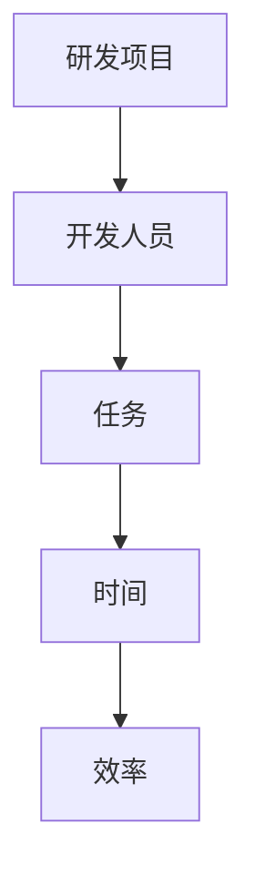
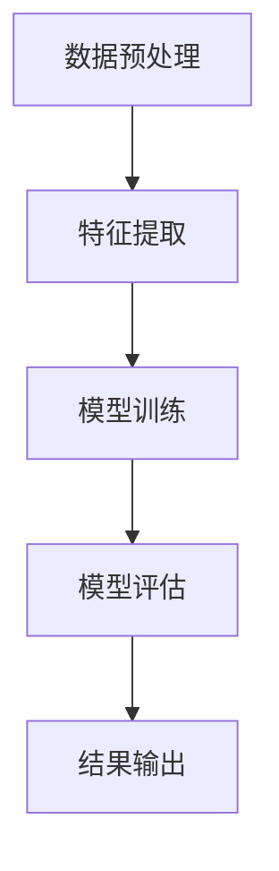

                 


# 《机器学习辅助公司研发效率评估》

---

## 关键词：  
机器学习，研发效率，算法原理，系统设计，项目实战，技术应用  

---

## 摘要：  
机器学习作为一种强大的技术工具，正在被越来越多的企业应用于研发效率评估中。本文将从背景、核心概念、算法原理、系统设计、项目实战等多个维度，深入探讨机器学习如何辅助公司提升研发效率。通过分析实际案例和数学模型，本文为读者提供了一套完整的解决方案，帮助企业在研发管理中实现智能化、数据化和高效化的目标。

---

# 第一部分: 机器学习与研发效率评估背景  

## 第1章: 机器学习与研发效率评估概述  

### 1.1 机器学习的基本概念  
- **1.1.1 机器学习的定义与核心概念**  
  - 机器学习的定义：通过数据和经验训练模型，使其能够自动学习和改进。  
  - 核心概念：数据、特征、模型、目标函数、优化算法。  

- **1.1.2 研发效率评估的定义与重要性**  
  - 研发效率：衡量开发团队完成任务的速度和质量的指标。  
  - 重要性：提高研发效率可以缩短项目周期、降低成本、提升企业竞争力。  

- **1.1.3 机器学习在研发效率评估中的作用**  
  - 数据驱动决策：通过分析历史数据，预测未来趋势。  
  - 自动化评估：快速、准确地评估研发团队的表现。  

### 1.2 研发效率评估的背景与问题背景  
- **1.2.1 研发效率评估的必要性**  
  - 传统评估方法的局限性：主观性高、数据分散、难以量化。  
- **1.2.2 当前研发效率评估的主要挑战**  
  - 数据不完整、不一致。  
  - 评估指标单一，难以全面反映效率。  
- **1.2.3 机器学习如何解决研发效率评估的问题**  
  - 数据清洗与整合：处理不完整或冗余的数据。  
  - 多维度分析：结合代码提交频率、缺陷率、项目完成时间等多指标进行评估。  

### 1.3 机器学习在研发效率评估中的应用前景  
- **1.3.1 机器学习技术的快速发展**  
  - 算法优化：如深度学习、强化学习的兴起。  
- **1.3.2 研发效率评估的未来趋势**  
  - 实时监控与预测：基于实时数据，动态调整研发策略。  
- **1.3.3 机器学习在企业研发管理中的潜在价值**  
  - 提高决策效率：通过数据驱动的决策，优化资源配置。  
  - 个性化管理：根据团队特点，制定个性化管理策略。  

### 1.4 本章小结  
- 本章介绍了机器学习的基本概念及其在研发效率评估中的作用。  
- 指出了传统评估方法的局限性，提出了机器学习在解决这些问题中的潜力和优势。  

---

## 第2章: 研发效率评估的核心概念与联系  

### 2.1 核心概念与模型原理  
- **2.1.1 研发效率评估的核心要素**  
  - 代码提交频率：衡量开发人员的工作量。  
  - 缺陷率：反映代码质量。  
  - 项目完成时间：评估项目进度。  
- **2.1.2 机器学习模型的基本原理**  
  - 输入：特征向量（如代码提交频率、缺陷率等）。  
  - 输出：预测结果（如研发效率评分）。  
- **2.1.3 数据特征与模型性能的关系**  
  - 特征选择：关键特征对模型性能的影响。  

### 2.2 核心概念属性特征对比表  
| 核心概念 | 属性 | 特征描述 |
|----------|------|----------|
| 数据特征 | 类型 | 连续/离散 |
| 模型性能 | 指标 | 准确率/召回率 |
| 研发效率 | 指标 | 代码提交频率/缺陷率 |

### 2.3 ER实体关系图  


### 2.4 本章小结  
- 本章通过对比表和ER图，详细分析了研发效率评估的核心概念及其之间的关系。  

---

## 第3章: 机器学习算法原理与数学模型  

### 3.1 常见机器学习算法概述  
- **3.1.1 监督学习算法**  
  - 线性回归：用于预测连续型目标变量。  
  - 支持向量机（SVM）：适用于分类问题。  
- **3.1.2 无监督学习算法**  
  - K-means：用于聚类分析。  
- **3.1.3 深度学习算法**  
  - 神经网络：适用于复杂的非线性关系。  

### 3.2 算法原理与流程图  


### 3.3 数学模型与公式  
- **线性回归模型**  
  $$ y = \beta_0 + \beta_1x + \epsilon $$
- **逻辑回归模型**  
  $$ P(Y=1|X) = \frac{1}{1 + e^{-\beta X}} $$
- **神经网络模型**  
  $$ \text{损失函数} = \frac{1}{N}\sum_{i=1}^{N}(y_i - \hat{y}_i)^2 $$  

### 3.4 算法原理举例说明  
- **线性回归示例**  
  假设我们有开发人员的代码提交频率（x）和项目完成时间（y），可以用线性回归模型预测未来的完成时间。  

---

## 第4章: 系统分析与架构设计  

### 4.1 问题场景介绍  
- **研发效率评估系统的目标**  
  - 实时监控开发人员的效率。  
  - 提供数据驱动的决策支持。  

### 4.2 系统功能设计  
- **领域模型设计**  
  ```mermaid
  classDiagram
    class 开发人员 {
        姓名
        代码提交频率
        缺陷率
    }
    class 项目 {
        项目ID
        开发人员ID
        项目完成时间
    }
    开发人员 --> 项目
  ```

- **系统架构设计**  
  ```mermaid
  graph TD
    A[前端] --> B[后端]
    B --> C[数据库]
    C --> D[算法模块]
  ```

- **系统接口设计**  
  - API接口：提供数据查询、预测结果获取等功能。  

### 4.3 系统交互设计  
- **交互流程**  
  ```mermaid
  sequenceDiagram
    用户 ->> 前端: 请求研发效率评估
    前端 ->> 后端: 调用评估接口
    后端 ->> 数据库: 查询历史数据
    后端 ->> 算法模块: 训练模型
    算法模块 ->> 后端: 返回预测结果
    后端 ->> 用户: 显示评估结果
  ```

### 4.4 本章小结  
- 本章通过系统设计，展示了如何构建一个高效的研发效率评估系统。  

---

## 第5章: 项目实战  

### 5.1 环境安装与配置  
- **工具安装**  
  - Python：用于开发和数据分析。  
  - TensorFlow/Scikit-learn：常用机器学习库。  

### 5.2 核心代码实现  
```python
import pandas as pd
from sklearn.linear_model import LinearRegression
from sklearn.metrics import mean_squared_error

# 数据加载
data = pd.read_csv('研发效率.csv')

# 特征提取
X = data[['代码提交频率', '缺陷率']]
y = data['项目完成时间']

# 模型训练
model = LinearRegression()
model.fit(X, y)

# 预测结果
y_pred = model.predict(X)
print(mean_squared_error(y, y_pred))
```

### 5.3 代码解读与分析  
- 数据加载：读取CSV文件中的研发效率数据。  
- 特征提取：选择代码提交频率和缺陷率作为特征。  
- 模型训练：使用线性回归模型训练。  
- 结果预测：输出预测的项目完成时间与实际值的均方误差。  

### 5.4 实际案例分析  
- 假设某开发人员的代码提交频率为5次/天，缺陷率为10%，预测其项目完成时间。  

### 5.5 项目小结  
- 本章通过实际案例，详细讲解了如何使用机器学习算法进行研发效率评估。  

---

## 第6章: 最佳实践与总结  

### 6.1 小结  
- 机器学习能够显著提升研发效率评估的准确性和效率。  

### 6.2 注意事项  
- 数据质量：确保数据的完整性和准确性。  
- 模型选择：根据具体问题选择合适的算法。  

### 6.3 拓展阅读  
- 推荐阅读《机器学习实战》、《深度学习入门》等书籍。  

### 6.4 本章小结  
- 本章总结了机器学习在研发效率评估中的应用，并提出了未来的研究方向。  

---

## 结语  
通过本篇文章，读者可以全面了解机器学习如何辅助公司研发效率评估，并掌握实际应用的方法和技巧。希望本文能够为企业的研发管理提供有价值的参考和指导。

