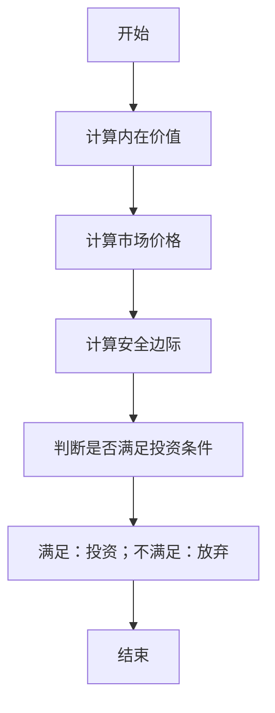
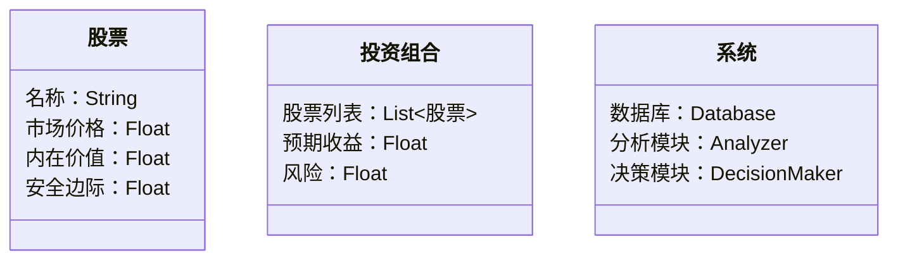
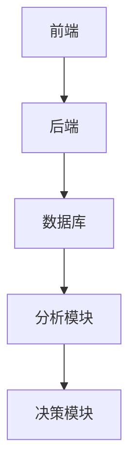
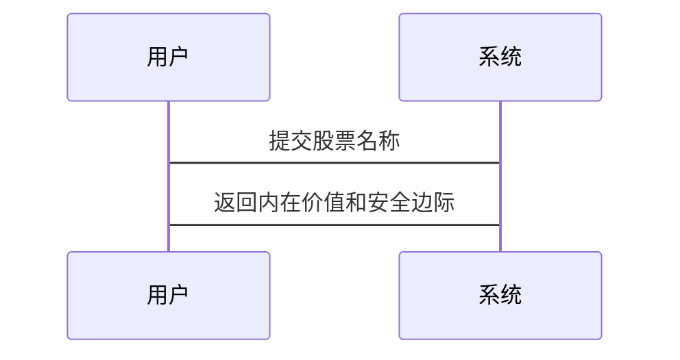

                 


# 格雷厄姆特价股票理论在私募股权投资中的应用

## 关键词：
格雷厄姆、特价股票、私募股权、投资策略、价值投资、风险管理、数学模型

## 摘要：
本文系统地探讨了格雷厄姆特价股票理论在私募股权投资中的应用。首先，介绍了格雷厄姆投资理论的背景与核心概念，分析了其在私募股权投资中的独特价值。接着，详细阐述了格雷厄姆理论的核心数学模型与算法，结合私募股权投资的特点，提出了改进的组合优化模型。通过实际案例分析，展示了如何将格雷厄姆理论应用于私募股权项目的筛选与估值。最后，总结了格雷厄姆理论在私募股权投资中的优势与挑战，并提出了相应的投资策略建议。

---

# 第一部分: 格雷厄姆特价股票理论的背景与核心概念

## 第1章: 格雷厄姆特价股票理论的背景与核心概念

### 1.1 格雷厄姆投资理论的起源与发展

#### 1.1.1 投资理论的历史演变
- **早期投资理论**：19世纪末至20世纪初，投资理论主要基于市场波动和情绪分析。
- **格雷厄姆的贡献**：本杰明·格雷厄姆（Benjamin Graham）在20世纪30年代提出了“价值投资”理念，强调基于企业的内在价值进行投资。
- **现代发展**：现代金融学将格雷厄姆的理论与数学模型相结合，发展出更复杂的量化投资策略。

#### 1.1.2 格雷厄姆的价值投资理念
- **核心思想**：投资的本质是购买企业的一部分，而非投机市场价格波动。
- **安全边际**：格雷厄姆强调在购买股票时，市场价格应显著低于其内在价值，以确保投资的安全性。
- **长期视角**：价值投资强调长期持有，避免短期市场波动的干扰。

#### 1.1.3 格雷厄姆投资理论与私募股权投资的契合点
- **私募股权投资的特点**：私募股权关注企业的长期价值，注重企业的基本面分析，与格雷厄姆的价值投资理念高度契合。
- **市场波动的应对**：私募股权的长期持有策略与格雷厄姆的安全边际理念一致，能够在市场波动中保持稳定性。

### 1.2 格雷厄姆特价股票理论的核心概念

#### 1.2.1 特价股票的定义
- **特价股票**：指市场价格显著低于其内在价值的股票，通常出现在市场恐慌或企业短期困境时期。
- **内在价值公式**：$$ V = \frac{E}{k} $$
  其中，E为企业的预期收益，k为折现率。

#### 1.2.2 格雷厄姆对特价股票的筛选标准
- **盈利能力分析**：重点关注企业的净利润率、ROE（净资产收益率）等指标。
- **偿债能力分析**：企业是否具备健康的资产负债表，尤其是流动比率和速动比率。
- **市盈率与市净率的比较**：$$ PE = \frac{P}{E} \quad \text{和} \quad PB = \frac{P}{B} $$
  其中，P为股价，E为每股收益，B为每股净资产。

#### 1.2.3 特价股票与普通股票的区别
| 特性 | 特价股票 | 普通股票 |
|------|----------|----------|
| 市场价格 | 远低于内在价值 | 接近或高于内在价值 |
| 投资风险 | 较低，安全边际高 | 较高，受市场波动影响大 |
| 投资期限 | 长期持有 | 短期交易为主 |

### 1.3 格雷厄姆投资理论在私募股权投资中的应用背景

#### 1.3.1 私募股权投资的定义与特点
- **私募股权投资**：通过非公开市场投资于未上市企业，通常以控制权为目标。
- **特点**：
  - 高风险高回报
  - 投资期限长
  - 强调企业的基本面分析

#### 1.3.2 格雷厄姆理论与私募股权投资的契合点
- **价值发现**：私募股权投资的核心是发现被低估的企业，与格雷厄姆的特价股票理论一致。
- **长期视角**：私募股权的长期持有策略与格雷厄姆的安全边际理念高度契合。

#### 1.3.3 当前市场环境下的应用价值
- **市场波动加剧**：近年来，市场波动性增加，格雷厄姆的理论在不确定环境中更具优势。
- **企业估值机会**：私募股权可以通过深入分析企业基本面，发现特价股票的投资机会。

### 1.4 本章小结
本章介绍了格雷厄姆投资理论的背景与核心概念，分析了其在私募股权投资中的应用价值。通过对比特价股票与普通股票的特点，明确了格雷厄姆理论在私募股权投资中的独特优势。

---

## 第2章: 格雷厄姆特价股票理论的核心概念分析

### 2.1 格雷厄姆投资理论的核心要素

#### 2.1.1 内在价值的计算公式
- **内在价值公式**：$$ V = \frac{E}{k} $$
  其中，E为企业的预期收益，k为折现率。
- **预期收益的计算**：$$ E = \text{净利润} + \text{折旧与摊销} - \text{资本支出} $$

#### 2.1.2 市场价值与内在价值的关系
- **市场价值公式**：$$ P = \text{股价} $$
- **安全边际公式**：$$ MS = V - P $$

#### 2.1.3 安全边际的定义与作用
- **安全边际的作用**：通过安全边际，投资者可以在市场价格波动时，确保投资的安全性。
- **安全边际的应用**：$$ \text{安全边际率} = \frac{V - P}{V} \times 100\% $$

### 2.2 格雷厄姆特价股票的筛选标准

#### 2.2.1 盈利能力分析
- **盈利能力公式**：$$ \text{净利润率} = \frac{\text{净利润}}{\text{收入}} \times 100\% $$
- **ROE公式**：$$ \text{ROE} = \frac{\text{净利润}}{\text{股东权益}} \times 100\% $$

#### 2.2.2 偿债能力分析
- **流动比率公式**：$$ \text{流动比率} = \frac{\text{流动资产}}{\text{流动负债}} $$
- **速动比率公式**：$$ \text{速动比率} = \frac{\text{速动资产}}{\text{流动负债}} $$

#### 2.2.3 市盈率与市净率的比较
- **市盈率公式**：$$ PE = \frac{P}{E} $$
- **市净率公式**：$$ PB = \frac{P}{B} $$

### 2.3 格雷厄姆投资理论与现代金融学的联系

#### 2.3.1 现代投资组合理论
- **现代投资组合理论的核心**：通过分散投资降低风险。
- **与格雷厄姆理论的联系**：格雷厄姆的安全边际理念与投资组合理论的分散化理念相辅相成。

#### 2.3.2 CAPM模型与格雷厄姆理论的结合
- **CAPM公式**：$$ R_i = R_f + \beta_i (R_m - R_f) $$
  其中，\( R_i \) 为资产的预期收益，\( R_f \) 为无风险利率，\( \beta_i \) 为资产的贝塔系数，\( R_m \) 为市场预期收益。

#### 2.3.3 风险与收益的平衡
- **风险收益平衡**：通过安全边际和分散化投资，实现风险与收益的最佳平衡。

### 2.4 本章小结
本章详细分析了格雷厄姆投资理论的核心概念，包括内在价值、安全边际和筛选标准。同时，探讨了格雷厄姆理论与现代金融学的联系，为后续的私募股权投资应用奠定了理论基础。

---

## 第3章: 格雷厄姆特价股票理论的数学模型与算法

### 3.1 内在价值计算模型

#### 3.1.1 内在价值公式
$$ V = \frac{E}{k} $$
其中，\( E \) 为企业的预期收益，\( k \) 为折现率。

#### 3.1.2 预期收益的计算
$$ E = \text{净利润} + \text{折旧与摊销} - \text{资本支出} $$

### 3.2 安全边际计算模型

#### 3.2.1 安全边际公式
$$ MS = V - P $$

#### 3.2.2 安全边际率公式
$$ \text{安全边际率} = \frac{V - P}{V} \times 100\% $$

### 3.3 组合优化模型

#### 3.3.1 最优化投资组合公式
$$ \text{Minimize } \sigma^2 \text{ subject to } \mu \geq \text{target return} $$
其中，\( \sigma \) 为标准差，\( \mu \) 为期望收益。

#### 3.3.2 风险调整后的内在价值公式
$$ V_{\text{调整后}} = V \times (1 - \alpha \times \sigma^2) $$
其中，\( \alpha \) 为风险调整系数。

### 3.4 算法流程图



### 3.5 本章小结
本章通过数学模型和算法，详细阐述了格雷厄姆特价股票理论的内在价值计算、安全边际分析和组合优化方法。这些模型为私募股权投资提供了科学的决策依据。

---

## 第4章: 系统架构与设计方案

### 4.1 系统功能设计

#### 4.1.1 系统功能模块
- **数据采集模块**：获取企业财务数据。
- **价值评估模块**：计算内在价值和安全边际。
- **风险评估模块**：评估投资组合风险。
- **决策支持模块**：提供投资建议。

#### 4.1.2 领域模型类图



### 4.2 系统架构设计

#### 4.2.1 系统架构图



### 4.3 系统接口设计

#### 4.3.1 数据接口
- **输入接口**：接收企业的财务数据和市场数据。
- **输出接口**：返回内在价值、安全边际和投资建议。

#### 4.3.2 交互流程



### 4.4 本章小结
本章通过系统架构设计，展示了如何将格雷厄姆特价股票理论应用于私募股权投资的实践中。系统设计包括数据采集、价值评估和决策支持等模块，为投资者提供了高效的决策工具。

---

## 第5章: 项目实战

### 5.1 环境安装

#### 5.1.1 安装Python环境
- 使用Anaconda安装Python 3.8及以上版本。

#### 5.1.2 安装依赖库
```bash
pip install numpy pandas matplotlib
```

### 5.2 核心代码实现

#### 5.2.1 数据获取模块
```python
import pandas as pd

def get_stock_data(ticker):
    # 获取股票数据
    return pd.DataFrame()
```

#### 5.2.2 内在价值计算模块
```python
def calculate_intrinsic_value(ticker):
    data = get_stock_data(ticker)
    E = data['净利润'].mean()
    k = 0.1  # 假设折现率为10%
    V = E / k
    return V
```

#### 5.2.3 安全边际计算模块
```python
def calculate_margin_of_safety(ticker):
    V = calculate_intrinsic_value(ticker)
    P = data['股价'].mean()
    MS = V - P
    return MS
```

#### 5.2.4 投资组合优化模块
```python
import numpy as np

def optimize_portfolio(stocks):
    # 假设 stocks 为股票列表
    returns = np.array([get_stock_data(ticker)['回报'] for ticker in stocks])
    covariance = np.cov(returns)
    # 使用拉格朗日乘数法优化投资组合
    pass
```

### 5.3 代码应用与解读

#### 5.3.1 数据获取与清洗
```python
data = get_stock_data('AAPL')
data_clean = data.dropna()
```

#### 5.3.2 内在价值与安全边际计算
```python
V = calculate_intrinsic_value('AAPL')
P = data_clean['股价'].mean()
MS = V - P
print(f"内在价值：{V:.2f}，市场价格：{P:.2f}，安全边际：{MS:.2f}")
```

#### 5.3.3 投资组合优化
```python
stocks = ['AAPL', 'MSFT', 'GOOGL']
returns = np.array([get_stock_data(ticker)['回报'] for ticker in stocks])
covariance = np.cov(returns)
# 假设目标回报率为10%
target_return = 0.1
# 使用最小方差优化算法
# 这里简化处理，实际需要更复杂的优化过程
```

### 5.4 案例分析与详细解读

#### 5.4.1 案例选择
- **案例公司**：苹果公司（AAPL）
- **数据来源**：2010-2020年的财务数据。

#### 5.4.2 计算过程
```python
V_AAPL = calculate_intrinsic_value('AAPL')
P_AAPL = data['股价'].mean()
MS_AAPL = V_AAPL - P_AAPL
print(f"苹果公司的内在价值为：{V_AAPL:.2f}，市场价格为：{P_AAPL:.2f}，安全边际为：{MS_AAPL:.2f}")
```

#### 5.4.3 投资决策
- **决策依据**：如果安全边际为正，则建议投资；否则，建议避免。
- **案例决策**：假设计算结果显示MS_AAPL > 0，则建议投资苹果公司。

### 5.5 本章小结
本章通过实际案例分析，展示了如何将格雷厄姆特价股票理论应用于私募股权投资的实践中。通过Python代码实现数据获取、内在价值计算和投资组合优化，为投资者提供了具体的操作指南。

---

## 第6章: 最佳实践与总结

### 6.1 本章总结

#### 6.1.1 核心观点回顾
- 格雷厄姆的价值投资理念在私募股权投资中具有重要价值。
- 通过内在价值计算和安全边际分析，可以有效识别特价股票。
- 系统化的投资流程和数学模型能够提高投资决策的科学性。

#### 6.1.2 投资策略建议
- **长期持有**：私募股权投资应注重长期价值，避免短期市场波动的干扰。
- **分散投资**：通过组合优化降低投资风险。
- **持续监控**：定期评估投资组合的表现，及时调整投资策略。

### 6.2 投资策略的注意事项

#### 6.2.1 风险管理
- **风险分散**：通过投资不同行业的企业降低风险。
- **风险评估**：定期评估投资组合的风险敞口。

#### 6.2.2 市场环境的适应
- **市场周期**：根据市场周期调整投资策略。
- **宏观经济因素**：关注宏观经济指标，如GDP增长率、利率变化等。

### 6.3 未来趋势与展望

#### 6.3.1 数字化投资工具的发展
- **人工智能**：利用AI技术进行更精准的股票筛选和估值。
- **大数据分析**：通过大数据分析发现更多投资机会。

#### 6.3.2 可持续投资
- **ESG投资**：将环境、社会和治理因素纳入投资决策。
- **绿色金融**：关注绿色产业的投资机会。

### 6.4 本章小结
本章总结了全文的核心观点，提出了具体的投资策略建议，并展望了未来的发展趋势。投资者应结合市场环境和自身需求，灵活运用格雷厄姆特价股票理论，实现稳健的投资回报。

---

## 第7章: 结语与展望

### 7.1 核心内容回顾
- 本文系统地探讨了格雷厄姆特价股票理论在私募股权投资中的应用。
- 通过数学模型和系统设计，展示了如何将理论应用于实际投资决策。

### 7.2 投资策略建议
- **理论与实践结合**：投资者应深入理解格雷厄姆理论，并结合实际市场环境进行投资。
- **系统化投资流程**：通过系统化的投资流程和数学模型提高投资决策的科学性。

### 7.3 未来研究方向
- **人工智能与大数据分析**：利用AI和大数据技术进一步优化投资策略。
- **跨市场投资**：探索格雷厄姆理论在不同市场环境中的应用。

### 7.4 本章小结
本文通过系统的分析与实践，为私募股权投资者提供了科学的投资决策依据。未来的研究将结合新兴技术，进一步提升投资策略的有效性。

---

## 参考文献
1. 格雷厄姆，本杰明. 《聪明的投资者》. 北京：机械工业出版社，2004.
2. 现代投资组合理论相关文献
3. 私募股权投资相关学术研究

---

通过以上内容，我们系统地探讨了格雷厄姆特价股票理论在私募股权投资中的应用，从理论分析到实际操作，为投资者提供了全面的指导。

