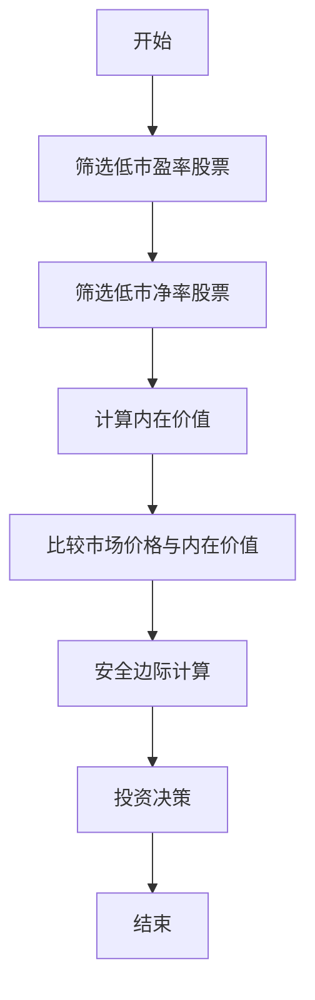
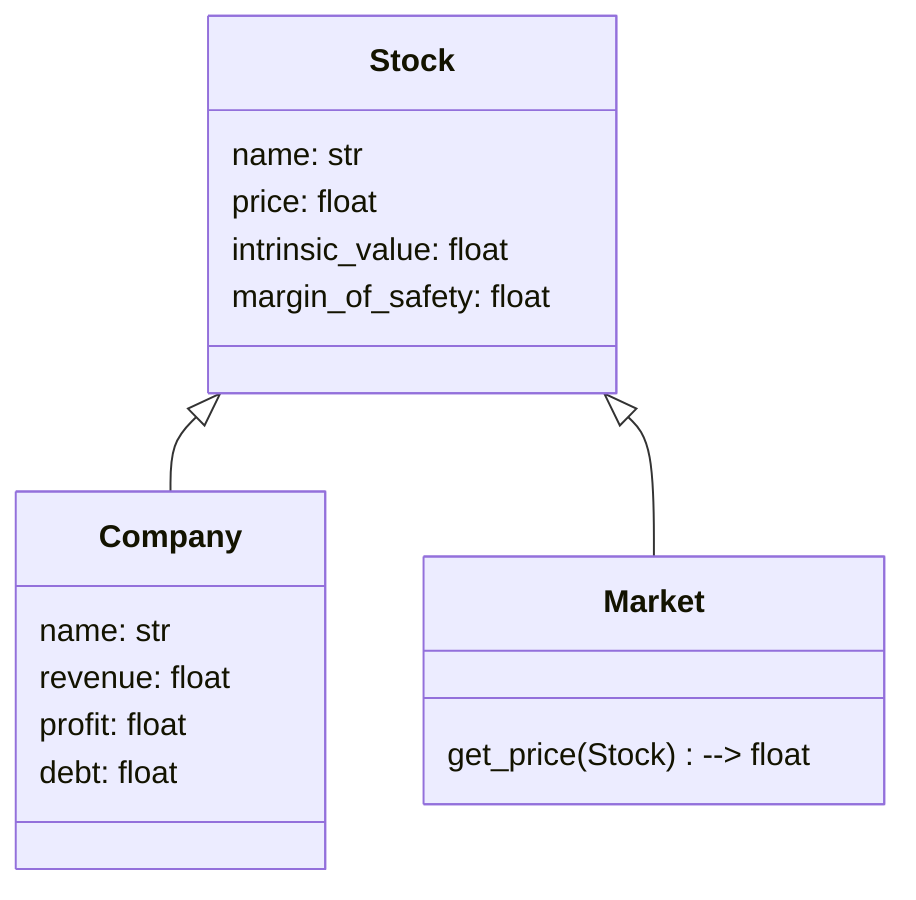

                 


# 《格雷厄姆特价股票理论对公司财务政策的影响》

---

## 关键词：
- 格雷厄姆特价股票理论
- 公司财务政策
- 价值投资
- 股票估值
- 财务杠杆

---

## 摘要：
本文深入探讨了格雷厄姆特价股票理论对公司财务政策的影响。通过分析格雷厄姆的投资理念，如安全边际和内在价值，结合公司财务政策的核心要素，如资本结构和股利政策，揭示了如何利用格雷厄姆理论优化公司财务决策。文章从理论背景、数学模型、系统架构到实际案例，全面解析了格雷厄姆理论在财务管理中的应用，为投资者和公司管理层提供了实用的指导和启示。

---

## 第一部分: 格雷厄姆特价股票理论与公司财务政策概述

### 第1章: 格雷厄姆特价股票理论的核心概念

#### 1.1 格雷厄姆特价股票理论的背景与起源

格雷厄姆特价股票理论是价值投资的重要组成部分，由本杰明·格雷厄姆提出。该理论强调通过分析股票的内在价值，寻找市场价格低于其实际价值的股票。以下是格雷厄姆理论的核心要素：

- **安全边际**：买入价格低于内在价值的股票，以降低投资风险。
- **内在价值**：通过分析公司的财务报表和市场数据，计算股票的合理价值。
- **价值投资**：长期持有优质股票，等待其市场价格回归内在价值。

格雷厄姆理论的核心在于通过基本面分析，识别市场低估的股票，从而实现长期稳定的收益。

#### 1.2 公司财务政策的基本概念

公司财务政策是指企业在财务管理方面制定的一系列规则和策略，主要包括以下几个方面：

1. **资本结构**：公司如何分配债务和股权融资。
2. **股利政策**：公司如何分配股利给股东。
3. **投资决策**：公司如何选择投资项目。
4. **风险管理**：公司如何应对财务风险。

财务政策的制定直接影响公司的财务健康和股东价值。

#### 1.3 格雷厄姆理论与公司财务政策的联系

格雷厄姆理论强调通过基本面分析寻找低估股票，这与公司财务政策密切相关。以下是两者的主要联系：

- **股票估值与资本结构**：格雷厄姆通过内在价值分析，帮助企业优化资本结构。
- **股利政策优化**：通过分析股利支付率，格雷厄姆理论为企业制定合理的股利政策提供依据。
- **风险管理与投资决策**：格雷厄姆的安全边际理念帮助企业降低投资风险，优化财务决策。

### 第2章: 格雷厄姆理论在公司财务决策中的应用

#### 2.1 格雷厄姆理论对公司资本结构的影响

资本结构是公司财务政策的核心内容之一。格雷厄姆理论通过分析公司的资本成本和杠杆效应，帮助企业优化资本结构。

- **资本成本分析**：通过计算债务和股权的成本，确定最优资本结构。
- **杠杆效应**：分析财务杠杆对公司净利润和股东权益的影响。

#### 2.2 格雷厄姆理论与股利政策

格雷厄姆理论强调股利的稳定性和可持续性，这对公司的股利政策有重要影响。

- **股利支付率**：通过分析公司的盈利能力和现金流，确定合理的股利支付率。
- **股利稳定性**：企业应保持股利的稳定增长，增强投资者信心。

#### 2.3 格雷厄姆理论与风险管理

格雷厄姆的安全边际理念帮助公司在财务管理中规避风险。

- **风险评估**：通过分析公司的财务比率和市场环境，评估潜在风险。
- **风险管理策略**：制定合理的风险管理措施，降低财务风险。

---

## 第二部分: 格雷厄姆特价股票理论的数学模型与算法原理

### 第3章: 格雷厄姆理论的数学模型

#### 3.1 内在价值计算公式

格雷厄姆的内在价值公式是价值投资的核心工具之一。以下是内在价值的计算公式：

$$
V = \frac{E}{1 + r}
$$

其中，\( V \) 为内在价值，\( E \) 为未来现金流，\( r \) 为折现率。

#### 3.2 安全边际计算公式

安全边际是格雷厄姆理论中重要的风险控制指标，其计算公式为：

$$
\text{安全边际} = \frac{\text{内在价值} - \text{市场价格}}{\text{市场价格}}
$$

安全边际越高，投资风险越小。

#### 3.3 股票估值与市场价格的对比

以下是股票估值与市场价格的对比表格：

| 项目               | 内在价值   | 市场价格 |
|--------------------|------------|----------|
| 计算方式           | \( V = \frac{E}{1 + r} \) | 市场供需决定 |
| 投资机会           | 低估股票   | 高估或低估 |

### 第4章: 格雷厄姆投资策略的算法实现

#### 4.1 基于格雷厄姆理论的股票筛选算法

以下是基于格雷厄姆理论的股票筛选算法流程图：



#### 4.2 格雷厄姆理论的Python实现

以下是格雷厄姆理论的Python实现示例代码：

```python
def calculate_intrinsic_value(enterprise_value, discount_rate):
    return enterprise_value / (1 + discount_rate)

def calculate_margin_of_safety(intrinsic_value, market_price):
    return (intrinsic_value - market_price) / market_price

# 示例计算
enterprise_value = 1000
discount_rate = 0.05
market_price = 800

intrinsic_value = calculate_intrinsic_value(enterprise_value, discount_rate)
margin_of_safety = calculate_margin_of_safety(intrinsic_value, market_price)

print(f"内在价值: {intrinsic_value}")
print(f"安全边际: {margin_of_safety}")
```

---

## 第三部分: 系统分析与架构设计

### 第5章: 系统功能设计

#### 5.1 领域模型类图

以下是领域模型类图：



#### 5.2 系统架构设计

以下是系统架构设计图：


---

## 第四部分: 项目实战

### 第6章: 项目实战与案例分析

#### 6.1 环境安装与配置

- Python 3.8 或更高版本
- Jupyter Notebook
- Pandas 和 NumPy 库

#### 6.2 核心代码实现

以下是核心代码实现：

```python
import pandas as pd

def calculate_intrinsic_value(data, discount_rate):
    return data / (1 + discount_rate)

def calculate_margin_of_safety(data, market_price):
    return (data - market_price) / market_price

# 示例数据
data = pd.DataFrame({
    'enterprise_value': [1000, 1500, 2000],
    'discount_rate': [0.05, 0.05, 0.05],
    'market_price': [800, 900, 1000]
})

# 计算内在价值
intrinsic_values = calculate_intrinsic_value(data['enterprise_value'], data['discount_rate'])

# 计算安全边际
margin_of_safety = calculate_margin_of_safety(intrinsic_values, data['market_price'])

# 显示结果
result = pd.DataFrame({
    '企业价值': data['enterprise_value'],
    '折现率': data['discount_rate'],
    '市场价格': data['market_price'],
    '内在价值': intrinsic_values,
    '安全边际': margin_of_safety
})

print(result)
```

#### 6.3 案例分析

以下是案例分析：

假设某公司企业价值为1500，折现率为5%，市场价格为900。计算其内在价值和安全边际：

$$
\text{内在价值} = \frac{1500}{1 + 0.05} = 1428.57
$$

$$
\text{安全边际} = \frac{1428.57 - 900}{900} = 0.6 \text{或} 60\%
$$

---

## 第五部分: 总结与展望

### 第7章: 总结

格雷厄姆特价股票理论为公司财务政策的制定提供了重要的理论依据和实践指导。通过内在价值分析和安全边际理念，帮助企业优化资本结构、制定合理的股利政策，并降低财务风险。

---

## 第六部分: 拓展阅读

### 7.1 推荐书籍

1. 《证券分析》——本杰明·格雷厄姆
2. 《投资学原理》——查尔斯·埃利森

### 7.2 网站与工具

1. [格雷厄姆投资俱乐部](https://www.grahamclub.com)
2. [QuantInsti](https://www.quantinsti.com)

---

## 结语

通过本文的分析，我们可以看到格雷厄姆特价股票理论对公司财务政策的影响是深远的。无论是资本结构优化、股利政策制定，还是风险管理，格雷厄姆的理论都提供了重要的指导。未来，随着市场的变化和理论的发展，格雷厄姆的投资理念仍将在财务管理中发挥重要作用。

