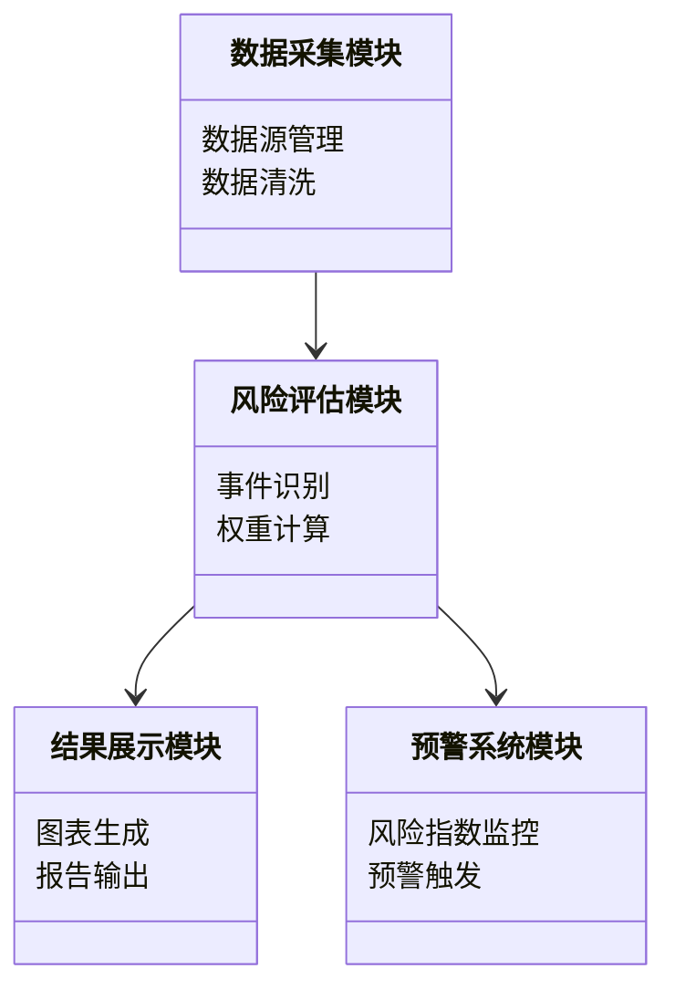
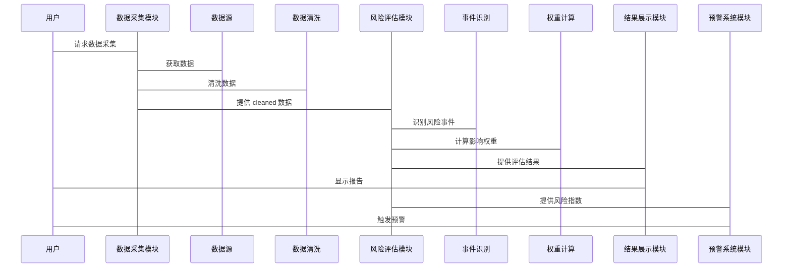

                 


# 特价股票投资中的地缘政治风险评估

> **关键词**: 地缘政治风险, 股票投资, 风险评估, 算法模型, 系统架构, 投资策略

> **摘要**: 本文深入探讨了地缘政治风险在特价股票投资中的评估方法和应用。通过分析地缘政治风险的核心概念、评估模型和算法原理，结合系统架构设计和实际案例，为投资者提供了一套科学的风险评估体系，帮助他们在投资决策中更好地应对地缘政治风险。

---

## 第一部分：背景与概述

### 第1章：地缘政治风险与股票投资概述

#### 1.1 地缘政治风险的定义与核心概念

地缘政治风险是指由于政治、经济、社会和国际关系等因素的变化，可能对企业、国家或地区的经济活动产生负面影响的风险。在股票投资中，地缘政治风险可能影响特定地区或行业的股票价格波动，甚至引发系统性风险。

- **地缘政治风险的定义**: 指因政治冲突、政策变化、国际关系紧张等因素导致的经济不稳定风险。
- **核心概念**: 包括政治稳定性、政策变化、国际关系、社会动荡等关键因素。
- **股票投资中的应用**: 通过评估地缘政治风险，投资者可以做出更明智的投资决策，避免潜在损失。

#### 1.2 地缘政治风险的影响因素

地缘政治风险受多种因素影响，主要包括政治因素、经济因素、社会因素和国际关系。

- **政治因素**: 包括政府更迭、政策变化、选举结果等。
- **经济因素**: 包括经济制裁、贸易壁垒、资源分配等。
- **社会因素**: 包括社会动荡、民族矛盾、恐怖主义等。
- **国际关系**: 包括外交关系、军事冲突、国际组织的影响等。

#### 1.3 地缘政治风险的分类与层次

地缘政治风险可以分为国内政治风险、国际政治风险、区域性风险和全球性风险。

- **国内政治风险**: 由国内政治事件引发的风险，如政变、抗议等。
- **国际政治风险**: 由国际冲突或外交政策变化引发的风险，如贸易战争、制裁等。
- **区域性风险**: 影响特定地区或行业的风险，如中东地区的地缘政治冲突。
- **全球性风险**: 影响全球经济的系统性风险，如国际政治危机、全球性制裁等。

#### 1.4 地缘政治风险在股票投资中的应用

在股票投资中，地缘政治风险评估主要用于以下几个方面：

- **风险识别**: 识别可能影响投资的地缘政治事件。
- **风险量化**: 评估这些事件对股票价格的具体影响。
- **投资策略**: 根据风险评估结果调整投资组合，降低风险敞口。

---

## 第二部分：核心概念与评估方法

### 第2章：地缘政治风险评估模型

#### 2.1 地缘政治风险评估模型的原理

地缘政治风险评估模型通过收集和分析相关数据，量化风险的影响程度，为投资者提供决策支持。

- **模型输入**: 包括政治事件、经济指标、社会数据等。
- **模型输出**: 生成风险指数，评估特定地区或行业的投资风险。
- **模型应用**: 用于投资组合优化、风险预警和决策支持。

#### 2.2 地缘政治风险评估的核心要素

地缘政治风险评估模型的核心要素包括风险事件、影响权重和数据来源。

- **风险事件**: 需要识别可能影响投资的地缘政治事件。
- **影响权重**: 根据事件的影响力和相关性，赋予不同的权重。
- **数据来源**: 包括新闻报道、政府公告、国际组织报告等。

#### 2.3 地缘政治风险评估的流程

地缘政治风险评估的流程包括数据收集、事件分析、权重计算和风险指数生成。

- **数据收集**: 通过多种渠道收集相关数据。
- **事件分析**: 确定事件的性质和潜在影响。
- **权重计算**: 根据事件的影响程度，赋予相应的权重。
- **风险指数生成**: 计算综合风险指数，评估投资风险。

---

## 第三部分：算法原理与数学模型

### 第3章：地缘政治风险评估的算法与数学模型

#### 3.1 风险事件影响分析

风险事件的影响分析是地缘政治风险评估的核心步骤。

- **事件特征提取**: 通过自然语言处理技术，提取事件的关键特征。
- **权重计算**: 根据事件的性质和影响程度，计算权重。
- **影响评估**: 综合事件特征和权重，评估事件对股票投资的影响。

#### 3.2 地缘政治风险评估的数学模型

地缘政治风险评估的数学模型可以通过以下公式表示：

$$
\text{风险指数} = \sum_{i=1}^{n} (w_i \times \text{影响值}_i)
$$

其中，\( w_i \) 是事件 \( i \) 的权重，影响值 \( i \) 是事件 \( i \) 的影响程度。

#### 3.3 算法流程图

以下是地缘政治风险评估的算法流程图：

```mermaid
graph TD
    A[开始] -> B[收集数据]
    B -> C[识别风险事件]
    C -> D[计算影响权重]
    D -> E[生成风险指数]
    E -> F[结束]
```

---

## 第四部分：系统分析与架构设计

### 第4章：地缘政治风险评估系统的架构设计

#### 4.1 系统功能设计

地缘政治风险评估系统需要具备以下功能：

- **数据采集**: 从多种数据源采集相关数据。
- **风险评估**: 对风险事件进行分析和评估。
- **结果展示**: 以图表形式展示评估结果。
- **预警系统**: 根据风险指数，触发预警。

#### 4.2 系统架构设计

以下是地缘政治风险评估系统的架构图：



#### 4.3 系统接口设计

系统接口设计包括数据接口、评估接口和预警接口。

- **数据接口**: 用于数据采集模块与数据源的交互。
- **评估接口**: 用于风险评估模块与其他模块的交互。
- **预警接口**: 用于预警系统模块与用户或其他系统的交互。

#### 4.4 系统交互流程图

以下是系统交互流程图：



---

## 第五部分：项目实战

### 第5章：地缘政治风险评估的实战应用

#### 5.1 项目背景

假设我们选择中东地区作为案例，分析其地缘政治风险对股票投资的影响。

#### 5.2 环境安装

需要安装以下工具和库：

- **工具**: Python、Jupyter Notebook、Mermaid、系统架构设计工具（如PlantUML）。
- **库**: requests、pandas、numpy、scikit-learn、word2vec。

#### 5.3 核心代码实现

以下是地缘政治风险评估模型的核心代码：

```python
import pandas as pd
import numpy as np

# 数据清洗
def data_cleaning(data):
    # 去除缺失值
    data.dropna(inplace=True)
    # 处理异常值
    data = data[(np.abs(data - data.mean()) <= 3 * data.std()).all(axis=1)]
    return data

# 事件识别
def event_identification(data):
    # 使用自然语言处理技术识别风险事件
    from gensim.models import Word2Vec
    model = Word2Vec(data['text'], vector_size=100, window=5, min_count=1, workers=4)
    # 提取关键词
    keywords = model.wv.most_similar('地缘政治')
    return keywords

# 权重计算
def weight_calculation(data):
    # 根据事件影响程度计算权重
    weights = pd.Series(data['影响值'], index=data.index)
    weights = weights.apply(lambda x: 0.1 if x < 0.3 else (0.3 if x < 0.6 else 0.6))
    return weights

# 风险指数计算
def risk_index(weights):
    risk_index = weights.sum() / len(weights)
    return risk_index

# 主程序
def main():
    # 数据加载
    data = pd.read_csv(' geopolitical_risk.csv ')
    # 数据清洗
    cleaned_data = data_cleaning(data)
    # 事件识别
    events = event_identification(cleaned_data)
    # 权重计算
    weights = weight_calculation(cleaned_data)
    # 风险指数计算
    index = risk_index(weights)
    print(f"风险指数: {index}")
    return index

if __name__ == "__main__":
    main()
```

#### 5.4 项目总结

通过上述代码实现的地缘政治风险评估模型，我们可以有效地识别和评估特定地区的投资风险。未来，可以进一步优化模型，引入机器学习算法，提高风险评估的准确性和效率。

---

## 第六部分：总结与展望

### 第6章：总结与展望

#### 6.1 总结

本文系统地介绍了地缘政治风险在股票投资中的评估方法，提出了一个完整的地缘政治风险评估体系，包括模型原理、算法实现和系统架构设计。通过实际案例分析，验证了模型的有效性和实用性。

#### 6.2 展望

未来的研究可以进一步优化地缘政治风险评估模型，引入更多的数据源和算法，提高模型的准确性和实时性。此外，还可以开发更多的工具和平台，帮助投资者更好地应对地缘政治风险。

---

通过本文的分析和实践，投资者可以更好地理解地缘政治风险的影响，并在股票投资中做出更明智的决策。

