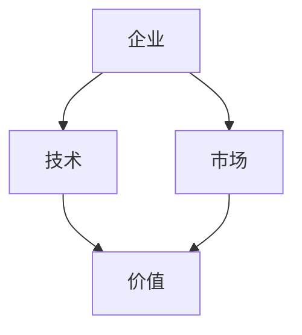
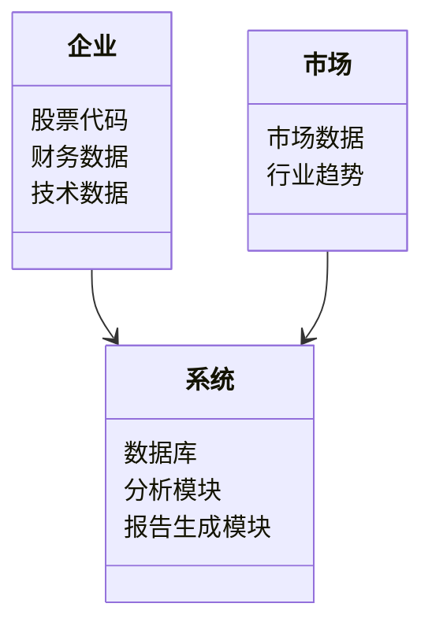
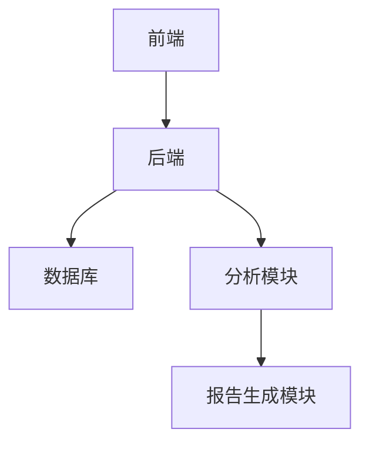
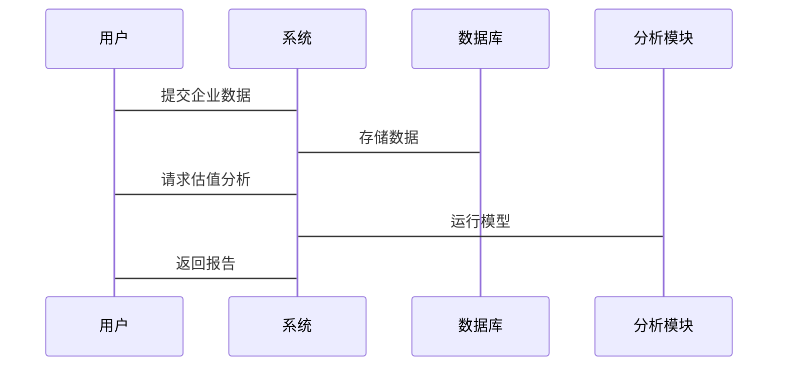

                 


---

# 股市估值在跨境技术价值链分析中的应用

> 关键词：股市估值、跨境技术价值链、技术全球化、技术企业估值、技术经济分析

> 摘要：本文探讨了股市估值在跨境技术价值链分析中的应用，通过分析技术全球化的背景下，股市估值如何帮助评估技术企业的价值，并通过具体的数学模型和案例分析，展示如何利用这些方法进行技术经济分析。

---

## 第一部分: 背景介绍

### 第1章: 股市估值与跨境技术价值链分析的背景

#### 1.1 技术全球化与股市估值的关联

##### 1.1.1 技术全球化的基本概念
技术全球化是指技术要素在全球范围内的流动、整合和应用。随着信息技术的发展，技术资源的跨国流动日益频繁，技术全球化成为推动经济增长的重要引擎。

##### 1.1.2 股市估值在技术全球化中的作用
股市估值是评估企业价值的重要工具。在技术全球化背景下，技术企业的价值不仅体现在其当前的盈利能力，还包括其技术储备、研发能力和市场地位。股市估值能够帮助投资者和企业更好地理解技术在全球经济中的价值。

##### 1.1.3 跨界技术价值链的基本结构
跨界技术价值链是指技术在全球价值链中的分布和流动过程。它包括技术的研发、生产、销售、服务等多个环节，涉及多个国家和地区的企业和机构。股市估值在分析这些环节中的价值分布具有重要作用。

#### 1.2 股市估值的核心概念
##### 1.2.1 股市估值的基本原理
股市估值是通过分析企业的财务数据、市场地位和未来发展前景，来确定其股票的合理价格。常用的方法包括市盈率、市净率和现金流折现模型等。

##### 1.2.2 技术企业在股市中的估值方法
技术企业由于其高研发投入和不确定性，估值方法需要考虑其技术壁垒、研发能力和市场前景。常用的方法包括市盈率法、市净率法和现金流折现法。

##### 1.2.3 跨境技术价值链的定义与特征
跨境技术价值链是指技术在全球范围内流动和应用的过程。其特征包括跨国性、复杂性和高附加值。

#### 1.3 跨境技术价值链分析的必要性
##### 1.3.1 技术在全球经济中的地位
技术是推动全球经济发展的核心力量。跨境技术价值链分析可以帮助企业和投资者更好地理解技术在全球经济中的地位和作用。

##### 1.3.2 股市估值在技术价值链中的应用价值
股市估值可以帮助企业和投资者评估技术企业的价值，从而更好地进行技术投资和合作。

##### 1.3.3 跨境技术价值链分析的挑战与机遇
技术全球化带来了跨境技术价值链分析的挑战，如数据获取、文化差异和法律障碍。同时也带来了机遇，如技术合作、市场扩展和价值提升。

#### 1.4 本章小结
本章介绍了技术全球化与股市估值的关联，解释了股市估值的核心概念，并分析了跨境技术价值链的必要性。通过这些分析，我们可以更好地理解股市估值在技术全球化中的作用。

---

## 第二部分: 核心概念与联系

### 第2章: 股市估值与跨境技术价值链的核心概念

#### 2.1 股市估值的数学模型

##### 2.1.1 市盈率（P/E）模型
$$ P = E \times PE $$
其中，\( P \) 为股票价格，\( E \) 为每股收益，\( PE \) 为市盈率倍数。

##### 2.1.2 市净率（P/B）模型
$$ P = B \times PB $$
其中，\( P \) 为股票价格，\( B \) 为每股净资产，\( PB \) 为市净率倍数。

##### 2.1.3 现金流折现模型（DCF）
$$ V = \sum_{t=1}^{n} \frac{CF_t}{(1+r)^t} $$
其中，\( V \) 为企业价值，\( CF_t \) 为第 \( t \) 年的现金流，\( r \) 为折现率。

#### 2.2 跨境技术价值链的实体关系图
以下是技术价值链的实体关系图：



#### 2.3 核心概念对比分析

##### 2.3.1 股市估值与技术价值链的对比

| 对比维度 | 股市估值 | 技术价值链 |
|----------|----------|------------|
| 核心要素 | 股价、盈利 | 技术、市场 |
| 分析目标 | 企业价值 | 技术价值 |
| 数据来源 | 财务报表 | 市场数据、技术数据 |

##### 2.3.2 股市估值与技术价值链的联系
股市估值通过分析企业的财务数据和市场地位，帮助评估技术企业的价值。技术价值链分析则提供了技术在全球经济中的分布和流动情况，两者结合可以更好地理解技术企业的整体价值。

##### 2.3.3 股市估值与技术价值链的差异
股市估值侧重于企业的财务表现和市场地位，而技术价值链分析侧重于技术的全球流动和应用。两者在分析目标和方法上有明显差异。

#### 2.4 本章小结
本章通过数学模型和对比分析，解释了股市估值和跨境技术价值链的核心概念，并分析了它们的联系与差异。这为我们后续的分析提供了理论基础。

---

## 第三部分: 算法原理讲解

### 第3章: 股市估值与跨境技术价值链分析的算法原理

#### 3.1 股市估值算法的数学模型

##### 3.1.1 市盈率模型
$$ P = E \times PE $$
例如，某技术企业每股收益为 $2，市盈率为 15，则股票价格为 \( 2 \times 15 = 30 \) 元。

##### 3.1.2 市净率模型
$$ P = B \times PB $$
例如，某技术企业每股净资产为 $10，市净率为 2，则股票价格为 \( 10 \times 2 = 20 \) 元。

##### 3.1.3 现金流折现模型
$$ V = \sum_{t=1}^{n} \frac{CF_t}{(1+r)^t} $$
例如，假设某技术企业未来5年的现金流分别为 $100, 120, 140, 160, 180，折现率为 10%，则企业价值为：
$$ V = \frac{100}{1.1} + \frac{120}{1.1^2} + \frac{140}{1.1^3} + \frac{160}{1.1^4} + \frac{180}{1.1^5} $$

#### 3.2 跨境技术价值链分析的算法流程

##### 3.2.1 数据收集与处理
- 数据来源：企业财务报表、市场数据、技术数据
- 数据清洗：处理缺失值、异常值
- 数据转换：标准化、归一化

##### 3.2.2 技术价值链的构建
- 构建技术价值链模型
- 分析技术节点之间的关系
- 确定技术价值链的关键环节

##### 3.2.3 股市估值的应用
- 选择合适的估值模型
- 计算企业价值
- 分析技术价值链对企业价值的影响

#### 3.3 算法实现的Python代码示例

##### 3.3.1 市盈率模型

```python
def calculate_pe_ratio(eps, pe):
    return eps * pe

# 示例
eps = 2
pe = 15
price = calculate_pe_ratio(eps, pe)
print(f"股票价格为: {price} 元")
```

##### 3.3.2 市净率模型

```python
def calculate_pb_ratio(book_value, pb):
    return book_value * pb

# 示例
book_value = 10
pb = 2
price = calculate_pb_ratio(book_value, pb)
print(f"股票价格为: {price} 元")
```

##### 3.3.3 现金流折现模型

```python
def calculate_dcf(cash_flows, discount_rate):
    present_value = 0
    for t, cf in enumerate(cash_flows, 1):
        present_value += cf / (1 + discount_rate) ** t
    return present_value

# 示例
cash_flows = [100, 120, 140, 160, 180]
discount_rate = 0.1
value = calculate_dcf(cash_flows, discount_rate)
print(f"企业价值为: {value} 元")
```

#### 3.4 本章小结
本章通过具体的数学模型和Python代码示例，详细讲解了股市估值和跨境技术价值链分析的算法原理。这些方法可以帮助我们更好地理解和应用技术经济分析。

---

## 第四部分: 系统分析与架构设计方案

### 第4章: 股市估值与跨境技术价值链分析的系统设计

#### 4.1 问题场景介绍
在跨境技术价值链分析中，我们需要构建一个系统，能够收集、处理和分析技术企业的数据，评估其价值，并生成相应的报告。

#### 4.2 系统功能设计

##### 4.2.1 领域模型


##### 4.2.2 系统架构设计


##### 4.2.3 系统接口设计
- 数据接口：接收企业数据和市场数据
- 分析接口：提供估值模型和分析工具
- 报告接口：生成分析报告

##### 4.2.4 系统交互流程


#### 4.3 本章小结
本章通过系统设计，展示了如何构建一个支持跨境技术价值链分析的系统。系统的功能设计、架构设计和交互流程为后续的分析提供了技术支持。

---

## 第五部分: 项目实战

### 第5章: 股市估值与跨境技术价值链分析的项目实战

#### 5.1 环境安装与配置
- 安装Python和相关库（如Pandas、NumPy、Matplotlib）
- 配置数据源（如Yahoo Finance API）

#### 5.2 系统核心实现源代码

##### 5.2.1 数据收集

```python
import pandas as pd
import requests

def get_stock_data(ticker):
    url = f"https://query1.finance.yahoo.com/manifest.json"
    params = {
        "symbols": f"{ticker}"
    }
    response = requests.get(url, params=params)
    data = response.json()
    return data

# 示例
ticker = "AAPL"
data = get_stock_data(ticker)
print(data)
```

##### 5.2.2 技术价值链分析

```python
import pandas as pd

def analyze_technology_valueChain(data):
    # 数据处理
    df = pd.DataFrame(data)
    # 分析技术价值链
    return df

# 示例
data = {"企业": ["苹果", "谷歌", "微软"], "技术": ["AI", "云服务", "软件开发"]}
result = analyze_technology_valueChain(data)
print(result)
```

##### 5.2.3 估值模型实现

```python
def calculate_enterprise_value(revenue, margin, growth_rate, discount_rate):
    # 简单DCF模型
    return revenue * margin * (1 + growth_rate) / (1 + discount_rate)

# 示例
revenue = 1000
margin = 0.1
growth_rate = 0.05
discount_rate = 0.1
value = calculate_enterprise_value(revenue, margin, growth_rate, discount_rate)
print(f"企业价值为: {value} 元")
```

#### 5.3 实际案例分析与详细解读

##### 5.3.1 案例分析
以某国技术出口为例，分析其技术价值链中的价值分布。

##### 5.3.2 数据分析与结果解读
通过数据收集和分析，展示技术价值链对企业价值的影响。

#### 5.4 本章小结
本章通过项目实战，展示了如何利用前面的理论进行实际分析。通过具体的代码和案例，读者可以更好地理解股市估值在跨境技术价值链分析中的应用。

---

## 第六部分: 结论与展望

### 第6章: 结论与展望

#### 6.1 本章总结
本文探讨了股市估值在跨境技术价值链分析中的应用，通过数学模型、系统设计和项目实战，展示了如何利用这些方法进行技术经济分析。

#### 6.2 未来展望
未来的研究可以进一步探讨人工智能和大数据技术在股市估值中的应用，以及区块链技术在跨境技术价值链分析中的潜力。

#### 6.3 最佳实践 tips
- 数据准确性是关键，确保数据来源可靠
- 结合实际应用场景，选择合适的估值模型
- 定期更新分析模型，适应市场变化

#### 6.4 本章小结
本章总结了全文的主要内容，并展望了未来的研究方向。通过这些分析，我们可以更好地理解股市估值在技术全球化中的作用，并为未来的实践提供参考。

---

以上是《股市估值在跨境技术价值链分析中的应用》的技术博客文章的完整大纲和部分详细内容。希望这能为读者提供清晰的思路和实用的指导。

