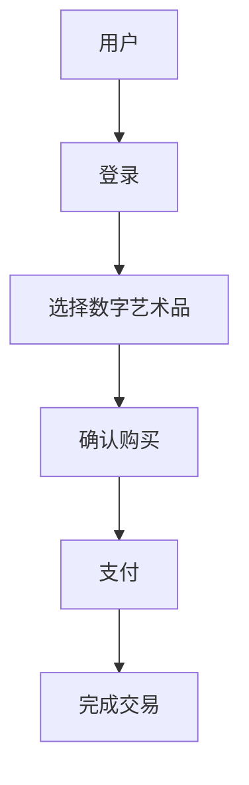
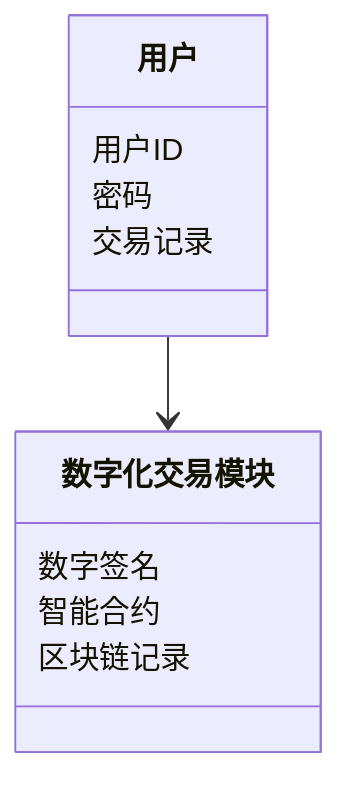
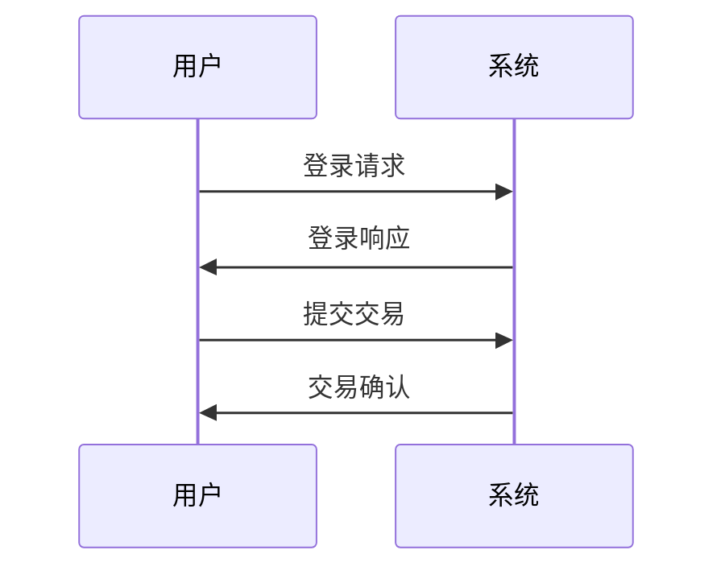
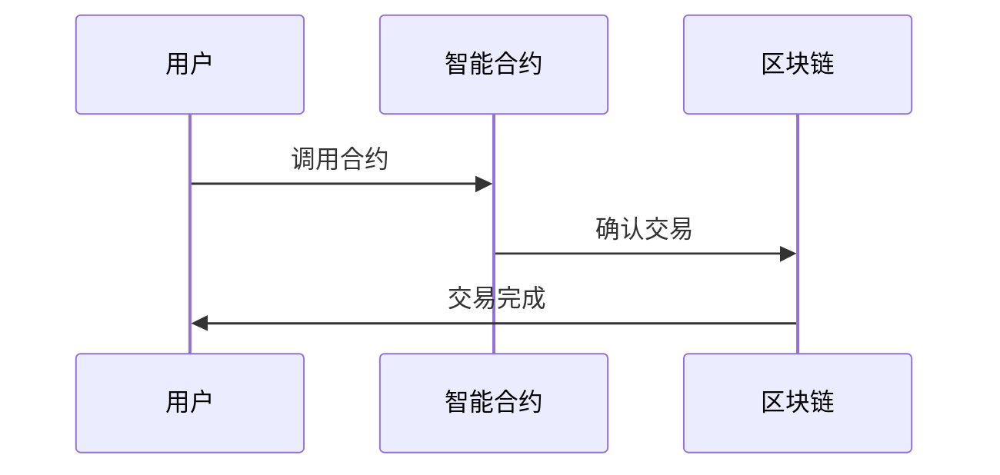

                 


# 股市估值对国际艺术品数字化交易的影响

> **关键词**: 股市估值、数字化交易、国际艺术品、区块链技术、NFT

> **摘要**: 本文探讨了股市估值对国际艺术品数字化交易的影响，分析了数字化交易的技术基础、股市估值的数学模型及其相互作用。通过案例分析和系统设计，揭示了数字化交易如何改变艺术品市场，并为投资者提供新的机会和挑战。文章还详细介绍了相关算法、系统架构及实际应用，为读者提供了全面的视角。

---

## 第1章: 股市估值与国际艺术品数字化交易的背景

### 1.1 股市估值的基本概念

#### 1.1.1 股市估值的定义
股市估值是指通过一定的数学模型和方法，对上市公司或资产的市场价值进行评估的过程。常用的估值方法包括市盈率（P/E）、市净率（P/B）和现金流折现模型（DCF）等。

#### 1.1.2 股市估值的核心要素
- **市盈率（P/E）**: 价格与收益的比率，反映市场对公司的盈利能力的评价。
- **市净率（P/B）**: 价格与净资产的比率，适用于评估资产密集型行业。
- **现金流折现模型（DCF）**: 通过预测未来现金流，计算其现值来评估企业价值。

#### 1.1.3 股市估值的计算方法
- **市盈率计算**: 市盈率 = 股价 / 每股收益
- **市净率计算**: 市净率 = 股价 / 每股净资产
- **现金流折现模型**: 现金流的未来价值现值化，考虑了资金的时间价值。

### 1.2 国际艺术品数字化交易的现状

#### 1.2.1 数字化交易的定义
数字化交易是指通过数字技术（如区块链）进行的资产交易，具有去中心化、透明性和不可篡改的特点。

#### 1.2.2 数字化交易的平台与技术
- **区块链技术**: 提供去中心化的交易记录和验证。
- **NFT（非同质化代币）**: 用于表示独特的数字资产，确保所有权和真实性。

#### 1.2.3 数字化交易的市场规模与趋势
随着数字技术的发展，艺术品数字化交易的市场规模迅速增长，尤其是在疫情期间，线上交易成为主流。

### 1.3 股市估值与数字化交易的关联性

#### 1.3.1 数字化交易对股市的影响
- 提高交易效率和透明度。
- 带来新的投资品种，如数字艺术品和NFT。

#### 1.3.2 股市估值对数字化交易的影响
- 通过股市估值方法，投资者可以评估数字艺术品的价值。
- 数字化交易可能影响传统股市的估值模型。

#### 1.3.3 两者的互动关系
数字化交易的兴起推动了新的估值方法，而股市估值的理论也为数字化交易提供了理论支持。

---

## 第2章: 核心概念与联系

### 2.1 股市估值的数学模型

#### 2.1.1 市盈率模型
$$\text{市盈率} = \frac{\text{股价}}{\text{每股收益}}$$

#### 2.1.2 市净率模型
$$\text{市净率} = \frac{\text{股价}}{\text{每股净资产}}$$

#### 2.1.3 现金流折现模型
$$\text{企业价值} = \sum_{t=1}^{n} \frac{\text{现金流}_t}{(1 + r)^t}$$
其中，\( r \) 是折现率。

### 2.2 数字化交易的系统架构

#### 2.2.1 数字化交易的系统组成
- 用户界面
- 区块链节点
- 智能合约
- 数据存储

#### 2.2.2 数字化交易的流程图


#### 2.2.3 数字化交易的实体关系图
```mermaid
erd
    系统
    用户
    数字艺术品
    智能合约
    区块链
```

### 2.3 股市估值与数字化交易的关联模型

#### 2.3.1 关联模型的构建
$$\text{数字化交易价值} = f(\text{数字化交易量}, \text{市场流动性}, \text{估值模型})$$

#### 2.3.2 关联模型的验证
通过统计回归分析，验证数字化交易对股市估值的影响。

#### 2.3.3 关联模型的应用
应用于投资决策，优化资产配置。

---

## 第3章: 算法原理与实现

### 3.1 股市估值算法

#### 3.1.1 市盈率计算算法
```python
def calculate_pe_ratio(stock_price, earnings_per_share):
    return stock_price / earnings_per_share
```

#### 3.1.2 市净率计算算法
```python
def calculate_pb_ratio(stock_price, book_value_per_share):
    return stock_price / book_value_per_share
```

#### 3.1.3 现金流折现算法
```python
def calculate_dcf(cash_flows, discount_rate):
    return sum(cash_flow / (1 + discount_rate) ** t for t, cash_flow in enumerate(cash_flows))
```

### 3.2 数字化交易算法

#### 3.2.1 数字签名算法
$$\text{签名} = \text{哈希}(\text{消息})$$

#### 3.2.2 区块链共识算法
- **工作量证明（PoW）**: 比特币采用的共识机制。
- **权益证明（PoS）**: 基于持币数量的共识机制。

#### 3.2.3 智能合约算法
```solidity
function multiply(uint256 a, uint256 b) internal pure returns (uint256) {
    return a * b;
}
```

### 3.3 算法实现与代码

#### 3.3.1 Python代码实现
```python
# 示例：计算市盈率
stock_price = 100
earnings_per_share = 2
pe_ratio = calculate_pe_ratio(stock_price, earnings_per_share)
print(f"市盈率为: {pe_ratio}")
```

#### 3.3.2 算法的优化与改进
通过机器学习模型优化估值模型，如使用 LSTM 预测股价。

---

## 第4章: 系统分析与架构设计方案

### 4.1 系统功能设计

#### 4.1.1 用户需求分析
- 用户需要安全、便捷的数字化交易体验。
- 用户希望透明的交易记录和估值报告。

#### 4.1.2 系统功能模块划分
- 用户管理模块
- 数字化交易模块
- 估值模块
- 报告模块

#### 4.1.3 领域模型设计


### 4.2 系统架构设计

#### 4.2.1 分层架构设计
- **表现层**: 用户界面
- **业务逻辑层**: 交易处理
- **数据访问层**: 区块链交互

#### 4.2.2 微服务架构设计
- **用户服务**: 用户管理
- **交易服务**: 交易处理
- **估值服务**: 估值计算

#### 4.2.3 系统接口设计
- REST API 接口
- WebSocket 实时通信

### 4.3 系统交互设计

#### 4.3.1 用户界面设计
- 登录界面
- 交易界面
- 估值报告界面

#### 4.3.2 系统交互流程


#### 4.3.3 序列图设计


---

## 第5章: 项目实战

### 5.1 项目环境安装

#### 5.1.1 开发环境搭建
- 安装 Python 和必要的库（如 Flask、Solidity 编译器）。
- 安装区块链开发环境（如 Ganache）。

#### 5.1.2 依赖库安装
```bash
pip install flask web3
```

#### 5.1.3 项目初始化
```bash
mkdir project && cd project
touch app.py contract.sol
```

### 5.2 核心系统实现

#### 5.2.1 股市估值模块实现
```python
from flask import Flask
app = Flask(__name__)

@app.route('/calculate_pe', methods=['GET'])
def calculate_pe():
    stock_price = float(request.args.get('price'))
    earnings_per_share = float(request.args.get('eps'))
    pe = stock_price / earnings_per_share
    return f"市盈率为: {pe}"
```

#### 5.2.2 数字化交易模块实现
```solidity
contract ArtNFT {
    function buyArt(uint256 tokenId) public payable {
        require(msg.sender == ownerOf(tokenId), "Not owner");
        transferFrom(ownerOf(tokenId), msg.sender, tokenId);
    }
}
```

#### 5.2.3 系统测试与调试
使用单元测试框架（如 pytest）进行功能测试。

### 5.3 实际案例分析

#### 5.3.1 案例背景介绍
某艺术平台上线数字化交易，使用区块链技术保障交易透明性。

#### 5.3.2 案例分析与解决
通过市盈率模型评估交易价值，优化交易流程。

#### 5.3.3 案例总结与反思
数字化交易提高了交易效率，但也面临技术瓶颈和监管挑战。

---

## 第6章: 最佳实践与未来发展

### 6.1 最佳实践 tips

#### 6.1.1 系统设计中的注意事项
- 确保系统安全性和可扩展性。
- 定期更新系统以适应市场变化。

#### 6.1.2 开发中的常见问题与解决方案
- **性能问题**: 使用优化的算法和分布式架构。
- **安全性问题**: 加强加密措施和安全审计。

#### 6.1.3 运维中的关键点
- 监控系统运行状态。
- 建立应急响应机制。

### 6.2 项目总结与小结

#### 6.2.1 项目成果总结
成功实现了基于区块链的数字化交易系统，提高了交易效率和透明度。

#### 6.2.2 项目总结
- 成功应用了股市估值模型。
- 验证了数字化交易的可行性。

#### 6.2.3 项目小结
通过该项目，我们深入了解了股市估值与数字化交易的相互影响，为未来的投资决策提供了新的视角。

### 6.3 未来发展的思考

#### 6.3.1 技术发展的方向
- 更高的安全性。
- 更强的可扩展性。

#### 6.3.2 市场的发展趋势
- 更多的艺术品数字化。
- 更多的投资者参与。

#### 6.3.3 个人的思考
作为开发者，我们需要不断学习新技术，适应市场的变化，为投资者和艺术爱好者提供更好的服务。

---

## 附录: 拓展阅读

### 附录1: 相关书籍推荐
1. 《区块链: 重新定义价值和信任的新经济》
2. 《股票估值与投资策略》
3. 《数字化转型: 重构商业与技术》

### 附录2: 开源项目链接
- Blockchain Art Exchange: [GitHub链接](https://github.com/blockchain-art-exchange)
- NFT Market: [GitHub链接](https://github.com/nft-market)

---

通过本文的系统分析和实践，我们深入探讨了股市估值对国际艺术品数字化交易的影响，从理论到实践，为读者提供了全面的视角。希望本文能为相关领域的研究和实践提供有价值的参考。

