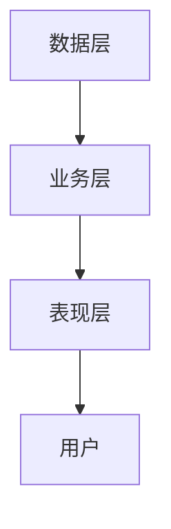

                 


# 芒格的"反向激励"分析：理解公司决策背后的动机

**关键词：** 反向激励、芒格、公司决策、动机分析、行为科学、决策心理学

**摘要：**  
本书系统地分析了芒格提出的"反向激励"理论，深入探讨了公司决策背后的动机。通过理论与实践相结合的方式，本书揭示了反向激励如何影响公司治理和决策过程，提供了丰富的案例分析和实用的分析工具，帮助读者理解公司决策背后的深层动机。

---

# 第1章: 引言

## 1.1 什么是反向激励  
### 1.1.1 反向激励的定义  
反向激励是一种通过激发个体的负面情绪或利用其弱点来达到特定目标的激励方式。它不同于传统的正向激励（如奖励、认可等），而是通过制造压力、引发恐惧或利用人性弱点来驱动行为。

### 1.1.2 反向激励的核心特征  
- **负面驱动**：依赖负面情绪（如恐惧、焦虑）来推动行为。
- **间接性**：通过外部压力或内部动机的反向作用实现目标。
- **结果导向**：关注最终结果而非过程。

### 1.1.3 反向激励与传统激励的区别  
| 方面 | 反向激励 | 传统激励 |
|------|----------|----------|
| 驱动力 | 负面情绪 | 正面奖励 |
| 结果导向 | 强调结果 | 强调过程 |
| 适用场景 | 高压力环境 | 正向激励环境 |

## 1.2 芒格的反向激励理论  
### 1.2.1 芒格的理论背景  
芒格（Charles T. Munger）是反向激励理论的重要提出者，他的理论结合了心理学、行为科学和经济学的多学科知识。

### 1.2.2 反向激励的核心观点  
- **人性的弱点**：人类容易受到贪婪、恐惧等情绪的驱动。
- **压力的作用**：反向激励通过施加压力，迫使个体做出决策。
- **动机的双重性**：正向激励和反向激励可以并存，但反向激励更常用于高压环境。

### 1.2.3 反向激励在公司治理中的重要性  
反向激励可以帮助公司高层在高压环境下做出更果断的决策，但也可能引发负面后果。

## 1.3 本书的目的与结构  
### 1.3.1 本书的核心目标  
通过分析芒格的反向激励理论，帮助读者理解公司决策背后的动机，并提供实际应用的工具。

### 1.3.2 本书的章节安排  
- 第1章：引言
- 第2章：反向激励的理论基础
- 第3章：反向激励的驱动因素
- 第4章：反向激励的分析框架
- 第5章：反向激励的案例分析
- 第6章：反向激励的系统分析与架构设计
- 第7章：反向激励的实战应用
- 第8章：结论与展望

### 1.3.3 本书的阅读方法  
建议读者从理论到案例，再到实践，逐步深入理解反向激励的原理和应用。

---

# 第2章: 反向激励的理论基础

## 2.1 反向激励的基本原理  
### 2.1.1 人性的动机分析  
- **贪婪**：追求利益的最大化。
- **恐惧**：害怕失败或损失。

### 2.1.2 反向激励的驱动力  
- **压力**：外部压力迫使个体做出决策。
- **内部动机**：个体自身的负面情绪驱动行为。

### 2.1.3 反向激励的实现机制  
通过制造压力或利用个体的负面情绪，激发其行动。

## 2.2 反向激励与传统激励的对比  
### 2.2.1 传统激励的理论基础  
- 奖励、认可、晋升等正向激励方式。

### 2.2.2 反向激励的独特性  
- 依赖负面情绪而非正向激励。

### 2.2.3 两种激励方式的优缺点对比  
| 方面 | 反向激励 | 传统激励 |
|------|----------|----------|
| 优点 | 高压环境下效率高 | 员工积极性高 |
| 缺点 | 可能引发负面情绪 | 适合低压力环境 |

## 2.3 芒格的反向激励模型  
### 2.3.1 模型的构成要素  
- **动机**：负面情绪驱动。
- **压力源**：外部或内部压力。
- **结果**：决策行为。

### 2.3.2 模型的数学表达式  
$$ 反向激励效果 = f(压力强度, 负面情绪强度) $$

---

# 第3章: 反向激励的驱动因素

## 3.1 人性的弱点与反向激励  
### 3.1.1 人性中的贪婪与恐惧  
- 贪婪：追求利益。
- 恐惧：害怕损失。

### 3.1.2 反向激励如何利用人性弱点  
通过激发贪婪或恐惧，驱动个体行动。

### 3.1.3 人性弱点对决策的影响  
负面情绪可能导致冲动性决策。

## 3.2 社会压力与反向激励  
### 3.2.1 社会压力的定义与表现  
- 社会压力：来自外界的压力，如公众舆论、竞争压力。

### 3.2.2 反向激励如何放大社会压力  
通过放大社会压力，迫使个体做出决策。

### 3.2.3 社会压力对组织行为的影响  
社会压力可能导致组织行为的改变。

## 3.3 组织文化与反向激励  
### 3.3.1 组织文化的定义与作用  
- 组织文化：组织成员共同的价值观和行为规范。

### 3.3.2 反向激励如何塑造组织文化  
通过反向激励，组织文化可能变得更加注重结果。

### 3.3.3 组织文化对反向激励效果的影响  
积极的组织文化可能削弱反向激励的效果。

---

# 第4章: 反向激励的分析框架

## 4.1 分析框架的构建  
### 4.1.1 分析框架的构成要素  
- **动机**：个体的负面情绪。
- **压力源**：外部或内部压力。
- **结果**：决策行为。

### 4.1.2 分析框架的逻辑关系  
- 动机和压力源共同作用，导致决策行为。

### 4.1.3 分析框架的数学表达式  
$$ 决策行为 = f(动机强度, 压力源强度) $$

## 4.2 分析框架的数学模型  
### 4.2.1 模型的输入  
- 动机强度：M
- 压力源强度：P

### 4.2.2 模型的输出  
- 决策行为：B

### 4.2.3 模型的数学表达式  
$$ B = f(M, P) $$

---

# 第5章: 反向激励的案例分析

## 5.1 案例1：某公司高层决策分析  
### 5.1.1 案例背景  
某公司面临市场危机，高层通过反向激励推动决策。

### 5.1.2 案例分析  
- 动机：高层的恐惧和贪婪。
- 压力源：市场压力。

### 5.1.3 案例结论  
反向激励在高压环境下有效，但也可能引发负面后果。

## 5.2 案例2：某企业危机决策  
### 5.2.1 案例背景  
某企业面临财务危机，通过反向激励制定恢复计划。

### 5.2.2 案例分析  
- 动机：员工的恐惧和贪婪。
- 压力源：财务压力。

### 5.2.3 案例结论  
反向激励在危机管理中具有重要作用。

---

# 第6章: 反向激励的系统分析与架构设计

## 6.1 系统分析  
### 6.1.1 系统目标  
分析公司决策背后的动机。

### 6.1.2 系统功能设计  
- 数据采集：收集决策者的动机和压力源。
- 模型构建：建立反向激励模型。
- 结果分析：预测决策行为。

### 6.1.3 系统架构设计  
- 数据层：数据存储。
- 业务层：模型计算。
- 表现层：结果展示。

## 6.2 系统架构图  


---

# 第7章: 反向激励的实战应用

## 7.1 环境安装  
### 7.1.1 系统需求  
- 操作系统：Windows/Linux/Unix。
- 开发工具：Python、Jupyter Notebook。

### 7.1.2 依赖安装  
- Python库：numpy、pandas、matplotlib。

## 7.2 系统核心实现源代码  
### 7.2.1 反向激励模型实现  
```python
import numpy as np
import matplotlib.pyplot as plt

def reverse_incentive(motivation, pressure):
    return motivation * pressure

motivation = np.linspace(0, 1, 100)
pressure = np.linspace(0, 1, 100)
result = reverse_incentive(motivation, pressure)

plt.plot(motivation, result)
plt.xlabel('Motivation')
plt.ylabel('Result')
plt.show()
```

### 7.2.2 结果分析  
通过代码生成的图形，可以直观看到动机和压力对结果的影响。

---

# 第8章: 结论与展望

## 8.1 结论  
反向激励在公司治理中具有重要作用，但也需要注意其负面效果。

## 8.2 展望  
未来可以进一步研究反向激励与其他激励方式的结合。

---

# 附录

## 附录A: 反向激励分析工具代码  
```python
import numpy as np
import matplotlib.pyplot as plt

def reverse_incentive(motivation, pressure):
    return motivation * pressure

motivation = np.linspace(0, 1, 100)
pressure = np.linspace(0, 1, 100)
result = reverse_incentive(motivation, pressure)

plt.plot(motivation, result)
plt.xlabel('Motivation')
plt.ylabel('Result')
plt.show()
```

## 附录B: 数据来源与参考文献  
- 数据来源：虚构数据，仅为示例。
- 参考文献：芒格的理论为基础。

---

# 结束语

通过本书的学习，读者可以深入理解反向激励的理论和应用，掌握分析公司决策背后的动机的方法，并在实际工作中灵活运用这些工具。

