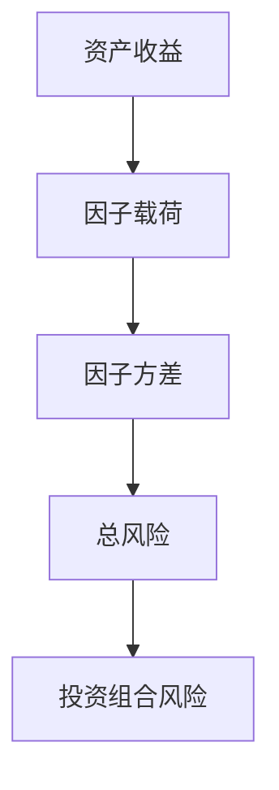
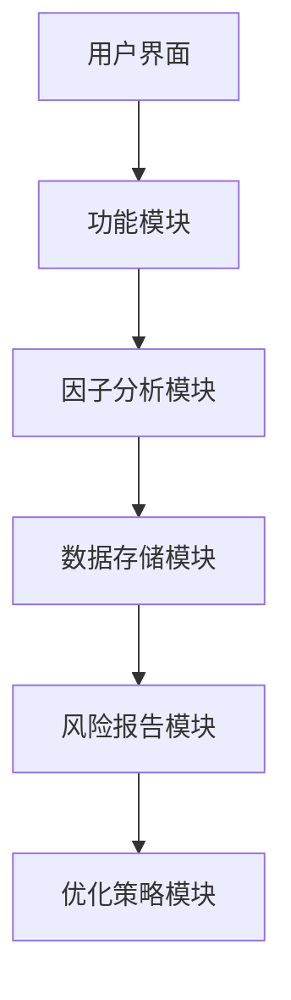
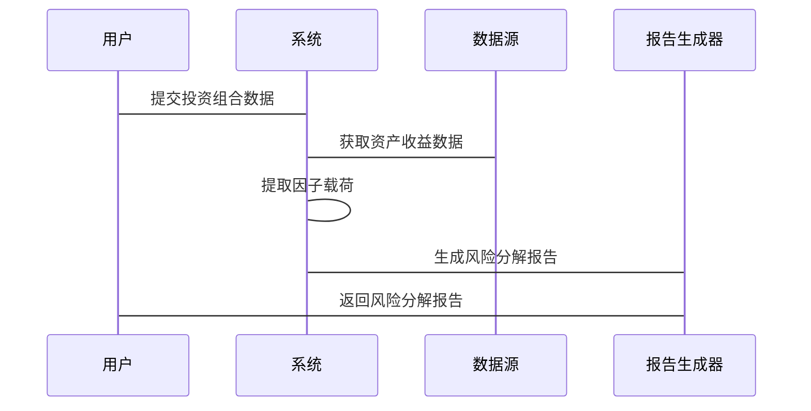

                 


# 风险因子分解：深入理解投资组合风险来源

## 关键词
- 风险因子分解
- 投资组合风险
- 因子模型
- 数学模型
- 系统架构
- 项目实战

## 摘要
风险因子分解是投资组合管理中的关键方法，用于识别和量化影响投资组合风险的因素。本文将从背景、理论基础、算法原理、系统架构到项目实战，全面解析风险因子分解的核心思想和应用。通过详细讲解因子模型、方差分解、协方差矩阵等关键概念，结合实际案例，帮助读者深入理解投资组合风险的来源及其分解方法。

---

## 第一部分：风险因子分解的背景与概念

### 第1章：风险因子分解概述

#### 1.1 风险因子分解的基本概念
- 1.1.1 风险因子的定义
  - 风险因子是指影响资产或投资组合收益波动的特定因素，如市场波动、利率变化、流动性风险等。
- 1.1.2 风险因子分解的背景
  - 金融市场中的风险来源多样化，投资者需要通过分解风险因子来优化投资组合。
- 1.1.3 风险因子分解的重要性
  - 帮助投资者识别和量化不同风险来源，制定有效的风险管理策略。

#### 1.2 投资组合风险的背景
- 1.2.1 投资组合风险的定义
  - 投资组合风险是指投资组合收益的波动性，通常由市场风险、流动性风险、信用风险等构成。
- 1.2.2 风险在投资决策中的作用
  - 风险是投资决策的核心因素，投资者需要在风险与收益之间找到平衡点。
- 1.2.3 风险因子分解的必要性
  - 通过分解风险因子，投资者可以更好地理解风险来源，从而优化投资组合的配置。

#### 1.3 风险因子分解的核心思想
- 1.3.1 风险来源的多样性
  - 市场风险、利率风险、信用风险、流动性风险等。
- 1.3.2 风险因子的分类
  - 系统性风险（如市场因子）和非系统性风险（如公司特有风险）。
- 1.3.3 风险因子分解的目标
  - 量化每个风险因子对投资组合风险的贡献，优化投资组合的风险管理。

---

### 第2章：风险因子分解的理论基础

#### 2.1 现代投资组合理论（MPT）
- 2.1.1 MPT的核心思想
  - 通过分散投资降低非系统性风险，构建最优投资组合。
- 2.1.2 风险与收益的关系
  - 预期收益与风险成正比，投资者需要在风险与收益之间找到平衡。
- 2.1.3 有效前沿的概念
  - 有效前沿是指在给定风险水平下，提供最高预期收益的投资组合。

#### 2.2 因子模型与风险分解
- 2.2.1 单因子模型（CAPM）
  - 单因子模型假设资产收益仅受市场因子的影响。
- 2.2.2 多因子模型（APT）
  - 多因子模型考虑多个因子对资产收益的影响，如市值、价值、动量等。
- 2.2.3 因子模型的优缺点
  - 优点：能够量化多个风险因子的影响；缺点：因子选择和权重的确定需要主观判断。

#### 2.3 风险分解的数学基础
- 2.3.1 方差与协方差矩阵
  - 方差衡量资产收益的波动性，协方差衡量资产之间的相关性。
- 2.3.2 因子载荷矩阵
  - 因子载荷矩阵表示资产收益与各因子之间的关系。
- 2.3.3 因子方差与总方差的关系
  - 总方差可以分解为因子方差和非因子方差之和。

---

### 第3章：风险因子分解的核心概念与联系

#### 3.1 风险因子的属性特征对比
| 特性        | 系统性风险       | 非系统性风险       |
|-------------|------------------|--------------------|
| 影响范围     | 全市场          | 单一资产或行业     |
| 可分散性     | 不可分散        | 可分散            |
| 例子         | 市场波动、利率变化 | 公司业绩、管理风险  |

#### 3.2 ER实体关系图架构
```mermaid
erd
  entity 投资组合风险
    - 资产：资产ID, 名称, 风险值
    - 因子：因子ID, 名称, 影响程度
    - 投资组合：组合ID, 名称, 风险分解结果
```

#### 3.3 因子模型的mermaid流程图


---

### 第4章：风险因子分解的算法原理

#### 4.1 方差分解算法
- 方差分解公式：
  $$ \text{Var}(r) = \sum_{i=1}^{n} \lambda_i \text{Var}(f_i) + \text{Var}(e) $$
  其中，\( \lambda_i \) 是因子载荷，\( f_i \) 是因子，\( e \) 是特异风险。

#### 4.2 协方差矩阵的构建
- 协方差矩阵公式：
  $$ \text{Cov}(r_i, r_j) = \sum_{k=1}^{m} \lambda_{ik}\lambda_{jk} \text{Var}(f_k) + \text{Cov}(e_i, e_j) $$

#### 4.3 因子载荷矩阵的计算
- 使用主成分分析（PCA）或因子分析方法提取因子载荷。

#### 4.4 Python代码实现
```python
import numpy as np
from sklearn.decomposition import PCA

# 示例数据：资产收益矩阵
returns = np.array([[0.1, 0.2, 0.15],
                    [0.05, 0.3, 0.2],
                    [0.15, 0.25, 0.2]])

# 使用PCA提取因子载荷
pca = PCA(n_components=2)
pca.fit(returns)
factor_loadings = pca.components_

# 计算因子方差
factor_variances = np.diag(pca.explained_variance_)

# 计算总方差
total_var = np.var(returns, axis=0).sum()

# 输出结果
print("因子载荷矩阵：", factor_loadings)
print("因子方差：", factor_variances)
print("总方差：", total_var)
```

---

## 第二部分：系统分析与架构设计

### 第5章：风险因子分解的系统架构

#### 5.1 项目介绍
- 投资组合风险管理系统旨在通过分解风险因子，优化投资组合的风险管理。

#### 5.2 功能设计
- 数据采集与处理
- 因子提取与分析
- 风险分解与报告
- 风险优化与策略制定

#### 5.3 系统架构设计


#### 5.4 接口设计
- 数据接口：从数据源获取资产收益数据。
- 因子分析接口：提取因子载荷并计算因子方差。
- 报告接口：生成风险分解报告。

#### 5.5 交互流程图


---

## 第三部分：项目实战

### 第6章：风险因子分解的实战应用

#### 6.1 环境安装
- 安装必要的Python库，如numpy、pandas、sklearn等。

#### 6.2 核心实现代码
```python
import numpy as np
from sklearn.decomposition import PCA

# 示例数据：资产收益矩阵
returns = np.array([[0.1, 0.2, 0.15],
                    [0.05, 0.3, 0.2],
                    [0.15, 0.25, 0.2]])

# 使用PCA提取因子载荷
pca = PCA(n_components=2)
pca.fit(returns)
factor_loadings = pca.components_

# 计算因子方差
factor_variances = np.diag(pca.explained_variance_)

# 计算总方差
total_var = np.var(returns, axis=0).sum()

# 输出结果
print("因子载荷矩阵：", factor_loadings)
print("因子方差：", factor_variances)
print("总方差：", total_var)
```

#### 6.3 案例分析
- 选取一个资产组合，计算各因子对风险的贡献，优化投资组合配置。

#### 6.4 实验结果与分析
- 展示因子分解后的风险分布，分析各因子对总风险的贡献比例。

#### 6.5 项目小结
- 总结风险因子分解的优势和局限性，提出改进建议。

---

## 第四部分：总结与展望

### 第7章：总结与展望

#### 7.1 总结
- 风险因子分解是投资组合风险管理的重要工具，能够帮助投资者量化和优化风险来源。

#### 7.2 展望
- 随着AI技术的发展，风险因子分解将更加智能化和自动化，未来可能结合大数据和机器学习模型进行更精准的风险分析。

---

通过以上结构，本文将系统地介绍风险因子分解的核心思想、算法原理、系统架构和实际应用，帮助读者深入理解投资组合风险的来源及其分解方法。

