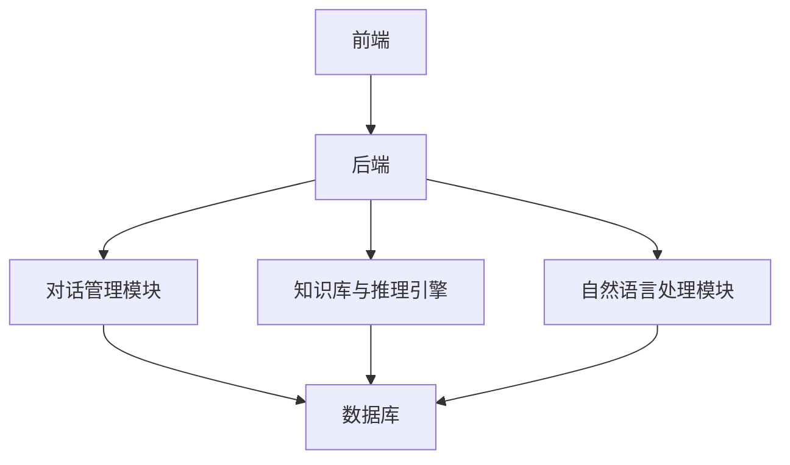
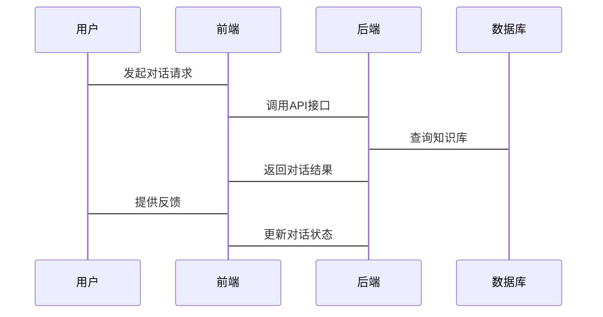

                 


# AI Agent在企业客户服务质量监控与智能升级中的角色

## 关键词：AI Agent, 客户服务质量, 智能升级, 多轮对话, 机器学习, 自然语言处理, 知识图谱

## 摘要：  
AI Agent作为一种智能化的交互系统，正在成为企业客户服务质量监控与智能升级的核心工具。本文从AI Agent的基本概念出发，深入分析其在客户服务质量监控中的角色与应用，探讨其技术原理、系统架构及实际项目中的实现。通过案例分析和代码示例，本文详细展示了如何利用AI Agent提升客户服务质量，并提出了最佳实践与未来发展建议。

---

# 第一部分: AI Agent 在企业客户服务质量监控与智能升级中的背景与概念

## 第1章: AI Agent 的基本概念与背景

### 1.1 AI Agent 的定义与核心概念
#### 1.1.1 什么是 AI Agent
AI Agent（人工智能代理）是一种能够理解、推理、学习并执行任务的智能系统，旨在通过自然语言交互为用户提供高效、个性化的服务。与传统客服系统相比，AI Agent具有以下特点：
- **自动化**：无需人工干预，自动处理客户请求。
- **智能化**：基于上下文理解和历史数据，提供个性化服务。
- **实时性**：能够实时响应客户需求并提供解决方案。

#### 1.1.2 AI Agent 与传统客服系统的区别
| 特性 | 传统客服系统 | AI Agent |
|------|---------------|-----------|
| 交互方式 | 单向沟通，依赖人工操作 | 双向互动，支持多轮对话 |
| 处理能力 | 仅能处理预设问题 | 能够理解和解决复杂问题 |
| 效率 | 受人工限制，效率较低 | 高效、快速响应 |

#### 1.1.3 AI Agent 在企业中的应用场景
- **客户支持**：实时解决客户问题，提供个性化建议。
- **服务质量监控**：通过数据分析优化服务流程。
- **智能推荐**：基于客户行为推荐相关产品或服务。

### 1.2 企业客户服务质量监控的现状与挑战
#### 1.2.1 传统客户服务质量监控的痛点
- 数据分散，难以统一分析。
- 人工监控效率低，且容易出错。
- 缺乏实时反馈机制，难以快速响应客户需求。

#### 1.2.2 AI Agent 在客户服务质量监控中的优势
- **实时性**：能够实时收集和分析客户反馈。
- **准确性**：通过自然语言处理技术，准确识别客户情绪和需求。
- **高效性**：自动化处理大量数据，降低人工成本。

#### 1.2.3 企业客户服务质量升级的需求与目标
- 提升客户满意度和忠诚度。
- 优化服务流程，降低运营成本。
- 提供个性化服务，增强客户体验。

---

## 第2章: AI Agent 在企业客户服务质量监控中的角色

### 2.1 AI Agent 在客户服务质量监控中的功能
#### 2.1.1 实时监控与反馈
AI Agent通过实时分析客户对话内容，快速识别潜在问题并提供解决方案。例如，当客户投诉产品缺陷时，AI Agent可以立即触发内部流程进行问题处理。

#### 2.1.2 数据分析与预测
AI Agent可以收集和分析大量的客户数据，包括对话记录、客户反馈和行为数据，利用机器学习算法预测客户满意度和潜在需求。

#### 2.1.3 智能决策支持
AI Agent能够根据分析结果为企业提供智能化的决策支持，例如优化服务流程、调整营销策略等。

### 2.2 AI Agent 在客户服务质量升级中的应用场景
#### 2.2.1 客户情绪分析与服务优化
通过自然语言处理技术，AI Agent可以分析客户情绪，识别客户不满并及时提供解决方案，从而提升客户满意度。

#### 2.2.2 自动化问题解决与反馈
AI Agent能够自动识别并解决常见问题，例如密码重置、订单查询等，减少人工干预，提高服务效率。

#### 2.2.3 智能推荐与个性化服务
基于客户行为和偏好，AI Agent可以推荐相关产品或服务，提升客户体验和满意度。

### 2.3 本章小结
AI Agent在企业客户服务质量监控与智能升级中扮演着重要角色，通过实时监控、数据分析和智能决策支持，帮助企业优化服务流程，提升客户满意度。

---

# 第二部分: AI Agent 的核心概念与技术原理

## 第3章: AI Agent 的核心概念与原理

### 3.1 AI Agent 的核心概念
#### 3.1.1 多轮对话机制
多轮对话是AI Agent与客户交互的核心机制，通过上下文理解实现连贯的对话。例如：
- 客户：我的订单在哪里？
- AI Agent：请提供订单号，我帮您查询。
- 客户：12345。
- AI Agent：您的订单预计明天送达。

#### 3.1.2 知识库与上下文理解
AI Agent需要依赖知识库来回答客户问题，同时通过上下文理解实现对话连贯性。例如，客户提到“订单延迟”，AI Agent需要结合订单信息和延迟原因进行回复。

#### 3.1.3 智能推理与决策
AI Agent通过智能推理和决策，能够在复杂场景下提供最优解决方案。例如，当客户投诉产品缺陷时，AI Agent可以结合产品信息和客户反馈，推荐解决方案。

### 3.2 AI Agent 的技术原理
#### 3.2.1 自然语言处理（NLP）基础
自然语言处理是AI Agent实现智能对话的核心技术，包括分词、实体识别、情感分析等功能。例如：
- **分词**：将客户对话内容分解为词语或短语。
- **实体识别**：识别客户输入中的关键实体，例如订单号、产品名称等。
- **情感分析**：分析客户情绪，识别客户满意度。

#### 3.2.2 机器学习与深度学习
机器学习和深度学习是AI Agent实现智能推理和决策的核心技术，包括监督学习、无监督学习和强化学习。例如：
- **监督学习**：基于标注数据训练模型，识别客户意图。
- **无监督学习**：通过聚类分析发现客户行为模式。
- **强化学习**：通过奖励机制优化对话策略。

#### 3.2.3 知识图谱与推理引擎
知识图谱是AI Agent实现智能推理的基础，推理引擎则是实现智能决策的核心。例如：
- **知识图谱**：构建产品信息、订单信息等知识图谱。
- **推理引擎**：基于知识图谱进行推理，生成解决方案。

---

## 第4章: AI Agent 的核心算法与模型

### 4.1 基于生成模型的对话生成
#### 4.1.1 Transformer 模型简介
Transformer模型是一种基于自注意力机制的深度学习模型，广泛应用于自然语言处理任务。其核心公式为：
$$\text{Attention}(Q, K, V) = \text{softmax}(\frac{QK^T}{\sqrt{d}})V$$
其中，$Q$、$K$、$V$分别为查询、键和值矩阵，$d$为维度。

#### 4.1.2 GPT 模型在对话生成中的应用
GPT（Generative Pre-trained Transformer）模型是一种基于Transformer的生成模型，广泛应用于对话生成任务。其损失函数为：
$$\text{Loss} = -\sum_{i=1}^{n} \log P(x_i | x_{<i})$$
其中，$x_i$为输入序列，$P(x_i | x_{<i})$为条件概率。

#### 4.1.3 对话生成的损失函数与优化方法
对话生成的损失函数通常采用交叉熵损失函数，优化方法包括Adam优化器和学习率衰减策略。

### 4.2 基于检索模型的对话理解
#### 4.2.1 基于向量检索的对话理解
基于向量检索的对话理解方法通过将对话内容表示为向量，利用余弦相似度进行匹配。例如：
$$\text{Similarity}(v_1, v_2) = \frac{v_1 \cdot v_2}{\|v_1\| \|v_2\|}$$
其中，$v_1$和$v_2$分别为两个向量。

#### 4.2.2 BM25 算法在对话理解中的应用
BM25是一种基于概率的检索算法，广泛应用于信息检索任务。其核心公式为：
$$\text{Score}(d, q) = \text{BM25}(d, q) = \frac{\text{len}(d)}{\text{avgdl}} \cdot \frac{\text{freq}(q, d)}{\text{freq}(q, R)} \cdot \log(\text{doc\_len} + 1)$$
其中，$d$为文档，$q$为查询词，$R$为文档库。

#### 4.2.3 对话理解的评估指标
对话理解的评估指标包括准确率、召回率和F1值。例如：
- **准确率**：正确识别的意图数量 / 总意图数量。
- **召回率**：正确识别的意图数量 / 实际存在的意图数量。
- **F1值**：准确率和召回率的调和平均值。

### 4.3 算法原理的数学模型与公式
#### 4.3.1 Transformer 模型的注意力机制公式
$$\text{Attention}(Q, K, V) = \text{softmax}(\frac{QK^T}{\sqrt{d}})V$$
其中，$Q$、$K$、$V$分别为查询、键和值矩阵，$d$为维度。

#### 4.3.2 GPT 模型的损失函数
$$\text{Loss} = -\sum_{i=1}^{n} \log P(x_i | x_{<i})$$
其中，$x_i$为输入序列，$P(x_i | x_{<i})$为条件概率。

---

## 第5章: AI Agent 的系统架构设计

### 5.1 系统功能模块设计
#### 5.1.1 对话管理模块
对话管理模块负责处理多轮对话，包括上下文管理和对话状态跟踪。例如：
- **上下文管理**：记录对话历史，确保连贯性。
- **对话状态跟踪**：根据当前对话内容更新状态。

#### 5.1.2 知识库与推理引擎
知识库与推理引擎模块负责提供知识支持和智能推理。例如：
- **知识库**：存储产品信息、订单信息等。
- **推理引擎**：基于知识图谱进行推理，生成解决方案。

#### 5.1.3 自然语言处理模块
自然语言处理模块负责对话内容的理解与生成。例如：
- **文本分词**：将对话内容分解为词语或短语。
- **情感分析**：分析客户情绪，识别客户满意度。

### 5.2 系统架构设计
#### 5.2.1 系统功能模块设计
- **前端**：负责用户交互，包括对话界面和结果显示。
- **后端**：负责处理用户请求，包括对话管理和知识库查询。
- **数据库**：负责存储客户数据和系统配置。

#### 5.2.2 系统架构图


#### 5.2.3 系统接口设计
- **API接口**：提供RESTful API，供前端调用。
- **数据库接口**：提供数据库访问接口，供后端调用。

#### 5.2.4 系统交互流程


---

## 第6章: 项目实战

### 6.1 项目背景与目标
#### 6.1.1 项目背景
某电商平台希望通过引入AI Agent提升客户服务质量，优化用户体验。

#### 6.1.2 项目目标
- 实现客户与AI Agent的多轮对话。
- 提供智能推荐和个性化服务。
- 实时监控客户情绪，优化服务流程。

### 6.2 项目环境与工具
- **编程语言**：Python
- **框架**：TensorFlow、Keras
- **自然语言处理库**：spaCy
- **知识图谱构建工具**：Neo4j

### 6.3 核心系统实现

#### 6.3.1 对话管理模块实现
```python
class DialogManager:
    def __init__(self):
        self.context = {}

    def process_query(self, user_input):
        # 分析用户输入
        # 更新上下文
        self.context[user_input] = time.time()
        # 返回响应
        return self.generate_response(user_input)

    def generate_response(self, user_input):
        # 基于上下文生成响应
        return "感谢您的咨询，我会尽快为您解决问题。"
```

#### 6.3.2 知识库与推理引擎实现
```python
class KnowledgeBase:
    def __init__(self):
        self.products = {
            "product1": {"id": 1, "name": "Product 1", "description": "This is product 1."},
            "product2": {"id": 2, "name": "Product 2", "description": "This is product 2."}
        }

    def get_product_info(self, product_id):
        return self.products.get(product_id, {})
```

#### 6.3.3 自然语言处理模块实现
```python
import spacy

nlp = spacy.load("en_core_web_sm")

def analyze_text(text):
    doc = nlp(text)
    # 分析实体、情感等
    return {"entities": [(ent.text, ent.start, ent.end) for ent in doc.ents]}
```

### 6.4 项目测试与优化
#### 6.4.1 系统测试
- 功能测试：验证对话管理、知识库查询等功能是否正常。
- 性能测试：测试系统在高并发情况下的响应时间。
- 安全测试：验证系统是否能够抵御恶意攻击。

#### 6.4.2 模型优化
- 参数调整：优化模型超参数，提高准确率。
- 数据增强：通过数据增强技术提高模型鲁棒性。
- 模型微调：基于新数据对模型进行微调，适应具体场景需求。

### 6.5 项目小结
通过实际项目实战，我们验证了AI Agent在企业客户服务质量监控与智能升级中的有效性。系统实现了多轮对话、智能推荐和实时监控等功能，显著提升了客户满意度和运营效率。

---

# 第三部分: AI Agent 的最佳实践与未来发展

## 第7章: 最佳实践与注意事项

### 7.1 最佳实践
#### 7.1.1 数据质量管理
- 确保数据质量，避免噪声数据干扰模型训练。
- 定期更新知识库，保持知识准确性。

#### 7.1.2 人机协同
- 在AI Agent无法解决复杂问题时，及时转接人工客服。
- 结合人工客服经验优化AI Agent模型。

#### 7.1.3 客户隐私保护
- 遵守数据隐私相关法律法规，保护客户隐私。
- 采用加密技术，防止数据泄露。

### 7.2 注意事项
- **模型可解释性**：确保模型决策过程透明，便于调试和优化。
- **用户体验**：避免过度依赖AI Agent，保持用户体验自然流畅。
- **系统稳定性**：确保系统在高负载情况下稳定运行。

## 第8章: 未来发展趋势

### 8.1 技术创新
- **多模态交互**：结合视觉、听觉等多模态信息，提升交互体验。
- **强化学习**：通过强化学习优化对话策略，提升智能性。

### 8.2 应用场景拓展
- **智能客服**：进一步优化智能客服系统，提升客户满意度。
- **智能营销**：结合营销策略，提供个性化推荐服务。
- **智能风控**：利用AI Agent进行风险监控和预警。

### 8.3 伦理与法律
- **数据隐私**：随着数据隐私法规的完善，AI Agent需要更加注重数据保护。
- **伦理问题**：避免AI Agent在实际应用中出现伦理问题，例如虚假信息生成。

---

## 第9章: 结语

AI Agent正在成为企业客户服务质量监控与智能升级的核心工具。通过本文的分析，我们深入探讨了AI Agent的核心概念、技术原理和系统架构，并通过实际项目展示了其在企业中的应用价值。未来，随着技术的不断发展，AI Agent将在更多场景中发挥重要作用，为企业创造更大的价值。

---

## 参考文献
1. Vaswani, A., et al. "Attention Is All You Need." Advances in Neural Information Processing Systems, 2017.
2. Radford, A., et al. "Language Models are Few-Shot Learners." arXiv preprint arXiv:1909.02795, 2019.
3. Mikolov, T., et al. "Efficient Processing of Text Using Neural Networks." arXiv preprint arXiv:1303.3771, 2013.

