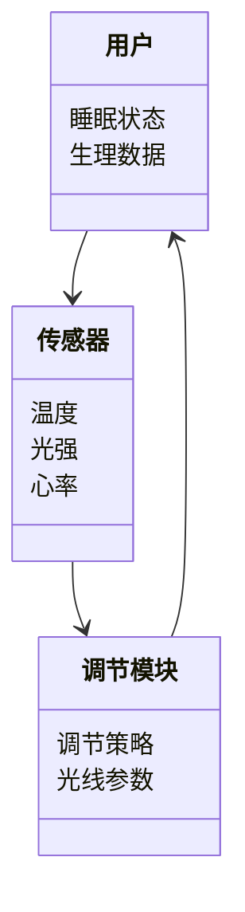
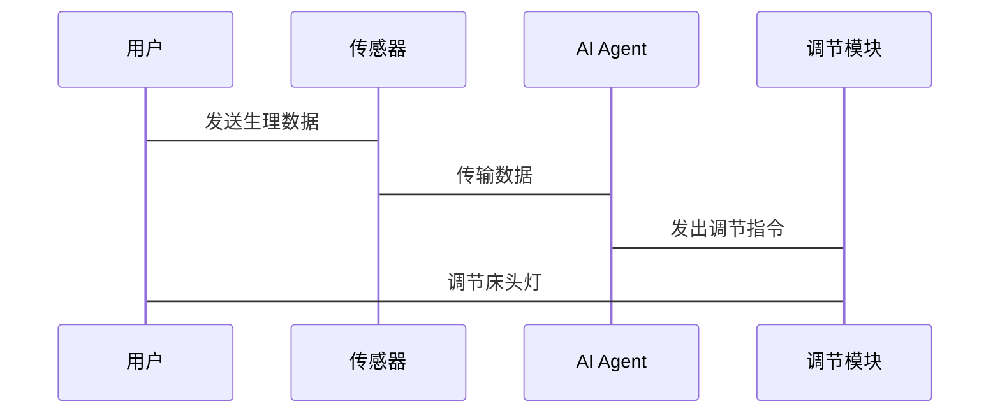

                 


# AI Agent在智能床头灯中的生理节律调节

## 关键词：AI Agent, 生理节律, 智能床头灯, 强化学习, 算法原理, 系统架构

## 摘要：本文探讨了AI Agent在智能床头灯中的应用，重点分析了其在生理节律调节中的作用。通过背景介绍、核心概念、算法原理、系统架构、项目实战等部分，详细阐述了AI Agent如何通过调节光线和环境因素来优化用户的生理节律。文章结合理论与实践，为智能床头灯的设计提供了新的思路。

---

# 第1章：AI Agent与生理节律调节的背景

## 1.1 AI Agent的基本概念

### 1.1.1 AI Agent的定义与特点
AI Agent（人工智能代理）是指能够感知环境、自主决策并执行任务的智能实体。其特点包括：
- **自主性**：能够在无外部干预的情况下运行。
- **反应性**：能够根据环境变化实时调整行为。
- **学习能力**：通过数据和经验不断优化性能。

### 1.1.2 AI Agent在智能设备中的应用
AI Agent广泛应用于智能家居、医疗设备等领域。在智能床头灯中，AI Agent主要用于调节光线、监测用户状态并优化环境。

### 1.1.3 生理节律调节的背景与重要性
生理节律是指生物体内部的时间周期，如睡眠-觉醒周期。调节生理节律对健康至关重要，尤其是对于失眠、生物钟紊乱的用户。

## 1.2 智能床头灯的发展现状

### 1.2.1 智能床头灯的功能演变
从简单的照明到支持智能调节光线、监测环境参数，智能床头灯的功能日益多样化。

### 1.2.2 当前市场中的智能床头灯技术
现代智能床头灯通常集成光线调节、环境监测、无线通信等功能，部分产品已开始引入AI技术。

### 1.2.3 AI技术在床头灯中的应用趋势
AI技术的应用将使床头灯从单一照明工具转变为智能健康助手。

## 1.3 AI Agent在生理节律调节中的应用价值

### 1.3.1 生理节律对健康的影响
紊乱的生理节律可能导致睡眠障碍、情绪波动等问题。

### 1.3.2 AI Agent在调节中的优势
AI Agent能够实时监测用户状态，并通过动态调节环境因素优化生理节律。

### 1.3.3 智能床头灯作为调节工具的潜力
通过AI Agent，智能床头灯可成为用户生理节律调节的重要工具，改善睡眠质量。

---

# 第2章：AI Agent的原理与生理节律调节的核心概念

## 2.1 AI Agent的核心原理

### 2.1.1 感知模块：数据采集与处理
AI Agent通过传感器收集用户的状态数据，如心率、体温、环境光强等。

### 2.1.2 决策模块：算法与模型
基于收集的数据，AI Agent通过强化学习等算法生成调节策略。

### 2.1.3 执行模块：输出调节指令
根据决策结果，AI Agent调整床头灯的光线参数，如亮度、色温和照射角度。

## 2.2 生理节律调节的数学模型

### 2.2.1 生理节律的基本数学模型
生理节律通常可以用周期函数描述，如正弦波函数。

### 2.2.2 AI Agent的调节算法模型
AI Agent通过强化学习优化调节策略，建立动态模型。

### 2.2.3 调节效果的评估模型
通过统计学方法评估调节效果，如睡眠质量评分。

## 2.3 AI Agent与生理节律调节的关系

### 2.3.1 AI Agent在调节中的作用机制
AI Agent通过调节环境因素间接影响用户的生理节律。

### 2.3.2 生理节律调节对AI Agent的要求
AI Agent需要高精度的传感器和高效的算法。

### 2.3.3 二者的相互影响与协同作用
AI Agent的调节能力依赖于对生理节律的深刻理解，而生理节律研究则推动AI Agent的进步。

---

# 第3章：AI Agent的算法原理

## 3.1 强化学习算法在AI Agent中的应用

### 3.1.1 强化学习的基本原理
强化学习通过试错机制优化决策策略。

### 3.1.2 Q-learning算法的实现
Q-learning是一种经典的强化学习算法，公式如下：

$$ Q(s, a) = Q(s, a) + \alpha (r + \gamma \max Q(s', a') - Q(s, a)) $$

其中，$s$是状态，$a$是动作，$\alpha$是学习率，$r$是奖励，$\gamma$是折扣因子。

### 3.1.3 算法在生理节律调节中的应用实例
AI Agent通过Q-learning算法学习最佳的光线调节策略。

## 3.2 生理节律预测模型的构建

### 3.2.1 数据预处理与特征提取
对收集的用户数据进行清洗和特征提取。

### 3.2.2 神经网络模型的设计
设计神经网络模型，用于预测用户的生理状态。

### 3.2.3 模型的训练与优化
通过大量数据训练模型，并不断优化参数。

## 3.3 调节策略的优化算法

### 3.3.1 基于反馈的策略优化
AI Agent根据用户反馈调整调节策略。

### 3.3.2 在线学习与自适应调节
AI Agent通过在线学习实现动态优化。

---

# 第4章：系统分析与架构设计

## 4.1 问题场景介绍

### 4.1.1 用户需求
用户希望智能床头灯能够帮助调节生理节律。

### 4.1.2 系统目标
设计一个基于AI Agent的智能床头灯系统，优化用户的生理节律。

## 4.2 系统功能设计

### 4.2.1 领域模型


### 4.2.2 系统架构


## 4.3 系统接口设计

### 4.3.1 接口定义
- 传感器数据接口：提供实时数据。
- 调节模块接口：接收调节指令。

## 4.4 系统交互流程

### 4.4.1 交互流程图


---

# 第5章：项目实战

## 5.1 环境安装

### 5.1.1 系统环境
- 操作系统：Linux
- 开发工具：Python 3.8+

### 5.1.2 安装依赖
```bash
pip install numpy matplotlib scikit-learn
```

## 5.2 核心代码实现

### 5.2.1 AI Agent实现
```python
import numpy as np

class AI_Agent:
    def __init__(self):
        self.Q = {}

    def get_Q(self, state, action):
        return self.Q.get((state, action), 0)

    def update_Q(self, state, action, reward, next_state):
        key = (state, action)
        self.Q[key] = self.Q.get(key, 0) + 0.1 * (reward + 0.9 * max(self.get_Q(next_state, a) for a in self.possible_actions(next_state)) - self.get_Q(state, action))

    def possible_actions(self, state):
        return ['bright', 'dim', 'normal']
```

### 5.2.2 应用实例
```python
agent = AI_Agent()
state = 'low_light'
action = 'bright'
reward = 0.9
next_state = 'normal_light'
agent.update_Q(state, action, reward, next_state)
```

## 5.3 代码解读与分析

### 5.3.1 代码功能
AI Agent通过Q-learning算法学习最优的调节策略。

### 5.3.2 实际案例
通过训练，AI Agent能够根据用户状态调整床头灯的光线。

## 5.4 项目小结

### 5.4.1 实战总结
通过项目实战，验证了AI Agent在智能床头灯中的有效性。

---

# 第6章：总结与展望

## 6.1 项目小结
本文详细介绍了AI Agent在智能床头灯中的应用，探讨了其在生理节律调节中的作用。

## 6.2 注意事项
- 数据采集的准确性影响调节效果。
- 需要考虑用户隐私保护。

## 6.3 最佳实践 tips
- 定期更新模型，保持调节策略的有效性。
- 提供用户友好的交互界面。

## 6.4 拓展阅读
建议读者深入学习强化学习和生物节律调节的相关知识。

---

# 结语
通过本文的探讨，AI Agent在智能床头灯中的应用前景广阔，未来将为用户提供更健康的生活方式。

