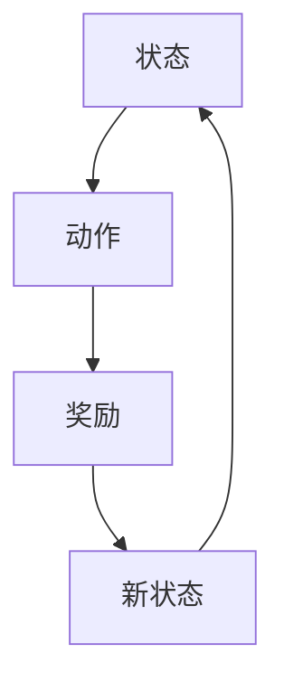
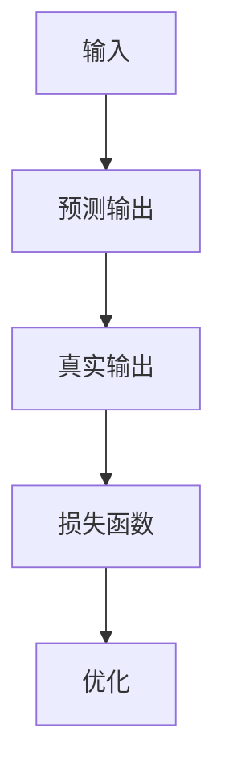
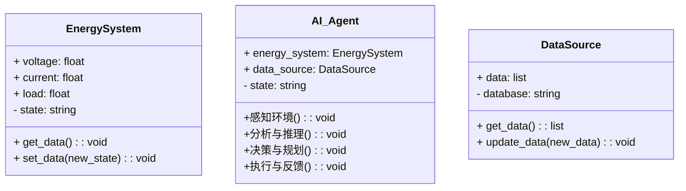
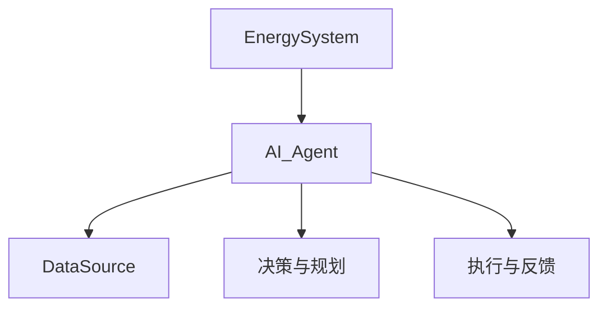
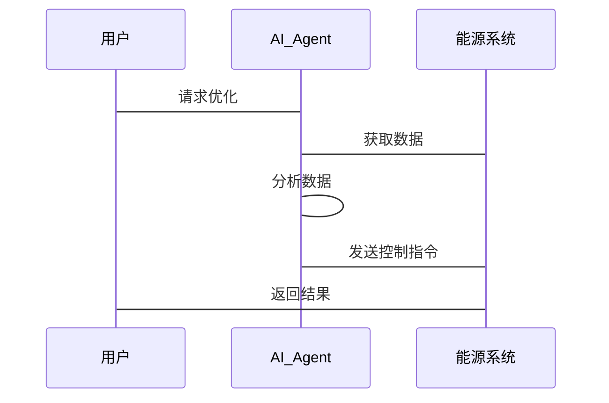

                 


# AI Agent在智能能源管理中的应用

> 关键词：AI Agent，智能能源管理，强化学习，能源优化，可再生能源

> 摘要：随着全球能源需求的增长和环境问题的加剧，智能能源管理的重要性日益凸显。AI Agent作为人工智能领域的核心技术，正在被广泛应用于能源管理的各个环节。本文将深入探讨AI Agent在智能能源管理中的应用，从背景、核心概念、算法原理、系统架构到项目实战，全面解析AI Agent如何助力能源管理的智能化升级。

---

# 第一部分: AI Agent与智能能源管理的背景介绍

# 第1章: AI Agent与智能能源管理的背景介绍

## 1.1 问题背景与问题描述

### 1.1.1 智能能源管理的定义与目标

智能能源管理是一种通过智能化技术优化能源使用效率、降低能源消耗、提高能源系统可靠性的管理方式。其目标是通过实时数据采集、分析和决策，实现能源的高效配置和优化利用。

### 1.1.2 当前能源管理中的挑战与痛点

- **能源需求增长与资源有限的矛盾**：随着全球经济的发展，能源需求持续增长，但传统能源资源（如煤炭、石油）的储量有限，且不可再生。
- **能源浪费与效率低下**：传统的能源管理方式往往依赖人工操作，存在效率低下、浪费严重的问题。
- **可再生能源的接入与协调**：随着可再生能源（如太阳能、风能）的广泛应用，如何协调多种能源源的波动性与电网的稳定性成为新的挑战。
- **数据爆炸与决策复杂性**：能源系统的数据量急剧增加，传统的决策方法难以应对复杂多变的能源环境。

### 1.1.3 AI Agent在能源管理中的作用与意义

AI Agent（人工智能代理）是一种能够感知环境、自主决策并执行任务的智能体。在能源管理中，AI Agent可以通过实时数据采集、智能分析和自主决策，实现能源的高效配置和优化利用。AI Agent的应用可以显著提升能源管理的效率和智能化水平，帮助解决上述挑战。

## 1.2 问题解决与边界定义

### 1.2.1 AI Agent如何解决能源管理问题

AI Agent可以通过以下方式解决能源管理中的问题：
- **实时数据采集与分析**：AI Agent能够实时采集能源系统的数据（如电压、电流、负荷等），并利用机器学习算法进行分析，识别潜在问题。
- **智能决策与优化**：基于分析结果，AI Agent可以自主决策，优化能源分配、负荷调节和设备运行。
- **预测与规划**：通过历史数据和机器学习模型，AI Agent可以预测未来的能源需求和供应，制定优化的能源使用计划。

### 1.2.2 AI Agent在能源管理中的边界与外延

AI Agent在能源管理中的边界包括：
- **数据输入**：AI Agent需要从能源系统中获取实时数据和历史数据。
- **决策输出**：AI Agent需要将决策结果输出到能源系统中，执行相应的操作。
- **外部交互**：AI Agent可能需要与用户、其他系统或外部服务进行交互。

### 1.2.3 核心概念与核心要素组成

智能能源管理的核心概念包括：
- **能源系统**：包括发电、输电、配电和用电等环节。
- **AI Agent**：负责感知、决策和执行。
- **数据源**：包括传感器、数据库等。
- **决策模型**：包括机器学习模型和优化算法。

## 1.3 本章小结

本章主要介绍了智能能源管理的背景、挑战和AI Agent在其中的作用。通过分析能源管理中的问题，我们明确了AI Agent在优化能源利用、提高系统效率和降低能源浪费方面的重要价值。

---

# 第二部分: AI Agent的核心概念与原理

# 第2章: AI Agent的核心概念与属性特征

## 2.1 AI Agent的定义与原理

### 2.1.1 AI Agent的基本定义

AI Agent是一种智能体，能够感知环境、自主决策并执行任务。在能源管理中，AI Agent可以是一个软件系统，通过与能源系统交互，实现能源的优化管理。

### 2.1.2 AI Agent的核心原理与机制

AI Agent的核心原理包括：
1. **感知环境**：通过传感器、数据库等获取能源系统中的实时数据。
2. **分析与推理**：利用机器学习算法对数据进行分析和推理，识别潜在问题或优化机会。
3. **决策与规划**：基于分析结果，制定最优决策。
4. **执行与反馈**：将决策结果执行，并根据反馈调整策略。

## 2.2 AI Agent的属性特征对比

### 2.2.1 基于表格的属性特征对比

| 属性        | AI Agent                          | 传统能源管理系统                 |
|-------------|-----------------------------------|--------------------------------|
| 智能性       | 高                                 | 低                             |
| 自主性       | 高                                 | 低                             |
| 反应速度     | 快                                 | 较慢                            |
| 适应性       | 强                                 | 较弱                            |

### 2.2.2 AI Agent的ER实体关系图

```mermaid
er
actor: 用户
|------|
role: 角色
|------|
agent: AI Agent
|------|
energy_system: 能源系统
|------|
data_source: 数据源
|------|
action: 动作
```

## 2.3 本章小结

本章通过对比分析，明确了AI Agent与传统能源管理系统的区别。AI Agent的高智能性、自主性和快速反应能力使其在能源管理中具有显著优势。

---

# 第三部分: AI Agent的算法原理与数学模型

# 第3章: AI Agent的算法原理

## 3.1 AI Agent的核心算法

### 3.1.1 强化学习算法

强化学习是一种通过试错方式来优化决策的算法。AI Agent通过与环境交互，不断学习最优策略。以下是强化学习的流程图：



### 3.1.2 监督学习算法

监督学习是一种基于标签数据进行学习的算法。AI Agent通过监督学习可以识别模式并做出预测。以下是监督学习的流程图：



## 3.2 算法实现的Python代码示例

### 强化学习算法实现

```python
class AI_Agent:
    def __init__(self, state_space, action_space):
        self.state_space = state_space
        self.action_space = action_space
        self.q_table = np.zeros((state_space, action_space))

    def choose_action(self, state):
        if np.random.random() < 0.1:
            return np.random.randint(self.action_space)
        else:
            return np.argmax(self.q_table[state])

    def learn(self, state, action, reward, next_state):
        self.q_table[state, action] += 0.1 * (reward + np.max(self.q_table[next_state]) - self.q_table[state, action])
```

### 数学模型与公式

强化学习中的Q-learning算法公式为：

$$ Q(s, a) = Q(s, a) + \alpha (r + \gamma \max Q(s', a') - Q(s, a)) $$

其中：
- \( Q(s, a) \) 表示在状态 \( s \) 下执行动作 \( a \) 的价值。
- \( \alpha \) 是学习率。
- \( r \) 是奖励。
- \( \gamma \) 是折扣因子。
- \( Q(s', a') \) 是下一个状态的最大价值。

## 3.3 本章小结

本章介绍了AI Agent的核心算法，包括强化学习和监督学习，并给出了算法实现的Python代码和数学公式。通过这些算法，AI Agent可以实现对能源系统的智能决策和优化。

---

# 第四部分: AI Agent的系统分析与架构设计

# 第4章: AI Agent的系统分析与架构设计

## 4.1 问题场景介绍

在智能能源管理中，AI Agent通常应用于以下场景：
- **电网优化**：优化电力分配，降低能耗。
- **可再生能源管理**：协调太阳能、风能等可再生能源的接入与使用。
- **负荷预测与管理**：预测用电需求，优化负荷分配。

## 4.2 系统功能设计

### 领域模型类图



## 4.3 系统架构设计

### 系统架构图



### 接口设计

AI Agent与能源系统之间的接口设计包括：
- **数据接口**：AI Agent从能源系统中获取数据。
- **控制接口**：AI Agent向能源系统发送控制指令。

### 交互序列图



## 4.4 本章小结

本章通过系统分析和架构设计，明确了AI Agent在智能能源管理中的作用和实现方式。通过类图和序列图，展示了AI Agent与能源系统之间的交互关系。

---

# 第五部分: AI Agent的项目实战

# 第5章: AI Agent的项目实战

## 5.1 环境安装与配置

### Python环境配置

- 安装Python 3.8及以上版本。
- 安装必要的库：numpy、pandas、scikit-learn、matplotlib。

### 数据源配置

- 数据来源可以是本地数据库或API接口。
- 数据格式包括电压、电流、负荷等。

## 5.2 系统核心实现源代码

### 强化学习算法实现

```python
import numpy as np

class AI_Agent:
    def __init__(self, state_space, action_space):
        self.state_space = state_space
        self.action_space = action_space
        self.q_table = np.zeros((state_space, action_space))

    def choose_action(self, state):
        if np.random.random() < 0.1:
            return np.random.randint(self.action_space)
        else:
            return np.argmax(self.q_table[state])

    def learn(self, state, action, reward, next_state):
        self.q_table[state, action] += 0.1 * (reward + np.max(self.q_table[next_state]) - self.q_table[state, action])
```

### 系统架构实现

```python
class EnergySystem:
    def __init__(self):
        self.voltage = 0.0
        self.current = 0.0
        self.load = 0.0
        self.state = "normal"

    def get_data(self):
        return [self.voltage, self.current, self.load]

    def set_data(self, new_state):
        self.state = new_state

class DataSource:
    def __init__(self):
        self.data = []
        self.database = "energy.db"

    def get_data(self):
        return self.data

    def update_data(self, new_data):
        self.data.append(new_data)
```

## 5.3 代码应用解读与分析

### 代码解读

- **EnergySystem类**：表示能源系统，包含电压、电流和负荷等状态。
- **DataSource类**：表示数据源，用于获取和更新数据。
- **AI_Agent类**：实现强化学习算法，用于决策和优化。

### 代码实现的步骤

1. 初始化能源系统和数据源。
2. AI Agent从能源系统中获取数据。
3. AI Agent通过强化学习算法进行决策。
4. AI Agent向能源系统发送控制指令。

## 5.4 实际案例分析

### 案例1：电网优化

- **背景**：某地区电网负荷波动较大，需要优化电力分配。
- **实现**：AI Agent通过强化学习算法优化电力分配，降低能耗。
- **结果**：电网负荷波动显著减少，能源利用效率提升。

## 5.5 项目小结

本章通过项目实战，展示了AI Agent在智能能源管理中的具体应用。通过代码实现和案例分析，验证了AI Agent的有效性和优越性。

---

# 第六部分: 总结与展望

# 第6章: 总结与展望

## 6.1 最佳实践 tips

- **数据质量**：确保数据的准确性和实时性。
- **算法选择**：根据具体场景选择合适的算法。
- **系统安全性**：确保AI Agent系统的安全性，防止恶意攻击。

## 6.2 小结

本文深入探讨了AI Agent在智能能源管理中的应用，从背景、核心概念、算法原理到系统架构和项目实战，全面解析了AI Agent在能源管理中的重要价值和实现方式。

## 6.3 注意事项

- AI Agent的应用需要结合具体场景，不能盲目使用。
- 系统设计需要考虑可扩展性和可维护性。

## 6.4 拓展阅读

- 《强化学习：算法与应用》
- 《人工智能在能源管理中的应用》

## 6.5 本章小结

AI Agent在智能能源管理中的应用前景广阔，随着技术的不断发展，AI Agent将在能源管理中发挥越来越重要的作用。

---

# 结语

AI Agent作为人工智能领域的核心技术，正在深刻改变智能能源管理的方式。通过本文的分析和实战，我们看到了AI Agent在能源管理中的巨大潜力。未来，随着技术的不断进步，AI Agent将在能源管理中发挥更大的作用，为实现可持续发展和绿色能源目标贡献力量。

