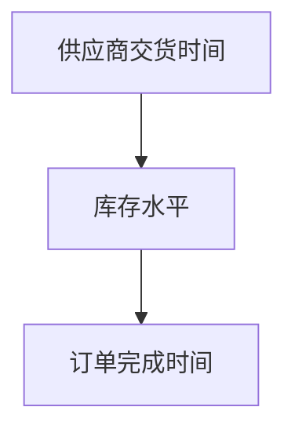
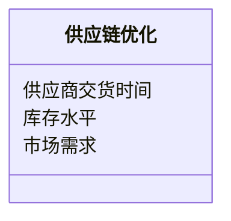
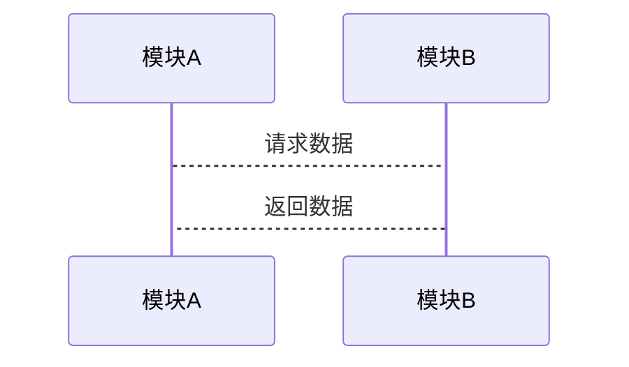
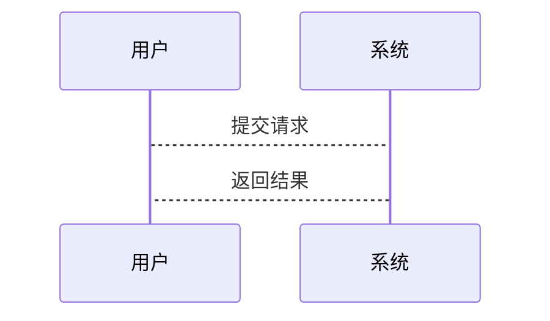

                 


# 企业AI Agent的因果推理应用：深入理解业务逻辑

## 关键词：企业AI Agent，因果推理，业务逻辑，因果关系，算法实现，系统架构，项目实战

## 摘要：本文深入探讨了企业AI Agent在因果推理中的应用，分析了如何通过因果推理技术来理解复杂的业务逻辑。文章从背景、核心概念、算法原理、系统架构到项目实战，层层展开，详细解读了因果推理在企业AI Agent中的重要性及其实际应用。通过理论与实践的结合，帮助读者掌握如何在企业场景中运用因果推理技术来优化业务逻辑。

---

# 第1章: 问题背景与问题描述

## 1.1 企业AI Agent的背景介绍

### 1.1.1 企业智能化转型的现状与挑战

随着人工智能技术的快速发展，企业智能化转型已成为不可逆转的趋势。企业AI Agent作为一种能够自主感知、分析和决策的智能体，正在成为企业数字化转型的核心工具。然而，在实际应用中，企业AI Agent需要处理复杂的业务逻辑，而这些逻辑往往涉及多个变量之间的因果关系。传统的数据分析方法难以捕捉这些因果关系，导致决策的不准确性和片面性。

### 1.1.2 AI Agent在企业中的角色与价值

企业AI Agent通过整合企业内外部数据，能够实时感知业务状态，并基于因果推理技术，为企业提供智能化的决策支持。它不仅能够预测业务结果，还能解释因果关系，从而帮助企业优化业务流程、提升决策效率。

### 1.1.3 业务逻辑与因果关系的重要性

业务逻辑是企业运营的核心，而因果关系是业务逻辑的核心。只有理解了因果关系，才能真正理解业务逻辑。因果推理技术能够帮助企业AI Agent从数据中提取因果关系，从而更准确地理解和优化业务逻辑。

## 1.2 问题描述与目标

### 1.2.1 传统数据分析的局限性

传统的数据分析方法（如统计分析）通常只能发现变量之间的相关性，而无法确定因果关系。这导致企业在基于数据分析的决策中，容易受到相关关系的误导，无法真正优化业务流程。

### 1.2.2 因果推理在业务逻辑中的必要性

因果推理能够帮助AI Agent理解变量之间的因果关系，从而更准确地预测业务结果。这在复杂的业务环境中尤为重要，因为业务结果往往受到多个变量的共同影响。

### 1.2.3 企业AI Agent的目标与应用场景

企业AI Agent的目标是通过因果推理技术，深入理解业务逻辑，并在实际业务场景中应用这些理解，优化业务流程、提升决策效率。其应用场景包括供应链优化、客户行为预测、风险控制等。

## 1.3 问题解决与边界

### 1.3.1 因果推理如何解决业务逻辑问题

因果推理通过分析变量之间的因果关系，帮助企业AI Agent理解业务逻辑的内在结构。这使得AI Agent能够从数据中提取因果关系，从而更准确地预测业务结果。

### 1.3.2 企业AI Agent的边界与外延

企业AI Agent的边界在于其处理的业务逻辑的复杂性和数据的完整性。其外延则包括与企业其他系统的集成、数据来源的多样性等。

### 1.3.3 核心概念与关键问题

企业AI Agent的核心概念包括因果推理、业务逻辑、数据驱动决策等。关键问题在于如何将因果推理技术应用于实际业务场景，如何处理数据的不确定性，以及如何优化因果推理算法的性能。

## 1.4 核心概念结构

企业AI Agent的因果推理应用涉及多个核心概念，包括因果关系、业务逻辑、数据驱动决策等。这些概念之间的关系可以通过ER图（实体关系图）来描述。

```mermaid
er
actor: 企业AI Agent
relation: 实施因果推理
```

---

# 第2章: 因果推理的核心概念与联系

## 2.1 因果推理的原理与方法

### 2.1.1 因果关系的定义与特征

因果关系是指一个事件（原因）导致另一个事件（结果）发生的必然联系。其特征包括：时间顺序性、可重复性、可验证性等。

### 2.1.2 因果推理的基本原理

因果推理的基本原理包括识别因果变量、建立因果模型、验证因果关系等。常用的方法包括潜在结果框架（Potential Outcome Framework）和结构方程模型（SEM）。

### 2.1.3 因果推理与相关概念的对比

因果推理与相关分析、回归分析等方法有明显的区别。以下是它们的对比：

| 概念       | 相关分析             | 回归分析             | 因果推理             |
|------------|----------------------|----------------------|----------------------|
| 目标       | 描述变量之间的相关性 | 预测变量之间的关系   | 确定变量之间的因果关系 |
| 方法       | 计算相关系数         | 建立回归模型         | 分析潜在结果         |
| 适用场景   | 描述性分析           | 预测性分析           | 因果性分析           |

## 2.2 业务逻辑与因果关系的关联

### 2.2.1 业务逻辑的构成要素

业务逻辑由变量、关系、规则和目标组成。例如，在供应链优化中，变量可能包括供应商交货时间、库存水平、市场需求等。

### 2.2.2 因果关系在业务逻辑中的表现

因果关系在业务逻辑中表现为变量之间的因果影响。例如，供应商交货时间的延迟（原因）会导致库存水平下降（结果）。

### 2.2.3 业务逻辑与因果关系的映射关系

业务逻辑中的因果关系可以通过因果图（Causal Graph）进行建模。例如：



---

# 第3章: 因果推理的数学模型与算法原理

## 3.1 因果推理的数学基础

### 3.1.1 概率论基础

概率论是因果推理的数学基础之一。概率分布（Probability Distribution）描述了变量可能的取值及其概率。

### 3.1.2 图论与因果图

因果图（Causal Graph）是一种有向图，用于表示变量之间的因果关系。例如：


### 3.1.3 贝叶斯定理与应用

贝叶斯定理（Bayes' Theorem）用于计算条件概率，是因果推理中的重要工具。公式如下：

$$ P(A|B) = \frac{P(B|A)P(A)}{P(B)} $$

其中，$$ P(A|B) $$ 表示在B发生的条件下，A发生的概率。

## 3.2 因果推理的核心算法

### 3.2.1 潜在结果框架（Potential Outcome Framework）

潜在结果框架通过分析每个单位在不同处理情况下的潜在结果，来评估因果效应。例如，对于每个客户，分析他们在接受优惠和不接受优惠情况下的购买行为。

### 3.2.2 结构方程模型（SEM）

结构方程模型通过构建方程组，描述变量之间的因果关系。例如：

$$ Y = \beta X + \epsilon $$

其中，$$ Y $$ 是结果变量，$$ X $$ 是原因变量，$$ \epsilon $$ 是误差项。

### 3.2.3 随机化实验与因果推断

随机化实验是验证因果关系的金标准。通过随机分配处理组和对照组，可以有效分离变量之间的因果关系。

## 3.3 算法原理的数学公式

### 3.3.1 潜在结果公式

$$ Y_i = \theta D_i + \epsilon_i $$

其中，$$ Y_i $$ 是结果变量，$$ D_i $$ 是处理变量（例如是否接受优惠），$$ \theta $$ 是因果效应，$$ \epsilon_i $$ 是误差项。

### 3.3.2 结构方程模型公式

$$ Y = \beta X + \epsilon $$

其中，$$ Y $$ 是结果变量，$$ X $$ 是原因变量，$$ \beta $$ 是系数，$$ \epsilon $$ 是误差项。

---

# 第4章: 企业AI Agent的系统架构设计

## 4.1 问题场景介绍

企业AI Agent需要处理复杂的业务逻辑，涉及多个变量之间的因果关系。例如，在供应链优化中，需要考虑供应商交货时间、库存水平、市场需求等多个变量。

## 4.2 系统功能设计

### 4.2.1 领域模型（Domain Model）

领域模型描述了业务领域的核心概念及其关系。例如：



### 4.2.2 系统架构设计

系统架构设计需要考虑数据流、组件交互等。例如：


### 4.2.3 系统接口设计

系统接口设计需要定义组件之间的交互接口。例如：



### 4.2.4 系统交互设计

系统交互设计需要描述用户与系统的交互流程。例如：



---

# 第5章: 项目实战与案例分析

## 5.1 项目介绍

### 5.1.1 项目背景

以供应链优化为例，企业需要通过AI Agent优化供应链管理，减少库存成本，提高交货速度。

### 5.1.2 项目目标

通过因果推理技术，优化供应链管理，减少库存成本，提高交货速度。

## 5.2 系统核心实现

### 5.2.1 环境配置

安装必要的依赖库，例如Python的因果推理库：

```bash
pip install causalnex
```

### 5.2.2 核心代码实现

以下是因果推理的核心代码示例：

```python
import causalnex

# 定义因果图
 causal_graph = causalnex.structure.StructuralModel()
 causal_graph.add_edge('供应商交货时间', '库存水平')

# 训练因果模型
 causal_model = causalnex.deiderite.Inference.do2( causal_graph, data)

# 预测因果效应
 causal_effect = causal_model.treatment('供应商交货时间', 'fast')
```

### 5.2.3 代码解读与分析

上述代码定义了一个因果图，训练了一个因果模型，并预测了处理变量（供应商交货时间）的因果效应。

## 5.3 案例分析

### 5.3.1 案例背景

以某企业供应链优化为例，数据包括供应商交货时间、库存水平、市场需求等变量。

### 5.3.2 数据分析

通过因果推理技术，分析供应商交货时间对库存水平的影响。

### 5.3.3 案例小结

通过因果推理技术，企业成功优化了供应链管理，降低了库存成本，提高了交货速度。

---

# 第6章: 总结与展望

## 6.1 全文总结

本文深入探讨了企业AI Agent在因果推理中的应用，分析了如何通过因果推理技术来理解复杂的业务逻辑。通过理论与实践的结合，帮助读者掌握如何在企业场景中运用因果推理技术来优化业务逻辑。

## 6.2 未来展望

未来，因果推理技术将在企业AI Agent中发挥更大的作用。随着算法的不断优化和数据的日益丰富，因果推理技术将更加精准，为企业决策提供更强大的支持。

## 6.3 最佳实践

- 在实际应用中，建议先从简单的因果关系入手，逐步复杂化。
- 确保数据的完整性和准确性，避免数据偏差。
- 定期更新因果模型，以适应业务环境的变化。

## 6.4 小结

因果推理是企业AI Agent的核心技术之一，通过深入理解业务逻辑，企业可以更有效地优化业务流程，提升决策效率。

## 6.5 注意事项

- 在实际应用中，注意数据的隐私和安全问题。
- 确保因果模型的可解释性，避免黑箱决策。
- 定期评估因果模型的效果，及时优化。

## 6.6 拓展阅读

建议读者进一步阅读相关书籍和论文，例如：

- 理解因果：寻找事物的因果关系
- 因果推理在机器学习中的应用
- 结构方程模型的深入理解

---

通过以上内容，我们系统地介绍了企业AI Agent的因果推理应用，从理论到实践，帮助读者全面理解因果推理在业务逻辑中的重要性及其实际应用。希望本文能够为企业的智能化转型提供有价值的参考和指导。

