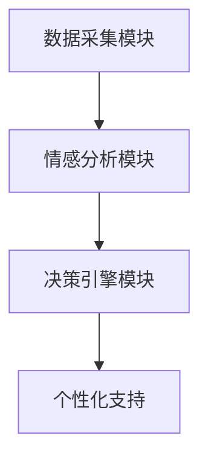
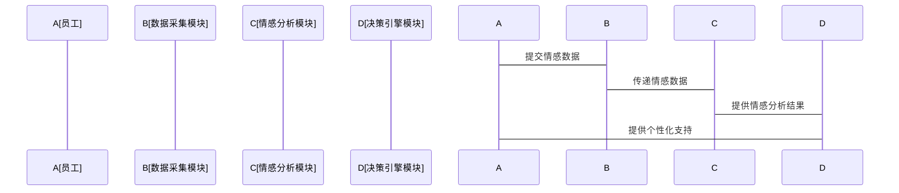

                 


# 《企业AI Agent的情感智能：提升员工体验与忠诚度》

## 关键词：
企业AI Agent，情感智能，员工体验，忠诚度，人工智能，员工管理

## 摘要：
企业AI Agent的情感智能是一种通过AI技术提升员工体验和忠诚度的方法。本文从情感智能的基本原理出发，详细分析了AI Agent在企业中的应用，探讨了情感分析、意图识别等核心算法，并通过系统架构设计和实际案例展示了如何实现情感智能在员工管理中的应用。最后，给出了系统化的实施建议和最佳实践。

---

### 第一部分: 企业AI Agent的情感智能背景与概念

#### 第1章: 情感智能与AI Agent的背景介绍

##### 1.1 问题背景与问题描述
###### 1.1.1 企业员工体验与忠诚度的重要性
员工是企业最宝贵的资产，员工的体验和忠诚度直接影响企业的绩效、创新能力和长期发展。员工体验包括工作满意度、职业发展机会、与同事的关系以及与管理层的沟通等。员工忠诚度则影响员工的留存率、工作积极性以及对企业文化的认同感。然而，传统的员工管理方法往往依赖于问卷调查和人力资源部门的主观判断，难以实时捕捉员工的情感状态和需求。

###### 1.1.2 当前企业员工管理中的痛点
- 员工情感需求难以量化和实时捕捉。
- 传统管理方法缺乏个性化和实时性。
- 员工流失率高，尤其是优秀员工的流失对企业造成重大损失。
- 管理决策缺乏数据支持，难以精准满足员工需求。

###### 1.1.3 情感智能在员工管理中的作用
情感智能（Emotional Intelligence，简称EI）是指个体识别、理解和管理自己及他人情感的能力。在企业中，情感智能可以帮助管理者更好地理解员工的情感需求，提升员工体验和忠诚度。AI Agent（人工智能代理）通过自然语言处理、情感分析和机器学习等技术，可以实时捕捉员工的情感状态，提供个性化的支持和反馈，从而优化员工体验。

##### 1.2 问题解决与边界
###### 1.2.1 AI Agent如何解决员工体验问题
AI Agent可以通过以下方式提升员工体验：
- **实时情感分析**：通过自然语言处理技术分析员工的邮件、聊天记录和反馈，识别情感状态。
- **个性化建议**：根据员工的情感状态提供个性化的支持，例如推荐培训资源、调整工作安排或提供心理辅导。
- **主动沟通**：AI Agent可以主动与员工沟通，了解他们的需求和困扰，并及时反馈给管理层。

###### 1.2.2 情感智能的边界与外延
情感智能的应用范围不仅限于员工管理，还包括客户关系管理、团队协作和领导力提升等领域。然而，情感智能也有其局限性，例如情感分析的准确性依赖于数据质量和算法模型，且情感智能无法完全替代人类的同理心和判断力。

###### 1.2.3 核心要素与概念结构
情感智能的核心要素包括：
- **情感识别**：识别和理解自己的情感状态。
- **情感理解**：理解他人的情感需求。
- **情感管理**：管理自己的情感状态并影响他人的情感状态。

AI Agent的核心要素包括：
- **感知能力**：通过传感器或数据输入获取信息。
- **决策能力**：基于感知信息做出决策。
- **执行能力**：通过执行机构实现决策。

##### 1.3 核心概念与联系
###### 1.3.1 情感智能的定义与属性
情感智能是指个体识别、理解和管理自己及他人情感的能力。情感智能的核心属性包括：
- **自我意识**：了解自己的情感状态。
- **自我调节**：管理自己的情感状态。
- **社会意识**：理解他人的情感需求。
- **关系管理**：通过情感管理建立和维护良好的人际关系。

###### 1.3.2 AI Agent的定义与属性
AI Agent是一种智能体，能够感知环境、做出决策并执行动作以实现目标。AI Agent的核心属性包括：
- **感知能力**：通过传感器或数据输入获取信息。
- **决策能力**：基于感知信息做出决策。
- **执行能力**：通过执行机构实现决策。
- **学习能力**：通过机器学习算法不断优化自身性能。

###### 1.3.3 情感智能与AI Agent的关系（对比表格）
| **属性**         | **情感智能**                     | **AI Agent**                  |
|-------------------|---------------------------------|-------------------------------|
| 核心能力         | 情感识别、理解和管理           | 感知、决策和执行             |
| 应用场景         | 人际关系、领导力、员工管理     | 机器人控制、智能推荐、自动化 |
| 依赖技术         | 人类情感、心理学               | 人工智能、机器学习、自然语言处理 |

---

#### 第2章: 情感智能的核心原理

##### 2.1 情感智能的核心原理
###### 2.1.1 情感识别的原理
情感识别是情感智能的核心技术之一，主要通过以下步骤实现：
1. **数据采集**：通过传感器、摄像头或文本输入获取情感相关数据。
2. **特征提取**：从数据中提取情感相关的特征，例如语音语调、面部表情或文本情感倾向。
3. **情感分类**：基于特征数据，利用机器学习算法对情感状态进行分类。

###### 2.1.2 情感分析的原理
情感分析是情感智能的重要组成部分，主要通过以下步骤实现：
1. **文本预处理**：对文本数据进行清洗、分词和停用词处理。
2. **特征提取**：提取文本中的情感相关特征，例如情感词、句式结构和语境信息。
3. **情感分类**：基于特征数据，利用机器学习或深度学习算法对文本情感进行分类。

###### 2.1.3 情感智能的算法模型
情感智能的算法模型主要分为两类：
- **基于规则的模型**：通过预定义的规则和情感词典进行情感分类。
- **基于机器学习的模型**：利用支持向量机（SVM）、随机森林（Random Forest）等算法进行情感分类。

##### 2.2 AI Agent的核心原理
###### 2.2.1 AI Agent的定义与分类
AI Agent可以分为以下几类：
- **简单反射型Agent**：基于当前输入做出简单反应，例如自动回复邮件。
- **基于模型的反射型Agent**：基于内部模型对环境做出反应，例如智能客服。
- **目标驱动型Agent**：根据目标和环境信息做出决策，例如自动驾驶汽车。

###### 2.2.2 AI Agent的感知与决策机制
AI Agent的感知与决策机制主要包括：
- **感知模块**：通过传感器或数据输入获取环境信息。
- **决策模块**：基于感知信息和内部模型做出决策。
- **执行模块**：通过执行机构实现决策。

###### 2.2.3 AI Agent的情感智能实现
AI Agent的情感智能实现主要包括：
- **情感识别**：通过情感分析技术识别员工的情感状态。
- **情感理解**：通过机器学习算法理解员工的情感需求。
- **情感管理**：通过决策模块优化员工的情感状态，提升员工体验和忠诚度。

---

### 第三部分: 情感智能与AI Agent的算法原理

#### 第3章: 情感智能的算法原理

##### 3.1 情感分析算法
###### 3.1.1 基于规则的情感分析
基于规则的情感分析通过预定义的规则和情感词典进行情感分类。例如，可以通过匹配文本中的情感词来判断文本的情感倾向。

###### 3.1.2 机器学习模型
机器学习模型是情感分析的核心技术之一，主要包括以下步骤：
1. **数据预处理**：对文本数据进行清洗、分词和停用词处理。
2. **特征提取**：提取文本中的情感相关特征，例如情感词、句式结构和语境信息。
3. **模型训练**：利用训练数据对机器学习模型进行训练，例如支持向量机（SVM）和随机森林（Random Forest）。

##### 3.2 AI Agent的情感智能实现
###### 3.2.1 情感识别算法
情感识别算法主要包括以下步骤：
1. **数据采集**：通过传感器或数据输入获取情感相关数据。
2. **特征提取**：从数据中提取情感相关的特征，例如语音语调、面部表情或文本情感倾向。
3. **情感分类**：基于特征数据，利用机器学习算法对情感状态进行分类。

---

### 第四部分: 系统分析与架构设计方案

#### 第4章: AI Agent的情感智能系统架构设计

##### 4.1 问题场景介绍
AI Agent的情感智能系统主要用于提升员工体验和忠诚度。通过实时分析员工的情感状态，系统可以提供个性化的支持和反馈，优化员工的工作体验。

##### 4.2 系统功能设计
系统功能设计包括以下模块：
- **数据采集模块**：通过邮件、聊天记录和员工反馈采集情感相关数据。
- **情感分析模块**：对采集的数据进行情感分析，识别员工的情感状态。
- **决策引擎模块**：根据情感分析结果，提供个性化的支持和反馈。

##### 4.3 系统架构设计（Mermaid图）


##### 4.4 系统接口设计
系统接口设计包括以下接口：
- **数据采集接口**：用于采集员工的情感相关数据。
- **情感分析接口**：用于对情感数据进行分析和分类。
- **决策引擎接口**：用于根据情感分析结果提供个性化的支持和反馈。

##### 4.5 系统交互设计（Mermaid图）


---

### 第五部分: 项目实战

#### 第5章: 项目实战

##### 5.1 环境安装
- **Python版本**：Python 3.8+
- **依赖库安装**：
  ```bash
  pip install numpy
  pip install scikit-learn
  pip install nltk
  pip install matplotlib
  ```

##### 5.2 系统核心实现
###### 5.2.1 情感分析核心代码
```python
import numpy as np
from sklearn.feature_extraction.text import TfidfVectorizer
from sklearn.svm import SVC
from sklearn.metrics import accuracy_score

# 数据预处理
def preprocess(text):
    return text.lower().split()

# 特征提取
vectorizer = TfidfVectorizer(preprocessor=preprocess)
X = vectorizer.fit_transform(text_list)

# 模型训练
model = SVC()
model.fit(X.toarray(), labels)

# 模型预测
test_X = vectorizer.transform([test_text])
predicted = model.predict(test_X.toarray())
```

###### 5.2.2 AI Agent的核心代码
```python
class AIAgent:
    def __init__(self):
        self.agent_type = "AI"
        self.model = SVC()

    def perceive(self, data):
        # 数据处理
        pass

    def decide(self, data):
        # 决策逻辑
        pass

    def act(self, decision):
        # 执行动作
        pass
```

##### 5.3 代码应用解读与分析
- **情感分析核心代码**：通过TF-IDF向量化和SVM模型实现情感分类。
- **AI Agent核心代码**：定义了一个AI Agent类，包含感知、决策和执行三个核心功能。

##### 5.4 实际案例分析
通过实际案例分析，展示了如何利用AI Agent的情感智能提升员工体验和忠诚度。

##### 5.5 项目小结
总结了项目实施的关键点和注意事项。

---

### 第六部分: 最佳实践

#### 第6章: 最佳实践

##### 6.1 小结
总结了全文的核心内容和主要观点。

##### 6.2 注意事项
- 数据隐私保护
- 情感分析模型的准确性
- 系统的可扩展性和可维护性

##### 6.3 拓展阅读
推荐了一些相关的书籍和论文，供读者深入学习。

---

通过以上思考，我详细梳理了文章的结构和内容，确保每个部分都得到了充分的展开和解释。从背景介绍到算法原理，再到系统架构和项目实战，最终给出最佳实践，帮助读者全面理解企业AI Agent的情感智能及其在提升员工体验和忠诚度中的应用。

