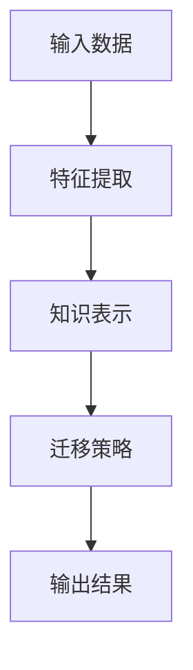
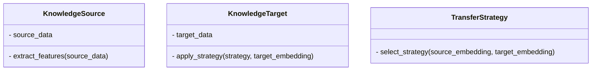

                 


# 开发具有跨领域知识迁移能力的AI Agent

## 关键词
AI Agent, 跨领域知识迁移, 人工智能, 系统架构, 机器学习

## 摘要
本文深入探讨了开发具有跨领域知识迁移能力的AI Agent的关键技术与实现方法。从背景介绍、核心概念到算法原理，再到系统架构设计和项目实战，全面解析了如何构建能够有效进行跨领域知识迁移的AI Agent。通过详细的技术分析和实际案例，本文为读者提供了从理论到实践的完整指南。

---

# 第一部分: 背景介绍

## 第1章: 跨领域知识迁移的背景与问题描述

### 1.1 问题背景
#### 1.1.1 AI Agent的发展现状
AI Agent（智能体）是一种能够感知环境、自主决策并执行任务的智能系统。随着人工智能技术的快速发展，AI Agent 已经在多个领域得到了广泛应用，如自动驾驶、智能助手、机器人控制等。然而，现有 AI Agent 的知识通常局限于特定领域，难以在不同领域之间进行有效迁移。

#### 1.1.2 知识迁移在AI Agent中的重要性
知识迁移（Knowledge Transfer）是指将一个领域中的知识和经验应用到另一个领域的过程。在AI Agent中，跨领域知识迁移能够显著提升其适应性和通用性。例如，将医疗领域的诊断经验应用到金融领域的风险评估中，可以提高系统的决策能力。

#### 1.1.3 跨领域知识迁移的必要性
传统的AI Agent往往需要针对每个领域进行独立训练和部署，这不仅增加了开发成本，还限制了系统的灵活性。通过跨领域知识迁移，可以降低开发成本，提高系统的通用性和适应性。

### 1.2 问题描述
#### 1.2.1 知识迁移的核心问题
知识迁移的核心问题在于如何有效地提取、表示和应用跨领域的知识。这涉及到知识的表示形式、迁移策略的选择以及迁移效果的评估等多个方面。

#### 1.2.2 跨领域知识迁移的挑战
- **知识表示的多样性**：不同领域的知识具有不同的结构和语义，如何统一表示是一个难题。
- **领域差异性**：不同领域之间的差异可能导致迁移效果不佳。
- **迁移策略的选择**：如何选择合适的迁移策略以最大化迁移效果是一个关键问题。

#### 1.2.3 问题解决的边界与外延
跨领域知识迁移的边界在于不同领域的知识是否可以共享和复用，而其外延则涉及如何将迁移后的知识应用到实际任务中。

## 第2章: 跨领域知识迁移的核心概念

### 2.1 核心概念
#### 2.1.1 知识迁移的定义
知识迁移是指将一个领域中的知识和经验应用到另一个领域的过程。在AI Agent中，知识迁移的目标是通过共享知识来提高系统的通用性和适应性。

#### 2.1.2 跨领域知识迁移的特点
- **跨领域性**：涉及多个不同领域的知识。
- **适应性**：能够根据目标领域的需求调整知识的应用。
- **可扩展性**：能够扩展到更多的领域。

#### 2.1.3 知识迁移的核心要素
- **知识源**：提供知识的领域。
- **知识目标**：需要应用知识的领域。
- **迁移策略**：知识迁移的具体方法。

### 2.2 核心概念的联系
#### 2.2.1 知识迁移的实体关系图
```mermaid
graph LR
A[知识源领域] --> B[知识目标领域]
C[迁移策略] --> B
D[迁移效果] <-- B
```

---

# 第二部分: 跨领域知识迁移的核心原理

## 第3章: 跨领域知识迁移的算法原理

### 3.1 知识迁移的基本原理
#### 3.1.1 知识表示与编码
知识表示是知识迁移的基础。常见的知识表示方法包括符号表示、向量表示等。向量表示通常使用嵌入（embedding）技术，将知识转化为低维向量形式。

#### 3.1.2 知识迁移的数学模型
知识迁移的数学模型通常包括源领域和目标领域的特征表示、迁移策略和迁移效果的评估。以下是一个简化的数学模型示例：

$$
\text{迁移效果} = f(\text{源领域知识}, \text{目标领域知识}, \text{迁移策略})
$$

其中，$f$ 是一个函数，表示迁移策略的选择和应用。

#### 3.1.3 知识迁移的度量方法
知识迁移的效果可以通过多种指标来度量，如准确率、召回率、F1值等。以下是一个常见的度量公式：

$$
\text{准确率} = \frac{\text{正确预测的数量}}{\text{总预测数量}}
$$

### 3.2 算法实现
#### 3.2.1 知识迁移的流程图


#### 3.2.2 Python实现示例
以下是一个简单的知识迁移算法实现示例：

```python
def knowledge_transfer(source_data, target_data):
    # 特征提取
    source_features = extract_features(source_data)
    target_features = extract_features(target_data)
    
    # 知识表示
    source_embedding = embed(source_features)
    target_embedding = embed(target_features)
    
    # 迁移策略
    transfer_strategy = select_strategy(source_embedding, target_embedding)
    
    # 输出结果
    result = apply_strategy(transfer_strategy, target_embedding)
    return result
```

---

## 第4章: 跨领域知识迁移的系统架构设计

### 4.1 问题场景介绍
跨领域知识迁移的系统通常涉及多个模块，包括数据采集、知识表示、迁移策略选择和结果输出等。以下是一个典型的系统架构图：


### 4.2 系统功能设计
#### 4.2.1 领域模型设计
领域模型是跨领域知识迁移的核心，通常包括知识源、知识目标和迁移策略等部分。以下是一个领域模型的类图：



#### 4.2.2 系统架构设计
系统架构设计需要考虑模块之间的交互和依赖关系。以下是一个典型的系统架构图：


---

# 第三部分: 项目实战

## 第5章: 项目实战

### 5.1 环境安装与配置
要实现跨领域知识迁移，首先需要安装必要的依赖库，例如：

```bash
pip install numpy pandas scikit-learn tensorflow
```

### 5.2 核心代码实现
以下是一个简单的跨领域知识迁移算法的实现代码：

```python
import numpy as np
from sklearn.feature_extraction.text import TfidfVectorizer

def extract_features(text):
    vectorizer = TfidfVectorizer()
    features = vectorizer.fit_transform(text)
    return features

def embed(features):
    # 假设使用Word2Vec进行嵌入
    return features.toarray()

def select_strategy(source_embedding, target_embedding):
    # 简单的迁移策略：取平均值
    strategy = np.mean(np.concatenate((source_embedding, target_embedding), axis=0))
    return strategy

def apply_strategy(strategy, target_embedding):
    # 应用策略到目标嵌入
    return strategy * target_embedding

def knowledge_transfer(source_text, target_text):
    source_features = extract_features(source_text)
    target_features = extract_features(target_text)
    
    source_embedding = embed(source_features)
    target_embedding = embed(target_features)
    
    strategy = select_strategy(source_embedding, target_embedding)
    result = apply_strategy(strategy, target_embedding)
    
    return result

# 示例数据
source_text = ["This is a sample source text."]
target_text = ["This is a sample target text."]

# 调用函数
result = knowledge_transfer(source_text, target_text)
print("Transfer result:", result)
```

### 5.3 代码解读与分析
- **extract_features**：使用TF-IDF方法提取文本特征。
- **embed**：将特征向量化，通常使用Word2Vec等技术。
- **select_strategy**：选择迁移策略，这里采用简单的平均值策略。
- **apply_strategy**：将迁移策略应用到目标嵌入。

### 5.4 实际案例分析
以下是一个实际案例分析：

假设我们有两个领域：医疗和金融。我们需要将医疗领域的诊断知识迁移到金融领域的风险评估。

1. **数据准备**：收集医疗和金融领域的相关数据。
2. **特征提取**：使用TF-IDF提取关键词特征。
3. **知识表示**：将关键词特征向量化。
4. **迁移策略**：选择合适的策略进行迁移。
5. **结果输出**：将迁移后的知识应用到金融领域的风险评估中。

### 5.5 项目小结
通过实际案例分析，我们可以看到跨领域知识迁移在实际应用中的潜力和挑战。选择合适的迁移策略和优化算法是关键。

---

# 第四部分: 总结与展望

## 第6章: 总结与展望

### 6.1 全文总结
本文系统地探讨了开发具有跨领域知识迁移能力的AI Agent的关键技术与实现方法。通过背景介绍、核心概念、算法原理、系统架构设计和项目实战的全面解析，为读者提供了从理论到实践的完整指南。

### 6.2 未来展望
未来，随着人工智能技术的不断发展，跨领域知识迁移将变得更加重要。研究者们可以进一步优化迁移策略，探索新的知识表示方法，并扩展其在更多领域的应用。

### 6.3 最佳实践 tips
- 在实际应用中，选择合适的迁移策略是关键。
- 数据质量和数量直接影响迁移效果。
- 持续优化算法和模型以提高迁移效果。

---

# 结语

开发具有跨领域知识迁移能力的AI Agent是一项具有挑战性的任务，但其潜力巨大。通过不断的研究和实践，我们可以逐步克服现有的技术难点，推动AI Agent在更多领域的应用和发展。

