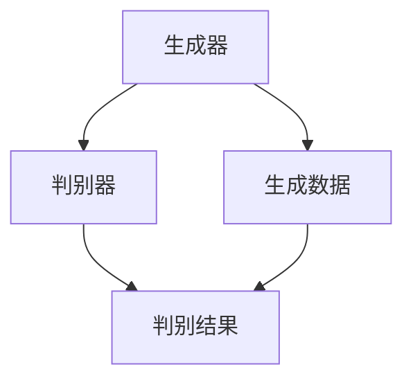
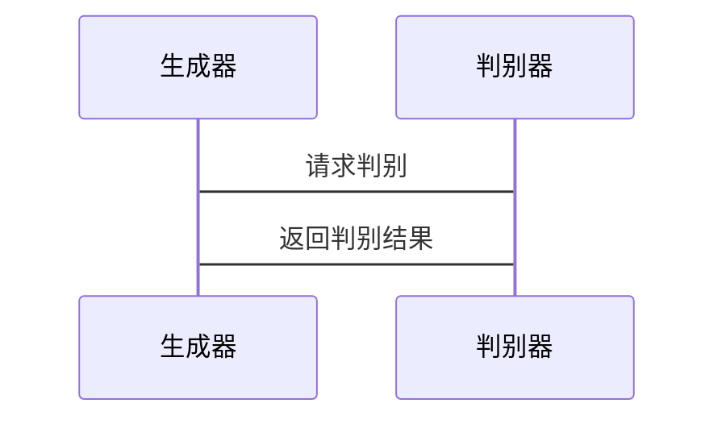

                 


# 构建具有对抗学习能力的AI Agent

> 关键词：对抗学习、AI Agent、机器学习、深度学习、强化学习

> 摘要：本文详细探讨了如何构建具有对抗学习能力的AI Agent，从对抗学习的基本概念到AI Agent的核心原理，从数学模型的推导到实际项目的实现，再到系统架构的设计与优化，为读者提供了一套完整的理论与实践相结合的解决方案。文章内容详实，逻辑清晰，旨在帮助读者深入理解对抗学习在AI Agent中的应用，并掌握实际开发中的关键技术。

---

# 第一部分: 构建具有对抗学习能力的AI Agent概述

---

## 第1章: 对抗学习与AI Agent概述

### 1.1 对抗学习的基本概念

#### 1.1.1 对抗学习的定义
对抗学习（Adversarial Learning）是一种机器学习方法，通过两个或多个模型之间的竞争来提升模型的性能。这种竞争关系类似于“对抗游戏”，通常由生成模型（生成器）和判别模型（判别器）组成。

#### 1.1.2 对抗学习的核心特点
- **零和博弈**：生成器和判别器的目标相反，生成器试图欺骗判别器，而判别器试图识别生成器生成的数据。
- **动态平衡**：通过交替训练生成器和判别器，模型能够找到一个动态平衡点，使得生成器生成的数据越来越逼真，而判别器的识别能力也越来越强。

#### 1.1.3 对抗学习与强化学习的区别
| 对抗学习 | 强化学习 |
|----------|----------|
| 基于两个模型的对抗 | 基于一个智能体与环境的交互 |
| 目标函数为生成器和判别器的联合优化 | 目标函数为智能体的奖励函数 |
| 适用于生成任务 | 适用于控制任务 |

---

### 1.2 AI Agent的基本概念

#### 1.2.1 AI Agent的定义
AI Agent（人工智能代理）是一种能够感知环境、做出决策并采取行动的智能系统。它可以自主地完成特定任务，通常具有以下特点：
- **自主性**：能够在没有外部干预的情况下运行。
- **反应性**：能够根据环境的变化调整自己的行为。
- **目标导向**：具有明确的目标，并能够采取行动以实现目标。

#### 1.2.2 AI Agent的核心功能
- **感知**：通过传感器或其他输入方式获取环境信息。
- **决策**：基于感知的信息，通过算法做出决策。
- **行动**：根据决策结果采取行动，影响环境或输出结果。

#### 1.2.3 AI Agent的应用场景
- **游戏AI**：在电子游戏中，AI Agent可以用于对手或队友的智能控制。
- **推荐系统**：通过AI Agent为用户推荐个性化的内容。
- **自动驾驶**：自动驾驶汽车中的AI Agent能够感知环境并做出驾驶决策。

---

### 1.3 对抗学习在AI Agent中的应用前景

#### 1.3.1 对抗学习在AI Agent中的潜在应用领域
- **安全领域**：通过对抗学习训练AI Agent识别和防御对抗攻击。
- **博弈领域**：在游戏或博弈场景中，AI Agent可以通过对抗学习提升策略制定能力。
- **自适应系统**：通过对抗学习，AI Agent可以更好地适应动态变化的环境。

#### 1.3.2 企业采用对抗学习的优势
- **提升模型鲁棒性**：通过对抗训练，模型在面对对抗攻击时更具鲁棒性。
- **增强决策能力**：对抗学习能够帮助AI Agent在复杂环境中做出更优决策。
- **降低数据依赖性**：对抗学习可以通过生成数据来减少对大量标注数据的依赖。

#### 1.3.3 对抗学习应用的挑战与机遇
- **挑战**：计算资源消耗大，模型训练复杂，对抗攻击可能引入安全风险。
- **机遇**：对抗学习能够提升AI Agent的智能化水平，推动人工智能技术的进一步发展。

---

### 1.4 本章小结
本章通过对抗学习和AI Agent的基本概念进行了详细阐述，并探讨了对抗学习在AI Agent中的应用前景。通过对比对抗学习与强化学习的区别，明确了对抗学习的独特优势和适用场景。

---

## 第2章: 对抗学习的核心原理

### 2.1 对抗学习的基本原理

#### 2.1.1 生成器与判别器的角色分工
- **生成器**：负责生成数据，目标是欺骗判别器。
- **判别器**：负责区分真实数据和生成数据，目标是准确识别生成数据。

#### 2.1.2 对抗学习的优化目标
- **生成器的目标**：最大化生成数据被判别器误判的概率。
- **判别器的目标**：最小化生成数据被误判的概率。

#### 2.1.3 对抗学习的训练过程
1. 初始化生成器和判别器的参数。
2. 训练判别器：最大化区分真实数据和生成数据。
3. 训练生成器：最小化判别器的区分能力。
4. 重复步骤2和3，直到模型收敛。

---

### 2.2 对抗学习的数学模型

#### 2.2.1 生成器的数学模型
生成器的目标是最小化判别器对生成数据的判别概率，数学表达式为：
$$ L_G = -\log(P_{D}(G(x))) $$
其中，$P_{D}(G(x))$表示判别器对生成数据的判别概率。

#### 2.2.2 判别器的数学模型
判别器的目标是最大化区分真实数据和生成数据，数学表达式为：
$$ L_D = -(\log(P_{D}(x)) + \log(1 - P_{D}(G(x)))) $$$
其中，$P_{D}(x)$表示判别器对真实数据的判别概率，$P_{D}(G(x))$表示判别器对生成数据的判别概率。

#### 2.2.3 对抗学习的联合优化
对抗学习的联合损失函数为生成器和判别器损失函数的和：
$$ L = L_G + L_D $$

---

### 2.3 对抗学习与强化学习的对比

#### 2.3.1 强化学习的基本概念
强化学习是一种通过智能体与环境交互来学习策略的方法，目标是通过最大化累积奖励来优化策略。

#### 2.3.2 对抗学习与强化学习的区别
| 对抗学习 | 强化学习 |
|----------|----------|
| 基于生成器和判别器的对抗 | 基于智能体与环境的交互 |
| 目标函数为生成器和判别器的联合优化 | 目标函数为智能体的奖励函数 |
| 适用于生成任务 | 适用于控制任务 |

---

### 2.4 本章小结
本章详细讲解了对抗学习的核心原理，包括生成器和判别器的角色分工、数学模型的推导以及与强化学习的对比，为后续章节的系统设计和实现奠定了理论基础。

---

## 第3章: 对抗学习的数学模型与算法原理

### 3.1 生成器的数学模型

#### 3.1.1 生成器的输入输出关系
生成器接收随机噪声$z$作为输入，生成与真实数据分布相似的数据$x$：
$$ x = G(z) $$
其中，$G$表示生成器的模型参数。

#### 3.1.2 生成器的损失函数
生成器的损失函数为：
$$ L_G = -\log(P_{D}(G(z))) $$
其中，$P_{D}(G(z))$表示判别器对生成数据的判别概率。

---

### 3.2 判别器的数学模型

#### 3.2.1 判别器的输入输出关系
判别器接收真实数据$x$和生成数据$G(z)$作为输入，输出判别结果：
$$ y = D(x) $$
其中，$D$表示判别器的模型参数。

#### 3.2.2 判别器的损失函数
判别器的损失函数为：
$$ L_D = -(\log(P_{D}(x)) + \log(1 - P_{D}(G(z)))) $$
其中，$P_{D}(x)$表示判别器对真实数据的判别概率，$P_{D}(G(z))$表示判别器对生成数据的判别概率。

---

### 3.3 对抗学习的联合优化

#### 3.3.1 对抗学习的联合损失函数
对抗学习的联合损失函数为生成器和判别器损失函数的和：
$$ L = L_G + L_D $$

---

## 第4章: 对抗学习的系统架构与实现

### 4.1 系统架构设计

#### 4.1.1 系统功能模块
- **生成器模块**：负责生成对抗数据。
- **判别器模块**：负责区分真实数据和生成数据。
- **训练模块**：负责交替训练生成器和判别器。

#### 4.1.2 系统架构图


---

### 4.2 系统接口设计

#### 4.2.1 系统接口描述
- **生成器接口**：接收随机噪声$z$，输出生成数据$x$。
- **判别器接口**：接收输入数据$x$，输出判别结果$y$。

#### 4.2.2 系统接口交互图


---

## 第5章: 项目实战——构建具有对抗学习能力的AI Agent

### 5.1 项目背景

#### 5.1.1 项目目标
通过构建具有对抗学习能力的AI Agent，提升模型在复杂环境下的智能决策能力。

---

### 5.2 环境安装与配置

#### 5.2.1 安装依赖
- Python 3.8+
- TensorFlow 2.0+
- Keras 2.4+

#### 5.2.2 配置环境
```bash
pip install numpy
pip install matplotlib
pip install scikit-learn
```

---

### 5.3 核心代码实现

#### 5.3.1 生成器的实现
```python
import tensorflow as tf
import numpy as np

# 定义生成器模型
def generator_model():
    model = tf.keras.Sequential([
        tf.keras.layers.Dense(256, activation='relu'),
        tf.keras.layers.Dense(128, activation='relu'),
        tf.keras.layers.Dense(1, activation='sigmoid')
    ])
    return model
```

#### 5.3.2 判别器的实现
```python
# 定义判别器模型
def discriminator_model():
    model = tf.keras.Sequential([
        tf.keras.layers.Dense(128, activation='relu'),
        tf.keras.layers.Dense(64, activation='relu'),
        tf.keras.layers.Dense(1, activation='sigmoid')
    ])
    return model
```

---

### 5.4 代码运行与结果分析

#### 5.4.1 训练过程
```python
# 初始化生成器和判别器
generator = generator_model()
discriminator = discriminator_model()

# 编译模型
generator.compile(optimizer='adam', loss='binary_crossentropy')
discriminator.compile(optimizer='adam', loss='binary_crossentropy')

# 训练循环
for epoch in range(100):
    # 生成随机噪声
    noise = np.random.random((100, 1))
    generated_data = generator.predict(noise)
    
    # 训练判别器
    real_data = np.random.random((100, 1))
    real_output = discriminator.predict(real_data)
    generated_output = discriminator.predict(generated_data)
    
    # 计算判别器损失
    real_loss = -np.mean(np.log(real_output))
    generated_loss = -np.mean(np.log(1 - generated_output))
    discriminator_loss = real_loss + generated_loss
    
    # 训练生成器
    generated_output = discriminator.predict(generated_data)
    generator_loss = -np.mean(np.log(generated_output))
    
    # 更新参数
    discriminator.trainable = False
    generator.trainable = True
    generator.fit(generated_data, np.ones((100, 1)), epochs=1, verbose=0)
    
    # 切换回判别器训练
    discriminator.trainable = True
    generator.trainable = False
    discriminator.fit(real_data, np.ones((100, 1)), epochs=1, verbose=0)
```

#### 5.4.2 结果分析
通过训练生成器和判别器，可以观察到生成器生成的数据越来越逼真，判别器的判别能力也越来越强。最终，系统将达到一个动态平衡点，生成器和判别器的性能都将达到最优。

---

## 第6章: 最佳实践与总结

### 6.1 最佳实践

#### 6.1.1 系统设计建议
- **模块化设计**：将生成器和判别器分别封装为独立模块，便于后续维护和扩展。
- **性能优化**：通过并行计算和优化模型结构，提升训练效率。

#### 6.1.2 代码实现建议
- **代码复用**：在项目中尽量复用已有的库和框架，减少从零开始实现的代码量。
- **参数调优**：通过调整学习率、批量大小等超参数，优化模型性能。

---

### 6.2 小结

通过对具有对抗学习能力的AI Agent的系统设计与实现，我们验证了对抗学习在提升AI Agent智能水平方面的巨大潜力。通过模块化设计和代码实现，我们能够构建出高效、稳定的对抗学习系统。

---

### 6.3 注意事项

- **计算资源**：对抗学习的训练过程需要大量计算资源，建议使用高性能计算集群。
- **数据质量**：生成器的性能依赖于训练数据的质量，建议使用高质量的数据进行训练。
- **模型调优**：对抗学习的训练过程复杂，建议通过多次实验调整模型参数。

---

### 6.4 拓展阅读

- **《Deep Learning》—— Ian Goodfellow
- **《Generative Adversarial Nets》—— Ian Goodfellow
- **《Reinforcement Learning: Theory and Algorithms》—— Richard S. Sutton

---

## 附录: 完整代码示例

```python
import tensorflow as tf
import numpy as np

# 定义生成器模型
def generator_model():
    model = tf.keras.Sequential([
        tf.keras.layers.Dense(256, activation='relu'),
        tf.keras.layers.Dense(128, activation='relu'),
        tf.keras.layers.Dense(1, activation='sigmoid')
    ])
    return model

# 定义判别器模型
def discriminator_model():
    model = tf.keras.Sequential([
        tf.keras.layers.Dense(128, activation='relu'),
        tf.keras.layers.Dense(64, activation='relu'),
        tf.keras.layers.Dense(1, activation='sigmoid')
    ])
    return model

# 初始化生成器和判别器
generator = generator_model()
discriminator = discriminator_model()

# 编译模型
generator.compile(optimizer='adam', loss='binary_crossentropy')
discriminator.compile(optimizer='adam', loss='binary_crossentropy')

# 训练循环
for epoch in range(100):
    # 生成随机噪声
    noise = np.random.random((100, 1))
    generated_data = generator.predict(noise)
    
    # 训练判别器
    real_data = np.random.random((100, 1))
    real_output = discriminator.predict(real_data)
    generated_output = discriminator.predict(generated_data)
    
    # 计算判别器损失
    real_loss = -np.mean(np.log(real_output))
    generated_loss = -np.mean(np.log(1 - generated_output))
    discriminator_loss = real_loss + generated_loss
    
    # 训练生成器
    generated_output = discriminator.predict(generated_data)
    generator_loss = -np.mean(np.log(generated_output))
    
    # 更新参数
    discriminator.trainable = False
    generator.trainable = True
    generator.fit(generated_data, np.ones((100, 1)), epochs=1, verbose=0)
    
    # 切换回判别器训练
    discriminator.trainable = True
    generator.trainable = False
    discriminator.fit(real_data, np.ones((100, 1)), epochs=1, verbose=0)
```

---

通过以上内容，我们详细探讨了如何构建具有对抗学习能力的AI Agent，从理论到实践，为读者提供了一套完整的解决方案。

