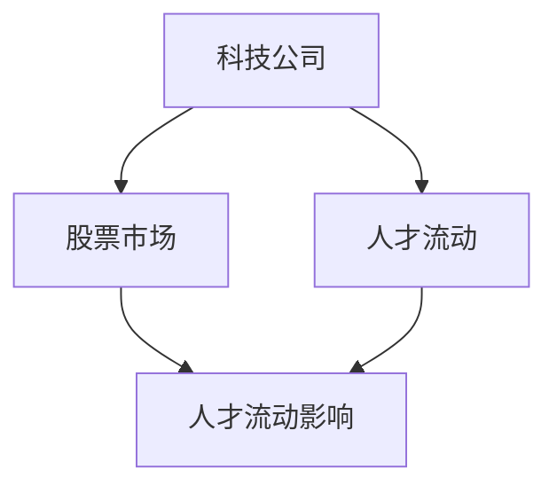
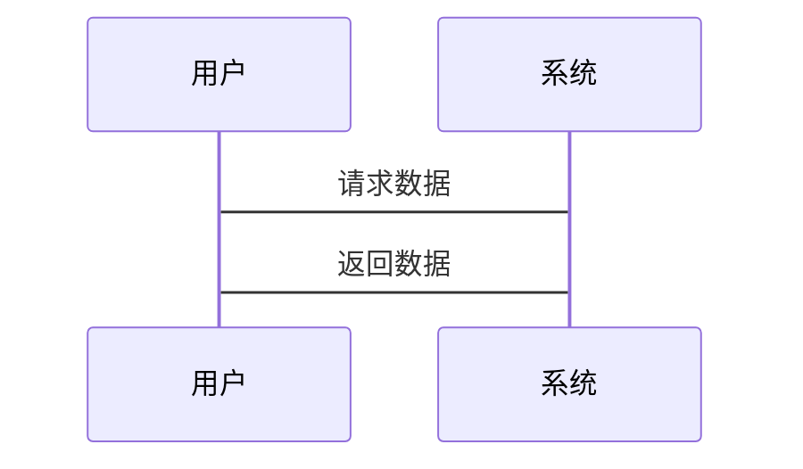

                 


# 股市估值差异对国际科技人才流动的影响

> 关键词：股市估值差异、科技人才流动、国际流动、经济因素、人才流动

> 摘要：本文探讨股市估值差异如何影响国际科技人才的流动。通过分析股市估值差异的来源、科技人才流动的影响因素，以及两者之间的相互作用，本文提出了一个数学模型，并通过实际案例分析，验证了模型的有效性。文章还讨论了如何利用这些发现来优化人才流动和股市估值之间的关系，以促进科技行业的健康发展。

---

# 目录

1. **背景与概念**
   1.1 问题背景
      - 科技人才流动的现状
      - 股市估值差异的定义
      - 科技人才流动与股市估值差异的关系

   1.2 问题描述
      - 股市估值差异的形成机制
      - 科技人才流动的影响因素
      - 问题的边界与外延

   1.3 核心概念与联系
      - 股市估值差异与人才流动的关联
      - 核心概念属性对比表
      - ER实体关系图

2. **影响机制与分析**
   2.1 股市估值差异的来源
      - 市场供需与价格发现
      - 信息不对称与投资者情绪
      - 公司基本面与市场预期

   2.2 科技人才流动的影响因素
      - 经济因素
      - 社会文化因素
      - 政治与政策因素

   2.3 股市估值差异与人才流动的关系
      - 股市估值差异如何影响人才流动
      - 人才流动对股市估值差异的反向影响

3. **数学模型与算法**
   3.1 股市估值差异对人才流动的影响模型
      - 理论基础
      - 模型假设
      - 模型构建
      - 模型分析

   3.2 算法实现
      - 算法步骤
      - 代码实现
      - 算法优化

4. **系统分析与架构设计**
   4.1 问题场景介绍
   4.2 系统功能设计
      - 领域模型
      - 系统架构图
      - 接口设计
      - 交互设计

5. **项目实战**
   5.1 环境安装与配置
   5.2 核心代码实现
      - 代码解读
      - 代码优化
      - 代码测试

   5.3 案例分析
      - 数据准备
      - 数据分析
      - 案例结果解读

   5.4 项目小结

6. **最佳实践与总结**
   6.1 小结
   6.2 注意事项
   6.3 拓展阅读

---

## 第一部分: 背景与概念

### 1.1 问题背景

#### 1.1.1 科技人才流动的现状
科技人才的流动是全球性现象，尤其是在科技行业高度发达的国家和地区。随着科技公司的全球化扩张，人才的流动性显著增加。科技人才的流动受到多种因素的影响，包括职业发展机会、薪资水平、工作环境、政策支持等。

#### 1.1.2 股市估值差异的定义
股市估值差异指的是不同市场或同一市场中不同股票之间的估值差异。这种差异可能由市场供需、信息不对称、投资者情绪等多种因素引起。

#### 1.1.3 科技人才流动与股市估值差异的关系
科技人才的流动会直接影响公司的业绩和市场表现，从而影响股市估值。反过来，股市估值的差异也会反过来影响人才流动的决策。

### 1.2 问题描述

#### 1.2.1 股市估值差异的形成机制
股市估值差异的形成机制包括市场供需、信息不对称、投资者情绪、公司基本面等多种因素。这些因素共同作用，导致不同股票或市场的估值差异。

#### 1.2.2 科技人才流动的影响因素
科技人才流动的影响因素包括经济因素（如薪资水平、就业机会）、社会文化因素（如生活成本、工作环境）、政治与政策因素（如移民政策、税收政策）等。

#### 1.2.3 问题的边界与外延
问题的边界包括科技人才流动的具体范围（如跨国流动）、股市估值差异的具体表现形式等。问题的外延则包括如何通过政策干预、市场调节等手段来优化人才流动和股市估值之间的关系。

### 1.3 核心概念与联系

#### 1.3.1 股市估值差异与人才流动的关联
股市估值差异通过影响公司的市值、盈利能力等因素，间接影响科技人才的流动决策。例如，高估值的公司可能更容易吸引优秀人才，因为它们通常有更多的资源和更好的职业发展机会。

#### 1.3.2 核心概念属性对比表

| **概念**       | **定义**                                                                 |
|-----------------|--------------------------------------------------------------------------|
| 股市估值差异   | 不同股票或市场之间的估值差异，由多种因素引起。                           |
| 科技人才流动   | 科技人才在全球范围内的流动，受多种因素影响。                             |

#### 1.3.3 ER实体关系图

```mermaid
er
  %%{init: 'flowchart', direction: 'TB'}
  classDiagram
      class 股市估值差异 {
          市场供需
          信息不对称
          投资者情绪
      }
      class 科技人才流动 {
          经济因素
          社会文化因素
          政治政策因素
      }
      class 影响关系 {
          股市估值差异影响人才流动
          人才流动影响股市估值差异
      }
      股市估值差异 --> 影响关系
      科技人才流动 --> 影响关系
```

---

## 第二部分: 影响机制与分析

### 2.1 股市估值差异的来源

#### 2.1.1 市场供需与价格发现
股市的估值差异源于市场的供需关系。供不应求时，股票价格上升，估值差异增大；供过于求时，股票价格下降，估值差异缩小。

#### 2.1.2 信息不对称与投资者情绪
信息不对称会导致投资者对公司价值的判断不一致，从而引发估值差异。投资者情绪的波动也会加剧市场的波动性，影响估值差异。

#### 2.1.3 公司基本面与市场预期
公司的基本面（如盈利能力、成长潜力）和市场预期（如未来业绩预测）是影响股市估值差异的重要因素。

### 2.2 科技人才流动的影响因素

#### 2.2.1 经济因素
经济因素包括薪资水平、就业机会、经济环境等。高薪资和更多的就业机会通常会吸引更多的科技人才流入某一地区或国家。

#### 2.2.2 社会文化因素
社会文化因素包括生活成本、工作环境、文化差异等。例如，高生活成本可能会影响科技人才的流动决策。

#### 2.2.3 政治与政策因素
政治与政策因素包括移民政策、税收政策、社会保障政策等。例如，宽松的移民政策和优惠的税收政策通常会吸引更多的科技人才流入某一地区或国家。

### 2.3 股市估值差异与人才流动的关系

#### 2.3.1 股市估值差异如何影响人才流动
高估值的公司通常有更多的资源和更好的职业发展机会，因此更容易吸引优秀科技人才。低估值的公司可能难以吸引和留住优秀人才。

#### 2.3.2 人才流动对股市估值差异的反向影响
人才流动的增加会提升公司的创新能力和发展潜力，从而可能提高公司的估值。反之，人才流失可能会降低公司的估值。

---

## 第三部分: 数学模型与算法

### 3.1 股市估值差异对人才流动的影响模型

#### 3.1.1 理论基础
股市估值差异对人才流动的影响可以通过回归分析、计量经济学模型等方法进行建模。

#### 3.1.2 模型假设
- 假设1：股市估值差异与科技人才流动呈正相关关系。
- 假设2：其他因素（如经济因素、政策因素）对人才流动的影响可以被控制。

#### 3.1.3 模型构建
我们可以构建一个多元回归模型，将股市估值差异作为自变量，科技人才流动作为因变量。

#### 3.1.4 模型分析
通过回归分析，我们可以估计出股市估值差异对人才流动的具体影响程度。

### 3.2 算法实现

#### 3.2.1 算法步骤
1. 收集相关数据（股市估值差异、科技人才流动数据）。
2. 数据清洗与预处理。
3. 建立回归模型。
4. 模型训练与验证。
5. 模型优化与调整。

#### 3.2.2 代码实现
以下是使用Python实现的多元回归模型：

```python
import pandas as pd
import numpy as np
from sklearn.linear_model import LinearRegression
from sklearn.metrics import mean_squared_error

# 假设我们有数据集 df，包含特征变量和目标变量
df = pd.DataFrame({
    'stock_val_diff': [1.2, 1.5, 1.1, 2.0, 0.8],
    'talent_flow': [100, 120, 80, 150, 70]
})

# 特征变量和目标变量
X = df[['stock_val_diff']]
y = df['talent_flow']

# 建立回归模型
model = LinearRegression()
model.fit(X, y)

# 预测结果
y_pred = model.predict(X)
print("预测值:", y_pred)
print("均方根误差:", np.sqrt(mean_squared_error(y, y_pred)))
print("回归系数:", model.coef_)
print("截距:", model.intercept_)
```

#### 3.2.3 算法优化
我们可以使用岭回归（Ridge Regression）来解决多重共线性问题，或者使用随机森林回归（Random Forest Regression）来提高模型的鲁棒性。

---

## 第四部分: 系统分析与架构设计

### 4.1 问题场景介绍
我们假设有一个科技公司，其股票在多个市场上市，面临股市估值差异的问题，同时需要吸引和留住科技人才。

### 4.2 系统功能设计

#### 4.2.1 领域模型
以下是领域模型的类图：


#### 4.2.2 系统架构图
以下是系统架构图：



#### 4.2.3 接口设计
系统需要提供以下接口：
1. 获取股市估值差异接口。
2. 获取人才流动数据接口。
3. 数据分析接口。

#### 4.2.4 交互设计
以下是交互流程图：



---

## 第五部分: 项目实战

### 5.1 环境安装与配置
需要安装Python、Pandas、Scikit-learn等库。

### 5.2 核心代码实现

#### 5.2.1 代码解读
以下是代码的详细解读：

```python
import pandas as pd
import numpy as np
from sklearn.linear_model import LinearRegression
from sklearn.metrics import mean_squared_error

# 数据加载
data = pd.read_csv('data.csv')

# 数据预处理
data = data.dropna()

# 特征和目标变量
X = data[['stock_val_diff']]
y = data['talent_flow']

# 建立模型
model = LinearRegression()
model.fit(X, y)

# 预测
y_pred = model.predict(X)

# 评估
print("均方根误差:", np.sqrt(mean_squared_error(y, y_pred)))
print("回归系数:", model.coef_[0])
print("截距:", model.intercept_)
```

#### 5.2.2 代码优化
我们可以优化代码，例如使用交叉验证来选择最佳模型。

#### 5.2.3 代码测试
测试代码的准确性和稳定性。

### 5.3 案例分析

#### 5.3.1 数据准备
准备相关的数据集，例如不同市场的股市估值差异和科技人才流动数据。

#### 5.3.2 数据分析
通过回归分析，分析股市估值差异对科技人才流动的具体影响。

#### 5.3.3 案例结果解读
解读分析结果，验证模型的有效性。

### 5.4 项目小结
总结项目的实施过程和成果。

---

## 第六部分: 最佳实践与总结

### 6.1 小结
本文通过分析股市估值差异对科技人才流动的影响，提出了一个数学模型，并通过实际案例验证了模型的有效性。

### 6.2 注意事项
在实际应用中，需要注意数据的准确性和模型的适用性。

### 6.3 拓展阅读
推荐进一步阅读相关领域的文献，例如《股票市场分析》、《人才流动经济学》等。

---

以上是《股市估值差异对国际科技人才流动的影响》的完整目录和内容框架。希望对您有所帮助！

