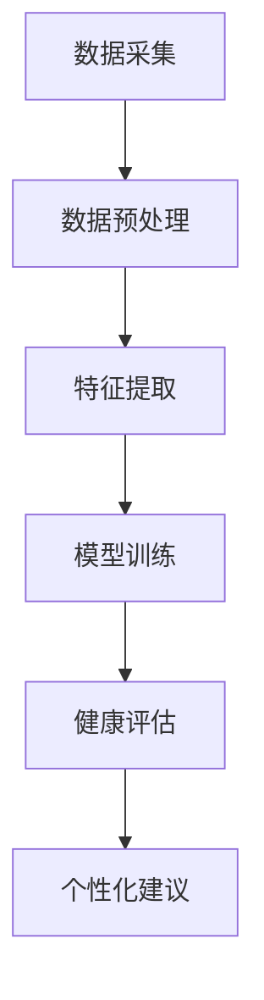
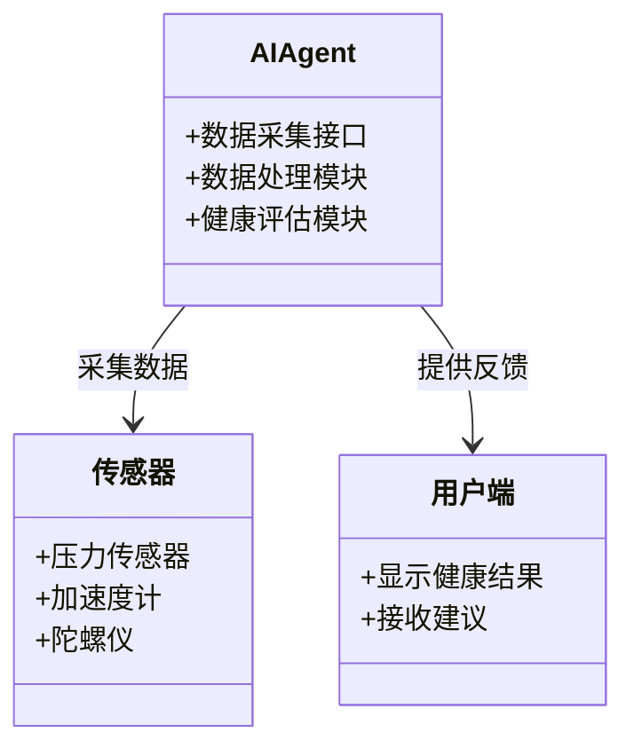
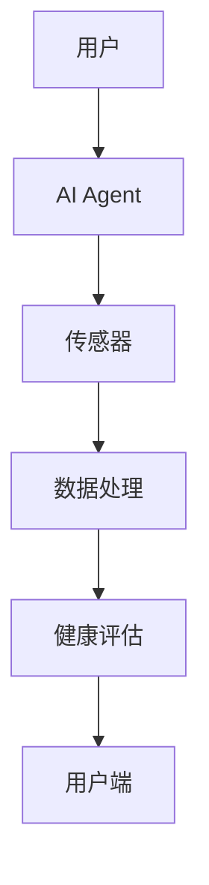

                 


# AI Agent在智能拖鞋中的足部健康分析

> 关键词：AI Agent, 足部健康分析, 智能拖鞋, 健康监测, 人工智能

> 摘要：本文探讨了AI Agent在智能拖鞋中的足部健康分析应用，详细分析了AI Agent的核心原理、算法设计、系统架构以及实际应用场景。通过结合传感器数据和AI算法，实现足部健康评估和个性化健康建议，为足部健康监测提供了新的解决方案。

---

## 第一部分：背景介绍

### 第1章：AI Agent与足部健康分析的背景

#### 1.1 问题背景

- **足部健康的重要性**  
  足部健康直接影响人体姿势、运动能力和整体健康。足部长期问题可能导致疼痛、步态异常甚至更严重的健康问题。

- **当前足部健康监测的痛点**  
  - 传统足部健康监测方法依赖手动检查，效率低且难以实时监测。  
  - 现有设备多为单一功能，缺乏智能化和个性化分析。

- **AI技术在足部健康监测中的潜力**  
  AI Agent可以通过分析步态、压力分布等数据，实时评估足部健康状况，提供个性化建议。

#### 1.2 问题描述

- **足部健康监测的复杂性**  
  足部健康涉及多个指标，如足弓形状、步频、步幅、压力分布等，需要多维度数据采集和分析。

- **AI Agent在足部健康分析中的角色**  
  AI Agent负责数据采集、分析和健康评估，帮助用户实时了解足部健康状态。

- **智能拖鞋的硬件与数据采集特点**  
  智能拖鞋配备多种传感器，如压力传感器、加速度计、陀螺仪等，用于采集足部运动数据。

#### 1.3 问题解决

- **AI Agent的核心功能**  
  - 数据采集与处理  
  - 健康评估与分析  
  - 个性化健康建议  

- **数据采集与处理的解决方案**  
  利用传感器采集足部运动数据，通过AI算法进行数据清洗和特征提取。

- **AI模型的训练与优化**  
  使用机器学习模型（如决策树、随机森林）进行健康评估，模型通过大量数据训练优化。

#### 1.4 边界与外延

- **AI Agent在足部健康分析中的应用边界**  
  - 仅限于足部健康监测，不涉及其他身体部位的健康分析。  
  - 数据采集依赖硬件传感器，无法分析非穿戴设备的数据。

- **与其他健康监测设备的对比**  
  智能拖鞋的优势在于便捷性和实时性，但功能单一，适合特定场景使用。

- **足部健康分析的未来发展**  
  结合更多传感器和更复杂的AI算法，实现更精准的足部健康监测和个性化健康管理。

#### 1.5 概念结构与核心要素

- **AI Agent的基本组成**  
  - 传感器模块：采集足部数据。  
  - 数据处理模块：清洗和特征提取。  
  - AI模型：进行健康评估和分析。  

- **足部健康分析的关键要素**  
  - 数据采集：压力、加速度、步频等。  
  - 数据分析：足弓形状、步态分析、压力分布。  
  - 健康评估：健康状况评分、风险预测。  

---

## 第二部分：核心概念与联系

### 第2章：AI Agent的核心原理

#### 2.1 AI Agent的基本原理

- **AI Agent的定义与分类**  
  AI Agent是一种智能代理，能够感知环境并采取行动以实现目标。在智能拖鞋中，AI Agent用于数据处理和健康分析。

- **AI Agent的核心算法**  
  常见算法包括支持向量机（SVM）、随机森林（Random Forest）和神经网络（NN）。这些算法用于分类和回归任务。

- **AI Agent与传统传感器的区别**  
  AI Agent不仅能采集数据，还能通过算法分析数据，提供智能反馈。

#### 2.2 足部健康分析的原理

- **足部健康的主要指标**  
  - 足弓高度：影响足部压力分布。  
  - 步频和步幅：反映运动能力和健康状态。  
  - 压力分布：评估足部疲劳和潜在健康问题。  

- **数据采集的关键技术**  
  - 压力传感器：测量足部不同区域的压力分布。  
  - 加速度计：捕捉足部运动的加速度变化。  
  - 陀螺仪：测量足部旋转角度。  

- **数据分析与健康评估的方法**  
  - 使用机器学习模型对数据进行分类和回归分析，评估足部健康状态。

#### 2.3 AI Agent与足部健康分析的联系

- **AI Agent在数据处理中的作用**  
  AI Agent通过算法处理传感器数据，提取有用的特征用于健康评估。

- **AI Agent在健康评估中的应用**  
  AI Agent能够实时分析足部数据，提供健康评分和风险预测。

- **AI Agent在个性化健康建议中的价值**  
  基于AI分析结果，AI Agent可以推荐适合的鞋子或锻炼计划，帮助用户改善足部健康。

---

### 第3章：核心概念对比与ER实体关系图

#### 3.1 核心概念对比

- **AI Agent与传统传感器的对比**  
  | 特性       | AI Agent         | 传统传感器      |  
  |------------|------------------|-----------------|  
  | 功能       | 数据处理与分析   | 数据采集        |  
  | 智能性      | 高               | 无               |  
  | 应用场景     | 智能健康监测     | 单一数据采集    |  

- **足部健康分析与其他健康监测技术的对比**  
  | 技术         | 足部健康分析     | 心率监测         |  
  |--------------|------------------|------------------|  
  | 数据类型     | 压力、加速度     | 心率             |  
  | 应用场景     | 足部健康评估     | 心理健康监测     |  

- **智能拖鞋与传统足部健康监测设备的对比**  
  | 特性       | 智能拖鞋         | 传统足部监测设备 |  
  |------------|------------------|------------------|  
  | 便携性      | 高               | 低               |  
  | 实时性      | 高               | 低               |  
  | 功能集成     | 多功能（健康监测 + 舒适） | 单一功能       |  

#### 3.2 ER实体关系图

```mermaid
er
classDiagram
    class AI Agent {
        +传感器数据
        +健康评估结果
        +个性化建议
        -数据处理算法
        -健康评估算法
    }
    class 足部健康数据 {
        +压力分布
        +步频
        +步幅
    }
    class 用户 {
        +用户ID
        +健康档案
    }
    AI Agent --> 足部健康数据: 处理
    AI Agent --> 用户: 提供建议
```

---

## 第三部分：算法原理

### 第3章：AI Agent的算法实现

#### 3.1 算法流程



#### 3.2 Python代码实现

```python
import numpy as np
from sklearn.ensemble import RandomForestClassifier
from sklearn.metrics import accuracy_score

# 示例数据：压力分布
X = np.array([[100, 200, 150],
              [120, 180, 200],
              [90, 220, 160]])

# 示例标签：健康状态（0：正常，1：异常）
y = np.array([0, 1, 0])

# 训练随机森林模型
model = RandomForestClassifier(n_estimators=100)
model.fit(X, y)

# 预测
new_data = np.array([[110, 190, 170]])
prediction = model.predict(new_data)

print(f"预测结果：{prediction}")
print(f"准确率：{accuracy_score([0], prediction)}")
```

#### 3.3 数学模型与公式

- **随机森林模型**  
  随机森林是一种基于决策树的集成学习方法，公式如下：  
  $$ \text{预测结果} = \text{多数投票}(\text{决策树预测结果}) $$

---

## 第四部分：系统分析与架构设计

### 第4章：系统架构设计

#### 4.1 项目介绍

- **项目背景**  
  智能拖鞋通过AI Agent实现足部健康监测，帮助用户实时了解足部健康状态。

#### 4.2 系统功能设计



#### 4.3 系统架构设计



---

## 第五部分：项目实战

### 第5章：AI Agent在智能拖鞋中的实现

#### 5.1 环境安装

- **Python环境**  
  安装必要的库：`numpy`, `scikit-learn`, `mermaid`

#### 5.2 核心代码实现

```python
# 示例代码：AI Agent的数据处理模块
import numpy as np

class AI_Agent:
    def __init__(self, sensors):
        self.sensors = sensors

    def collect_data(self):
        # 从传感器获取数据
        data = []
        for sensor in self.sensors:
            data.append(sensor.read_data())
        return np.array(data)

    def preprocess(self, data):
        # 数据预处理：归一化
        normalized_data = (data - data.min()) / (data.max() - data.min())
        return normalized_data

# 示例传感器
class Sensor:
    def __init__(self, name):
        self.name = name

    def read_data(self):
        return np.random.random() * 100  # 示例数据

# 创建AI Agent和传感器
sensors = [Sensor('压力传感器'), Sensor('加速度计'), Sensor('陀螺仪')]
agent = AI_Agent(sensors)
data = agent.collect_data()
preprocessed_data = agent.preprocess(data)
print(preprocessed_data)
```

---

## 第六部分：最佳实践

### 第6章：小结与注意事项

#### 6.1 小结

- AI Agent在智能拖鞋中的应用为足部健康监测提供了新的解决方案。  
- 通过传感器数据采集和AI算法分析，能够实现足部健康评估和个性化建议。

#### 6.2 注意事项

- 数据隐私：确保用户数据的安全性和隐私性。  
- 硬件限制：智能拖鞋的传感器性能可能影响数据采集和分析的准确性。  
- 模型优化：需要不断优化AI模型，提高健康评估的准确率。  

#### 6.3 拓展阅读

- 《机器学习实战》  
- 《深度学习入门：基于Python》  
- 《人工智能在医疗健康中的应用》

---

通过以上内容，我们可以看到，AI Agent在智能拖鞋中的足部健康分析不仅是一项技术突破，更是健康监测领域的一大进步。未来，随着AI技术的不断发展，智能拖鞋将为足部健康监测提供更精准、更个性化的解决方案。

