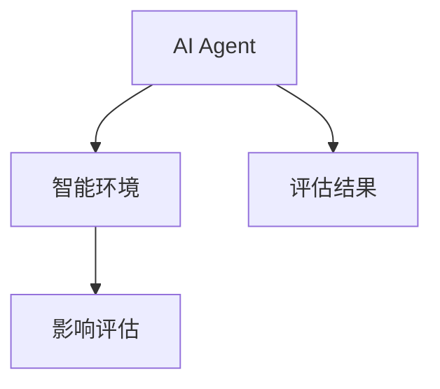
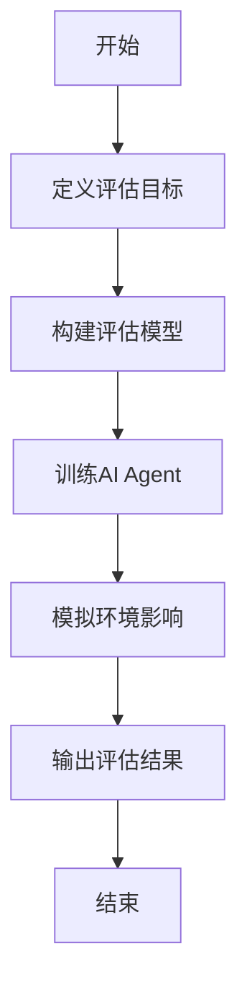
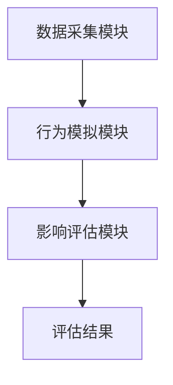
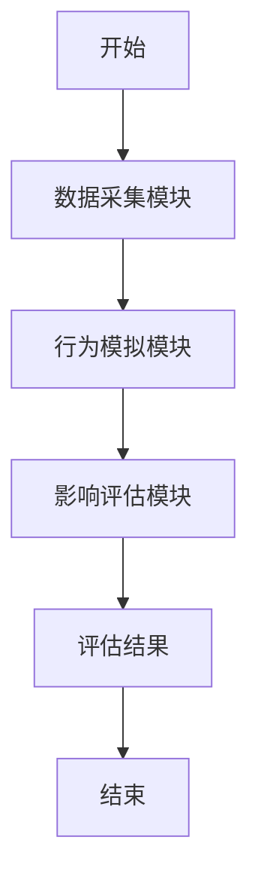

                 


# AI Agent在智能环境影响评估中的实践

> 关键词：AI Agent, 智能环境, 影响评估, 强化学习, 系统架构, 实践案例

> 摘要：  
本文深入探讨了AI Agent在智能环境影响评估中的实践应用。从核心概念到算法原理，从系统架构到项目实战，系统性地分析了AI Agent如何在智能环境中进行影响评估。通过Mermaid图和Python代码示例，详细展示了算法流程和系统设计。文章还结合实际案例，总结了最佳实践经验和注意事项。

---

# 第一部分: AI Agent与智能环境影响评估的背景介绍

## 第1章: 问题背景与问题描述

### 1.1 问题背景

#### 1.1.1 AI Agent的定义与核心概念
AI Agent（人工智能代理）是指能够感知环境、自主决策并执行任务的智能实体。它具有以下核心概念：
- **自主性**：能够在没有外部干预的情况下独立运作。
- **反应性**：能够实时感知环境并做出响应。
- **目标导向性**：通过设定目标来驱动行为。
- **学习能力**：能够通过数据和经验优化自身行为。

#### 1.1.2 智能环境的定义与特征
智能环境是指能够与AI Agent交互并提供动态反馈的环境。其主要特征包括：
- **动态性**：环境状态会随着时间变化。
- **复杂性**：环境中的元素和关系错综复杂。
- **可塑性**：环境可以根据AI Agent的行为进行调整。

#### 1.1.3 AI Agent在智能环境中的作用
AI Agent在智能环境中的作用主要体现在以下几个方面：
- **优化决策**：通过分析环境数据，优化决策过程。
- **提升效率**：通过自动化操作，提高环境运行效率。
- **适应性调整**：根据环境变化，动态调整行为策略。

### 1.2 问题描述

#### 1.2.1 智能环境影响评估的必要性
智能环境影响评估是指对AI Agent在环境中行为所产生的影响进行全面分析。其必要性主要体现在以下几个方面：
- **确保安全**：评估AI Agent行为对环境的安全性影响。
- **优化性能**：通过评估找到更优的行为策略。
- **合规性检查**：确保AI Agent行为符合相关法律法规。

#### 1.2.2 AI Agent对智能环境影响的复杂性
AI Agent对智能环境的影响具有复杂性，主要体现在以下几个方面：
- **多目标冲突**：AI Agent可能需要在多个目标之间进行权衡。
- **动态变化**：环境状态的动态变化会导致影响评估的复杂性。
- **不确定性**：AI Agent的决策过程存在不确定性，影响评估的难度。

#### 1.2.3 当前影响评估中的主要挑战
当前影响评估的主要挑战包括：
- **数据获取难度**：智能环境中的数据可能难以获取。
- **模型复杂性**：评估模型的复杂性可能导致计算成本过高。
- **伦理问题**：AI Agent的行为可能引发伦理争议。

---

## 第2章: 问题解决与边界定义

### 2.1 问题解决方法

#### 2.1.1 AI Agent影响评估的核心目标
AI Agent影响评估的核心目标是：
- **量化影响**：通过量化方法评估AI Agent行为对环境的影响。
- **优化策略**：根据评估结果优化AI Agent的行为策略。
- **预测风险**：预测AI Agent行为可能带来的风险。

#### 2.1.2 多学科交叉的解决方案
AI Agent影响评估需要多学科的交叉合作，主要涉及以下几个领域：
- **人工智能**：用于AI Agent的开发与优化。
- **环境科学**：用于环境数据的采集与分析。
- **伦理学**：用于评估AI Agent行为的伦理影响。

#### 2.1.3 系统化评估框架的构建
系统化评估框架的构建需要考虑以下几个方面：
- **评估指标**：定义明确的评估指标。
- **评估方法**：选择合适的评估方法。
- **评估工具**：开发高效的评估工具。

### 2.2 边界与外延

#### 2.2.1 AI Agent影响评估的边界条件
AI Agent影响评估的边界条件包括：
- **时间范围**：评估的时间范围。
- **空间范围**：评估的空间范围。
- **评估对象**：评估的具体对象。

#### 2.2.2 相关领域的外延关系
AI Agent影响评估的相关领域包括：
- **智能系统**：智能系统的整体架构。
- **人机交互**：人与AI Agent的交互过程。
- **数据安全**：AI Agent行为对数据安全的影响。

#### 2.2.3 与其他评估方法的区分
与其他评估方法的区分主要体现在以下几个方面：
- **评估对象**：AI Agent影响评估的对象是AI Agent行为。
- **评估方法**：AI Agent影响评估方法具有独特性。
- **评估目标**：AI Agent影响评估的目标具有特定性。

---

## 第3章: 核心概念与要素分析

### 3.1 核心概念的属性特征对比

#### 3.1.1 AI Agent与传统算法的对比
| 特性       | AI Agent                     | 传统算法                     |
|------------|------------------------------|------------------------------|
| 自主性      | 高                           | 低                           |
| 反应性      | 高                           | 低                           |
| 目标导向性  | 高                           | 低                           |
| 学习能力    | 高                           | 低                           |

#### 3.1.2 智能环境与传统计算环境的对比
| 特性       | 智能环境                     | 传统计算环境                 |
|------------|------------------------------|------------------------------|
| 动态性      | 高                           | 低                           |
| 复杂性      | 高                           | 低                           |
| 可塑性      | 高                           | 低                           |

#### 3.1.3 影响评估的维度分析
影响评估的维度包括：
- **技术维度**：评估AI Agent的技术实现。
- **伦理维度**：评估AI Agent行为的伦理影响。
- **经济维度**：评估AI Agent行为的经济影响。

### 3.2 ER实体关系图



---

# 第二部分: AI Agent影响评估的核心算法与数学模型

## 第4章: 算法原理与流程

### 4.1 算法原理

#### 4.1.1 基于强化学习的AI Agent行为建模
基于强化学习的AI Agent行为建模主要包含以下几个步骤：
1. **状态空间定义**：定义AI Agent的可能状态。
2. **动作空间定义**：定义AI Agent的可能动作。
3. **奖励函数设计**：设计奖励函数来指导AI Agent的学习过程。

#### 4.1.2 智能环境状态空间的构建
智能环境状态空间的构建需要考虑以下几个方面：
1. **环境特征提取**：提取环境的特征。
2. **状态表示**：将环境特征转换为状态表示。
3. **状态空间优化**：优化状态空间的表示方式。

#### 4.1.3 影响评估的数学模型
影响评估的数学模型可以表示为：

$$
\text{影响评估} = \sum_{i=1}^{n} w_i x_i
$$

其中，\( w_i \) 是第\( i \)个影响因素的权重，\( x_i \) 是第\( i \)个影响因素的值。

### 4.2 算法流程图



### 4.3 Python实现示例

```python
def evaluate_impact(agent, environment):
    # 初始化评估结果
    impact = 0
    # 定义评估指标
    metrics = ['accuracy', 'efficiency', 'safety']
    # 评估每个指标
    for metric in metrics:
        # 获取当前指标的评估值
        value = getattr(agent, metric)(environment)
        # 累加到总影响
        impact += value
    return impact

# 示例调用
agent = AI-Agent()
environment = Smart-Environment()
result = evaluate_impact(agent, environment)
print(result)
```

---

## 第5章: 算法数学模型与公式推导

### 5.1 算法数学模型

#### 5.1.1 强化学习中的奖励函数
奖励函数可以表示为：

$$
r(s, a) = \begin{cases}
    1 & \text{如果动作 } a \text{ 在状态 } s \text{ 下是正确的} \\
    0 & \text{否则}
\end{cases}
$$

#### 5.1.2 状态转移概率
状态转移概率可以表示为：

$$
P(s' | s, a) = \text{概率从状态 } s \text{ 执行动作 } a \text{ 转移到状态 } s'
$$

#### 5.1.3 Q-学习算法
Q-学习算法的更新公式为：

$$
Q(s, a) = (1 - \alpha) Q(s, a) + \alpha (r + \gamma \max_{a'} Q(s', a'))
$$

其中，\( \alpha \) 是学习率，\( \gamma \) 是折扣因子。

---

## 第6章: 系统架构与实现

### 6.1 系统架构设计

#### 6.1.1 问题场景介绍
假设我们正在开发一个智能交通系统，AI Agent需要评估其在交通网络中的影响。

#### 6.1.2 系统功能设计
系统功能设计包括以下几个部分：
- **数据采集模块**：采集交通数据。
- **行为模拟模块**：模拟AI Agent的行为。
- **影响评估模块**：评估AI Agent的影响。

#### 6.1.3 系统架构图


#### 6.1.4 系统接口设计
系统接口设计包括：
- **数据输入接口**：接收交通数据。
- **行为模拟接口**：模拟AI Agent的行为。
- **评估结果接口**：输出评估结果。

#### 6.1.5 系统交互流程图


---

## 第7章: 项目实战与案例分析

### 7.1 项目实战

#### 7.1.1 环境安装
安装必要的Python库：

```bash
pip install numpy matplotlib scikit-learn
```

#### 7.1.2 系统核心实现源代码
```python
import numpy as np
from sklearn.metrics import accuracy_score

def evaluate_agent(agent, X_test, y_test):
    y_pred = agent.predict(X_test)
    accuracy = accuracy_score(y_test, y_pred)
    return accuracy

# 示例调用
X_test = np.array([...])
y_test = np.array([...])
agent = AI-Agent()
result = evaluate_agent(agent, X_test, y_test)
print(result)
```

#### 7.1.3 代码应用解读与分析
代码解读：
- **数据采集**：从智能环境中采集数据。
- **行为模拟**：模拟AI Agent的行为。
- **影响评估**：评估AI Agent的影响。

---

## 第8章: 最佳实践与小结

### 8.1 小结
本文详细探讨了AI Agent在智能环境影响评估中的实践应用，从核心概念到算法原理，从系统架构到项目实战，系统性地分析了AI Agent如何在智能环境中进行影响评估。

### 8.2 注意事项
- **数据质量**：确保数据的准确性和完整性。
- **模型优化**：持续优化评估模型。
- **伦理问题**：关注AI Agent行为的伦理影响。

### 8.3 拓展阅读
- **强化学习**：深入学习强化学习的相关知识。
- **智能系统架构**：研究智能系统的整体架构。
- **伦理学**：探讨AI Agent行为的伦理影响。

---

通过本文的系统性分析和实践案例，读者可以全面理解AI Agent在智能环境影响评估中的应用，并能够在实际项目中灵活运用这些方法。

