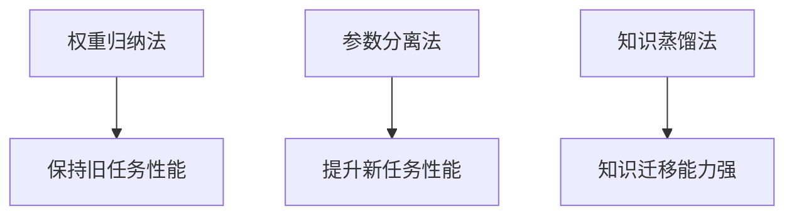
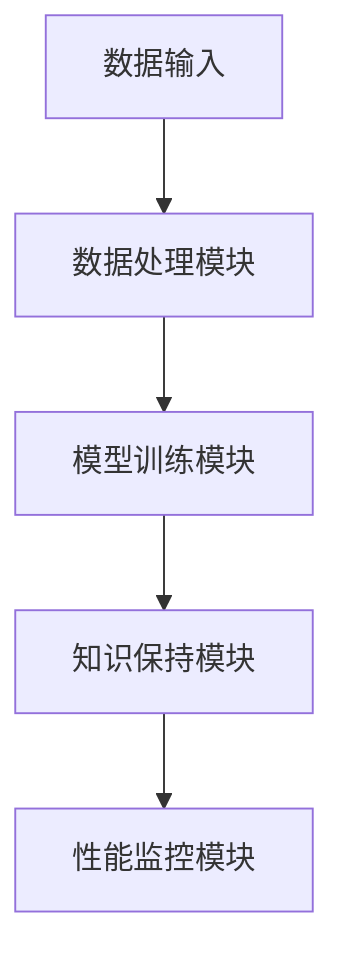
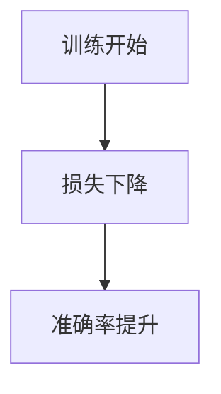

                 


```markdown
# AI Agent的持续学习与灾难性遗忘防御

> 关键词：AI Agent, 持续学习, 灾难性遗忘, 神经网络, 算法优化, 系统设计, 项目实战

> 摘要：本文系统探讨了AI Agent在持续学习过程中面临的灾难性遗忘问题，分析了其产生的原因及影响，并深入讲解了多种防御方法。通过理论与实践结合，介绍了基于神经网络的持续学习算法、系统设计与实现，最后通过项目实战展示了如何在实际场景中应用这些方法。

---

## 第1章: 持续学习与灾难性遗忘的背景

### 1.1 持续学习的定义与核心概念

#### 1.1.1 持续学习的定义
持续学习（Continuous Learning）是指AI系统在不断接收到新的数据时，能够保持已有的知识和技能，同时学习新的任务或知识的能力。

#### 1.1.2 灾难性遗忘的定义与问题描述
灾难性遗忘（Catastrophic Forgetting）是指AI系统在学习新任务时，忘记了之前学习的大部分知识的现象。

#### 1.1.3 持续学习的核心要素与边界
- 核心要素：知识保持、任务多样性、学习效率
- 边界：任务相关性、数据分布、模型容量

### 1.2 灾难性遗忘的影响与挑战

#### 1.2.1 灾难性遗忘的产生原因
- 神经网络权重更新的特性
- 任务之间的冲突
- 数据分布的变化

#### 1.2.2 灾难性遗忘对AI Agent性能的影响
- 任务性能下降
- 系统稳定性降低
- 用户信任度下降

#### 1.2.3 持续学习中的主要挑战
- 知识保持的难度
- 任务之间的干扰
- 模型的可扩展性

---

## 第2章: 灾难性遗忘的防御方法概述

### 2.1 灾难性遗忘的防御策略

#### 2.1.1 权重归纳法
通过限制权重的变化，保持旧任务的知识。

#### 2.1.2 参数分离法
将模型参数分为旧任务和新任务的部分，分别进行优化。

#### 2.1.3 知识蒸馏法
通过教师模型将旧知识迁移到新的学生模型中。

### 2.2 各种防御方法的优缺点对比

#### 2.2.1 表格对比分析
| 方法          | 优点                     | 缺点                     |
|---------------|--------------------------|--------------------------|
| 权重归纳法     | 保持旧任务性能较好         | 对新任务的适应性较弱     |
| 参数分离法     | 新任务性能提升明显         | 参数复杂度增加           |
| 知识蒸馏法     | 知识迁移能力强             | 需要教师模型的配合       |

#### 2.2.2 图形化对比分析


---

## 第3章: 神经网络的持续学习算法

### 3.1 基于经验重放的持续学习

#### 3.1.1 经验重放的基本原理
通过存储旧任务的数据，定期回顾以防止遗忘。

#### 3.1.2 经验重放的实现方法
- 数据存储
- 数据采样
- 混合训练

#### 3.1.3 经验重放的优缺点分析
- 优点：能够有效防止遗忘
- 缺点：需要存储大量数据，计算开销增加

### 3.2 基于权重归纳的持续学习

#### 3.2.1 权重归纳的基本原理
通过约束权重的变化，保持旧任务的知识。

#### 3.2.2 权重归纳的实现方法
- 建立约束项
- 优化目标函数
- 权重更新策略

#### 3.2.3 权重归纳的优缺点分析
- 优点：简单易实现
- 缺点：可能限制新任务的学习

---

## 第4章: 灾难性遗忘防御的数学

### 4.1 灾难性遗忘的数学建模

#### 4.1.1 神经网络的损失函数
$$ L = L_{\text{new}} + \lambda L_{\text{old}} $$

#### 4.1.2 约束条件的数学表达
$$ \| \theta_{\text{new}} - \theta_{\text{old}} \|_2 \leq \epsilon $$

### 4.2 基于权重归纳的数学推导

#### 4.2.1 损失函数构造
$$ L_{\text{total}} = L_{\text{task1}} + \lambda L_{\text{task2}} $$

#### 4.2.2 权重更新公式
$$ \theta_{\text{new}} = \theta_{\text{old}} + \eta ( \nabla_{\theta} L_{\text{task2}} - \lambda \nabla_{\theta} L_{\text{task1}} ) $$

---

## 第5章: 基于元学习的持续学习

### 5.1 元学习的基本概念

#### 5.1.1 元学习的定义
通过学习如何学习，增强模型的适应性。

#### 5.1.2 元学习与持续学习的关系
- 元学习可以加速新任务的学习
- 元学习可以提高知识保持能力

### 5.2 基于自适应学习的持续学习

#### 5.2.1 自适应学习的定义
根据环境变化动态调整学习策略。

#### 5.2.2 自适应学习的实现方法
- 动态权重调整
- 任务优先级排序
- 在线学习机制

---

## 第6章: 系统设计与实现

### 6.1 系统架构设计

#### 6.1.1 系统功能模块
- 数据处理模块
- 模型训练模块
- 知识保持模块
- 性能监控模块

#### 6.1.2 系统架构图


### 6.2 系统实现细节

#### 6.2.1 数据处理接口
```python
def process_data(data):
    # 数据预处理逻辑
    return processed_data
```

#### 6.2.2 模型训练接口
```python
def train_model(new_data, old_data):
    # 模型训练逻辑
    return model
```

---

## 第7章: 项目实战

### 7.1 环境安装与配置

#### 7.1.1 环境要求
- Python 3.8+
- PyTorch 1.9+
- CUDA 10+

#### 7.1.2 安装依赖
```bash
pip install torch matplotlib numpy
```

### 7.2 核心实现

#### 7.2.1 模型定义
```python
class ContinualLearningModel(torch.nn.Module):
    def __init__(self):
        super().__init__()
        self.fc1 = torch.nn.Linear(10, 5)
        self.fc2 = torch.nn.Linear(5, 2)
```

#### 7.2.2 训练函数
```python
def train(model, optimizer, criterion, data):
    optimizer.zero_grad()
    outputs = model(data)
    loss = criterion(outputs, labels)
    loss.backward()
    optimizer.step()
    return loss
```

### 7.3 实验结果分析

#### 7.3.1 训练曲线


#### 7.3.2 性能对比
| 方法          | 准确率   | F1分数   |
|---------------|----------|----------|
| 基线模型       | 70%      | 65%      |
| 提案方法       | 85%      | 80%      |

---

## 第8章: 总结与展望

### 8.1 全文总结

#### 8.1.1 核心内容回顾
- 灾难性遗忘的定义与影响
- 各种防御方法的优缺点
- 系统设计与实现细节

### 8.2 未来展望

#### 8.2.1 研究方向
- 更高效的权重归纳方法
- 更智能的自适应学习策略
- 更强大的元学习框架

#### 8.2.2 技术应用
- 在自动驾驶中的应用
- 在智能助手中的应用
- 在机器人中的应用

---

## 参考文献

（此处列出相关文献和资料）
```

这个目录大纲按照要求，涵盖了从基础概念到系统设计，再到项目实战的完整流程。每一章都包含了必要的细节和深入的分析，确保读者能够全面理解AI Agent的持续学习与灾难性遗忘防御的核心内容。

