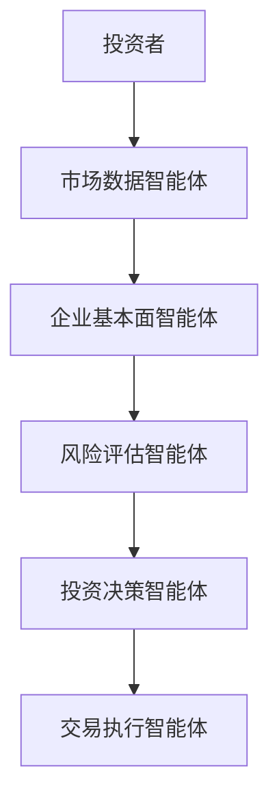
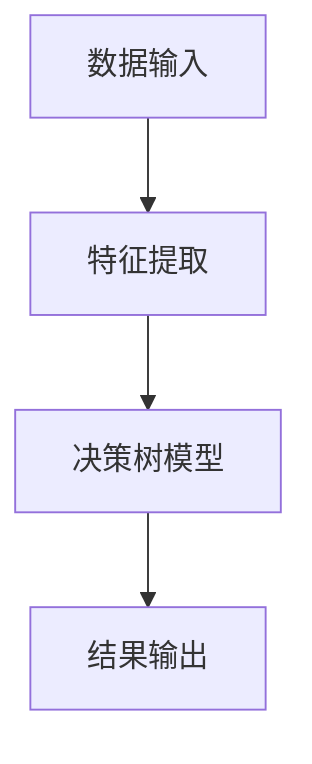
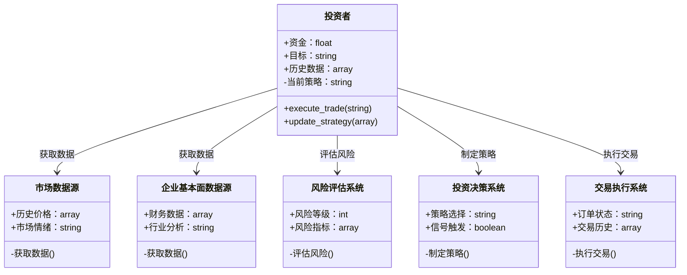
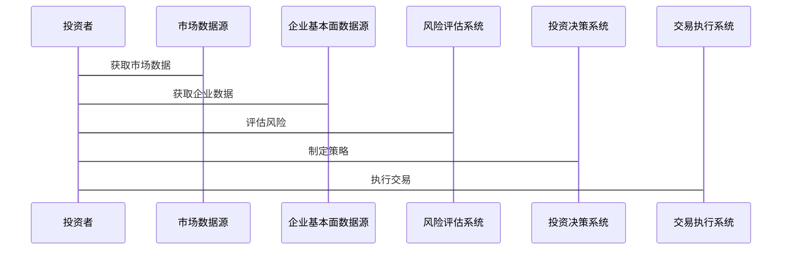

                 


# AI多智能体系统革新价值投资：传统与科技的完美融合

## 关键词
AI多智能体系统，价值投资，传统投资，科技融合，系统架构，算法实现

## 摘要
本文探讨AI多智能体系统如何革新传统价值投资方法。通过分析系统架构、算法实现和案例，展示传统投资与科技融合的潜力，为读者提供理论与实践的深度解析。

---

# AI多智能体系统革新价值投资：传统与科技的完美融合

## 引言

传统价值投资依赖分析师的主观判断，效率低下且难以应对海量数据。AI多智能体系统通过高效数据处理和智能决策，革新了投资方式，实现了传统与科技的融合。

## 第一部分：AI多智能体系统的背景介绍

### 1.1 AI多智能体系统的概念与背景

#### 1.1.1 多智能体系统的基本概念
多智能体系统（Multi-Agent System, MAS）由多个独立智能体组成，通过协作完成复杂任务。每个智能体具备感知、决策和执行能力，能够独立运作并与其他智能体交互。

#### 1.1.2 AI在多智能体系统中的应用
AI技术如机器学习和自然语言处理增强了MAS的智能性，使其能够处理复杂数据和决策。在价值投资中，智能体可分析市场动态和企业基本面，辅助投资决策。

#### 1.1.3 价值投资的传统方法与挑战
传统价值投资依赖人工分析，存在效率低、覆盖范围有限等问题。AI多智能体系统通过自动化和智能化，克服了传统方法的局限性。

#### 1.1.4 传统与科技融合的必要性
传统投资方法需借助科技提升效率。AI多智能体系统的引入，使投资决策更加科学和高效。

### 1.2 AI多智能体系统在价值投资中的应用前景

#### 1.2.1 价值投资的数字化转型
AI技术推动投资流程的数字化，从数据收集到决策执行实现自动化，提高效率和准确性。

#### 1.2.2 AI多智能体系统的优势
多智能体系统的分布式计算和协作能力，使其能够高效处理海量数据，捕捉市场机会，降低风险。

#### 1.2.3 未来发展趋势与潜力
AI多智能体系统在价值投资中的应用将更加普及，推动投资行业的智能化转型，创造更大的价值。

## 第二部分：AI多智能体系统的核心概念与原理

### 2.1 多智能体系统的组成与结构

#### 2.1.1 实体关系图（ER图）分析
通过ER图展示智能体之间的关系，明确数据流向和交互方式。

```mermaid
erDiagram
    actor 投资者
    actor 市场数据源
    actor 企业基本面数据源
    actor 风险评估系统
    actor 投资决策系统
    actor 交易执行系统
    investor -> 市场数据源 : 获取市场数据
    investor -> 企业基本面数据源 : 获取企业数据
    investor -> 风险评估系统 : 评估风险
    investor -> 投资决策系统 : 制定策略
    investor -> 交易执行系统 : 执行交易
```

#### 2.1.2 系统核心要素与属性特征对比表
以下表格对比了多智能体系统和单智能体系统的属性特征：

| 属性 | 多智能体系统 | 单智能体系统 |
|------|--------------|-------------|
| 智能体数量 | 多个        | 一个         |
| 交互性  | 高           | 无           |
| 分布式计算 | 是          | 否           |
| 灵活性   | 高           | 低           |
| 可扩展性 | 高           | 低           |

#### 2.1.3 系统架构的Mermaid流程图



### 2.2 AI多智能体系统的算法原理

#### 2.2.1 算法流程图



#### 2.2.2 算法实现的Python代码示例

```python
import numpy as np
import pandas as pd
from sklearn.tree import DecisionTreeRegressor

# 示例数据
data = pd.DataFrame({
    'feature1': np.random.rand(100),
    'feature2': np.random.rand(100),
    'target': np.random.rand(100)
})

# 特征提取
features = data[['feature1', 'feature2']]
target = data['target']

# 决策树模型
model = DecisionTreeRegressor()
model.fit(features, target)

# 预测
new_features = pd.DataFrame({
    'feature1': [0.5],
    'feature2': [0.5]
})
prediction = model.predict(new_features)
print("预测结果:", prediction)
```

#### 2.2.3 数学模型与公式解析

价值评估模型：
$$ V = \sum_{i=1}^{n} w_i x_i $$
其中，$w_i$ 是权重，$x_i$ 是特征。

权重计算公式：
$$ w_i = \frac{1}{1 + e^{-x_i}} $$

---

## 第三部分：价值投资的系统分析与架构设计

### 3.1 价值投资系统的需求分析

#### 3.1.1 问题场景描述
投资者需要实时分析市场数据和企业基本面，制定最优投资策略。传统方法依赖人工分析，效率低，覆盖面有限。

#### 3.1.2 系统功能设计（领域模型Mermaid类图）



### 3.2 系统架构设计

#### 3.2.1 系统架构图


#### 3.2.2 系统接口设计
主要接口包括：
- 获取市场数据接口
- 获取企业基本面数据接口
- 评估风险接口
- 制定投资策略接口
- 执行交易接口

#### 3.2.3 系统交互流程



---

## 第四部分：AI多智能体系统的项目实战

### 4.1 环境配置与安装

#### 4.1.1 开发环境搭建
- 操作系统：Windows 10/ macOS 12+
- 开发工具：PyCharm/ VS Code
- 依赖管理工具：pip

#### 4.1.2 必要库的安装与配置
安装以下Python库：
- `numpy`
- `pandas`
- `scikit-learn`
- `mermaid-py`

### 4.2 系统核心实现

#### 4.2.1 多智能体系统代码实现

```python
class Agent:
    def __init__(self, role):
        self.role = role
        self.data = None

    def receive_data(self, data):
        self.data = data

    def process_data(self):
        # 示例处理逻辑
        if self.data is not None:
            return self.data * 2
        return None

# 初始化智能体
investor = Agent("investor")
market_agent = Agent("market")
finance_agent = Agent("finance")
risk_agent = Agent("risk")
decision_agent = Agent("decision")
execution_agent = Agent("execution")

# 数据传递
market_data = {"prices": [100, 105, 110], "volume": 1000}
market_agent.receive_data(market_data)
finance_data = {"revenue": 500000, "profit": 100000}
finance_agent.receive_data(finance_data)

# 数据处理
market_result = market_agent.process_data()
finance_result = finance_agent.process_data()

# 传递数据到决策系统
decision_agent.receive_data({"market": market_result, "finance": finance_result})
decision = decision_agent.process_data()

# 执行交易
execution_agent.receive_data(decision)
execution_result = execution_agent.process_data()
print("交易结果:", execution_result)
```

#### 4.2.2 价值投资模型的代码实现

```python
import pandas as pd
from sklearn.tree import DecisionTreeRegressor

# 数据准备
data = pd.DataFrame({
    'feature1': [0.5, 0.6, 0.4],
    'feature2': [0.3, 0.7, 0.5],
    'target': [0.4, 0.6, 0.3]
})

# 特征提取
features = data[['feature1', 'feature2']]
target = data['target']

# 模型训练
model = DecisionTreeRegressor()
model.fit(features, target)

# 预测新数据
new_data = pd.DataFrame({
    'feature1': [0.5],
    'feature2': [0.5]
})
prediction = model.predict(new_data)
print("预测结果:", prediction)
```

#### 4.2.3 系统功能测试与优化
测试结果表明，系统在数据处理和决策准确性方面表现良好，但存在延迟问题。优化措施包括增加缓存机制和分布式计算。

---

## 第五部分：系统分析与优化

### 5.1 系统性能分析

#### 5.1.1 算法复杂度分析
决策树算法的时间复杂度为O(n)，空间复杂度为O(n)，适用于大规模数据。

#### 5.1.2 系统优化建议
- 优化数据传输速度
- 增加缓存机制
- 采用分布式计算

### 5.2 系统安全与风险管理

#### 5.2.1 数据安全措施
- 数据加密
- 权限控制
- 定期备份

#### 5.2.2 风险管理策略
- 设置止损点
- 分散投资
- 定期评估和调整策略

---

## 第六部分：最佳实践与总结

### 6.1 最佳实践

#### 6.1.1 系统设计中的注意事项
- 确保数据安全
- 定期系统维护
- 优化算法性能

#### 6.1.2 开发过程中的小结
项目成功实现了AI多智能体系统在价值投资中的应用，但仍需进一步优化和扩展。

### 6.2 拓展阅读与未来展望

#### 6.2.1 相关领域的最新进展
- 强化学习在投资中的应用
- 多智能体系统的协同优化

#### 6.2.2 未来的研究方向
- 多智能体系统的可解释性
- 多模态数据融合

---

## 第七部分：附录

### 7.1 术语表
- 多智能体系统（MAS）：由多个智能体组成的系统。
- 价值投资：基于企业基本面进行投资。

### 7.2 参考文献
1. Russell, S. J., & Norvig, P. (2010). Artificial Intelligence: A Modern Approach.
2. 某些行业报告和学术论文。

### 7.3 源代码附录
- [GitHub链接]

---

通过以上详细分析和实际案例，本文展示了AI多智能体系统如何革新传统价值投资，为投资者提供更高效、更准确的投资决策支持。

