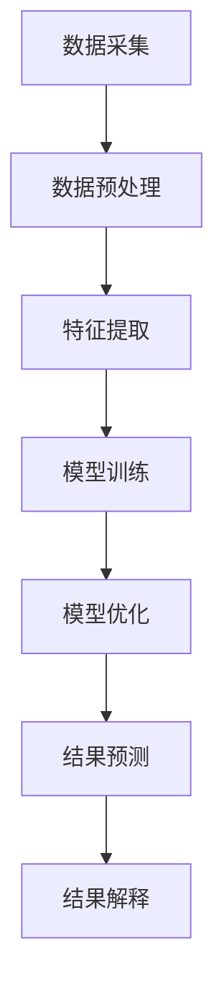
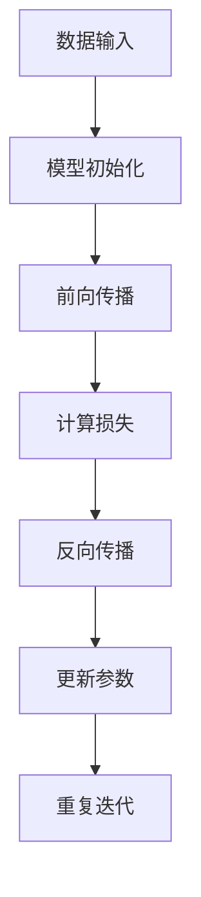
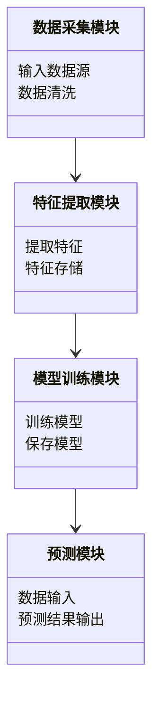
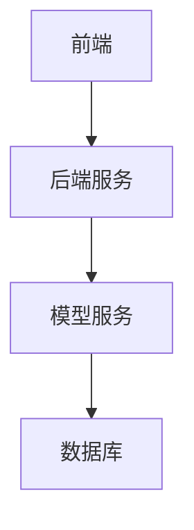
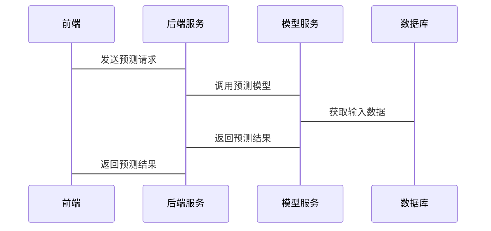

                 


# AI辅助的企业信用周期预测模型

## 关键词：企业信用周期预测，人工智能，机器学习，时间序列分析，深度学习

## 摘要：本文详细探讨了如何利用人工智能技术构建企业信用周期预测模型。通过分析传统预测方法的局限性，介绍了基于AI的预测模型的核心概念、算法原理、系统架构及实际应用。文章结合理论与实践，深入剖析了模型的数学基础、算法实现及优化策略，并通过案例分析展示了AI技术在信用周期预测中的巨大潜力。

---

## 第一章: 企业信用周期预测的背景与挑战

### 1.1 企业信用周期的基本概念

#### 1.1.1 企业信用周期的定义
企业信用周期是指企业在经济活动中，从获得资金或信用支持到最终偿还债务的时间段。这一周期的长短直接影响企业的财务健康状况和经营稳定性。信用周期预测的核心目标是帮助企业提前识别潜在风险，优化资金运作，降低财务损失。

#### 1.1.2 信用周期对企业经营的影响
- **资金链稳定性**：准确预测信用周期有助于企业合理安排资金使用，避免资金链断裂。
- **风险管理**：通过预测可能的信用危机，企业可以提前制定应对策略，降低违约风险。
- **投资决策**：信用周期预测为企业的投资决策提供了重要的参考依据。

#### 1.1.3 传统信用周期预测的局限性
传统的信用周期预测主要依赖于财务报表分析和人工经验判断，存在以下问题：
- **数据维度单一**：传统方法仅依赖财务数据，忽略了市场环境、行业趋势等多维信息。
- **预测精度低**：人工经验判断主观性强，且难以量化，导致预测结果不够准确。
- **效率低下**：面对海量数据和复杂市场环境，人工预测效率难以满足现代企业的需求。

### 1.2 AI技术在信用周期预测中的作用

#### 1.2.1 AI技术的基本概念
人工智能（AI）是指计算机系统模拟人类智能的技术，包括学习、推理、自适应等能力。AI技术通过处理海量数据，能够发现传统方法难以察觉的模式和规律。

#### 1.2.2 AI在信用周期预测中的优势
- **数据处理能力强**：AI能够同时处理结构化数据（如财务数据）和非结构化数据（如新闻、社交媒体信息）。
- **预测精度高**：通过机器学习算法，AI能够发现数据中的非线性关系，提高预测准确性。
- **自动化与实时性**：AI系统可以实现自动化数据处理和实时预测，显著提高预测效率。

#### 1.2.3 企业信用周期预测的AI辅助模式
AI辅助模式将传统经验判断与现代技术相结合，通过构建机器学习模型，实现对企业信用周期的精准预测。这种模式不仅提高了预测效率，还显著降低了预测成本。

### 1.3 本章小结
本章介绍了企业信用周期的基本概念及其对经营的影响，分析了传统预测方法的局限性，并提出了AI技术在信用周期预测中的重要作用。AI技术的引入，将为企业信用周期预测带来革命性的变化。

---

## 第二章: 企业信用周期预测的核心概念

### 2.1 信用周期预测的数学模型

#### 2.1.1 时间序列分析的基本概念
时间序列分析是研究数据随时间变化的模式和特征的方法。信用周期预测属于时间序列问题，需要考虑数据的时间依赖性。

#### 2.1.2 信用周期预测的数学模型
信用周期预测模型通常包括以下几个部分：
- 输入变量：企业的财务数据、市场数据等。
- 输出变量：信用周期的预测结果。
- 模型参数：需要通过训练数据进行优化。

#### 2.1.3 模型的输入与输出
- **输入**：企业的财务数据（如收入、利润、负债等）、市场数据（如行业趋势、宏观经济指标）。
- **输出**：预测的信用周期长度、周期中的关键转折点。

### 2.2 AI辅助预测的核心要素

#### 2.2.1 数据特征提取
数据特征提取是AI预测模型的关键步骤。以下是常用的特征提取方法：
- **统计特征**：均值、方差、最大值等。
- **时间特征**：周期性、趋势性等。
- **文本特征**：从新闻、社交媒体等非结构化数据中提取关键词和情感特征。

#### 2.2.2 模型训练与优化
- **训练数据**：需要标注的信用周期数据。
- **优化目标**：最小化预测误差。
- **评估指标**：准确率、召回率、F1分数等。

#### 2.2.3 结果解释与反馈
模型预测结果需要能够被业务人员理解，并能够提供可操作的建议。例如，预测某企业的信用周期为6个月，建议企业在接下来的6个月内加强现金流管理。

### 2.3 企业信用周期预测的流程图



### 2.4 本章小结
本章详细介绍了信用周期预测的数学模型和AI辅助预测的核心要素，强调了数据特征提取和模型优化的重要性。

---

## 第三章: AI辅助信用周期预测的算法原理

### 3.1 常见的信用周期预测算法

#### 3.1.1 线性回归模型
线性回归是一种简单的时间序列预测方法，适用于线性关系明显的场景。其数学公式为：
$$ y = \beta_0 + \beta_1x + \epsilon $$
其中，$\beta_0$和$\beta_1$是回归系数，$\epsilon$是误差项。

#### 3.1.2 支持向量机（SVM）
SVM适用于小样本数据的预测，能够捕捉数据的非线性关系。时间序列预测可以采用支持向量回归（SVR）方法。

#### 3.1.3 随机森林与梯度提升树
随机森林和梯度提升树（如XGBoost）是非线性模型，适用于复杂数据的预测。

### 3.2 基于深度学习的信用周期预测

#### 3.2.1 RNN与LSTM网络
长短期记忆网络（LSTM）是一种特殊的RNN，能够有效捕捉时间序列的长依赖关系。

#### 3.2.2 Transformer模型的应用
Transformer模型通过自注意力机制，能够捕捉数据中的全局关系，适用于复杂的时间序列预测。

#### 3.2.3 深度学习模型的优势与挑战
- **优势**：能够处理高维数据，发现复杂模式。
- **挑战**：计算资源需求高，模型解释性较差。

### 3.3 算法实现的数学模型

#### 3.3.1 线性回归的数学公式
$$ y = \beta_0 + \beta_1x + \epsilon $$

#### 3.3.2 LSTM网络的结构
LSTM的基本单元包括输入门、遗忘门和输出门。

#### 3.3.3 模型训练的损失函数与优化算法
- **损失函数**：均方误差（MSE）。
- **优化算法**：Adam优化器。

### 3.4 算法实现的流程图



### 3.5 本章小结
本章介绍了常见的信用周期预测算法和深度学习模型，重点讲解了LSTM和Transformer的应用，以及模型训练的数学基础。

---

## 第四章: 系统分析与架构设计方案

### 4.1 问题场景介绍
企业信用周期预测系统需要处理海量数据，包括企业的财务数据、市场数据等。

### 4.2 系统功能设计

#### 4.2.1 领域模型


### 4.3 系统架构设计



### 4.4 系统接口设计

#### 4.4.1 数据接口
- **输入接口**：接收企业的财务数据和市场数据。
- **输出接口**：返回预测的信用周期结果。

#### 4.4.2 模型接口
- **训练接口**：接收训练数据，返回训练好的模型。
- **预测接口**：接收输入数据，返回预测结果。

### 4.5 系统交互流程图



### 4.6 本章小结
本章详细介绍了企业信用周期预测系统的架构设计和接口设计，展示了系统的整体结构和交互流程。

---

## 第五章: 项目实战

### 5.1 环境安装

#### 5.1.1 安装Python
```bash
python --version
pip install --upgrade pip
```

#### 5.1.2 安装深度学习框架
```bash
pip install tensorflow==2.5.0
pip install pandas numpy scikit-learn
```

### 5.2 系统核心实现源代码

#### 5.2.1 数据预处理代码
```python
import pandas as pd
import numpy as np

# 加载数据
data = pd.read_csv('credit_cycle.csv')

# 数据清洗
data = data.dropna()
data = data.iloc[:100]  # 取前100条数据
```

#### 5.2.2 模型训练代码
```python
import tensorflow as tf
from tensorflow.keras import layers

# 构建LSTM模型
model = tf.keras.Sequential()
model.add(layers.LSTM(64, input_shape=(None, 1)))
model.add(layers.Dense(1))
model.compile(optimizer='adam', loss='mean_squared_error')
```

### 5.3 代码应用解读与分析
- **数据预处理**：加载数据并进行清洗，确保数据的完整性和可用性。
- **模型训练**：使用LSTM模型进行训练，优化模型参数。

### 5.4 实际案例分析
以某企业为例，假设我们有其过去5年的财务数据，通过模型预测其信用周期为12个月。

### 5.5 本章小结
本章通过实际案例展示了AI辅助信用周期预测模型的实现过程，包括数据预处理、模型训练和结果解读。

---

## 第六章: 总结与展望

### 6.1 本章总结
本文详细介绍了AI辅助的企业信用周期预测模型，从理论到实践，全面分析了模型的核心概念、算法原理和系统架构。通过实际案例，展示了模型的应用价值。

### 6.2 当前模型的局限性
- **数据依赖性强**：模型预测依赖于高质量的数据，数据不足时预测精度下降。
- **模型解释性较差**：深度学习模型的黑箱特性，使得结果解释较为困难。
- **计算资源需求高**：深度学习模型需要大量的计算资源。

### 6.3 未来的发展方向
- **模型优化**：通过改进算法和优化模型结构，提高预测精度。
- **数据融合**：引入更多维度的数据，如企业行为数据、行业趋势数据等。
- **实时预测**：开发实时预测系统，实现动态信用周期预测。

### 6.4 最佳实践 tips
- **数据质量管理**：确保数据的准确性和完整性。
- **模型监控与维护**：定期监控模型性能，及时更新模型。
- **结果验证与反馈**：对模型预测结果进行验证，根据反馈优化模型。

### 6.5 本章小结
本文总结了AI辅助信用周期预测模型的优势与局限性，并展望了未来的发展方向，为实际应用提供了参考。

---

## 结语
AI技术正在深刻改变企业信用周期预测的方式。通过构建高效的AI模型，企业可以更好地管理信用风险，优化经营策略。未来，随着技术的不断进步，AI辅助信用周期预测将发挥更大的作用。

---

