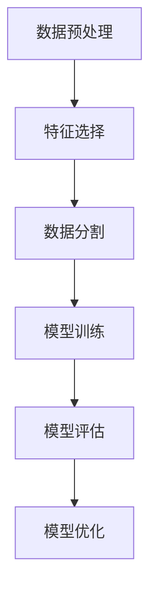
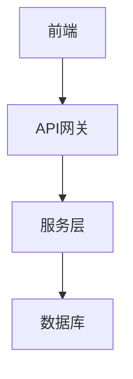
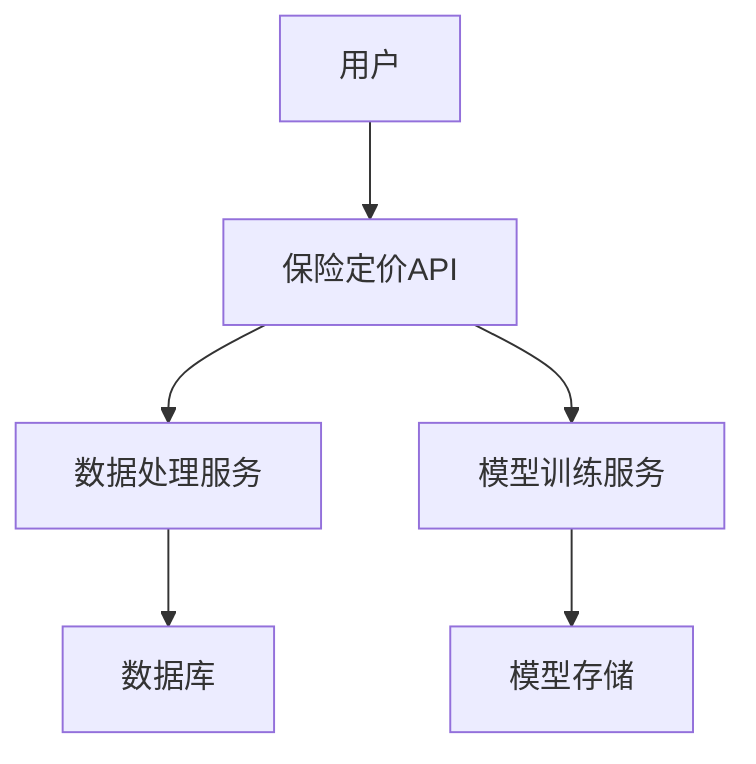
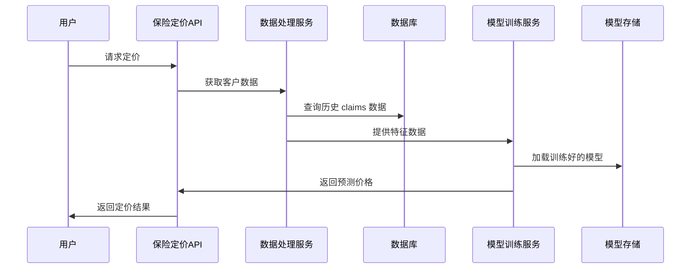
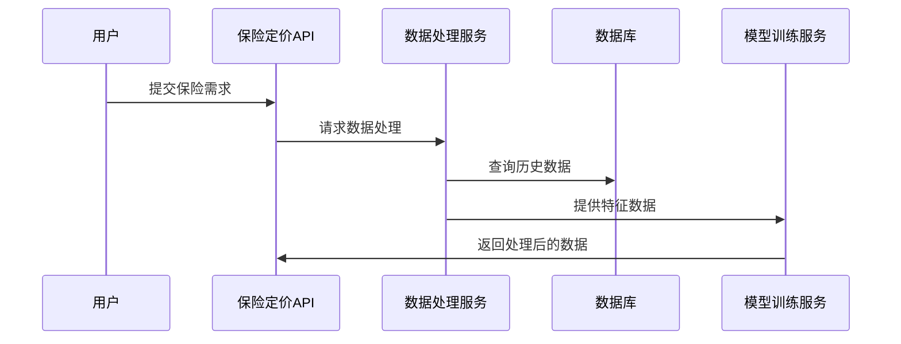
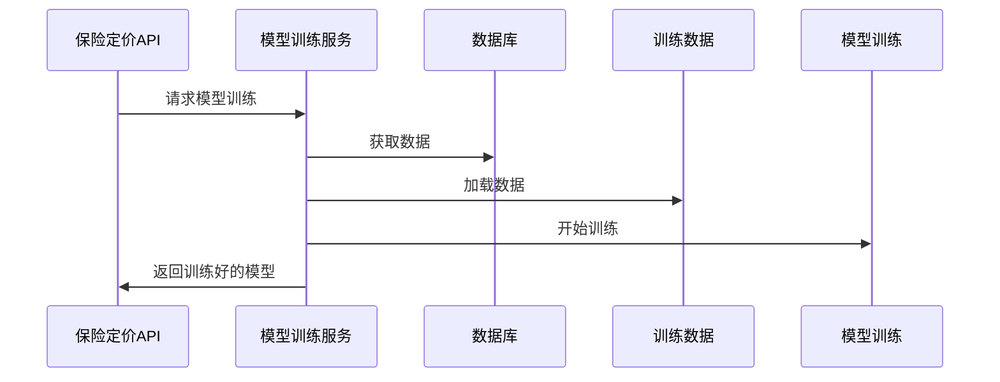

                 


# AI驱动的保险定价优化模型

**关键词**：保险定价、人工智能、机器学习、梯度提升树、神经网络

**摘要**：随着人工智能技术的快速发展，AI在保险定价中的应用越来越广泛。本文详细探讨了AI驱动的保险定价优化模型，从背景介绍、核心概念、算法原理、系统架构设计到项目实战，全面分析了该模型的构建与应用。通过对比传统定价模型与AI驱动模型的差异，结合实际案例，展示了如何利用AI技术优化保险定价流程，提高定价的准确性和效率。

---

# 第1章 保险定价优化模型概述

## 1.1 保险定价问题背景

### 1.1.1 保险定价的基本概念
保险定价是指根据风险的特征和概率，计算出保险产品的价格。传统定价方法依赖于历史数据和经验，通常基于统计分析和精算模型。然而，这种方法存在数据维度有限、个性化不足等问题。

### 1.1.2 传统保险定价的挑战
传统定价方法主要依赖于精算师的经验和历史数据，存在以下问题：
- 数据维度有限，难以捕捉复杂的风险因素。
- 个性化定价能力不足，难以满足客户的多样化需求。
- 模型的可解释性较差，难以获得监管机构和客户的信任。

### 1.1.3 AI技术在保险定价中的应用前景
AI技术可以通过大数据分析和机器学习算法，捕捉更多的风险因素，实现更精准的定价。AI驱动的保险定价模型具有以下优势：
- 数据处理能力强，能够利用结构化和非结构化数据。
- 可以实现个性化定价，满足客户的多样化需求。
- 模型可解释性较高，有助于获得监管机构和客户的信任。

## 1.2 AI驱动保险定价的核心问题

### 1.2.1 数据驱动的定价需求
AI驱动的定价模型需要大量的数据支持，包括客户信息、历史 claims 数据、市场数据等。数据的多样性和质量直接影响模型的性能。

### 1.2.2 个性化定价的实现路径
通过AI技术，可以根据客户的个体特征和行为模式，制定个性化的保险价格。例如，基于客户的驾驶行为数据，实时调整车险保费。

### 1.2.3 模型可解释性的重要性
保险定价需要满足监管要求，模型的可解释性是确保定价合理性和合规性的关键。AI模型需要能够清晰解释定价决策的原因，避免“黑箱”问题。

## 1.3 保险定价优化模型的目标与边界

### 1.3.1 模型的核心目标
- 提高定价的准确性。
- 实现个性化的定价策略。
- 降低定价成本，提高效率。

### 1.3.2 模型的边界与限制
- 数据来源有限，可能影响模型的泛化能力。
- 模型的可解释性要求较高，可能限制某些复杂算法的应用。
- 监管政策的变化可能对模型的适用性产生影响。

### 1.3.3 与相关领域的区别与联系
与传统定价模型相比，AI驱动的定价模型更加注重数据的利用和模型的可扩展性。与风险评估模型相比，定价模型更加关注价格的制定过程。

## 1.4 本章小结
本章介绍了保险定价的基本概念和传统定价方法的挑战，探讨了AI技术在保险定价中的应用前景。明确了AI驱动定价模型的核心问题和目标，为后续章节的分析奠定了基础。

---

# 第2章 核心概念原理

## 2.1 定价优化模型的原理

### 2.1.1 数据驱动的定价模型
数据驱动的定价模型依赖于大量数据，通过机器学习算法提取特征并建立定价模型。例如，使用随机森林或梯度提升树进行特征选择和价格预测。

### 2.1.2 基于机器学习的定价方法
机器学习算法可以自动提取数据中的特征，并建立定价模型。常用算法包括线性回归、支持向量机（SVM）、随机森林和梯度提升树（如XGBoost、LightGBM）。

### 2.1.3 深度学习在定价中的应用
深度学习模型（如神经网络）可以处理非结构化数据，例如图像、文本和语音数据。在保险定价中，可以用于识别隐藏的模式和关系。

## 2.2 核心概念属性特征对比

| 特征对比维度 | 传统定价模型 | AI驱动定价模型 |
|--------------|---------------|----------------|
| 数据来源     | 依赖历史数据   | 利用结构化和非结构化数据 |
| 特征选择     | 由精算师手动选择 | 由算法自动提取 |
| 模型复杂度   | 较低           | 较高，支持复杂关系建模 |
| 模型可解释性  | 较高           | 较低，但可通过特征重要性分析提高可解释性 |
| 定价效率     | 较低，依赖人工经验 | 较高，自动化程度高 |

### 2.2.1 传统定价模型的特征
- 数据来源单一，主要依赖历史 claims 数据和客户信息。
- 特征选择由精算师手动完成，可能遗漏重要特征。
- 模型复杂度低，难以捕捉复杂的风险关系。

### 2.2.2 基于AI的定价模型特征
- 数据来源多样，包括结构化和非结构化数据。
- 特征选择由算法自动完成，能够捕捉更多潜在风险因素。
- 模型复杂度高，支持非线性关系建模。

### 2.2.3 对比分析与总结
AI驱动的定价模型在数据利用、特征选择和模型复杂度方面具有明显优势，能够提高定价的准确性和个性化能力。然而，模型的可解释性仍然是需要重点关注的问题。

## 2.3 ER实体关系图架构

```mermaid
erd
    顾客
    历史claims数据
    保险产品
    风险评估
    定价模型
    价格

    顾客 -[拥有]-> 历史claims数据
    顾客 -[购买]-> 保险产品
    历史claims数据 --> 风险评估
    风险评估 --> 定价模型
    定价模型 --> 价格
```

---

# 第3章 算法原理讲解

## 3.1 算法原理概述

### 3.1.1 常见的保险定价算法
- 线性回归：适用于简单的线性关系，但难以捕捉复杂特征。
- 支持向量机（SVM）：适用于小数据集，但在高维数据中表现不佳。
- 随机森林：适用于特征较多的情况，具有较高的鲁棒性。
- 梯度提升树（如XGBoost、LightGBM）：适用于高维数据，模型解释性较好。

### 3.1.2 基于梯度提升树的定价模型
梯度提升树是一种集成学习算法，通过构建多棵决策树并进行加权投票，能够捕捉复杂的非线性关系。其优势在于模型解释性较高，适合保险定价场景。

### 3.1.3 神经网络在定价中的应用
神经网络可以通过多层结构捕捉数据中的复杂模式，但在保险定价中，模型的可解释性较差，可能限制其应用。

## 3.2 算法实现流程



## 3.3 算法实现代码

### 3.3.1 数据加载与处理
```python
import pandas as pd
data = pd.read_csv('insurance.csv')
```

### 3.3.2 模型训练代码
```python
from sklearn.model_selection import train_test_split
from xgboost import XGBRegressor

X = data.drop('price', axis=1)
y = data['price']

X_train, X_test, y_train, y_test = train_test_split(X, y, test_size=0.2, random_state=42)

model = XGBRegressor(n_estimators=100, learning_rate=0.1, max_depth=6)
model.fit(X_train, y_train)
```

### 3.3.3 模型评估代码
```python
from sklearn.metrics import mean_squared_error

y_pred = model.predict(X_test)
print(f"均方误差: {mean_squared_error(y_test, y_pred)}")
```

## 3.4 算法的数学推导

### 3.4.1 梯度提升树的数学基础
梯度提升树通过最小化损失函数构建多个决策树。损失函数通常采用平方误差损失：
$$ L = \frac{1}{2n}\sum_{i=1}^{n}(y_i - \hat{y}_i)^2 $$

### 3.4.2 神经网络的数学模型
神经网络的损失函数通常采用交叉熵损失：
$$ L = -\frac{1}{n}\sum_{i=1}^{n} [y_i \log(\hat{y}_i) + (1 - y_i)\log(1 - \hat{y}_i)] $$

### 3.4.3 模型的优化目标
$$ \min \theta L(\theta) $$

---

# 第4章 数学模型与公式

## 4.1 定价模型的数学表达

### 4.1.1 损失函数的定义
$$ \text{损失函数} = \sum_{i=1}^{n} (y_i - \hat{y}_i)^2 $$

### 4.1.2 模型的优化目标
$$ \text{优化目标} = \min \theta L(\theta) $$

### 4.1.3 模型的约束条件
$$ \text{约束条件} = \sum_{i=1}^{n} \lambda \cdot \text{特征重要性权重} $$

## 4.2 算法的数学推导

### 4.2.1 梯度提升树的数学基础
梯度提升树通过迭代优化损失函数，每棵决策树的构建目标是最小化当前的残差：
$$ \text{残差} = y_i - \hat{y}_i^{(t)} $$

### 4.2.2 神经网络的数学模型
神经网络的前向传播过程可以表示为：
$$ \hat{y} = f(x; \theta) $$

### 4.2.3 模型的损失函数优化
$$ \text{损失函数} = \sum_{i=1}^{n} (y_i - \hat{y}_i)^2 $$

## 4.3 公式与代码对应关系

### 4.3.1 损失函数公式
$$ \text{损失函数} = \sum_{i=1}^{n} (y_i - \hat{y}_i)^2 $$

### 4.3.2 优化目标公式
$$ \text{优化目标} = \min \theta L(\theta) $$

### 4.3.3 模型预测公式
$$ \hat{y} = f(x; \theta) $$

---

# 第5章 系统分析与架构设计

## 5.1 问题场景介绍

### 5.1.1 保险定价的业务场景
保险公司在定价时需要考虑客户的风险特征、历史 claims 数据、市场环境等因素。通过AI驱动的定价模型，可以实现更精准的定价。

### 5.1.2 数据来源与处理
数据来源包括客户信息、历史 claims 数据、市场数据等。需要进行数据清洗、特征工程和数据增强。

### 5.1.3 模型部署与应用
定价模型需要部署到生产环境中，通过API接口提供定价服务。同时，需要监控模型的性能和效果。

## 5.2 系统功能设计

### 5.2.1 数据处理模块
- 数据清洗：处理缺失值、异常值。
- 特征工程：提取特征、特征选择。
- 数据增强：增加数据的多样性和丰富性。

### 5.2.2 模型训练模块
- 模型选择：选择合适的算法。
- 参数调优：优化模型参数。
- 模型评估：评估模型性能。

### 5.2.3 模型评估模块
- 模型评估：计算均方误差、准确率等指标。
- 模型解释：分析模型的可解释性。
- 模型优化：优化模型性能。

### 5.2.4 模型部署模块
- 模型部署：将模型部署到生产环境。
- API接口：提供定价服务。
- 模型监控：监控模型性能。

## 5.3 系统架构设计

### 5.3.1 分层架构设计


### 5.3.2 微服务架构设计


### 5.3.3 数据流与服务交互设计


## 5.4 系统接口设计

### 5.4.1 数据接口
- 数据输入接口：接收客户数据和历史 claims 数据。
- 数据输出接口：输出处理后的数据。

### 5.4.2 模型接口
- 模型输入接口：接收特征数据。
- 模型输出接口：输出预测价格。

### 5.4.3 用户接口
- 用户输入接口：接收用户的请求。
- 用户输出接口：返回定价结果。

## 5.5 系统交互流程

### 5.5.1 数据输入流程


### 5.5.2 模型训练流程


---

# 第6章 项目实战

## 6.1 环境安装

### 6.1.1 安装Python环境
```bash
python --version
pip install --upgrade pip
```

### 6.1.2 安装依赖库
```bash
pip install pandas scikit-learn xgboost
```

## 6.2 核心实现源代码

### 6.2.1 数据加载与处理
```python
import pandas as pd
data = pd.read_csv('insurance.csv')
```

### 6.2.2 模型训练代码
```python
from sklearn.model_selection import train_test_split
from xgboost import XGBRegressor

X = data.drop('price', axis=1)
y = data['price']

X_train, X_test, y_train, y_test = train_test_split(X, y, test_size=0.2, random_state=42)

model = XGBRegressor(n_estimators=100, learning_rate=0.1, max_depth=6)
model.fit(X_train, y_train)
```

### 6.2.3 模型评估代码
```python
from sklearn.metrics import mean_squared_error

y_pred = model.predict(X_test)
print(f"均方误差: {mean_squared_error(y_test, y_pred)}")
```

## 6.3 代码应用解读与分析

### 6.3.1 数据加载与处理
读取CSV文件中的数据，并进行必要的数据清洗和特征工程。

### 6.3.2 模型训练
使用XGBoost算法训练定价模型，调整参数以优化模型性能。

### 6.3.3 模型评估
评估模型的均方误差，分析模型的预测能力。

## 6.4 实际案例分析

### 6.4.1 案例背景
以车险定价为例，假设我们有一组客户数据，包括年龄、驾驶记录、车辆类型等特征。

### 6.4.2 模型训练与预测
使用上述代码训练模型，并对测试数据进行预测。

### 6.4.3 模型分析
分析模型的预测结果，比较传统定价方法和AI驱动定价模型的差异。

## 6.5 项目小结
通过实际案例分析，验证了AI驱动定价模型的有效性和优势，为后续的应用提供了参考。

---

# 第7章 最佳实践

## 7.1 小结
AI驱动的保险定价优化模型在提高定价准确性和个性化能力方面具有显著优势，但模型的可解释性和数据质量仍然是需要重点关注的问题。

## 7.2 注意事项
- 数据质量：确保数据的准确性和完整性。
- 模型解释性：提高模型的可解释性，以满足监管要求。
- 模型更新：定期更新模型，以适应市场变化。

## 7.3 拓展阅读
- 《机器学习实战》
- 《深度学习入门：基于Python》
- 《保险精算：理论与实践》

---

# 附录

## 附录A: 代码实现细节
完整的代码实现和详细注释。

## 附录B: 模型评估指标
- 均方误差（MSE）
- 平均绝对误差（MAE）
- R平方系数（R²）

## 附录C: 模型优化建议
- 参数调优：使用网格搜索或随机搜索优化模型参数。
- 特征选择：使用特征重要性分析选择关键特征。
- 模型融合：结合多种模型结果，提高预测准确性。

---

通过以上内容，我们系统地介绍了AI驱动的保险定价优化模型的构建与应用。从背景分析到算法实现，再到系统设计和项目实战，全面展示了如何利用AI技术优化保险定价流程。希望本文能够为相关领域的研究和实践提供有价值的参考。

