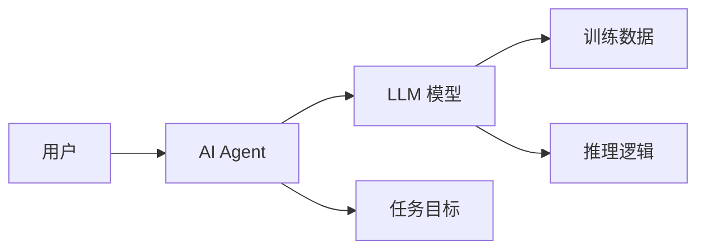
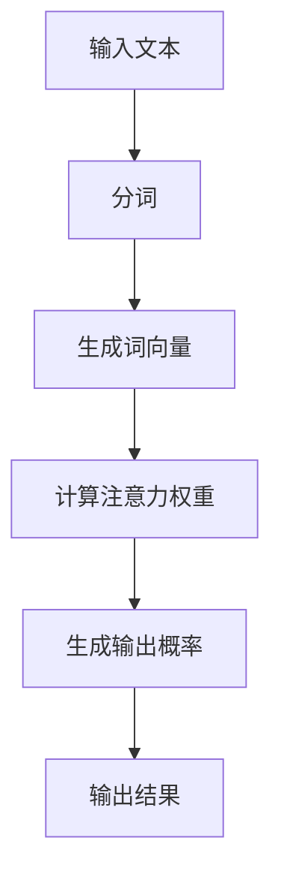
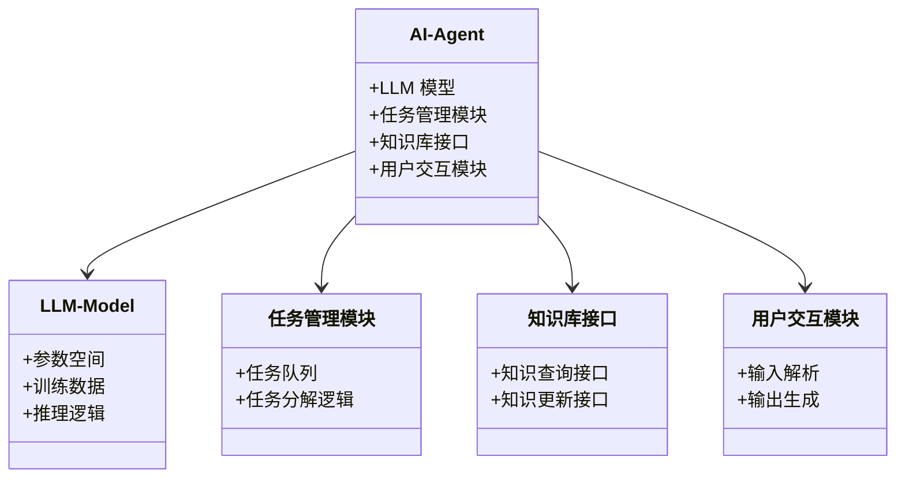
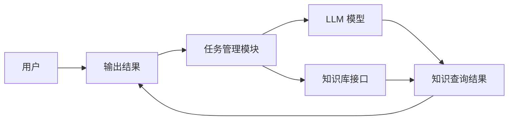
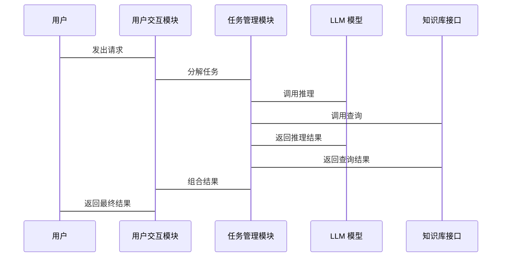

                 


# 从零构建 AI Agent：LLM 大模型应用开发实践

## 关键词：AI Agent, LLM, 大模型, 应用开发, 实践

## 摘要：本文将从零开始，详细介绍如何构建一个基于大语言模型（LLM）的 AI Agent。通过系统化的理论分析、算法原理拆解、系统架构设计以及实际项目实战，全面解析 AI Agent 的核心概念、技术实现与应用开发流程，帮助读者掌握从零到一的 AI Agent 开发能力。

---

# 第1章: 从零开始理解 AI Agent

## 1.1 AI Agent 的基本概念

### 1.1.1 什么是 AI Agent
AI Agent（人工智能代理）是指能够感知环境、自主决策并执行任务的智能体。它能够通过与用户交互、分析上下文信息以及调用外部服务来完成特定目标。

### 1.1.2 AI Agent 的核心特征
- **自主性**：AI Agent 能够自主决策，无需外部干预。
- **反应性**：能够实时感知环境并做出反应。
- **目标导向**：所有行为都围绕特定目标展开。
- **可扩展性**：能够集成多种功能模块，适应不同场景。

### 1.1.3 AI Agent 的应用场景
- **智能助手**：如 Siri、Alexa 等。
- **自动化工具**：如自动化工作流管理。
- **客服系统**：智能客服机器人。
- **垂直领域应用**：如医疗、金融等领域的智能助手。

---

## 1.2 大语言模型（LLM）与 AI Agent 的关系

### 1.2.1 LLM 的定义与特点
- **定义**：大语言模型是指经过海量文本数据训练的深度学习模型，能够理解并生成人类语言。
- **特点**：
  - 巨大的参数规模（如 GPT-3 的 175B 参数）。
  - 预训练-微调范式。
  - 强大的上下文理解能力。

### 1.2.2 LLM 如何赋能 AI Agent
- **自然语言处理**：LLM 提供强大的文本理解和生成能力。
- **知识整合**：通过微调或提示工程技术，整合领域知识。
- **推理能力**：结合外部知识库和推理引擎，提升决策能力。

### 1.2.3 LLM 在 AI Agent 中的角色
- **核心驱动力**：LLM 是 AI Agent 的“大脑”。
- **任务执行者**：通过 LLM 的输出结果，驱动具体任务执行。
- **交互界面**：通过 LLM 实现自然语言的输入输出。

---

## 1.3 AI Agent 的问题背景与挑战

### 1.3.1 传统 AI 系统的局限性
- **单一任务处理**：传统 AI 系统通常只能处理单一任务。
- **缺乏上下文理解**：难以处理复杂场景下的多轮对话。
- **知识更新困难**：知识库的更新和维护成本较高。

### 1.3.2 LLM 引入带来的变革
- **通用性增强**：LLM 的引入使 AI Agent 具备处理多种任务的能力。
- **上下文理解提升**：通过 LLM 的上下文理解能力，提升对话的连贯性。
- **知识整合效率提高**：通过微调或提示工程技术，快速整合领域知识。

### 1.3.3 AI Agent 开发中的主要挑战
- **模型调优**：如何在不同场景下优化 LLM 的表现。
- **任务分解**：如何将复杂任务分解为多个可执行的子任务。
- **系统集成**：如何将 AI Agent 与其他系统（如知识库、外部服务）无缝集成。

---

# 第2章: AI Agent 的核心概念与联系

## 2.1 核心概念原理

### 2.1.1 LLM 的输入输出机制
- **输入**：用户输入的自然语言文本。
- **输出**：生成的自然语言文本，通常是基于输入上下文的合理回复。

### 2.1.2 AI Agent 的任务分解与执行
- **任务分解**：将目标分解为多个子任务，并为每个子任务分配合适的执行方式。
- **任务执行**：通过调用外部服务或执行预定义的脚本来完成子任务。

### 2.1.3 人机交互的自然语言处理流程
- **输入解析**：将用户的自然语言输入解析为具体的操作指令。
- **意图识别**：识别用户的意图并生成相应的任务列表。
- **结果生成**：根据任务分解结果生成输出内容。

---

## 2.2 核心概念对比表

### 2.2.1 LLM 与传统 AI 模型的对比

| 特性           | LLM 模型         | 传统 AI 模型       |
|----------------|-----------------|-------------------|
| 模型复杂度     | 高              | 低                |
| 自然语言处理能力 | 强              | 弱                |
| 知识更新       | 可通过微调实现  | 需手动更新知识库   |

---

## 2.3 ER 实体关系图



---

# 第3章: AI Agent 的算法原理

## 3.1 大模型的数学模型

### 3.1.1 概率分布与损失函数
- **概率分布**：模型预测的每个词的概率分布。
  $$ P(y|x) $$
- **损失函数**：交叉熵损失。
  $$ \mathcal{L} = -\sum_{i=1}^{n} \log P(y_i|x) $$

### 3.1.2 转换器架构与注意力机制
- **转换器架构**：由编码器和解码器组成。
- **注意力机制**：计算输入序列中每个词的重要性。
  $$ \alpha_i = \frac{\exp(s_i)}{\sum_j \exp(s_j)} $$

### 3.1.3 梯度下降与优化算法
- **梯度下降**：通过计算损失函数的梯度，调整模型参数。
- **优化算法**：常用 Adam 优化器。
  $$ \theta_{t+1} = \theta_t - \eta \nabla_\theta \mathcal{L} $$

---

## 3.2 算法流程图



---

## 3.3 算法实现代码

```python
def loss_function(inputs, outputs):
    inputs = tokenize(inputs)  # 分词
    outputs = tokenize(outputs)  # 分词
    # 生成词向量
    input_vectors = get_word_embeddings(inputs)
    # 计算注意力权重
    attention_weights = calculate_attention(input_vectors)
    # 生成输出概率
    output_prob = generate_output_prob(attention_weights)
    # 计算损失
    loss = -sum([log(output_prob[i]) for i in range(len(outputs))])
    return loss
```

---

# 第4章: 系统分析与架构设计

## 4.1 系统功能设计

### 4.1.1 领域模型



---

## 4.2 系统架构设计

### 4.2.1 系统架构图



---

## 4.3 系统接口设计

### 4.3.1 系统交互流程图



---

# 第5章: 项目实战

## 5.1 环境搭建

### 5.1.1 安装依赖
```bash
pip install transformers
pip install torch
pip install mermaid
```

---

## 5.2 核心代码实现

### 5.2.1 AI Agent 核心代码

```python
class AI-Agent:
    def __init__(self):
        self.llm_model = LLMModel()
        self.task_manager = TaskManager()
        self.knowledge_base = KnowledgeBase()
        self.user_interface = UserInterface()

    def process_request(self, user_request):
        # 解析用户请求
        task = self.user_interface.parse_request(user_request)
        # 分解任务
        sub_tasks = self.task_manager.decompose_task(task)
        # 执行任务
        results = []
        for task in sub_tasks:
            if task.type == 'llm':
                result = self.llm_model.generate(task.prompt)
            elif task.type == 'knowledge':
                result = self.knowledge_base.query(task.prompt)
            results.append(result)
        # 组合结果
        final_output = self.user_interface.combine_results(results)
        return final_output
```

---

## 5.3 项目实战案例

### 5.3.1 实际案例分析

假设用户请求是：“帮我预订明天早上 8 点的机票去北京。”
1. **解析请求**：识别用户需求为机票预订。
2. **任务分解**：分解为查询航班信息和确认预订。
3. **任务执行**：
   - 查询航班信息：调用航班查询 API。
   - 确认预订：调用机票预订 API。
4. **组合结果**：返回预订确认信息。

---

## 5.4 项目小结

通过实际案例分析，我们可以看到 AI Agent 的核心流程包括：
1. 用户请求解析。
2. 任务分解。
3. 子任务执行。
4. 结果组合与输出。

---

# 第6章: 最佳实践与小结

## 6.1 最佳实践 tips
1. **模型选择**：根据具体需求选择合适的 LLM 模型。
2. **任务分解**：合理分解任务，避免复杂度过高。
3. **系统集成**：确保各模块之间的高效协同。

## 6.2 小结
本文从零开始，详细讲解了 AI Agent 的核心概念、算法原理、系统架构设计以及实际项目开发流程。通过系统化的理论分析和实践指导，帮助读者掌握从零到一的 AI Agent 开发能力。

---

## 6.3 注意事项
- **数据安全**：处理用户数据时，需注意隐私保护。
- **异常处理**：确保系统能够处理各种异常情况。
- **性能优化**：根据需求进行模型优化和系统调优。

## 6.4 拓展阅读
- 推荐阅读《Large Language Models in AI》。
- 关注最新的 LLM 和 AI Agent 技术动态。

--- 

通过以上内容，读者可以系统地掌握 AI Agent 的开发方法，并能够独立完成从零到一的 AI Agent 应用开发。

