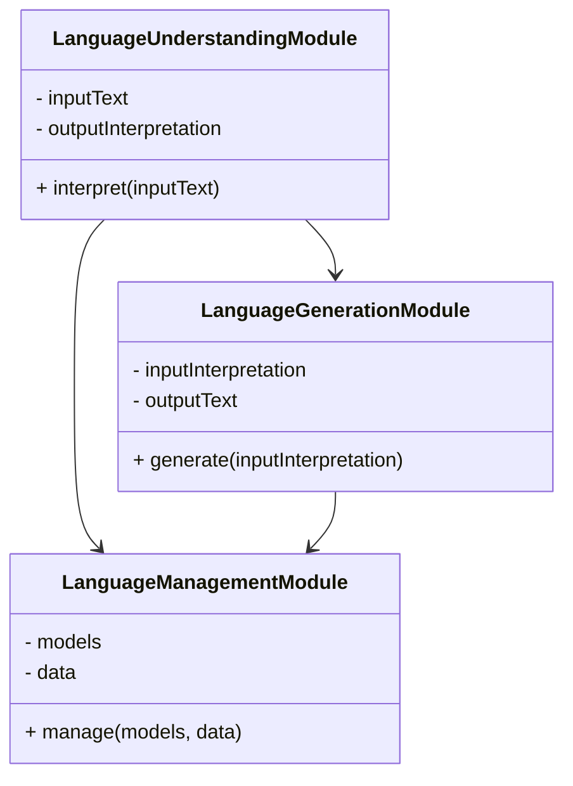
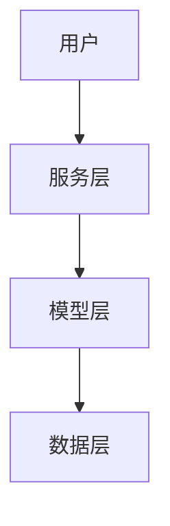
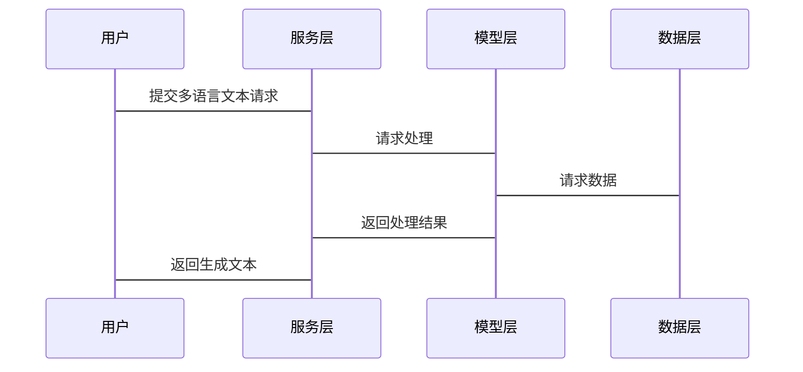

                 


# 实现AI Agent的多语言支持

---

## 关键词：AI Agent，多语言支持，自然语言处理，跨语言迁移学习，机器学习

---

## 摘要：  
本文系统地探讨了实现AI Agent的多语言支持的关键技术与方法。从AI Agent的基本概念出发，分析了多语言支持在AI Agent中的重要性，并深入探讨了多语言自然语言处理的核心技术，如多语言NLP模型、跨语言迁移学习等。本文还详细讲解了多语言支持的算法原理，并通过系统架构设计和项目实战，展示了如何将这些技术应用于实际场景。最后，本文总结了实现AI Agent多语言支持的最佳实践，并对未来的发展方向进行了展望。

---

# 第一部分: AI Agent的多语言支持基础

---

## 第1章: AI Agent与多语言支持概述

### 1.1 AI Agent的基本概念

#### 1.1.1 AI Agent的定义与特点
AI Agent（人工智能代理）是一种能够感知环境、自主决策并执行任务的智能系统。AI Agent可以是软件程序、机器人或其他智能设备，其核心目标是通过与环境交互，完成特定任务或提供服务。

AI Agent的特点包括：
1. **自主性**：能够自主决策，无需外部干预。
2. **反应性**：能够实时感知环境并做出反应。
3. **目标导向**：具有明确的目标，所有行为都围绕目标展开。
4. **学习能力**：能够通过数据和经验不断优化自身性能。

#### 1.1.2 多语言支持在AI Agent中的重要性
随着全球化的深入，AI Agent的应用场景越来越广泛，支持多语言能力成为其必备功能。多语言支持能够使AI Agent更好地服务于全球用户，提高用户体验和市场竞争力。此外，多语言支持还能帮助AI Agent在跨文化交流和国际业务中发挥更大的作用。

#### 1.1.3 当前AI Agent的应用场景
AI Agent的应用场景涵盖了多个领域，如智能助手、客服机器人、智能家居、自动驾驶等。在这些场景中，多语言支持能够让AI Agent更好地理解和处理用户的请求，提升服务效率和质量。

---

### 1.2 多语言支持的核心问题

#### 1.2.1 多语言支持的定义
多语言支持是指AI Agent能够理解和处理多种语言文本的能力。这种能力不仅包括语言的识别和生成，还包括对不同语言文化背景的理解。

#### 1.2.2 多语言支持的关键技术
多语言支持的关键技术包括：
1. **多语言自然语言处理（NLP）**：能够处理多种语言的文本数据。
2. **跨语言迁移学习**：通过利用一种语言的数据来提升其他语言的性能。
3. **多语言文本生成**：能够生成多种语言的文本内容。

#### 1.2.3 多语言支持的边界与外延
多语言支持的边界在于其处理语言的种类和深度。外延则包括与多语言支持相关的技术，如语言识别、语言翻译和语言生成等。

---

### 1.3 AI Agent与多语言支持的结合

#### 1.3.1 AI Agent的多语言能力需求
AI Agent的多语言能力需求主要体现在以下方面：
1. **多语言理解**：能够理解和解析多种语言的用户请求。
2. **多语言生成**：能够生成多种语言的回复或输出。
3. **多语言交互**：能够与使用不同语言的用户进行有效交互。

#### 1.3.2 多语言支持对AI Agent性能的影响
多语言支持能够显著提升AI Agent的性能，包括：
1. **提高用户体验**：使用户能够使用母语与AI Agent交互。
2. **增强功能多样性**：支持更多语言意味着能够覆盖更广泛的用户群体。
3. **提升任务处理能力**：在多语言环境下，AI Agent能够更准确地理解用户需求并提供相应的服务。

#### 1.3.3 多语言支持在AI Agent中的实现方式
多语言支持的实现方式包括：
1. **基于单语言模型的多语言扩展**：通过调整单语言模型参数，使其能够处理多种语言。
2. **多语言模型的联合训练**：在同一模型中同时训练多种语言的数据，使模型能够理解和生成多种语言。
3. **跨语言迁移学习**：利用一种语言的模型参数，通过迁移学习的方法，提升其他语言的性能。

---

### 1.4 本章小结

本章从AI Agent的基本概念出发，分析了多语言支持在AI Agent中的重要性，并探讨了多语言支持的核心问题。同时，本章还详细介绍了AI Agent与多语言支持的结合方式，为后续章节奠定了基础。

---

## 第2章: 多语言自然语言处理技术

### 2.1 多语言NLP模型

#### 2.1.1 多语言NLP模型的原理
多语言NLP模型是一种能够在多种语言上同时进行自然语言处理的模型。其核心原理是通过共享不同语言的特征，使模型能够在多种语言上实现高效的文本处理。

#### 2.1.2 主流多语言NLP模型介绍
目前，主流的多语言NLP模型包括：
1. **BERT（Bidirectional Encoder Representations from Transformers）**：一种基于Transformer的预训练模型，支持多种语言。
2. **XLM（Cross-Lingual Model）**：Facebook推出的多语言NLP模型，支持100多种语言。
3. **mBert**：基于BERT的多语言版本，支持多种语言的文本分类和命名实体识别任务。

#### 2.1.3 多语言NLP模型的优缺点
多语言NLP模型的优点包括：
- 支持多种语言，能够同时处理多种语言的任务。
- 参数共享，模型规模相对较小。

多语言NLP模型的缺点包括：
- 在特定语言上的性能可能不如单语言模型。
- 对某些语言的支持可能不够深入，特别是在资源匮乏的语言上。

---

### 2.2 跨语言迁移学习

#### 2.2.1 跨语言迁移学习的定义
跨语言迁移学习是指通过利用一种或多种语言的模型参数或特征，来提升另一种语言的模型性能。其核心思想是通过共享不同语言的特征，减少目标语言的训练数据需求。

#### 2.2.2 跨语言迁移学习的实现方法
跨语言迁移学习的实现方法包括：
1. **参数共享**：在预训练过程中，共享不同语言的模型参数，使模型能够跨语言通用。
2. **特征提取**：从一种语言的模型中提取特征，并将其应用于其他语言的任务。
3. **联合训练**：在多语言数据上联合训练模型，使模型能够同时处理多种语言。

#### 2.2.3 跨语言迁移学习在多语言支持中的应用
跨语言迁移学习在多语言支持中的应用包括：
- 在资源匮乏的语言上，通过迁移学习提升模型性能。
- 在多语言任务中，通过跨语言迁移学习减少对单一语言数据的依赖。

---

### 2.3 多语言文本生成技术

#### 2.3.1 多语言文本生成的原理
多语言文本生成是指模型能够生成多种语言的文本内容。其原理是通过多语言NLP模型对输入文本进行编码，生成对应的目标语言文本。

#### 2.3.2 多语言文本生成的实现方法
多语言文本生成的实现方法包括：
1. **基于单语言模型的多语言生成**：通过调整单语言模型参数，使其能够生成多种语言的文本。
2. **基于多语言模型的生成**：使用多语言NLP模型直接生成多种语言的文本。
3. **跨语言生成**：通过跨语言迁移学习，利用一种语言的生成能力，提升其他语言的生成能力。

#### 2.3.3 多语言文本生成的实际应用
多语言文本生成的实际应用包括：
- 多语言机器翻译。
- 多语言对话生成。
- 多语言内容生成。

---

### 2.4 本章小结

本章详细介绍了多语言NLP模型和跨语言迁移学习技术，并探讨了多语言文本生成技术的应用。这些技术为AI Agent的多语言支持提供了坚实的技术基础。

---

## 第3章: 多语言NLP算法详解

### 3.1 多语言序列到序列模型

#### 3.1.1 多语言序列到序列模型的原理
多语言序列到序列模型是一种基于Transformer的模型，能够同时处理多种语言的文本序列。其核心原理是通过共享不同语言的模型参数，实现多语言文本的编码和解码。

#### 3.1.2 多语言序列到序列模型的实现
多语言序列到序列模型的实现包括以下几个步骤：
1. **数据准备**：收集和整理多种语言的文本数据。
2. **模型训练**：在多语言数据上训练模型，共享模型参数。
3. **模型推理**：利用训练好的模型进行多语言文本生成。

#### 3.1.3 多语言序列到序列模型的优缺点
多语言序列到序列模型的优点包括：
- 支持多种语言，能够同时处理多种语言的任务。
- 参数共享，模型规模相对较小。

多语言序列到序列模型的缺点包括：
- 在特定语言上的性能可能不如单语言模型。
- 对某些语言的支持可能不够深入，特别是在资源匮乏的语言上。

---

### 3.2 预训练模型的微调

#### 3.2.1 预训练模型的定义
预训练模型是指在大规模通用数据上预先训练好的模型，通常用于多种NLP任务。预训练模型的核心思想是通过大规模数据的预训练，使模型能够掌握语言的基本规律和特征。

#### 3.2.2 预训练模型的微调
预训练模型的微调是指在预训练的基础上，对模型进行进一步的训练，使其适应特定任务或数据。微调的过程通常包括以下步骤：
1. **数据准备**：收集和整理特定任务的数据。
2. **模型微调**：在特定任务数据上训练模型，调整模型参数。
3. **模型评估**：对微调后的模型进行评估，验证其性能。

#### 3.2.3 预训练模型在多语言支持中的应用
预训练模型在多语言支持中的应用包括：
- 在多语言文本分类任务中，通过微调预训练模型，提升分类性能。
- 在多语言机器翻译任务中，通过微调预训练模型，提升翻译质量。

---

### 3.3 多语言词嵌入

#### 3.3.1 词嵌入的定义
词嵌入是一种将词表示为低维向量的技术，能够捕捉词义和语义信息。词嵌入的核心思想是通过将词映射到低维空间，使相似的词具有相似的向量表示。

#### 3.3.2 多语言词嵌入的实现
多语言词嵌入的实现方法包括：
1. **跨语言词嵌入**：通过跨语言迁移学习，生成多种语言的词嵌入。
2. **多语言词嵌入模型**：使用专门设计的多语言词嵌入模型，生成多种语言的词嵌入。

#### 3.3.3 多语言词嵌入的实际应用
多语言词嵌入的实际应用包括：
- 多语言文本匹配。
- 多语言情感分析。
- 多语言信息检索。

---

### 3.4 跨语言注意力机制

#### 3.4.1 跨语言注意力机制的定义
跨语言注意力机制是指在多语言文本处理中，通过注意力机制捕获不同语言之间的语义关联。其核心思想是通过注意力机制，使模型能够关注不同语言之间的语义信息，提升多语言文本处理的效果。

#### 3.4.2 跨语言注意力机制的实现
跨语言注意力机制的实现方法包括：
1. **跨语言注意力层**：在模型中添加跨语言注意力层，用于捕获不同语言之间的语义关联。
2. **多语言注意力机制**：通过设计多语言注意力机制，使模型能够同时关注多种语言的语义信息。

#### 3.4.3 跨语言注意力机制的实际应用
跨语言注意力机制的实际应用包括：
- 多语言文本摘要。
- 多语言文本生成。
- 多语言对话系统。

---

### 3.5 本章小结

本章详细讲解了多语言NLP算法的核心原理和实现方法，并通过具体的例子展示了这些算法在多语言支持中的应用。这些算法为AI Agent的多语言支持提供了坚实的技术基础。

---

## 第4章: 多语言支持的系统架构设计

### 4.1 系统功能设计

#### 4.1.1 系统功能模块
多语言支持的系统功能模块包括：
1. **语言理解模块**：负责理解和解析用户输入的多语言文本。
2. **语言生成模块**：负责生成目标语言的文本输出。
3. **语言管理模块**：负责管理多种语言的模型和数据。

#### 4.1.2 系统功能流程
系统功能流程包括：
1. **用户输入**：用户输入多语言文本请求。
2. **语言理解**：系统通过语言理解模块，解析用户输入的文本。
3. **任务处理**：系统根据解析结果，处理相关任务。
4. **语言生成**：系统通过语言生成模块，生成目标语言的文本输出。
5. **结果输出**：系统将生成的结果返回给用户。

#### 4.1.3 功能模块之间的关系
功能模块之间的关系可以通过以下类图表示：



---

### 4.2 系统架构设计

#### 4.2.1 系统架构概述
多语言支持的系统架构设计包括以下几个部分：
1. **数据层**：负责存储和管理多语言数据。
2. **模型层**：负责实现多语言NLP模型和算法。
3. **服务层**：负责处理用户的请求和响应。
4. **用户层**：负责与用户的交互和展示。

#### 4.2.2 系统架构图
系统架构图可以通过以下Mermaid图表示：



---

### 4.3 系统接口设计

#### 4.3.1 系统接口描述
系统接口描述包括：
1. **输入接口**：用户输入多语言文本请求。
2. **输出接口**：系统生成目标语言的文本输出。
3. **管理接口**：系统管理多种语言的模型和数据。

#### 4.3.2 接口交互流程
接口交互流程包括：
1. **用户输入**：用户通过输入接口提交多语言文本请求。
2. **系统处理**：系统通过服务层处理用户的请求，并调用模型层进行文本处理。
3. **系统输出**：系统通过输出接口将生成的文本返回给用户。

---

### 4.4 系统交互流程

#### 4.4.1 系统交互流程图
系统交互流程图可以通过以下Mermaid图表示：



---

### 4.5 本章小结

本章详细介绍了多语言支持的系统架构设计，包括功能模块设计、系统架构设计和接口设计。这些设计为实现AI Agent的多语言支持提供了系统的指导。

---

## 第5章: 项目实战——实现一个多语言对话系统

### 5.1 环境安装

#### 5.1.1 安装Python
安装Python的具体步骤如下：
1. 访问Python官方网站（https://www.python.org/）。
2. 下载并安装适合的操作系统版本。
3. 配置Python环境变量。

#### 5.1.2 安装必要的库
安装必要的库的具体步骤如下：
1. 打开终端或命令提示符。
2. 执行命令：`pip install transformers`。
3. 执行命令：`pip install numpy`。
4. 执行命令：`pip install torch`。

---

### 5.2 系统核心实现

#### 5.2.1 数据预处理
数据预处理的具体步骤如下：
1. 收集多语言对话数据。
2. 数据清洗：去除无效数据，处理噪声。
3. 数据分词：对文本进行分词处理。

#### 5.2.2 模型训练
模型训练的具体步骤如下：
1. 选择合适的多语言NLP模型。
2. 数据预处理：将数据转换为模型输入格式。
3. 模型训练：在预处理后的数据上训练模型。
4. 模型保存：保存训练好的模型参数。

#### 5.2.3 模型推理
模型推理的具体步骤如下：
1. 加载训练好的模型。
2. 接收用户输入的多语言文本请求。
3. 模型推理：生成目标语言的文本输出。
4. 返回生成的文本结果。

---

### 5.3 代码实现

#### 5.3.1 数据预处理代码
以下是数据预处理的代码示例：

```python
import pandas as pd
from transformers import AutoTokenizer

# 加载数据
data = pd.read_csv('multilingual_dialogue_data.csv')

# 分词处理
tokenizer = AutoTokenizer.from_pretrained('facebook/mmbert')

def tokenize_dialogue(text):
    return tokenizer.encode_plus(text, return_tensors='np', truncation=True, padding=True)

# 处理数据
processed_data = []
for text in data['text']:
    processed_data.append(tokenize_dialogue(text))
```

#### 5.3.2 模型训练代码
以下是模型训练的代码示例：

```python
import torch
from torch import nn
from torch.utils.data import DataLoader
from transformers import AutoModelForMaskedLM

# 加载预训练模型
model = AutoModelForMaskedLM.from_pretrained('facebook/mmbert')

# 定义训练器
optimizer = torch.optim.Adam(model.parameters(), lr=1e-5)
criterion = nn.CrossEntropyLoss()

# 定义训练函数
def train_step(model, optimizer, criterion, batch):
    inputs, labels = batch
    outputs = model(inputs)
    loss = criterion(outputs.logits, labels)
    loss.backward()
    optimizer.step()
    return loss.item()

# 开始训练
model.train()
for epoch in range(num_epochs):
    for batch in dataloader:
        loss = train_step(model, optimizer, criterion, batch)
        print(f'Epoch {epoch}, Loss: {loss:.4f}')
```

---

### 5.4 代码解读与分析

#### 5.4.1 数据预处理代码解读
1. **数据加载**：使用Pandas加载CSV格式的数据。
2. **分词处理**：使用预训练的分词器对文本进行分词处理。
3. **数据处理**：将文本转换为模型输入格式，并存储在processed_data中。

#### 5.4.2 模型训练代码解读
1. **预训练模型加载**：加载预训练的多语言NLP模型。
2. **训练器定义**：定义优化器和损失函数。
3. **训练函数**：定义训练步骤，包括前向传播、损失计算、反向传播和优化器更新。
4. **训练过程**：在训练数据上迭代训练模型，并输出训练损失。

---

### 5.5 实际案例分析

#### 5.5.1 案例背景
假设我们正在开发一个多语言对话系统，支持中英文两种语言。用户可以使用中文或英文与系统交互。

#### 5.5.2 案例实现
以下是多语言对话系统的实现代码示例：

```python
def generate_response(model, tokenizer, input_text, target_lang='en'):
    # 分词处理
    inputs = tokenizer.encode_plus(input_text, return_tensors='np', truncation=True, padding=True)
    # 模型推理
    outputs = model.generate(inputs['input_ids'])
    # 解码输出
    response = tokenizer.decode(outputs[0], skip_special_tokens=True)
    return response

# 示例使用
input_text = "你好，你今天过得怎么样？"
response = generate_response(model, tokenizer, input_text, target_lang='zh')
print(response)
```

---

### 5.6 项目小结

本章通过实际案例，详细介绍了如何实现一个多语言对话系统。从环境安装到代码实现，再到案例分析，为读者提供了完整的实现步骤和代码示例。

---

## 第6章: 多语言支持的扩展与展望

### 6.1 当前的技术挑战

#### 6.1.1 多语言模型的轻量化
多语言模型的轻量化是指在保证性能的前提下，减少模型的参数数量和计算复杂度。这可以通过模型剪枝、知识蒸馏等技术实现。

#### 6.1.2 多语言数据的均衡与多样性
多语言数据的均衡与多样性是指在多语言模型训练中，如何平衡不同语言的数据分布，避免某些语言的数据不足或过于集中。

#### 6.1.3 多语言模型的可解释性
多语言模型的可解释性是指模型在生成多语言文本时，能够解释生成结果的逻辑和依据。这可以通过可视化技术、注意力分析等方法实现。

---

### 6.2 未来的发展方向

#### 6.2.1 多语言与多模态的结合
多语言与多模态的结合是指将多语言支持与图像、语音等其他模态数据结合起来，实现跨模态的多语言处理。

#### 6.2.2 多语言模型的实时性优化
多语言模型的实时性优化是指在保证性能的前提下，提升模型的推理速度，使其能够实时处理多语言文本。

#### 6.2.3 多语言模型的个性化定制
多语言模型的个性化定制是指根据不同的用户需求，定制不同的多语言模型，以满足特定场景的应用需求。

---

### 6.3 本章小结

本章总结了当前多语言支持的技术挑战，并展望了未来的发展方向。这些挑战和方向为实现AI Agent的多语言支持提供了重要的参考和指导。

---

## 结语

实现AI Agent的多语言支持是一项复杂而重要的任务。通过本文的系统讲解，读者可以深入了解多语言支持的核心技术、算法原理和系统架构设计。同时，通过实际案例的分析，读者可以掌握多语言支持的实现方法和最佳实践。未来，随着技术的不断发展，多语言支持将在更多领域发挥重要作用，为AI Agent的发展注入新的活力。

