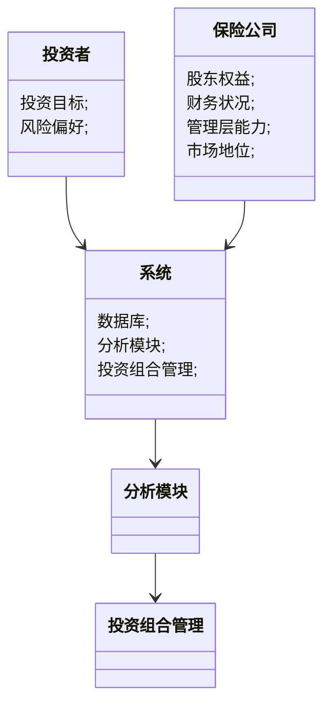
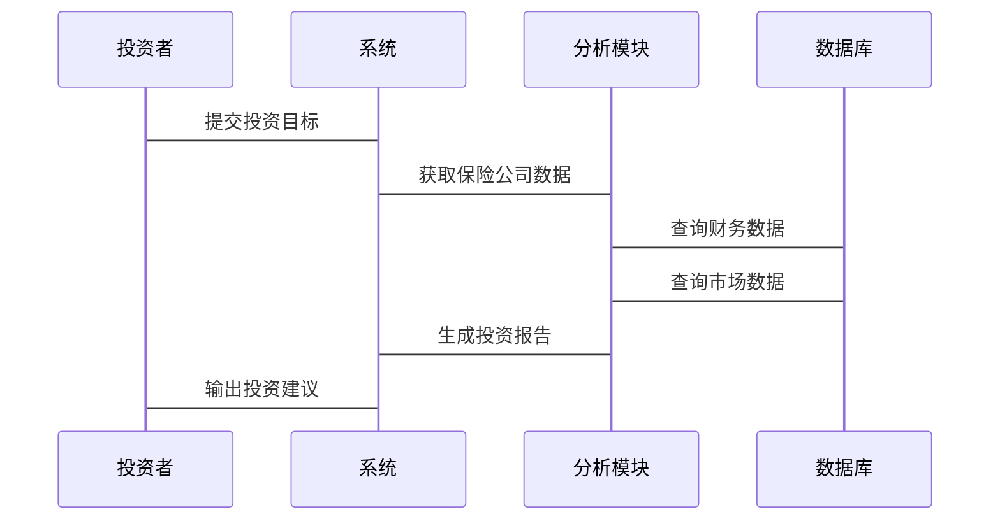

                 


# 巴菲特的保险业投资策略

> 关键词：巴菲特，保险业，投资策略，价值投资，风险管理，财务分析

> 摘要：本文深入分析了巴菲特在保险业的投资策略，从其核心理念到具体实施步骤，结合实际案例和系统架构，为投资者提供清晰的指导。文章详细探讨了保险公司的财务健康评估、竞争优势分析以及风险管理策略，同时结合数学模型和算法，为读者提供全面的技术解读。

---

## 第1章: 巴菲特的投资理念与保险业的结合

### 1.1 巴菲特的投资理念概述

#### 1.1.1 价值投资的核心思想
巴菲特的价值投资理念强调以低于内在价值的价格购买优质资产。他认为市场先生是不可靠的，真正的投资机会来自于对公司内在价值的深入分析。这种理念在保险业中得到了完美的体现，因为保险公司的内在价值可以通过其未来现金流的现值来评估。

#### 1.1.2 保险业在巴菲特投资组合中的地位
保险业在巴菲特的投资组合中占据重要地位，尤其是那些具有强大财务实力和竞争优势的保险公司。巴菲特认为，保险公司是天然的“浮存金”（float）来源，这种资金可以以较低的成本用于长期投资，从而为公司创造额外价值。

#### 1.1.3 巴菲特投资保险业的独特视角
巴菲特关注保险公司的管理层能力、财务健康状况以及市场地位。他倾向于投资那些能够长期稳定增长的公司，并且能够通过保险业务不断积累资金。

---

### 1.2 保险业的基本概念与运作机制

#### 1.2.1 保险业的定义与分类
保险是一种通过分散风险来补偿损失的机制。保险业可以分为寿险和非寿险两大类，其中非寿险包括财产保险、责任保险等。

#### 1.2.2 保险公司的主要业务模式
保险公司通过收取保费来建立责任准备金，用于赔付未来的保险 claim。这种模式使得保险公司需要具备强大的财务实力和风险管理能力。

#### 1.2.3 保险业的财务结构与风险特征
保险公司的财务结构包括保费收入、投资收益和赔付支出。其核心风险包括市场风险、信用风险和操作风险。

---

### 1.3 巴菲特保险投资策略的逻辑框架

#### 1.3.1 长期价值投资的核心要素
巴菲特的保险投资策略基于长期价值投资，关注公司的内在价值和可持续竞争优势。

#### 1.3.2 保险业的内在价值评估方法
通过分析保险公司的未来现金流，评估其内在价值。巴菲特特别关注公司的ROE（净资产收益率）和ROA（资产回报率）。

#### 1.3.3 巴菲特保险投资的成功案例分析
以伯克希尔 Hathaway为例，分析巴菲特如何通过投资保险公司积累资金，并通过长期投资实现财富增长。

---

## 第2章: 巴菲特保险投资策略的核心要素

### 2.1 保险公司的财务健康评估

#### 2.1.1 资产负债表的关键指标分析
- 资产总额
- 负债总额
- 所有者权益

#### 2.1.2 利润表与现金流的深度解读
- 营业收入
- 净利润
- 现金流

#### 2.1.3 保险公司的偿付能力评估
通过分析偿付能力充足率和资本充足率，评估保险公司的财务健康状况。

---

### 2.2 保险公司的管理层与治理结构

#### 2.2.1 管理层的能力与诚信评估
管理层的能力和诚信是保险公司长期成功的关键。巴菲特特别关注管理层的历史业绩和决策能力。

#### 2.2.2 公司治理结构的优劣分析
良好的公司治理结构能够确保管理层的利益与股东的利益保持一致。

#### 2.2.3 管理层决策对保险投资的影响
管理层的决策直接影响保险公司的财务状况和市场地位。

---

### 2.3 保险公司的竞争优势分析

#### 2.3.1 市场地位与品牌价值
强大的市场地位和品牌价值能够帮助保险公司获取更多的保费收入。

#### 2.3.2 核心业务的竞争力评估
通过分析保险公司的核心业务，评估其在市场中的竞争优势。

#### 2.3.3 保险产品的创新与差异化
创新的保险产品能够帮助公司在竞争激烈的市场中脱颖而出。

---

## 第3章: 巴菲特保险投资策略的实施步骤

### 3.1 确定投资目标与风险偏好

#### 3.1.1 投资目标的设定
明确投资目标，包括预期收益和风险承受能力。

#### 3.1.2 风险偏好的评估
根据自身的风险偏好，选择适合的保险投资标的。

#### 3.1.3 投资期限的规划
长期投资更适合巴菲特的保险投资策略。

---

### 3.2 保险公司的筛选标准

#### 3.2.1 财务健康状况评估
通过财务指标分析，筛选出财务健康、盈利能力强的保险公司。

#### 3.2.2 管理层能力评估
评估管理层的能力和诚信，选择具有优秀管理团队的保险公司。

#### 3.2.3 市场竞争优势分析
选择那些在市场上具有竞争优势的保险公司。

---

### 3.3 投资决策的执行与监控

#### 3.3.1 投资组合的构建
根据筛选结果，构建保险投资组合，分散风险。

#### 3.3.2 定期评估与调整
定期评估投资组合的表现，根据市场变化进行调整。

#### 3.3.3 风险管理与退出策略
制定风险管理计划和退出策略，确保投资安全。

---

## 第4章: 巴菲特保险投资策略的数学模型与算法

### 4.1 保险公司的内在价值评估模型

#### 4.1.1 股东权益价值的计算公式
$$ \text{股东权益价值} = \sum_{t=1}^{n} \frac{\text{自由现金流}_t}{(1 + r)^t} $$
其中，\( r \) 是折现率，\( n \) 是估计的永续年份。

#### 4.1.2 资产负债表的调整与优化
通过调整资产负债表中的各项指标，优化保险公司的财务结构。

#### 4.1.3 现金流折现模型的应用
使用现金流折现模型（DCF）评估保险公司的内在价值。

---

### 4.2 保险公司的风险评估算法

#### 4.2.1 风险因子的提取与分析
通过因子分析法，提取影响保险公司风险的关键因素。

#### 4.2.2 风险评估的数学公式
$$ \text{风险评分} = \sum_{i=1}^{m} w_i \times f_i $$
其中，\( w_i \) 是因子 \( f_i \) 的权重。

#### 4.2.3 算法的实现与优化
通过优化算法参数，提高风险评估的准确性。

---

### 4.3 投资组合优化的数学模型

#### 4.3.1 Markowitz 有效前沿模型
使用Markowitz有效前沿模型，优化保险投资组合的风险收益比。

#### 4.3.2 风险调整后的收益模型
$$ \text{夏普比率} = \frac{\text{收益} - \text{无风险利率}}{\text{收益的标准差}} $$

---

## 第5章: 巴菲特保险投资策略的系统架构

### 5.1 问题场景介绍
通过系统化的架构设计，帮助投资者更好地实施巴菲特的保险投资策略。

---

### 5.2 项目介绍

#### 5.2.1 项目目标
构建一个基于巴菲特保险投资策略的投资管理系统。

#### 5.2.2 项目范围
涵盖保险公司的筛选、评估、投资组合管理等功能。

---

### 5.3 系统功能设计

#### 5.3.1 领域模型（Mermaid 类图）


---

### 5.4 系统架构设计（Mermaid 架构图）


---

### 5.5 系统接口设计

#### 5.5.1 数据输入接口
接受保险公司的财务数据和市场数据。

#### 5.5.2 数据处理接口
对数据进行清洗、转换和分析。

#### 5.5.3 结果输出接口
输出投资建议和投资组合报告。

---

### 5.6 系统交互设计（Mermaid 序列图）



---

## 第6章: 项目实战

### 6.1 环境安装

#### 6.1.1 安装 Python
```bash
python --version
pip install --upgrade pip
```

#### 6.1.2 安装必要的库
```bash
pip install numpy pandas matplotlib
```

---

### 6.2 系统核心实现源代码

#### 6.2.1 数据获取与处理
```python
import pandas as pd
import numpy as np

# 获取保险公司数据
data = pd.read_csv('insurance_data.csv')

# 数据清洗
data.dropna(inplace=True)
data = data[~data['profit'].isin([0])]
```

#### 6.2.2 投资组合优化
```python
from sklearn import linear_model

# 训练线性回归模型
model = linear_model.LinearRegression()
model.fit(X, y)

# 预测收益
predictions = model.predict(X_new)
```

---

### 6.3 代码应用解读与分析

#### 6.3.1 数据处理部分
通过数据清洗和转换，确保数据的准确性和可用性。

#### 6.3.2 投资组合优化部分
使用线性回归模型，预测保险公司的收益，优化投资组合。

---

### 6.4 实际案例分析

#### 6.4.1 投资组合构建
以GEICO为例，分析其财务状况和市场地位。

#### 6.4.2 投资组合管理
根据市场变化，定期调整投资组合。

---

### 6.5 项目小结

通过实际案例分析，验证巴菲特保险投资策略的有效性，并总结经验教训。

---

## 第7章: 小结与展望

### 7.1 小结

巴菲特的保险投资策略基于长期价值投资，关注保险公司的财务健康、管理层能力和市场地位。通过系统化的分析和优化，投资者可以更好地实施这一策略。

### 7.2 注意事项

投资者在实际操作中，应结合市场变化和公司具体情况，灵活调整投资策略。

### 7.3 拓展阅读

建议阅读巴菲特的《投资之道》和《证券分析》等书籍，深入理解价值投资的理念和方法。

--- 

## 结语

通过本文的详细分析，读者可以全面理解巴菲特的保险投资策略，并将其应用于实际投资中。希望本文能够为投资者提供有价值的参考和指导。

