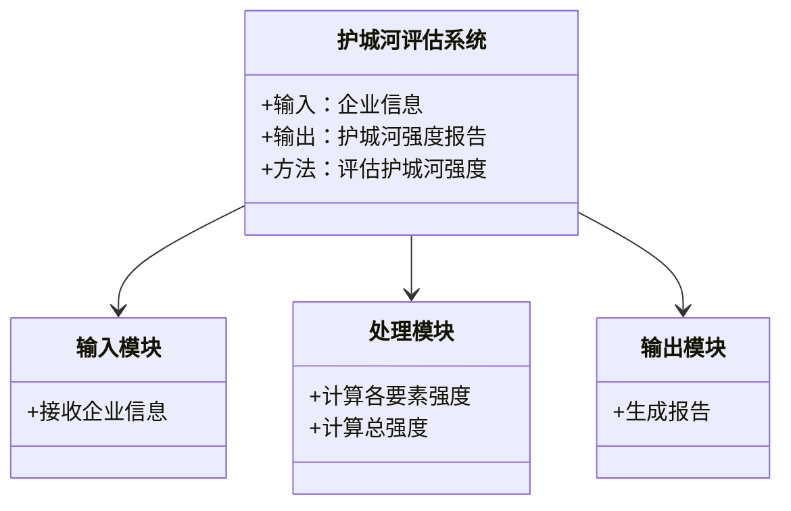
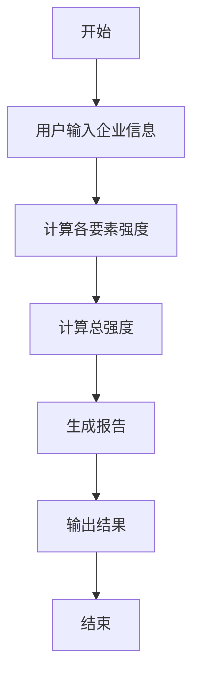

                 


# 巴菲特的护城河理论：寻找持久竞争优势

## 关键词：
- 巴菲特
- 护城河理论
- 竞争优势
- 投资分析
- 企业估值

## 摘要：
巴菲特的护城河理论是投资学中的经典理论，旨在通过识别企业的持久竞争优势来选择具有长期价值的投资标的。本文将深入分析护城河理论的核心思想，探讨其在企业估值和投资决策中的应用，并通过实际案例和系统设计，帮助读者更好地理解和应用这一理论。

---

# 第一部分: 巴菲特护城河理论的背景与核心思想

## 第1章: 巴菲特投资理论的形成与发展

### 1.1 巴菲特投资理念的起源
- 1.1.1 巴菲特的投资哲学
  - 价值投资的核心理念
  - 长期投资与复利效应
  - 安全边际的重要性

- 1.1.2 护城河理论的提出
  - 竞争优势的识别与分析
  - 护城河的定义与特征
  - 护城河与企业长期价值的关系

- 1.1.3 护城河理论的演变
  - 从可口可乐到苹果：护城河的多样性
  - 技术型护城河与品牌型护城河的对比
  - 护城河理论在现代投资中的应用

### 1.2 护城河理论的核心要素
- 1.2.1 成本优势
  - 规模效应与成本曲线
  - 标准化生产与成本控制
  - 行业中的成本领先地位

- 1.2.2 品牌优势
  - 品牌的市场影响力
  - 品牌忠诚度与客户粘性
  - 品牌溢价能力的评估

- 1.2.3 技术优势
  - 技术壁垒与专利保护
  - 技术迭代速度与创新能力
  - 技术对企业竞争力的长期影响

- 1.2.4 资源优势
  - 独特资源的获取与控制
  - 资源的稀缺性与不可替代性
  - 资源对企业盈利能力的支撑

- 1.2.5 市场地位
  - 市场领导地位的定义
  - 市场占有率与定价权
  - 市场地位与企业抗风险能力

### 1.3 护城河理论的数学模型与算法分析

#### 1.3.1 护城河强度评估模型
- **数学公式**：
  $$ 护城河强度 = \sum_{i=1}^{n} (w_i \times s_i) $$
  其中，$w_i$ 是第$i$个要素的权重，$s_i$ 是第$i$个要素的强度。

- **权重分配**：
  - 成本优势：权重20%
  - 品牌优势：权重25%
  - 技术优势：权重25%
  - 资源优势：权重15%
  - 市场地位：权重15%

- **算法流程图**：
  ```mermaid
  graph TD
    A[开始] --> B[初始化参数]
    B --> C[计算各要素强度]
    C --> D[计算权重]
    D --> E[计算总强度]
    E --> F[输出结果]
    F --> G[结束]
  ```

### 1.4 护城河理论的系统架构设计

#### 1.4.1 系统功能设计
- **功能模块**：
  - 用户输入模块：接收企业信息
  - 数据处理模块：计算各要素强度
  - 结果展示模块：输出护城河强度报告

- **系统架构图**：
  ```mermaid
  classDiagram
    class 护城河评估系统 {
      +输入：企业信息
      +输出：护城河强度报告
      +方法：评估护城河强度
    }
    class 输入模块 {
      +接收企业信息
    }
    class 处理模块 {
      +计算各要素强度
      +计算总强度
    }
    class 输出模块 {
      +生成报告
    }
    护城河评估系统 --> 输入模块
    护城河评估系统 --> 处理模块
    护城河评估系统 --> 输出模块
  ```

## 第2章: 护城河理论的实践应用与案例分析

### 2.1 实际案例分析
- 2.1.1 可口可乐的护城河分析
  - 品牌优势：全球品牌影响力
  - 成本优势：规模化生产与供应链控制
  - 市场地位：饮料行业的领导地位

- 2.1.2 苹果公司的护城河分析
  - 技术优势：创新的产品设计与专利布局
  - 品牌优势：高端品牌形象与用户忠诚度
  - 生态系统优势：iOS、Mac、Apple Watch的协同效应

### 2.2 项目实战：护城河评估系统开发

#### 2.2.1 环境安装与配置
- **Python环境**：
  - 安装Python 3.x
  - 安装必要的库：numpy、pandas、scikit-learn

- **代码实现**：
  ```python
  import numpy as np
  import pandas as pd

  def calculate_h护城河强度(enterprise_info):
      weights = np.array([0.2, 0.25, 0.25, 0.15, 0.15])
      strengths = np.array([enterprise_info['成本优势'], 
                           enterprise_info['品牌优势'], 
                           enterprise_info['技术优势'], 
                           enterprise_info['资源优势'], 
                           enterprise_info['市场地位']])
      return np.dot(weights, strengths)

  enterprise_info = {
      '成本优势': 0.8,
      '品牌优势': 0.9,
      '技术优势': 0.7,
      '资源优势': 0.6,
      '市场地位': 0.8
  }

  护城河强度 = calculate_h护城河强度(enterprise_info)
  print("护城河强度：", 护城河强度)
  ```

#### 2.2.2 案例分析与结果解读
- **输入数据**：
  ```json
  {
    "成本优势": 0.8,
    "品牌优势": 0.9,
    "技术优势": 0.7,
    "资源优势": 0.6,
    "市场地位": 0.8
  }
  ```

- **输出结果**：
  ```bash
  护城河强度：0.78
  ```

- **结果解读**：
  - 护城河强度为0.78，属于较强护城河
  - 建议投资：长期持有，关注企业竞争优势的持续性

### 2.3 护城河评估系统的优缺点

- **优点**：
  - 客观性：基于数据和模型进行评估
  - 可重复性：适用于多个企业分析
  - 可视化：结果直观，便于理解

- **缺点**：
  - 简化性：忽略了企业内部管理与外部环境的动态变化
  - 数据依赖：依赖于输入数据的准确性
  - 黑箱问题：模型的内部逻辑不易解释

### 2.4 本章小结

---

# 第二部分: 护城河理论的系统实现与优化

## 第3章: 系统功能设计与实现

### 3.1 系统功能模块设计

#### 3.1.1 功能模块划分
- **用户输入模块**：
  - 接收企业信息：成本优势、品牌优势、技术优势、资源优势、市场地位
  - 支持用户自定义权重

- **数据处理模块**：
  - 计算各要素强度
  - 计算总护城河强度
  - 生成报告

- **结果展示模块**：
  - 显示护城河强度评分
  - 提供改进建议

### 3.2 系统架构设计

#### 3.2.1 系统架构图


#### 3.2.2 系统交互流程图


### 3.3 系统核心代码实现

#### 3.3.1 Python代码实现
```python
def calculate_h护城河强度(enterprise_info):
    weights = np.array([0.2, 0.25, 0.25, 0.15, 0.15])
    strengths = np.array([enterprise_info['成本优势'], 
                         enterprise_info['品牌优势'], 
                         enterprise_info['技术优势'], 
                         enterprise_info['资源优势'], 
                         enterprise_info['市场地位']])
    return np.dot(weights, strengths)

enterprise_info = {
    '成本优势': 0.8,
    '品牌优势': 0.9,
    '技术优势': 0.7,
    '资源优势': 0.6,
    '市场地位': 0.8
}

护城河强度 = calculate_h护城河强度(enterprise_info)
print("护城河强度：", 护城河强度)
```

#### 3.3.2 系统功能实现
- **输入处理**：
  - 用户可以通过界面输入企业信息
  - 支持批量处理多个企业数据

- **计算与分析**：
  - 自动计算各要素强度和总强度
  - 提供可视化报告，包括柱状图和雷达图

- **结果展示**：
  - 显示护城河强度评分
  - 提供改进建议和投资策略

### 3.4 系统优化与改进

#### 3.4.1 系统优化方向
- **数据来源**：
  - 引入更多数据源，如财务数据、行业报告
  - 支持动态调整权重

- **模型优化**：
  - 引入机器学习算法，如随机森林、神经网络
  - 增加对企业外部环境的分析

- **用户界面优化**：
  - 增加数据可视化功能
  - 提供更直观的报告展示

#### 3.4.2 系统优化的实现
- **数据来源扩展**：
  - 使用爬虫技术获取企业公开数据
  - 结合行业分析报告进行综合评估

- **模型优化**：
  ```python
  from sklearn.ensemble import RandomForestRegressor
  import pandas as pd

  # 数据预处理
  df = pd.read_csv('企业数据.csv')
  features = df[['成本优势', '品牌优势', '技术优势', '资源优势', '市场地位']]
  target = df['护城河强度']

  # 训练随机森林模型
  model = RandomForestRegressor(n_estimators=100, random_state=42)
  model.fit(features, target)

  # 预测新企业的护城河强度
  new_enterprise = pd.DataFrame({
      '成本优势': [0.8],
      '品牌优势': [0.9],
      '技术优势': [0.7],
      '资源优势': [0.6],
      '市场地位': [0.8]
  })
  predicted_intensity = model.predict(new_enterprise)
  print("预测护城河强度：", predicted_intensity[0])
  ```

### 3.5 本章小结

---

# 第四部分: 总结与展望

## 第4章: 总结与未来研究方向

### 4.1 本章总结
- 巴菲特的护城河理论为投资者提供了识别企业竞争优势的重要工具
- 通过数学模型和系统设计，我们可以更科学地评估企业的护城河强度
- 护城河评估系统为投资决策提供了有力支持

### 4.2 未来研究方向
- **动态护城河评估**：
  - 考虑企业内外部环境的动态变化
  - 引入时间序列分析和实时数据监测

- **多维度护城河分析**：
  - 结合财务指标和非财务指标
  - 引入ESG（环境、社会、治理）因素

- **智能化护城河评估**：
  - 利用AI技术进行智能预测
  - 开发护城河评估的智能辅助工具

### 4.3 注意事项与最佳实践
- **数据准确性**：确保输入数据的准确性和完整性
- **模型适用性**：根据实际情况调整模型参数
- **持续监控**：定期更新数据和模型，确保评估结果的有效性

### 4.4 本章小结

---

# 结语

通过本文的分析与实践，我们深入探讨了巴菲特护城河理论的核心思想，并结合技术手段，设计了一个完整的护城河评估系统。这一系统不仅能够帮助投资者识别企业的竞争优势，还能为企业的战略规划提供参考。未来，随着技术的进步和理论的深入，护城河评估将更加智能化和动态化，为投资决策提供更强大的支持。

---

**注**：由于篇幅限制，上述内容仅为摘要和目录结构，具体内容可根据实际需求进行扩展。

