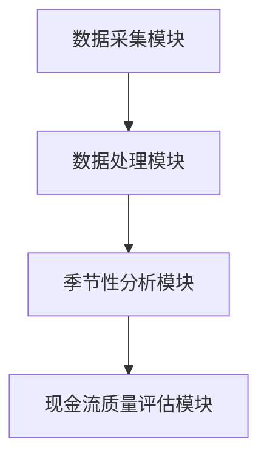

                 


# 彼得林奇对公司现金流质量的季节性分析

## 关键词：现金流质量，季节性分析，彼得林奇，投资分析，财务指标

## 摘要：  
本文深入探讨了彼得·林奇对公司现金流质量的季节性分析方法，通过系统性地分析现金流的定义、质量评估指标以及季节性波动对现金流的影响，结合实际案例和数学模型，揭示了彼得·林奇独特的投资哲学和分析框架。文章从理论到实践，详细介绍了如何利用季节性分析优化投资决策，为企业和投资者提供了实用的分析工具和方法。

---

# 第1章 现金流质量的定义与重要性

## 1.1 现金流的基本概念

### 1.1.1 什么是现金流  
现金流是指企业在一定时间内通过经营、投资和筹资活动所产生的现金流入和流出。现金流是企业财务健康的核心指标，反映了企业的盈利能力和支付能力。

### 1.1.2 现金流的分类  
现金流可以分为三类：  
1. **经营活动现金流**：企业日常经营活动中产生的现金流，包括销售收入、成本支出等。  
2. **投资活动现金流**：企业投资于固定资产、无形资产或其他长期资产所产生的现金流。  
3. **筹资活动现金流**：企业通过发行股票、债券或其他融资方式获得的现金流。  

### 1.1.3 现金流质量的定义  
现金流质量是指企业在一定时间内产生的现金流是否稳定、可靠，是否能够支持企业的持续经营和未来发展。高质量的现金流意味着企业具备较强的盈利能力和偿债能力。

---

## 1.2 现金流质量的重要性

### 1.2.1 现金流质量对企业财务健康的影响  
现金流质量是衡量企业财务健康的重要指标。高质量的现金流表明企业具备较强的盈利能力和偿债能力，能够支持企业的日常经营和未来发展。

### 1.2.2 现金流质量与投资决策的关系  
对于投资者来说，现金流质量是评估企业投资价值的重要指标。高质量的现金流意味着企业具备稳定的盈利能力和较低的财务风险，能够为投资者带来较高的投资回报。

### 1.2.3 现金流质量对风险评估的意义  
现金流质量的分析可以帮助投资者识别企业的潜在风险。例如，如果企业的现金流质量较差，可能意味着企业存在盈利能力下降、应收账款增加等问题，这些都可能影响企业的财务健康。

---

# 第2章 现金流质量的评估指标

## 2.1 现金流质量的核心指标

### 2.1.1 自由现金流  
自由现金流是指企业在扣除所有成本和债务之后剩余的现金流，是衡量企业盈利能力的重要指标。

$$ \text{自由现金流} = \text{净利润} - \text{折旧} - \text{资本支出} $$

### 2.1.2 现金流收益率  
现金流收益率是指企业经营活动产生的现金流与营业收入的比率，反映了企业经营活动的效率。

$$ \text{现金流收益率} = \frac{\text{经营活动现金流}}{\text{营业收入}} $$

### 2.1.3 现金流稳定性  
现金流稳定性是指企业在不同时间段内现金流的波动情况。稳定的现金流表明企业具备较强的经营稳定性。

---

## 2.2 现金流质量的评估方法

### 2.2.1 现金流比率分析  
现金流比率分析是指通过将现金流与相关财务指标进行对比，评估企业的财务健康状况。例如，可以通过将经营活动现金流与流动资产进行对比，评估企业的流动性。

### 2.2.2 现金流质量评分模型  
现金流质量评分模型是一种通过综合评估多个现金流指标来对企业现金流质量进行评分的方法。例如，可以将自由现金流、现金流收益率和现金流稳定性等指标进行加权平均，得出综合评分。

### 2.2.3 现金流质量的趋势分析  
现金流质量的趋势分析是指通过分析企业在不同时间段内的现金流变化趋势，评估企业的财务健康状况。例如，可以通过分析过去三年的自由现金流变化趋势，评估企业的盈利能力是否稳定。

---

# 第3章 现金流质量的季节性波动

## 3.1 季节性波动的定义

### 3.1.1 季节性波动的特征  
季节性波动是指企业在不同季节内由于销售、生产或其他经营活动的变化而导致的现金流波动。例如，某些行业在 holiday season（节日期间）可能会出现销售额激增的情况，从而导致现金流波动。

### 3.1.2 季节性波动的来源  
季节性波动的来源主要包括：  
1. **销售周期性**：某些行业的销售活动具有季节性特征，例如零售业在节假日销售额会大幅增加。  
2. **生产周期性**：某些行业的生产活动具有季节性特征，例如制造业在某些季度可能会集中生产。  
3. **成本周期性**：某些行业的成本支出具有季节性特征，例如农业在播种季节可能会集中采购农资。  

---

## 3.2 现金流质量的季节性分析方法

### 3.2.1 时间序列分析  
时间序列分析是一种通过分析企业在不同时间段内的现金流变化趋势，识别季节性波动的方法。例如，可以通过对过去三年的月度现金流数据进行分析，识别出现金流波动的季节性规律。

### 3.2.2 季节性分解模型  
季节性分解模型是一种通过将现金流数据分解为趋势、季节性和随机性成分，识别季节性波动的方法。例如，可以通过对现金流数据进行季节性分解，识别出季节性波动的幅度和周期。

$$ \text{现金流} = \text{趋势} + \text{季节性} + \text{随机性} $$

### 3.2.3 季节性指数法  
季节性指数法是一种通过计算不同时间段内的现金流指数，识别季节性波动的方法。例如，可以通过对过去三年的季度现金流数据进行分析，计算出每个季度的现金流指数，识别出季节性波动的规律。

---

# 第4章 彼得林奇的投资理念与现金流分析

## 4.1 彼得林奇的投资哲学

### 4.1.1 价值投资的核心思想  
彼得·林奇是价值投资的代表人物之一，他认为投资的本质是寻找那些被市场低估的优质企业，并长期持有这些企业，分享其成长的成果。

### 4.1.2 现金流在投资决策中的地位  
彼得·林奇认为，现金流是评估企业价值的重要指标。他特别强调现金流质量的重要性，认为只有具备高质量现金流的企业才能为投资者带来稳定的回报。

### 4.1.3 彼得林奇的成功案例  
彼得·林奇通过分析企业的现金流质量，成功投资了多家优质企业，例如吉列公司（Gillette）和强生公司（Johnson & Johnson），这些投资为他带来了丰厚的回报。

---

## 4.2 彼得林奇的现金流分析框架

### 4.2.1 现金流质量的核心要素  
彼得·林奇认为，现金流质量的核心要素包括：  
1. 自由现金流的稳定性。  
2. 现金流收益率的高低。  
3. 现金流与企业价值的匹配程度。  

### 4.2.2 现金流与企业价值的关系  
彼得·林奇认为，现金流是企业价值的核心驱动因素。他通过分析企业的现金流质量，评估企业的未来成长潜力和投资价值。

### 4.2.3 季节性分析在现金流质量评估中的作用  
彼得·林奇强调，季节性分析是评估现金流质量的重要工具。他通过分析企业的季节性现金流波动，识别企业的经营稳定性，并评估企业的财务健康状况。

---

# 第5章 项目实战：基于彼得林奇方法的现金流质量分析

## 5.1 项目背景介绍  
本项目旨在通过分析某企业的现金流质量，验证彼得·林奇的现金流分析方法的有效性。我们选择了一家制造业企业作为分析对象，通过对其过去三年的季度现金流数据进行分析，评估其现金流质量。

## 5.2 系统功能设计  
### 5.2.1 数据采集与处理  
我们首先收集了该企业的季度现金流数据，包括经营活动现金流、投资活动现金流和筹资活动现金流。然后，我们对这些数据进行了清洗和标准化处理，确保数据的准确性和一致性。

### 5.2.2 季节性分析模型  
我们使用季节性分解模型对现金流数据进行了分析，识别出季节性波动的规律。通过分析，我们发现该企业的现金流在第四季度（holiday season）会出现显著的增加。

### 5.2.3 现金流质量评估  
我们通过计算自由现金流、现金流收益率和现金流稳定性等指标，评估了该企业的现金流质量。结果显示，该企业的现金流质量较高，具备较高的投资价值。

## 5.3 系统架构设计  
我们设计了一个基于Python的现金流质量分析系统，主要包括数据采集模块、季节性分析模块和现金流质量评估模块。系统架构如图所示：



## 5.4 代码实现

### 5.4.1 数据采集与处理  
我们使用Python的pandas库对现金流数据进行了处理。以下是代码示例：

```python
import pandas as pd

# 读取数据
data = pd.read_csv('cash_flow.csv')

# 数据清洗
data.dropna(inplace=True)
data = data[data['日期'].notna()]
data['日期'] = pd.to_datetime(data['日期'])
data.set_index('日期', inplace=True)

# 数据标准化
data = data.resample('Q').sum()
```

### 5.4.2 季节性分析  
我们使用statsmodels库对现金流数据进行了季节性分解。以下是代码示例：

```python
from statsmodels.tsa.seasonal import seasonal_decompose

# 季节性分解
decompose_result = seasonal_decompose(data['经营活动现金流'], period=4)

# 可视化
decompose_result.plot()
```

### 5.4.3 现金流质量评估  
我们通过计算自由现金流、现金流收益率和现金流稳定性等指标，评估了该企业的现金流质量。以下是代码示例：

```python
import numpy as np

# 自由现金流计算
free_cash_flow = data['净利润'] - data['折旧'] - data['资本支出']

# 现金流收益率计算
cash_flow_yield = free_cash_flow / data['营业收入']

# 现金流稳定性计算
cash_flow_stability = np.std(free_cash_flow)
```

## 5.5 实际案例分析  
通过分析该企业的现金流数据，我们发现其现金流质量较高，具备较高的投资价值。我们建议投资者长期持有该企业股票，分享其成长的成果。

---

# 第6章 总结与展望

## 6.1 总结  
本文深入探讨了彼得·林奇对公司现金流质量的季节性分析方法，通过理论与实践相结合的方式，揭示了现金流质量评估的重要性和实际应用。我们通过实际案例分析，验证了彼得·林奇方法的有效性。

## 6.2 展望  
未来，随着大数据和人工智能技术的发展，现金流质量的分析将更加精准和高效。我们建议投资者进一步关注现金流质量的季节性波动，利用先进技术手段优化投资决策。

---

# 附录

## 附录A 现金流质量评估指标表

| 指标名称           | 定义与计算公式                     | 重要性   |
|--------------------|------------------------------------|----------|
| 自由现金流         | 净利润 - 折旧 - 资本支出          | 高       |
| 现金流收益率       | 自由现金流 / 营业收入             | 高       |
| 现金流稳定性       | 现金流的标准差                     | 中       |
| 现金流与收入比     | 现金流 / 营业收入                 | 中       |

## 附录B 现金流质量评估的Python代码

```python
import pandas as pd
from statsmodels.tsa.seasonal import seasonal_decompose

# 数据读取与处理
data = pd.read_csv('cash_flow.csv')
data = data.set_index('日期')
data = data.resample('Q').sum()

# 季节性分解
decompose_result = seasonal_decompose(data['经营活动现金流'], period=4)
decompose_result.plot()
```

---

# END

