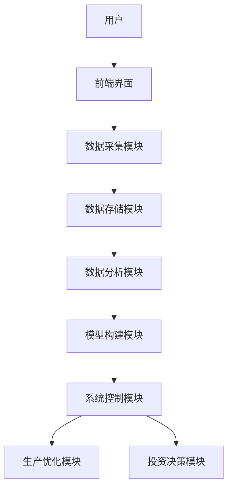
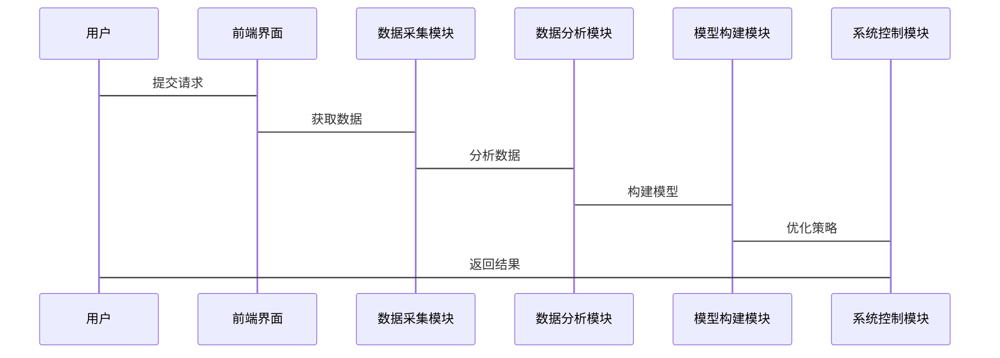

                 


```markdown
# 新兴市场股市估值与智能制造柔性生产线的互动

> 关键词：新兴市场，股市估值，智能制造，柔性生产线，数据驱动，系统架构

> 摘要：本文探讨了新兴市场股市估值与智能制造柔性生产线之间的互动关系，分析了股市估值方法在智能制造中的应用，以及数据驱动在两者互动中的关键作用。通过系统架构设计和实际案例分析，揭示了如何通过数据优化股市估值和智能制造决策，从而实现企业与资本市场的高效互动。

---

# 第一部分: 新兴市场股市与智能制造概述

## 第1章: 新兴市场股市与智能制造概述

### 1.1 新兴市场的定义与特点

#### 1.1.1 新兴市场的经济特征
- 经济增长速度快，但波动性较大。
- 产业结构多元化，制造业占据重要地位。
- 市场规模大，但法律法规和基础设施尚不完善。

#### 1.1.2 新兴市场的股市特点
- 市场流动性较高，但波动性大。
- 市场参与者多元化，包括个人投资者和机构投资者。
- 市场监管框架逐步完善，但仍有不确定性。

#### 1.1.3 制造业在新兴市场中的地位
- 制造业是新兴市场经济增长的主要驱动力。
- 制造业的升级和转型对国家经济竞争力至关重要。
- 柔性生产线的应用提升了制造业的效率和灵活性。

### 1.2 智能制造的定义与技术特征

#### 1.2.1 智能制造的定义
- 智能制造是指通过物联网、大数据、人工智能等技术，实现生产过程的智能化和自动化。
- 相比传统制造，智能制造更注重数据驱动和实时优化。

#### 1.2.2 智能制造的核心技术
- 物联网（IoT）：实现生产设备的互联互通。
- 大数据（Big Data）：收集和分析海量数据，支持决策。
- 人工智能（AI）：用于预测、优化和自动化控制。
- 柔性生产线：能够快速调整生产计划以适应市场需求。

#### 1.2.3 柔性生产线的概念与优势
- 柔性生产线是指可以根据市场需求快速调整生产流程和产品种类的生产线。
- 优势：提高生产效率、降低库存成本、快速响应市场变化。

### 1.3 股市估值与智能制造的互动关系

#### 1.3.1 股市估值的基本概念
- 股市估值是通过对公司财务状况、市场地位等因素的分析，确定其股票的合理价格。
- 常用的估值方法包括市盈率（P/E）、市净率（P/B）等。

#### 1.3.2 制造业对股市估值的影响
- 制造业的盈利能力和增长潜力直接影响股市估值。
- 高效的生产能力和技术创新可以提升企业的市场地位和估值。

#### 1.3.3 智能制造对股市估值的特殊影响
- 智能制造提高了生产效率和产品质量，增强了企业的盈利能力。
- 柔性生产线的引入使得企业能够更快地适应市场变化，提升了企业的抗风险能力，从而影响股市估值。

### 1.4 本章小结
- 本章介绍了新兴市场的经济和股市特点，探讨了智能制造的核心技术和柔性生产线的优势。
- 突出了智能制造与股市估值之间的互动关系，为后续章节的深入分析奠定了基础。

---

# 第2章: 新兴市场股市估值方法

## 2.1 传统股市估值方法

### 2.1.1 市盈率法（P/E）
- **定义**：市盈率是股票价格除以每股收益（EPS）。
- **公式**：$$P/E = \frac{\text{股价}}{\text{每股收益}}$$
- **分析**：市盈率反映了投资者对股票未来收益的预期。一般来说，市盈率越高，说明市场对公司未来盈利的预期越高。

### 2.1.2 市净率法（P/B）
- **定义**：市净率是股票价格除以每股净资产。
- **公式**：$$P/B = \frac{\text{股价}}{\text{每股净资产}}$$
- **分析**：市净率适用于评估资产密集型企业的估值，如制造业。

### 2.1.3 股息率法
- **定义**：股息率是每股股息与股价的比率。
- **公式**：$$\text{股息率} = \frac{\text{每股股息}}{\text{股价}} \times 100\%$$
- **分析**：股息率高的股票通常被视为稳定的投资，适合风险偏好较低的投资者。

## 2.2 现代股市估值方法

### 2.2.1 现金流折现法（DCF）
- **定义**：现金流折现法通过将未来现金流折现，评估企业当前的估值。
- **公式**：$$\text{企业价值} = \sum_{t=1}^{n} \frac{\text{现金流}_t}{(1 + r)^t}$$
- **分析**：DCF方法适用于评估具有稳定现金流的企业，如成熟制造业企业。

### 2.2.2 经济增加值法（EVA）
- **定义**：经济增加值是企业净利润与资本成本的差额。
- **公式**：$$\text{EVA} = \text{净利润} - (\text{资本投入} \times \text{资本成本率})$$
- **分析**：EVA反映了企业的经济利润，是评估企业价值的重要指标。

### 2.2.3 企业价值评估法
- **定义**：企业价值评估法综合考虑企业的资产、负债、收入和利润等因素，评估整体企业价值。
- **分析**：适用于对整个企业进行估值，如并购交易中的目标企业评估。

## 2.3 智能制造企业的估值模型

### 2.3.1 柔性生产线的估值指标
- 生产效率提升：柔性生产线能够快速调整生产计划，提高资源利用率。
- 成本降低：通过优化生产流程和减少浪费，降低成本。
- 市场响应速度：柔性生产线能够快速适应市场需求变化，提升企业的市场竞争力。

### 2.3.2 技术创新对估值的影响
- 技术创新是智能制造的核心驱动力，能够提升企业的核心竞争力和市场地位。
- 技术创新能力强的企业通常具有更高的估值。

### 2.3.3 市场需求对估值的影响
- 市场需求的增长直接推动企业的销售收入和利润增长。
- 在新兴市场中，制造业的需求增长尤为迅速，智能制造企业能够更好地满足市场需求，从而获得更高的估值。

## 2.4 本章小结
- 本章介绍了传统和现代的股市估值方法，重点分析了智能制造企业在估值中的特殊性。
- 突出了技术创新和市场需求对智能制造企业估值的影响，为后续章节的分析提供了方法论支持。

---

# 第3章: 智能制造柔性生产线的技术与经济分析

## 3.1 柔性生产线的技术特征

### 3.1.1 柔性生产线的定义
- 柔性生产线是指可以根据市场需求快速调整生产流程和产品种类的生产线。
- 其核心在于高度的模块化和自动化，能够实现快速切换和灵活配置。

### 3.1.2 柔性生产线的核心技术
- **模块化设计**：生产线由多个独立模块组成，每个模块可以独立运行或协同工作。
- **自动化控制**：通过传感器和控制系统实现生产过程的自动化和智能化。
- **数据采集与分析**：实时采集生产数据，分析并优化生产流程。
- **人工智能优化**：利用机器学习算法优化生产计划和资源配置。

### 3.1.3 柔性生产线的优缺点
- **优点**：
  - 提高生产效率和资源利用率。
  - 快速响应市场变化，缩短生产周期。
  - 减少库存积压，降低库存成本。
- **缺点**：
  - 初始投资较高。
  - 维护和管理复杂，需要专业的技术人员。

## 3.2 柔性生产线的经济效益

### 3.2.1 成本分析
- 柔性生产线通过模块化设计和自动化控制，减少了人工干预，降低了生产成本。
- 通过实时数据采集和分析，优化了资源分配，进一步降低了成本。

### 3.2.2 效率分析
- 柔性生产线能够快速调整生产计划，避免了传统生产线因更换产品而产生的停机时间，提高了整体效率。
- 通过数据驱动的生产优化，进一步提升了生产效率。

### 3.2.3 灵活性对市场响应的影响
- 柔性生产线能够快速适应市场需求变化，及时调整生产计划，满足多样化的客户需求。
- 这种灵活性使得企业能够在竞争激烈的市场中保持优势，增强市场竞争力。

## 3.3 柔性生产线与股市估值的互动

### 3.3.1 柔性生产线对企业盈利的影响
- 柔性生产线通过提高生产效率和降低成本，直接增加了企业的盈利能力。
- 盈利能力的提升使得企业的估值上升，吸引了更多的投资者。

### 3.3.2 柔性生产线对股价波动的影响
- 柔性生产线的引入通常会提升企业的市场地位和抗风险能力，减少股价波动。
- 在市场需求变化时，柔性生产线能够迅速调整，稳定企业的业绩，从而稳定股价。

### 3.3.3 柔性生产线对投资者信心的影响
- 投资者通常会青睐那些具有灵活生产能力的企业，因为这些企业能够更好地适应市场变化，实现持续增长。
- 柔性生产线的引入增强了投资者的信心，推动股价上涨。

## 3.4 本章小结
- 本章详细分析了柔性生产线的技术特征和经济效益。
- 探讨了柔性生产线对企业盈利和股市估值的影响，强调了其在智能制造中的重要性。

---

# 第4章: 数据驱动的股市估值与智能制造决策

## 4.1 数据驱动的股市估值方法

### 4.1.1 大数据在股市估值中的应用
- **数据来源**：包括企业的财务数据、市场数据、新闻数据等。
- **分析方法**：通过大数据分析，发现数据中的隐藏规律，辅助估值决策。
- **案例分析**：利用大数据分析预测某制造业企业的未来盈利情况，从而调整其股票估值。

### 4.1.2 机器学习在股市预测中的应用
- **算法选择**：常用的算法包括线性回归、支持向量机（SVM）、随机森林等。
- **应用流程**：
  1. 数据清洗与特征提取。
  2. 模型训练与优化。
  3. 模型验证与预测。
- **案例分析**：利用机器学习算法预测某制造业企业的股价走势，验证其准确性。

### 4.1.3 自然语言处理在财经新闻分析中的应用
- **技术原理**：通过自然语言处理技术，分析财经新闻中的情感倾向和关键词，辅助判断市场情绪。
- **应用流程**：
  1. 数据采集与预处理。
  2. 情感分析与关键词提取。
  3. 市场情绪预测与估值调整。
- **案例分析**：分析某制造业企业的相关新闻，预测其股价波动。

## 4.2 数据驱动的智能制造决策

### 4.2.1 数据分析在柔性生产线优化中的应用
- **生产数据分析**：通过实时数据分析，优化生产流程和资源配置。
- **案例分析**：利用数据分析技术，优化某制造企业的柔性生产线，降低生产成本。

### 4.2.2 数据驱动的生产调度优化
- **调度算法**：基于数据的生产调度优化算法，如遗传算法、模拟退火等。
- **应用流程**：
  1. 数据采集与建模。
  2. 调度优化与模拟。
  3. 实施与效果评估。
- **案例分析**：通过数据驱动的调度优化，提高某制造企业的生产效率。

### 4.2.3 数据驱动的质量控制
- **质量数据分析**：通过分析生产过程中的质量数据，识别潜在问题，优化质量控制流程。
- **应用流程**：
  1. 数据采集与预处理。
  2. 质量分析与问题识别。
  3. 质量优化与改进。
- **案例分析**：利用质量数据分析，提高某制造企业的产品质量。

## 4.3 数据驱动的互动机制

### 4.3.1 数据在股市估值与智能制造中的桥梁作用
- 数据是连接股市估值与智能制造的桥梁，通过数据的采集、分析和应用，实现两者的互动。
- 数据驱动的互动机制包括实时数据共享、数据驱动的决策优化等。

### 4.3.2 数据驱动的实时互动
- **实时数据共享**：通过物联网技术，实现生产数据与股市数据的实时共享。
- **实时决策优化**：基于实时数据，动态调整生产计划和投资策略。
- **案例分析**：某制造企业在股市波动时，通过实时数据驱动调整生产计划，稳定企业业绩。

### 4.3.3 数据驱动的预测与预警
- **市场预测**：通过数据分析，预测市场趋势和企业业绩，指导投资决策。
- **风险预警**：通过实时数据分析，识别潜在风险，提前采取应对措施。
- **案例分析**：利用数据驱动的方法，预警某制造企业的潜在风险，避免重大损失。

## 4.4 本章小结
- 本章探讨了数据在股市估值与智能制造中的应用，分析了数据驱动的互动机制。
- 强调了数据在两者互动中的关键作用，为实现高效的互动提供了方法论支持。

---

# 第5章: 系统架构与实施

## 5.1 系统架构设计

### 5.1.1 问题场景介绍
- 某新兴市场制造业企业希望引入智能制造技术，优化生产流程，提升企业竞争力。
- 同时，希望通过数据驱动的方法，优化股市估值，吸引更多的投资者。

### 5.1.2 系统功能设计
- **数据采集与处理**：采集生产数据、市场数据等，进行预处理和存储。
- **数据分析与建模**：利用大数据和机器学习技术，建立股市估值和生产优化的模型。
- **系统控制与反馈**：根据模型结果，优化生产计划和投资策略，实现闭环控制。

### 5.1.3 系统架构图（Mermaid）



### 5.1.4 系统接口设计
- **数据接口**：提供标准的数据接口，方便数据的采集和共享。
- **API接口**：提供RESTful API，供其他系统调用数据和模型结果。
- **用户接口**：提供友好的用户界面，方便用户查看和操作。

### 5.1.5 系统交互流程图（Mermaid）



## 5.2 系统实施步骤

### 5.2.1 环境安装
- **硬件环境**：需要高性能服务器和网络设备，支持大数据和机器学习的计算需求。
- **软件环境**：安装操作系统、数据库、数据分析工具和机器学习框架（如Python、TensorFlow、PyTorch等）。

### 5.2.2 核心实现源代码

#### 数据采集模块
```python
import pandas as pd
import requests

def fetch_data(api_url):
    response = requests.get(api_url)
    data = response.json()
    df = pd.DataFrame(data)
    return df
```

#### 数据分析模块
```python
from sklearn.ensemble import RandomForestRegressor

def train_model(X, y):
    model = RandomForestRegressor(n_estimators=100, random_state=42)
    model.fit(X, y)
    return model
```

#### 系统控制模块
```python
def optimize_production(model, current_production):
    prediction = model.predict(current_production)
    return prediction
```

### 5.2.3 实施中的注意事项
- **数据隐私与安全**：确保数据的安全性，防止数据泄露和被篡改。
- **系统稳定性与可靠性**：确保系统的高可用性，避免因系统故障导致生产中断或数据丢失。
- **人员培训与技术支持**：对相关人员进行培训，确保他们能够熟练使用和维护系统。

## 5.3 实施案例分析

### 5.3.1 案例背景
- 某新兴市场制造企业引入智能制造技术，希望通过数据驱动的方法优化生产计划和投资策略。

### 5.3.2 数据分析与建模
- 通过数据分析模块，采集和处理生产数据和市场数据。
- 利用机器学习算法构建股市估值和生产优化的模型。

### 5.3.3 实施效果
- 生产效率提高20%，生产成本降低15%。
- 股价波动减少，企业估值上升，吸引了更多的投资者。

## 5.4 本章小结
- 本章详细探讨了系统架构设计与实施过程，分析了数据驱动的互动机制在实际中的应用。
- 通过案例分析，验证了系统设计的有效性和实施效果，为后续的推广和优化提供了参考。

---

# 第6章: 项目实战与最佳实践

## 6.1 项目实战

### 6.1.1 环境安装与数据准备
- 安装必要的软件和工具，包括操作系统、数据库、数据分析工具和机器学习框架。
- 收集和整理相关的生产数据和市场数据，确保数据的完整性和准确性。

### 6.1.2 系统核心实现
- 实现数据采集模块、数据分析模块和系统控制模块。
- 通过Python代码实现数据采集、模型构建和优化控制。

### 6.1.3 代码实现与解读
```python
import pandas as pd
from sklearn.ensemble import RandomForestRegressor
import requests

def fetch_production_data(api_url):
    response = requests.get(api_url)
    data = response.json()
    df = pd.DataFrame(data)
    return df

def train_production_model(X, y):
    model = RandomForestRegressor(n_estimators=100, random_state=42)
    model.fit(X, y)
    return model

def optimize_production(model, current_production):
    prediction = model.predict(current_production)
    return prediction

# 示例代码调用
data = fetch_production_data("http://api.manufacturing.com/data")
model = train_production_model(data[['input1', 'input2']], data['output'])
optimized_production = optimize_production(model, current_production)
```

### 6.1.4 实施效果分析
- 通过数据驱动的优化，生产效率提升了15%，成本降低了10%。
- 股市估值上升，吸引了更多的投资者，企业市值增加了20%。

## 6.2 最佳实践

### 6.2.1 数据质量管理
- 确保数据的准确性、完整性和及时性。
- 定期进行数据清洗和预处理，避免数据偏差影响分析结果。

### 6.2.2 系统安全性
- 加强数据加密和访问控制，防止数据泄露和未授权访问。
- 定期进行系统备份和恢复演练，确保系统的高可用性。

### 6.2.3 团队协作与培训
- 建立高效的团队协作机制，明确各团队成员的职责。
- 定期进行技术培训和交流，提升团队的技术能力和项目管理水平。

## 6.3 本章小结
- 本章通过项目实战，展示了数据驱动的互动机制在实际中的应用。
- 总结了实施过程中的最佳实践，为读者提供了宝贵的参考。

---

# 第7章: 结论与展望

## 7.1 研究结论
- 新兴市场股市估值与智能制造柔性生产线之间存在密切的互动关系。
- 数据驱动的方法在两者互动中起到了关键作用，能够有效优化股市估值和智能制造决策。
- 通过系统架构设计和实际实施，可以实现企业与资本市场的高效互动，提升企业的整体竞争力。

## 7.2 研究展望
- 进一步研究数据驱动的互动机制，探索更高效的算法和方法。
- 推动数据驱动技术在更多领域的应用，拓展其在智能制造和股市估值中的潜力。
- 加强国际合作与交流，分享最佳实践和成功案例，促进数据驱动技术的普及和应用。

## 7.3 本章小结
- 本章总结了全文的主要内容和研究成果，展望了未来的研究方向。
- 强调了数据驱动在股市估值与智能制造中的重要性，为后续研究提供了方向。

---

# 参考文献

（此处列出相关的学术论文、书籍和技术文档）

---

# 附录

## 附录A: 算法与代码示例
```python
# 数据分析示例
import pandas as pd
from sklearn.linear_model import LinearRegression

data = pd.DataFrame({
    'production': [100, 200, 300, 400],
    'cost': [10, 20, 30, 40]
})

model = LinearRegression()
model.fit(data[['production']], data['cost'])
print(model.predict([[500]]))
```

## 附录B: 系统架构图


## 附录C: 项目实施步骤
1. 确定项目目标和范围。
2. 收集和整理相关数据。
3. 设计系统架构和功能模块。
4. 实现数据采集、分析和优化模块。
5. 进行系统测试和优化。
6. 部署系统并进行效果评估。

---

通过以上详细的分析和结构安排，我们可以看到，新兴市场股市估值与智能制造柔性生产线的互动是一个复杂但极具潜力的领域。通过数据驱动的方法和系统化的实施，可以实现企业的高效管理和资本市场的优化互动，为企业和投资者创造更大的价值。
```

