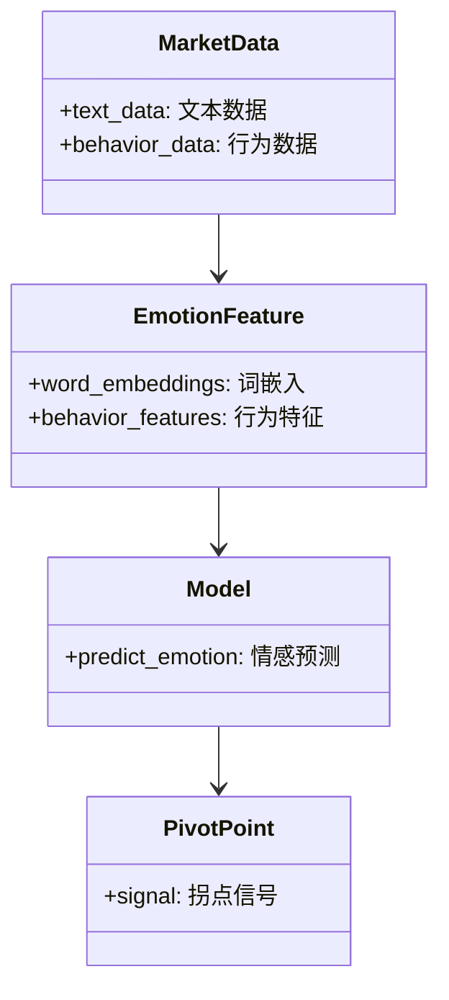

                 


# 智能算法识别市场情绪拐点信号

## 关键词：市场情绪，智能算法，拐点识别，自然语言处理，时间序列分析，机器学习

## 摘要：  
本文详细探讨了利用智能算法识别市场情绪拐点信号的核心方法与技术。通过分析市场情绪数据的特征，结合自然语言处理和机器学习技术，提出了一种基于智能算法的市场情绪拐点识别框架。文章首先介绍了市场情绪拐点的基本概念与识别的重要性，然后从数据预处理、特征提取、算法选择等多个维度详细阐述了智能算法的实现过程。同时，本文通过具体的数学模型和实际案例分析，展示了如何利用智能算法准确识别市场情绪拐点，并对算法的优缺点进行了深入分析。最后，本文提出了未来研究的方向与建议。

---

# 第一部分：市场情绪拐点信号的背景与核心概念

## 第1章：市场情绪拐点信号的背景与问题描述

### 1.1 市场情绪的基本概念

#### 1.1.1 市场情绪的定义
市场情绪是指投资者在市场中的情感倾向和态度，通常表现为乐观、悲观、谨慎等状态。市场情绪的变化往往与市场的波动密切相关，是影响市场走势的重要因素。

#### 1.1.2 市场情绪的特征与表现
市场情绪具有以下特征：
1. **波动性**：市场情绪会随着市场环境的变化而波动。
2. **滞后性**：市场情绪的变化往往滞后于市场实际走势。
3. **复杂性**：市场情绪受到多种因素影响，包括经济数据、政策变化、市场新闻等。

市场情绪的表现形式包括：
- 投资者的交易行为变化（如买卖决策）。
- 媒体报道和社交媒体上的市场相关言论。

#### 1.1.3 市场情绪拐点的定义与重要性
市场情绪拐点是指市场情绪从一个状态转向另一个状态的关键点。例如，从乐观转向悲观，或从悲观转向乐观。识别市场情绪拐点可以帮助投资者提前做出决策，避免重大损失或抓住潜在的收益机会。

---

### 1.2 问题背景与需求分析

#### 1.2.1 传统市场分析的局限性
传统的市场分析方法主要依赖于技术分析和基本面分析，但这些方法在识别市场情绪拐点时存在以下局限性：
- **主观性**：分析结果依赖于分析师的个人经验和判断。
- **滞后性**：传统分析方法通常基于历史数据，无法实时捕捉市场情绪的变化。
- **复杂性**：面对海量数据时，传统方法难以快速提取有效信息。

#### 1.2.2 智能算法在市场情绪分析中的优势
智能算法（如机器学习、自然语言处理）在市场情绪分析中具有以下优势：
- **数据驱动**：能够从大量数据中自动提取特征。
- **实时性**：可以实时分析市场情绪变化。
- **准确性**：通过训练模型，能够提高市场情绪预测的准确性。

#### 1.2.3 市场情绪拐点识别的实际应用场景
市场情绪拐点识别可以应用于以下几个场景：
1. **股票交易**：帮助投资者在市场情绪变化时做出买卖决策。
2. **风险管理**：提前识别潜在风险，避免重大损失。
3. **新闻分析**：通过分析媒体和社交媒体上的信息，预测市场情绪变化。

---

### 1.3 问题解决方法与技术路线

#### 1.3.1 数据驱动的市场情绪分析
市场情绪分析的核心是通过对数据的分析来识别情绪变化。数据来源包括：
- **文本数据**：新闻、社交媒体帖子、评论等。
- **行为数据**：投资者的交易行为数据，如买卖量、订单簿等。

#### 1.3.2 智能算法的核心技术
智能算法的核心技术包括：
1. **自然语言处理（NLP）**：用于分析文本数据中的情绪倾向。
2. **机器学习**：用于训练模型，预测市场情绪变化。
3. **时间序列分析**：用于分析市场情绪的时间演变趋势。

#### 1.3.3 技术路线与实现框架
市场情绪拐点识别的技术路线如下：
1. **数据采集**：收集市场相关的文本和行为数据。
2. **数据预处理**：清洗数据，提取特征。
3. **模型训练**：利用机器学习算法训练市场情绪预测模型。
4. **拐点识别**：通过模型预测市场情绪变化，识别拐点。

---

### 1.4 本章小结

#### 1.4.1 市场情绪拐点信号的核心概念
市场情绪拐点是指市场情绪从一种状态转向另一种状态的关键点，是投资者关注的重要指标。

#### 1.4.2 智能算法在市场情绪分析中的作用
智能算法能够通过数据驱动的方式，实时捕捉市场情绪变化，提高市场情绪预测的准确性和及时性。

#### 1.4.3 本书的技术路线与内容框架
本书将从数据预处理、特征提取、算法选择等多个维度详细阐述智能算法的实现过程，并通过实际案例分析验证算法的有效性。

---

## 第2章：市场情绪拐点信号的核心概念与联系

### 2.1 智能算法的基本原理

#### 2.1.1 数据预处理与特征提取
市场情绪分析的核心是数据预处理与特征提取。常见的特征提取方法包括：
- **文本特征提取**：利用词袋模型或词嵌入模型（如Word2Vec）提取文本特征。
- **行为特征提取**：分析交易数据中的买卖量、订单簿等信息。

#### 2.1.2 智能算法的分类与选择
常见的智能算法包括：
1. **支持向量机（SVM）**：适用于分类任务。
2. **随机森林**：适用于特征重要性分析。
3. **长短期记忆网络（LSTM）**：适用于时间序列分析。

#### 2.1.3 算法的性能评估指标
算法性能评估指标包括：
- **准确率**：分类的正确率。
- **召回率**：模型识别的正例比例。
- **F1分数**：综合准确率和召回率的指标。

---

### 2.2 市场情绪数据的特征分析

#### 2.2.1 文本数据的特征提取
文本数据的特征提取可以通过以下步骤实现：
1. **分词**：将文本分割成词语或短语。
2. **情感分析**：判断文本的情感倾向（如积极、消极、中性）。
3. **关键词提取**：提取与市场情绪相关的关键词。

#### 2.2.2 市场行为数据的特征提取
市场行为数据的特征提取可以通过以下步骤实现：
1. **数据分析**：分析交易量、价格波动等数据。
2. **特征工程**：提取有用的特征，如平均成交量、波动率等。

#### 2.2.3 多模态数据的融合分析
多模态数据的融合分析可以通过以下步骤实现：
1. **数据融合**：将文本数据和行为数据进行融合。
2. **特征组合**：将文本特征和行为特征进行组合。

---

### 2.3 智能算法与市场情绪拐点的关系

#### 2.3.1 算法与市场情绪拐点的因果关系
智能算法通过分析市场情绪数据的变化，能够识别出市场情绪拐点。这种识别基于算法对数据的建模和预测能力。

#### 2.3.2 算法的可解释性与市场情绪预测的准确性
算法的可解释性直接影响市场情绪预测的准确性。例如，LSTM网络能够捕捉时间序列中的长期依赖关系，适合分析市场情绪的时间演变趋势。

#### 2.3.3 算法的鲁棒性与市场情绪拐点的识别能力
算法的鲁棒性决定了其在面对市场波动时的表现。例如，随机森林算法具有较强的鲁棒性，适合处理噪声较多的数据。

---

### 2.4 核心概念对比与联系

#### 2.4.1 不同算法的特征对比
| 算法 | 优势 | 局限性 |
|------|------|--------|
| SVM  | 高准确率 | 对高维数据处理能力较弱 |
| 随机森林 | 鲁棒性强 | 需要较多计算资源 |
| LSTM | 能捕捉时间序列中的长期依赖 | 计算复杂度较高 |

#### 2.4.2 市场情绪数据与算法性能的关系
市场情绪数据的特征（如数据量、数据质量）直接影响算法的性能。例如，高质量的数据可以提高算法的准确率。

#### 2.4.3 市场情绪拐点识别的ER实体关系图
```mermaid
er
actor: 投资者
market_data: 市场数据
emotion_feature: 情感特征
model: 预测模型
pivot_point: 拐点信号
actor --> market_data
market_data --> emotion_feature
emotion_feature --> model
model --> pivot_point
```

---

## 第3章：算法原理与数学模型

### 3.1 基于自然语言处理的市场情绪分析

#### 3.1.1 情感分析模型
情感分析模型用于判断文本的情感倾向。常用的模型包括：
1. **词袋模型**：基于词频的特征提取。
2. **词嵌入模型**：如Word2Vec、GloVe。

#### 3.1.2 基于深度学习的情感分析模型
深度学习模型（如LSTM、BERT）能够捕捉文本中的语义信息，提高情感分析的准确性。

---

### 3.2 基于时间序列分析的市场情绪预测

#### 3.2.1 时间序列分析的基本原理
时间序列分析用于分析市场情绪的时间演变趋势。常用的模型包括：
1. **ARIMA**：自回归积分滑动平均模型。
2. **LSTM**：长短期记忆网络。

#### 3.2.2 市场情绪预测的数学模型
市场情绪预测的数学模型可以表示为：
$$ y_t = f(x_{t-n}, x_{t-n+1}, ..., x_{t-1}, x_t) $$
其中，$y_t$ 是预测的市场情绪，$x_i$ 是输入特征。

---

## 第4章：系统架构设计与实现

### 4.1 问题场景介绍
市场情绪拐点识别系统的目标是通过智能算法分析市场情绪数据，识别拐点信号。

### 4.2 系统功能设计

#### 4.2.1 领域模型设计


#### 4.2.2 系统架构设计


---

## 第5章：项目实战与案例分析

### 5.1 项目环境安装
安装必要的Python库：
```bash
pip install numpy pandas scikit-learn tensorflow
```

### 5.2 核心算法实现

#### 5.2.1 情感分析模型实现
```python
from sklearn.feature_extraction.text import TfidfVectorizer
from sklearn.svm import SVC

# 数据预处理
text_data = [...]  # 文本数据
labels = [...]      # 标签（市场情绪）

# 特征提取
vectorizer = TfidfVectorizer()
features = vectorizer.fit_transform(text_data)

# 模型训练
model = SVC()
model.fit(features, labels)
```

#### 5.2.2 时间序列模型实现
```python
from tensorflow.keras import layers
import numpy as np

# 数据准备
X_train = np.array([...])  # 输入特征
y_train = np.array([...])  # 标签

# 模型构建
model = tf.keras.Sequential()
model.add(layers.LSTM(64, input_shape=(timesteps, features)))
model.add(layers.Dense(1, activation='sigmoid'))
model.compile(optimizer='adam', loss='binary_crossentropy')
model.fit(X_train, y_train, epochs=10)
```

### 5.3 实际案例分析
以某段时间的股票市场数据为例，分析算法如何识别市场情绪拐点信号。

---

## 第6章：总结与展望

### 6.1 本章总结
智能算法通过数据驱动的方式，能够准确识别市场情绪拐点信号，为投资者提供有力支持。

### 6.2 未来研究方向
1. **算法优化**：进一步提高模型的准确性和实时性。
2. **数据融合**：探索多模态数据的融合分析方法。
3. **应用场景扩展**：将算法应用于更多领域，如外汇交易、加密货币市场等。

### 6.3 注意事项与最佳实践
- **数据质量**：确保数据来源可靠，避免噪声干扰。
- **模型调优**：根据实际情况调整模型参数，优化性能。
- **风险控制**：结合其他分析方法，全面评估市场风险。

---

通过以上章节的详细阐述，本文全面介绍了智能算法在识别市场情绪拐点信号中的应用，为读者提供了理论与实践相结合的指导。

