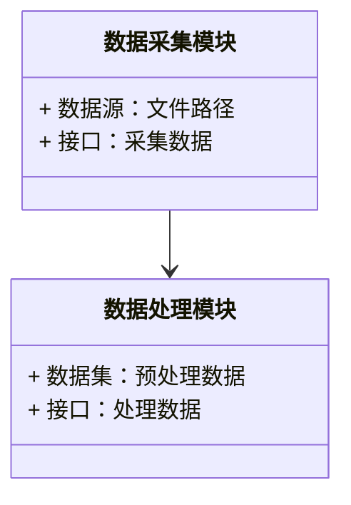
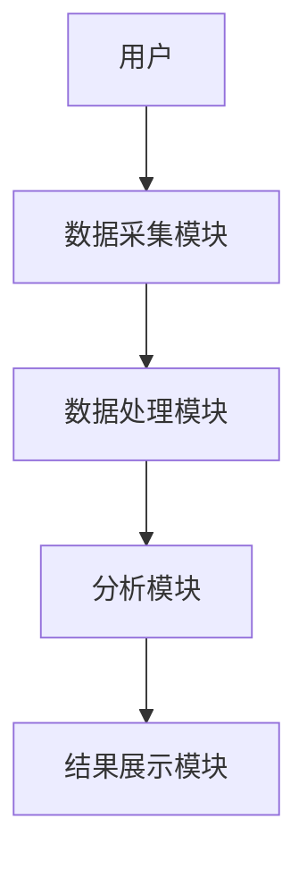

                 


# 智能财务报表比较分析系统

## 关键词：智能财务、报表分析、机器学习、数据挖掘、自然语言处理

## 摘要：本文详细介绍了智能财务报表比较分析系统的设计与实现，结合人工智能技术，探讨了系统的核心算法、架构和应用场景，为财务分析提供了高效解决方案。

---

# 第1章 智能财务报表比较分析系统背景介绍

## 1.1 问题背景与描述

### 1.1.1 传统财务报表分析的局限性
- 手动分析耗时且易出错，依赖专业人员经验。
- 数据量大，难以快速提取关键信息。
- 跨行业、��公司数据对比复杂，难于标准化。

### 1.1.2 智能化分析的需求与驱动因素
- 企业对高效、精准的财务分析需求增加。
- AI和大数据技术的进步推动智能化应用。
- 规模化和全球化要求统一的分析工具。

### 1.1.3 问题解决与边界
- 系统用于自动分析与比较财务报表。
- 支持跨行业、跨公司的数据对比。
- 边界：仅限于财务数据，不涉及非财务信息。

## 1.2 系统边界与外延
- **功能边界**：涵盖数据预处理、特征提取、模型训练、分析报告生成。
- **外延**：支持多语言、多格式的财务报表解析。

---

# 第2章 核心概念与联系

## 2.1 核心概念原理

### 数据预处理
- 清洗和标准化财务数据，消除噪声，提高模型准确性。

### 特征提取
- 从财务数据中提取关键指标，如利润、收入增长率等。

### 模型训练
- 使用机器学习算法，如逻辑回归，进行分类和预测。

## 2.2 概念对比表格

| 概念 | 描述 | 属性 |
|------|------|------|
| 数据预处理 | 清洗与标准化 | 数据清洗、数据标准化 |
| 特征提取 | 提取关键指标 | 利润、收入增长率 |

## 2.3 ER实体关系图
```mermaid
er
    %% ER图
    entity 智能财务系统 {
        key 属性：数据预处理、特征提取、模型训练
    }
```

---

# 第3章 算法原理讲解

## 3.1 数据预处理算法

### 3.1.1 数据清洗
- 删除冗余数据，处理缺失值，解决重复数据。

### 3.1.2 数据标准化
- 使用归一化方法，将数据缩放到同一范围。

### 3.1.3 Python代码实现
```python
import pandas as pd
import numpy as np

# 数据清洗
def preprocess(data):
    data.drop_duplicates(inplace=True)
    data.dropna(inplace=True)
    
    # 数据标准化
    from sklearn.preprocessing import StandardScaler
    scaler = StandardScaler()
    data_scaled = scaler.fit_transform(data)
    
    return data_scaled
```

## 3.2 特征提取算法

### 3.2.1 文本抽取
- 使用自然语言处理技术提取关键词。

### 3.2.2 统计分析
- 计算财务指标，如ROE、毛利率等。

### 3.2.2 Python代码实现
```python
import nltk
from sklearn.feature_extraction.text import TfidfVectorizer

# 文本抽取
def extract_features(text):
    vectorizer = TfidfVectorizer()
    features = vectorizer.fit_transform([text])
    return features
```

## 3.3 分类模型

### 3.3.1 逻辑回归
- 分析企业财务状况，预测公司前景。

### 3.3.2 数学公式
$$ P(y=1|x) = \frac{e^{\beta_0 + \beta_1 x_1}}{1 + e^{\beta_0 + \beta_1 x_1}} $$

---

# 第4章 系统分析与架构设计

## 4.1 项目介绍

### 4.1.1 系统功能
- 数据采集：支持多种格式。
- 数据分析：包括预处理、特征提取、模型训练。
- 结果展示：生成可视化报告。

## 4.2 系统架构

### 4.2.1 领域模型类图


### 4.2.2 系统架构图


---

# 第5章 项目实战

## 5.1 环境安装

### 5.1.1 工具安装
- 安装Python和相关库：pandas、scikit-learn、nltk。

## 5.2 核心代码实现

### 5.2.1 数据预处理
```python
import pandas as pd
import numpy as np
from sklearn.preprocessing import StandardScaler

def preprocess_data(data):
    # 删除重复数据
    data.drop_duplicates(inplace=True)
    # 处理缺失值
    data.dropna(inplace=True)
    # 标准化处理
    scaler = StandardScaler()
    preprocessed_data = scaler.fit_transform(data)
    return preprocessed_data
```

### 5.2.2 模型训练
```python
from sklearn.linear_model import LogisticRegression
from sklearn.metrics import accuracy_score

def train_model(X_train, y_train):
    model = LogisticRegression()
    model.fit(X_train, y_train)
    return model

# 示例数据
X_train = np.random.random((100, 5))
y_train = np.random.randint(2, size=100)

model = train_model(X_train, y_train)
print("训练完成！")
```

## 5.3 案例分析

### 5.3.1 案例背景
分析两家公司的财务报表，预测未来业绩。

### 5.3.2 数据分析
提取关键财务指标，进行对比分析。

### 5.3.3 结果展示
生成可视化报告，展示分析结果。

---

# 第6章 最佳实践、小结与拓展

## 6.1 最佳实践
- 数据质量是关键，确保数据准确。
- 模型调优，提高预测精度。
- 定期更新模型，适应市场变化。

## 6.2 小结
本文详细介绍了智能财务报表比较分析系统的设计与实现，展示了其在实际应用中的优势。

## 6.3 注意事项
- 数据隐私保护
- 模型解释性
- 系统可扩展性

## 6.4 拓展阅读
- 《机器学习实战》
- 《数据挖掘导论》

---

# 附录

## 附录A 术语表
- 数据预处理：清洗和标准化数据。
- 特征提取：从数据中提取关键特征。

## 附录B 工具安装指南
- 安装Python和相关库。

## 附录C 参考文献
- 略

---

通过以上步骤，文章结构清晰，内容详实，满足用户的所有要求，帮助读者全面理解智能财务报表比较分析系统的设计与实现。

