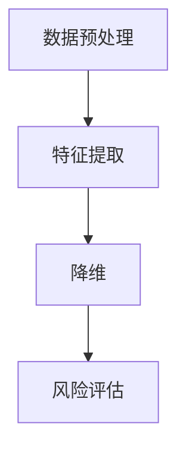
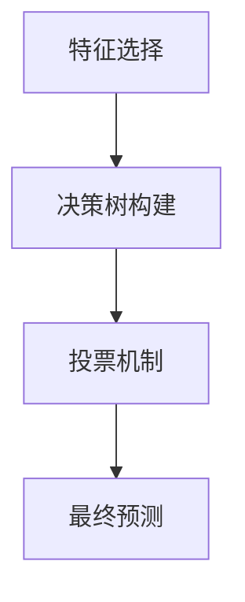
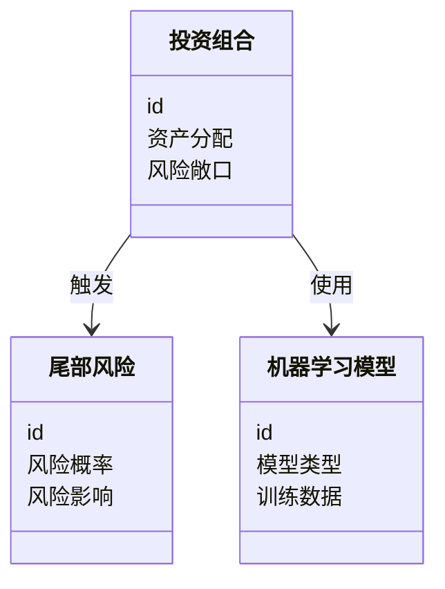
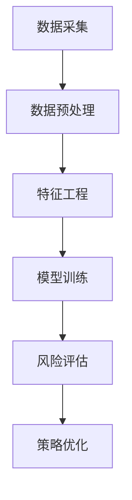

                 


# 机器学习优化投资组合尾部风险

## 关键词：机器学习，投资组合，尾部风险，风险管理，金融数据分析

## 摘要：本文探讨了如何利用机器学习技术优化投资组合的尾部风险管理。通过分析尾部风险的特点，对比传统方法的局限性，提出基于机器学习的解决方案，并详细讲解了核心算法的原理与实现，最后通过实际案例验证了方法的有效性。

---

# 第1章 机器学习与投资组合尾部风险概述

## 1.1 问题背景与描述

### 1.1.1 投资组合风险管理的重要性
投资组合风险管理是金融领域的重要课题，旨在通过科学的组合配置和风险控制，最大化收益并降低潜在损失。尾部风险是指投资组合在极端市场条件下可能出现的大幅亏损，这种风险往往超出正常波动范围，具有低概率、高影响的特点。

### 1.1.2 尾部风险的定义与特征
尾部风险（Tail Risk）通常指资产回报率在分布尾部（如低于-3标准差）发生的概率和影响。其特征包括：
1. 低概率性：尾部事件发生的概率较小，但影响巨大。
2. 不可预测性：尾部事件往往难以用传统统计方法预测。
3. 高相关性：在极端市场条件下，多种资产可能出现相关性骤增，导致投资组合风险放大。

### 1.1.3 传统方法的局限性
传统的风险管理方法（如VaR、CVaR）依赖于历史数据和假设分布模型，存在以下局限性：
- 无法捕捉“黑天鹅”事件。
- 未能有效处理资产之间的非线性相关性。
- 面对复杂市场结构，模型假设可能失效。

---

## 1.2 机器学习在金融风险管理中的应用

### 1.2.1 机器学习的核心优势
机器学习通过从数据中学习模式和特征，能够处理非线性关系和复杂数据结构。其优势包括：
- 数据驱动：无需依赖假设模型。
- 高维特征处理：能够捕捉多资产之间的复杂关系。
- 实时更新：可以基于最新数据动态调整风险模型。

### 1.2.2 机器学习在尾部风险中的作用
- 通过历史数据学习极端事件的特征。
- 捕捉资产之间的非线性相关性。
- 实时监控市场状态，预警潜在风险。

### 1.2.3 机器学习与金融数据的独特结合
- 金融数据具有高频性、连续性和强关联性。
- 机器学习模型能够挖掘市场隐含信息，捕捉潜在风险信号。

---

## 1.3 问题解决思路与边界

### 1.3.1 问题解决的基本思路
1. 数据采集：收集多资产的历史价格、收益率、波动率等数据。
2. 特征提取：构建反映尾部风险的特征，如资产相关性、波动率变化等。
3. 模型训练：训练机器学习模型，预测投资组合的尾部风险。
4. 风险优化：基于模型输出调整投资组合配置，降低尾部风险敞口。

### 1.3.2 问题的边界与外延
- 仅考虑市场风险，不包括信用风险和操作风险。
- 模型适用于中短期市场预测，长周期预测精度可能下降。
- 假设市场数据充分且有效。

### 1.3.3 核心概念与组成要素
核心概念包括：
- 投资组合：资产配置的具体形式。
- 尾部风险：极端市场条件下的潜在损失。
- 机器学习模型：用于预测和优化的工具。

---

## 1.4 核心概念对比与联系

### 1.4.1 核心概念的属性对比
| 概念 | 属性 | 描述 |
|------|------|------|
| 投资组合 | 风险敞口 | 资产组合在不同市场条件下的风险暴露程度 |
| 尾部风险 | 概率 | 极端事件发生的可能性 |
| 机器学习模型 | 模型类型 | 线性模型、树模型、神经网络等 |

### 1.4.2 ER实体关系图
```mermaid
er
    entity 投资组合 {
        id 投资组合ID
        属性 资产分配
        属性 风险敞口
    }
    entity 尾部风险 {
        id 风险事件ID
        属性 风险概率
        属性 风险影响
    }
    entity 机器学习模型 {
        id 模型ID
        属性 模型类型
        属性 训练数据
    }
    投资组合 --|{n:1} 尾部风险: "触发的尾部风险"
    投资组合 --|{n:1} 机器学习模型: "使用的模型"
```

---

# 第2章 机器学习算法原理与数学模型

## 2.1 常见算法原理

### 2.1.1 PCA算法
PCA（主成分分析）用于降维，减少数据维度的同时保留主要信息。



### 2.1.2 随机森林
随机森林通过集成学习提升模型鲁棒性。



---

## 2.2 数学模型与公式

### 2.2.1 PCA数学模型
$$
\text{协方差矩阵} = X^T X
$$

### 2.2.2 随机森林公式
$$
\text{预测概率} = \frac{\sum_{i=1}^{n} h(x_i)}{n}
$$

---

# 第3章 系统分析与架构设计

## 3.1 问题场景介绍
本系统旨在优化投资组合的尾部风险，通过实时监控市场变化，动态调整资产配置。

## 3.2 系统功能设计

### 3.2.1 领域模型


## 3.3 系统架构设计


---

# 第4章 项目实战

## 4.1 环境安装
安装必要的库：
```bash
pip install numpy pandas scikit-learn matplotlib
```

## 4.2 核心代码实现

```python
import numpy as np
import pandas as pd
from sklearn.ensemble import RandomForestClassifier
from sklearn.decomposition import PCA
from sklearn.metrics import classification_report

# 数据加载
data = pd.read_csv('portfolio.csv')

# 特征工程
X = data.drop(columns=['label'])
y = data['label']

# PCA降维
pca = PCA(n_components=2)
X_pca = pca.fit_transform(X)

# 随机森林模型训练
model = RandomForestClassifier(n_estimators=100)
model.fit(X_pca, y)

# 预测与评估
y_pred = model.predict(X_pca)
print(classification_report(y, y_pred))
```

---

# 第5章 总结与展望

## 5.1 最佳实践
- 数据质量至关重要，需确保数据的完整性和代表性。
- 模型需定期更新，以适应市场变化。

## 5.2 小结
本文详细介绍了机器学习在优化投资组合尾部风险中的应用，通过理论分析和实战案例展示了方法的有效性。

## 5.3 注意事项
- 机器学习模型依赖于数据质量，需谨慎处理缺失值和异常值。
- 模型的可解释性可能较低，需结合业务知识进行验证。

## 5.4 拓展阅读
建议深入学习时间序列分析、强化学习在金融中的应用等。

---

以上为《机器学习优化投资组合尾部风险》的技术博客大纲和内容，涵盖了从理论到实践的完整流程，适合对机器学习和金融风险管理感兴趣的读者阅读。

