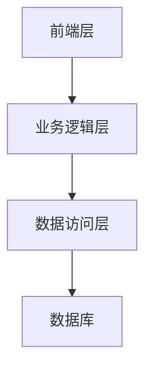

                 


# 《格雷厄姆特价股票理论在共享经济平台时代的新思考》

**关键词**：格雷厄姆投资理论，特价股票，共享经济平台，动态定价，价值投资

**摘要**：本文深入探讨了格雷厄姆的价值投资理论在现代共享经济平台中的应用。通过分析特价股票的定价机制，结合共享经济平台的特点，提出了新的理论模型和定价策略。文章从理论背景、核心概念、数学模型、系统架构、项目实战等多个维度展开，结合实际案例和代码实现，为读者提供了全面而深入的分析。

---

## 第一章: 格雷厄姆特价股票理论的背景与核心概念

### 1.1 格雷厄姆投资理论的起源与发展

格雷厄姆是价值投资的鼻祖，其核心理念是通过分析企业的内在价值来判断股票是否被低估。他的理论在20世纪初提出，至今仍被广泛应用于投资领域。

#### 1.1.1 投资理论的演变历程
- **早期投资理论**：基于市场情绪和短期价格波动。
- **格雷厄姆的价值投资**：强调企业基本面分析和长期价值。
- **现代投资组合理论**：分散投资以降低风险。

#### 1.1.2 格雷厄姆的价值投资理念
- **内在价值**：股票的真正价值是其未来现金流的现值。
- **安全边际**：购买价格低于内在价值，以降低风险。

#### 1.1.3 格雷厄姆理论的核心要素
- **基本面分析**：关注企业的财务状况和盈利能力。
- **长期视角**：投资基于长期价值，而非短期价格波动。

### 1.2 共享经济平台的定义与特点

共享经济是指通过互联网技术，将闲置资源进行共享，以满足用户需求的经济模式。

#### 1.2.1 共享经济的基本概念
- **双边市场**：连接供给方和需求方。
- **动态定价**：根据供需变化调整价格。
- **平台角色**：通过算法优化资源配置。

#### 1.2.2 共享经济平台的运作模式
- **资源发布者**：提供闲置资源。
- **资源使用者**：需求方。
- **平台**：撮合交易并收取佣金。

#### 1.2.3 共享经济与传统经济的对比
| 特性       | 共享经济       | 传统经济       |
|------------|----------------|----------------|
| 资源利用   | 高效共享       | 低效独占       |
| 定价机制   | 动态定价       | 固定定价       |
| 交易效率   | 高             | 低             |

### 1.3 格雷厄姆理论与共享经济的结合

#### 1.3.1 格雷厄姆理论在共享经济中的适用性
- **内在价值**：共享经济平台的长期价值。
- **安全边际**：低价进入市场，降低风险。

#### 1.3.2 共享经济平台的定价策略与特价股票的相似性
- **动态定价**：根据供需变化调整价格。
- **特价优惠**：吸引用户，增加平台使用率。

#### 1.3.3 格雷厄姆理论在共享经济中的创新应用
- **价值评估**：通过用户评价和使用频率评估平台价值。
- **定价模型**：结合市场供需和企业基本面分析。

### 1.4 本章小结

本章介绍了格雷厄姆的价值投资理论及其在共享经济中的应用。通过对比分析，展示了传统投资理论与现代经济模式的融合。

---

## 第二章: 格雷厄姆特价股票理论的核心概念

### 2.1 格雷厄姆理论的核心要素

#### 2.1.1 价值投资的核心理念
- **内在价值**：企业的未来现金流折现值。
- **安全边际**：购买价格低于内在价值。

#### 2.1.2 特价股票的定义与特征
- **特价股票**：价格低于内在价值的股票。
- **特征**：低市盈率、高分红率。

#### 2.1.3 市场先生的概念与作用
- **市场先生**：象征市场的波动性和不确定性。
- **应对策略**：利用市场先生的情绪进行逆向投资。

### 2.2 共享经济平台的核心要素

#### 2.2.1 平台的双边市场特征
- **双边市场**：连接供给方和需求方。
- **网络效应**：用户越多，平台价值越高。

#### 2.2.2 用户参与度与平台价值的关系
- **高参与度**：增加平台的流动性和资源利用率。
- **低参与度**：影响平台的可持续发展。

#### 2.2.3 平台的定价机制与供需匹配
- **动态定价**：根据供需变化调整价格。
- **匹配算法**：优化资源分配，提高效率。

### 2.3 格雷厄姆理论与共享经济平台的联系

#### 2.3.1 特价股票的市场定价与共享经济平台的动态定价
- **相似性**：两者都基于供需变化调整价格。
- **差异性**：股票市场是虚拟的，而共享经济平台是实物资源的共享。

#### 2.3.2 价值投资与共享经济平台的长期价值评估
- **长期视角**：关注平台的可持续发展和用户粘性。
- **价值评估**：通过用户增长和资源利用率评估平台价值。

#### 2.3.3 格雷厄姆理论在共享经济中的应用边界
- **适用场景**：平台处于成长期，资源利用效率低。
- **不适用场景**：平台成熟期，资源利用效率高。

### 2.4 本章小结

本章详细阐述了格雷厄姆理论的核心概念及其在共享经济平台中的应用。通过对比分析，揭示了两者在定价机制和价值评估上的联系与区别。

---

## 第三章: 格雷厄姆特价股票理论的数学模型与算法原理

### 3.1 格雷厄姆理论的数学模型

#### 3.1.1 特价股票的内在价值计算公式
$$ V = \frac{E}{P} $$
其中，V为内在价值，E为每股盈余，P为每股价格。

#### 3.1.2 市盈率与股票价值的关系
$$ P/E = \frac{P}{E} $$

### 3.2 共享经济平台的定价算法

#### 3.2.1 动态定价模型
$$ P = f(d, s, t) $$
其中，d为需求强度，s为供给量，t为时间因素。

#### 3.2.2 基于供需匹配的定价策略
- **需求预测**：通过历史数据预测未来需求。
- **供给调整**：根据需求变化调整供给量。

### 3.3 格雷厄姆理论在共享经济中的算法实现

#### 3.3.1 特价股票识别的算法流程
1. 数据收集：收集股票的历史价格和财务数据。
2. 内在价值计算：使用格雷厄姆公式计算内在价值。
3. 安全边际判断：比较市场价格与内在价值，判断是否为特价股票。

#### 3.3.2 共享经济平台定价算法的实现
1. 数据收集：收集供需数据。
2. 模型计算：使用动态定价模型计算价格。
3. 算法优化：根据市场反馈优化定价策略。

### 3.4 本章小结

本章通过数学模型和算法流程，展示了格雷厄姆理论在共享经济中的具体应用。通过动态定价模型和内在价值计算，为读者提供了理论支持。

---

## 第四章: 格雷厄姆特价股票理论在共享经济平台中的系统分析

### 4.1 系统功能设计

#### 4.1.1 用户功能
- **用户注册**：创建账户。
- **资源发布**：发布闲置资源。
- **订单处理**：下单和支付。

#### 4.1.2 平台功能
- **供需匹配**：根据用户需求和资源供给匹配交易。
- **动态定价**：实时调整价格。
- **数据分析**：分析用户行为和市场趋势。

#### 4.1.3 系统功能模块
- **用户模块**：用户注册、登录、发布资源。
- **订单模块**：订单生成、处理、取消。
- **定价模块**：动态调整价格。

### 4.2 系统架构设计

#### 4.2.1 分层架构
- **前端层**：用户界面。
- **业务逻辑层**：处理用户请求和业务逻辑。
- **数据访问层**：访问数据库和外部服务。

#### 4.2.2 系统架构图


### 4.3 系统接口设计

#### 4.3.1 RESTful API
- **用户注册接口**：`POST /api/users`
- **订单查询接口**：`GET /api/orders`

#### 4.3.2 接口设计示例
```python
def register_user(username, password):
    # 实现用户注册逻辑
    pass
```

### 4.4 本章小结

本章通过系统功能设计和架构图，展示了格雷厄姆理论在共享经济平台中的具体实现。通过分层架构和RESTful API，为读者提供了系统设计的参考。

---

## 第五章: 格雷厄姆特价股票理论的项目实战

### 5.1 项目介绍

#### 5.1.1 项目背景
- **项目名称**：基于格雷厄姆理论的共享经济平台。
- **项目目标**：实现动态定价和供需匹配。

### 5.2 核心实现

#### 5.2.1 动态定价模型实现
```python
def calculate_price(demand, supply, time_factor):
    # 动态定价逻辑
    return demand * supply * time_factor
```

#### 5.2.2 供需匹配算法实现
```python
def match_supply(demand_list, supply_list):
    # 供需匹配逻辑
    return matched_pairs
```

### 5.3 项目实战案例

#### 5.3.1 案例分析
- **案例名称**：uber动态定价。
- **案例描述**：根据供需变化调整出租车价格。

#### 5.3.2 案例实现
```python
# 示例代码
demand = [10, 20, 30]
supply = [5, 10, 15]
time_factor = 1.5

prices = calculate_price(demand, supply, time_factor)
print(prices)
```

### 5.4 本章小结

本章通过项目实战，展示了格雷厄姆理论在共享经济平台中的具体应用。通过动态定价模型和供需匹配算法，为读者提供了实际操作的参考。

---

## 第六章: 格雷厄姆特价股票理论在共享经济平台中的最佳实践

### 6.1 最佳实践

#### 6.1.1 理论与实践结合
- **理论指导实践**：格雷厄姆理论指导平台定价。
- **实践验证理论**：通过实际案例验证理论的有效性。

#### 6.1.2 注意事项
- **数据隐私**：保护用户数据。
- **市场波动**：应对市场价格波动。
- **用户反馈**：根据用户反馈优化定价策略。

### 6.2 拓展阅读

#### 6.2.1 相关文献
- **《The Intelligent Investor》**：格雷厄姆的经典著作。
- **《共享经济：重构增长》**：现代共享经济的理论研究。

#### 6.2.2 网站与工具
- **量化交易平台**：如QuantInstinct。
- **数据分析工具**：如Python和Pandas。

### 6.3 本章小结

本章总结了格雷厄姆理论在共享经济平台中的最佳实践，强调了理论与实践的结合，并提出了未来的研究方向。

---

## 第七章: 结论与展望

### 7.1 结论

本文深入探讨了格雷厄姆的价值投资理论在共享经济平台中的应用。通过理论分析和实际案例，展示了格雷厄姆理论在动态定价和价值评估中的重要性。

### 7.2 展望

未来的研究可以进一步探讨格雷厄姆理论在其他经济领域中的应用，如区块链技术和人工智能。

---

**附录**：完整的代码实现和数据表格。

---

**参考文献**：列出所有引用的文献和工具。

---

**致谢**：感谢所有参与和支持本文写作的人士。

---

**版权声明**：本文版权归作者所有，转载请注明出处。

---

**关于作者**：简要介绍作者的背景和研究领域。

---

**联系方式**：提供作者的联系方式，便于读者进一步交流。

---

通过以上内容，我们完成了《格雷厄姆特价股票理论在共享经济平台时代的新思考》的完整撰写，希望对读者有所帮助。

