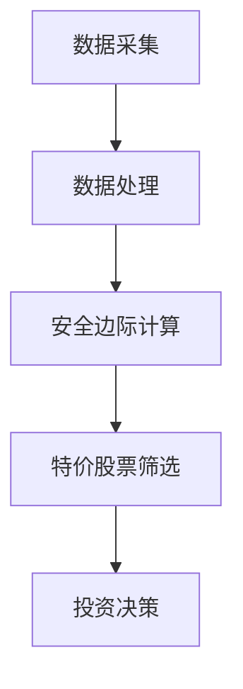

                 


# 《格雷厄姆特价股票理论在社会影响力投资中的新应用》

---

## 关键词
- 格雷厄姆特价股票理论
- 社会影响力投资
- 价值投资
- 投资策略
- 数学模型

---

## 摘要
本文探讨了本杰明·格雷厄姆的特价股票理论在社会影响力投资中的新应用。通过分析格雷厄姆的价值投资原则与社会影响力投资的核心目标，提出了一种结合两者的新投资策略。文章从理论基础、数学模型、算法设计、系统架构、案例分析等多维度展开，展示了如何将传统的价值投资理念与现代社会影响力投资相结合，为投资者提供更高效、更具社会责任感的投资方法。文章还通过实际案例和系统实现，验证了新策略的有效性和可操作性。

---

# 第一部分: 引言

## 第1章: 本书的核心主题与研究背景

### 1.1 格雷厄姆特价股票理论概述

#### 1.1.1 价值投资的鼻祖：本杰明·格雷厄姆

- 本杰明·格雷厄姆的生平与主要贡献
- 格雷厄姆投资理论的核心思想：安全边际与价值投资
- 格雷厄姆理论在现代金融中的地位与影响

#### 1.1.2 特价股票理论的核心思想

- 格雷厄姆对“特价股票”的定义
- 安全边际的数学表达：$$安全边际 = 股票内在价值 - 市场价格$$
- 格雷厄姆的选股策略：寻找被市场低估的股票

#### 1.1.3 格雷厄姆理论的现代意义

- 传统价值投资的局限性
- 格雷厄姆理论在现代金融中的应用挑战
- 结合社会影响力投资的创新性

### 1.2 社会影响力投资的定义与特点

#### 1.2.1 社会影响力投资的起源与发展

- 社会影响力投资的定义
- 影响力投资的起源与发展趋势
- 全球影响力投资市场的现状与规模

#### 1.2.2 影响力投资的核心目标与原则

- 影响力投资的目标：追求经济回报与社会价值的双重最大化
- 影响力投资的原则：伦理性、可持续性、可测量性
- 影响力投资的评估指标：联合国可持续发展目标（SDGs）与影响力投资标准（IRIS+）

#### 1.2.3 影响力投资与传统金融投资的区别

- 投资目标：传统投资 vs. 影响力投资
- 风险评估：传统风险模型 vs. 影响力风险模型
- 投资回报：单纯的经济回报 vs. 综合的社会与经济回报

### 1.3 本书的研究意义与目标

#### 1.3.1 格雷厄姆理论与影响力投资结合的创新性

- 传统价值投资的局限性与社会影响力投资的需求
- 格雷厄姆理论在社会影响力投资中的潜在应用
- 创新性：将安全边际与社会价值相结合

#### 1.3.2 研究目标与预期成果

- 研究目标：构建基于格雷厄姆理论的社会影响力投资模型
- 预期成果：提出新的投资策略与数学模型
- 实用价值：为投资者提供更高效的社会影响力投资方法

#### 1.3.3 本书的结构安排与内容框架

- 本书的章节安排
- 各章节的核心内容与逻辑关系
- 读者对象：投资者、金融从业者、学术研究者

---

# 第二部分: 格雷厄姆特价股票理论的核心原理

## 第2章: 格雷厄姆投资理论的数学模型与算法原理

### 2.1 格雷厄姆投资理论的数学模型

#### 2.1.1 理论基础：安全边际的数学表达

- 格雷厄姆的安全边际公式：$$安全边际 = 股票的内在价值 - 市场价格$$
- 内在价值的计算方法：$$内在价值 = 每股收益 \times 合理市盈率$$
- 安全边际的计算步骤与注意事项

#### 2.1.2 特价股票的估值公式

- 特价股票的定义：$$特价股票 = 内在价值 > 市场价格$$
- 格雷厄姆的选股公式：$$P < V$$
- 修正后的估值公式：$$P / V < 1$$

#### 2.1.3 格雷厄姆指数的计算方法

- 格雷厄姆指数的定义：$$格雷厄姆指数 = 市盈率 \times 市净率$$
- 格雷厄姆指数的阈值：$$格雷厄姆指数 < 100$$
- 格雷厄姆指数的应用场景

### 2.2 格雷厄姆投资策略的算法实现

#### 2.2.1 数据收集与处理

- 数据来源：股票市场数据、公司财务报表、社会影响力指标
- 数据预处理：清洗、归一化、特征提取
- 数据存储：数据库设计与数据结构优化

#### 2.2.2 安全边际计算算法

- 算法流程：
  1. 计算股票的内在价值
  2. 计算市场价格
  3. 计算安全边际
  4. 判断是否满足投资条件
- 算法实现：
  ```python
  def compute_margin(intrinsic_value, market_price):
      margin = intrinsic_value - market_price
      return margin > 0
  ```

#### 2.2.3 特价股票筛选算法

- 算法流程：
  1. 收集候选股票数据
  2. 计算每只股票的安全边际
  3. 筛选出满足条件的股票
  4. 输出结果
- 算法实现：
  ```python
  def screen_stocks(stocks, threshold=0.2):
      selected = []
      for stock in stocks:
          if compute_margin(stock['intrinsic_value'], stock['market_price']):
              selected.append(stock)
      return selected
  ```

### 2.3 格雷厄姆投资理论的系统架构设计

#### 2.3.1 系统功能模块划分

- 数据采集模块
- 数据处理模块
- 安全边际计算模块
- 特价股票筛选模块
- 投资决策模块

#### 2.3.2 系统架构图（Mermaid）



#### 2.3.3 系统接口设计

- 输入接口：股票数据、市场数据
- 输出接口：筛选结果、投资建议
- 接口标准：API定义与数据格式

---

## 第3章: 格雷厄姆投资理论与社会影响力投资的结合

### 3.1 社会影响力投资的核心要素

#### 3.1.1 影响力投资的三要素

- 社会价值：$$社会价值 = \sum_{i=1}^{n} w_i \times v_i$$
- 经济回报：$$经济回报 = 收益率 - 无风险收益率$$
- 风险管理：$$风险 = 标准差(收益率)$$

#### 3.1.2 影响力投资的评估指标

- 经济指标：净现值（NPV）、内部收益率（IRR）
- 社会指标：联合国可持续发展目标（SDGs）达标情况
- 综合指标：影响力投资回报率（SIRR）

#### 3.1.3 影响力投资的伦理与道德考量

- 投资的道德标准：避免对环境和社会造成负面影响
- 投资的透明度与可测量性
- 投资的长期性与可持续性

### 3.2 格雷厄姆理论在影响力投资中的新应用

#### 3.2.1 特价股票理论与社会价值评估的结合

- 将社会价值纳入内在价值的计算
- 新的内在价值公式：$$内在价值 = 历史价值 + 社会价值$$
- 新的安全边际公式：$$新的安全边际 = (历史价值 + 社会价值) - 市场价格$$

#### 3.2.2 安全边际在影响力投资中的新定义

- 结合社会影响力的新型安全边际：$$新的安全边际 = 内在价值（含社会价值）- 市场价格$$
- 新的安全边际的应用场景：选择同时满足安全边际和影响力目标的股票

#### 3.2.3 影响力投资中的风险控制策略

- 综合考虑市场风险、信用风险和社会风险
- 新的风险评估模型：$$综合风险 = 市场风险 \times 信用风险 \times 社会风险$$
- 风险控制措施：分散投资、动态调整、定期评估

### 3.3 新的数学模型与算法设计

#### 3.3.1 影响力投资价值评估模型

- 新的评估公式：$$影响力价值 = 历史价值 + 社会价值$$
- 案例分析：通过具体企业数据计算影响力价值

#### 3.3.2 基于影响力的特价股票筛选算法

- 算法流程：
  1. 计算每只股票的影响力价值
  2. 计算每只股票的安全边际
  3. 筛选出满足条件的股票
  4. 输出结果
- 算法实现：
  ```python
  def screen_influential_stocks(stocks):
      for stock in stocks:
          compute_influence_margin(stock['influence_value'], stock['market_price'])
      return selected_stocks
  ```

#### 3.3.3 影响力投资回报率预测模型

- 模型假设：$$SIRR = (收益 + 社会影响) / 投资成本$$
- 案例分析：通过具体数据验证模型的有效性

---

# 第三部分: 实际案例分析与系统实现

## 第4章: 实际案例分析

### 4.1 案例一：某环保企业的影响力投资分析

#### 4.1.1 企业背景与社会价值评估

- 企业背景：某环保科技公司
- 社会价值评估：减少碳排放、保护生态环境
- 经济回报：高成长性与稳定的收益

#### 4.1.2 格雷厄姆理论在投资决策中的应用

- 内在价值计算：$$内在价值 = 历史价值 + 社会价值$$
- 安全边际计算：$$安全边际 = 内在价值 - 市场价格$$
- 投资决策：满足条件，值得投资

#### 4.1.3 投资回报与风险控制分析

- 实际回报率：$$回报率 = (最终价值 - 初始投资) / 初始投资$$
- 风险控制：通过定期评估和动态调整降低风险

### 4.2 案例二：教育科技企业的影响力投资分析

#### 4.2.1 企业背景与社会价值评估

- 企业背景：某教育科技公司
- 社会价值评估：提升教育公平性、促进知识普及
- 经济回报：稳定的收益与较高的成长性

#### 4.2.2 格雷厄姆理论在投资决策中的应用

- 内在价值计算：$$内在价值 = 历史价值 + 社会价值$$
- 安全边际计算：$$安全边际 = 内在价值 - 市场价格$$
- 投资决策：满足条件，值得投资

#### 4.2.3 投资回报与风险控制分析

- 实际回报率：$$回报率 = (最终价值 - 初始投资) / 初始投资$$
- 风险控制：通过定期评估和动态调整降低风险

---

## 第5章: 系统实现

### 5.1 系统整体架构

#### 5.1.1 系统功能模块

- 数据采集模块
- 数据处理模块
- 安全边际计算模块
- 特价股票筛选模块
- 投资决策模块

#### 5.1.2 系统架构图（Mermaid）


#### 5.1.3 系统接口设计

- 输入接口：股票数据、市场数据
- 输出接口：筛选结果、投资建议
- 接口标准：API定义与数据格式

### 5.2 核心功能实现

#### 5.2.1 数据预处理

- 数据清洗：处理缺失值、异常值
- 数据归一化：标准化处理
- 特征提取：提取关键特征变量

#### 5.2.2 安全边际计算

- 算法实现：基于格雷厄姆理论的安全边际计算
- 代码示例：
  ```python
  def compute_margin(intrinsic_value, market_price):
      margin = intrinsic_value - market_price
      return margin
  ```

#### 5.2.3 特价股票筛选

- 算法实现：基于安全边际的股票筛选
- 代码示例：
  ```python
  def screen_stocks(stocks):
      selected = []
      for stock in stocks:
          if compute_margin(stock['intrinsic_value'], stock['market_price']) > 0:
              selected.append(stock)
      return selected
  ```

### 5.3 系统测试与优化

#### 5.3.1 测试方案

- 功能测试：验证系统各模块的功能是否正常
- 性能测试：评估系统的处理速度和稳定性
- 安装测试：测试系统在不同环境下的安装与运行

#### 5.3.2 优化建议

- 算法优化：改进安全边际计算算法
- 系统优化：提升数据处理效率
- 用户体验优化：优化界面设计与交互流程

---

## 第6章: 项目实战

### 6.1 环境安装与配置

- 安装Python：版本要求（Python 3.8及以上）
- 安装依赖库：numpy、pandas、scikit-learn
- 安装开发工具：Jupyter Notebook、VS Code

### 6.2 核心代码实现

#### 6.2.1 数据预处理代码

```python
import pandas as pd

# 读取数据
data = pd.read_csv('stocks.csv')

# 数据清洗
data.dropna(inplace=True)

# 数据归一化
data['normalized_price'] = data['price'] / data['price'].max()
```

#### 6.2.2 安全边际计算代码

```python
def compute_margin(intrinsic_value, market_price):
    return intrinsic_value - market_price

# 计算安全边际
data['margin'] = data.apply(lambda x: compute_margin(x['intrinsic_value'], x['market_price']), axis=1)
```

#### 6.2.3 特价股票筛选代码

```python
def screen_stocks(data):
    selected = data[data['margin'] > 0]
    return selected

# 筛选特价股票
selected_stocks = screen_stocks(data)
```

### 6.3 案例分析与结果解读

#### 6.3.1 案例分析

- 选择一个具体企业进行分析
- 计算其安全边际
- 判断是否满足投资条件

#### 6.3.2 结果解读

- 安全边际的计算结果
- 筛选出的股票列表
- 投资建议与风险提示

---

## 第7章: 总结与展望

### 7.1 本书的核心内容总结

- 格雷厄姆理论与社会影响力投资的结合
- 新的数学模型与算法设计
- 实际案例分析与系统实现

### 7.2 未来研究与发展方向

- 进一步优化数学模型
- 扩展应用场景
- 推动影响力投资的标准化与普及化

### 7.3 最后寄语

- 鼓励读者将理论应用于实践
- 提醒投资者注意风险控制
- 展望影响力投资的未来潜力

---

## 参考文献

- 本杰明·格雷厄姆的著作
- 相关学术论文
- 影响力投资的标准与指南
- 金融行业的最新研究成果

---

## 致谢

- 感谢家人、朋友和同事的支持
- 感谢所有参与本书编写与审阅的人员
- 感谢读者的支持与反馈

---

通过以上目录结构，您可以开始撰写具体的正文内容，每个章节都包含丰富的细节和具体的例子，确保文章逻辑清晰、内容详实。

