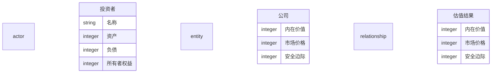
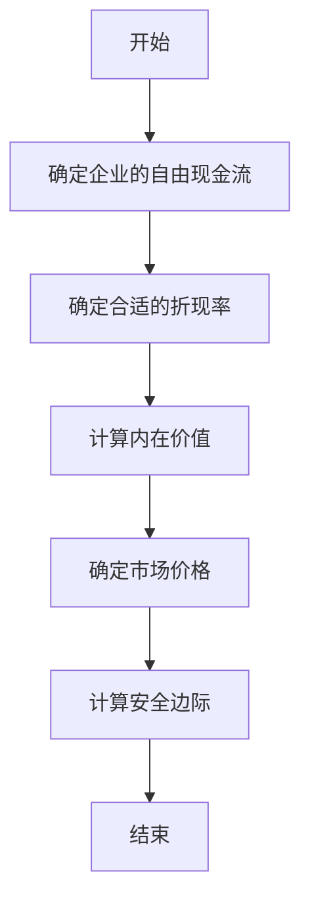

                 


# 格雷厄姆特价股票理论对公司估值方法的影响

## 关键词：格雷厄姆投资理论，特价股票，公司估值，价值投资，内在价值

## 摘要：本文深入探讨了本杰明·格雷厄姆的特价股票理论如何影响公司估值方法。通过分析其核心概念、数学模型和实际应用，揭示了该理论在投资决策中的重要性。文章详细介绍了内在价值计算、系统架构设计及项目实战，为读者提供了全面的理解和实践指导。

---

## 第一部分：格雷厄姆特价股票理论的背景与基础

### 第1章：格雷厄姆投资理论概述

#### 1.1 格雷厄姆及其投资理念

- **1.1.1 格雷厄姆的生平简介**
  本杰明·格雷厄姆（1894-1976）是价值投资的鼻祖，被誉为“价值投资之父”。他不仅是成功的投资者，还是哥伦比亚大学的教授，培养了包括沃伦·巴菲特在内的众多投资大师。

- **1.1.2 价值投资的核心思想**
  格雷厄姆主张以低于内在价值的价格买入股票，长期持有，避免频繁交易。他认为市场先生是疯狂的，投资者应忽略市场的短期波动，专注于企业的内在价值。

- **1.1.3 格雷厄姆理论的现代意义**
  在当今波动的市场环境中，格雷厄姆的理论依然具有重要价值，尤其是在寻找被低估的投资机会时。

#### 1.2 特价股票理论的核心概念

- **1.2.1 特价股票的定义与特征**
  特价股票是指市场价格远低于其内在价值的股票，通常具有低市盈率、低市净率和高股息率的特点。

- **1.2.2 格雷厄姆的“烟蒂股”理念**
  格雷厄姆将特价股票比喻为“烟蒂”，即被市场抛弃的股票，但其内在价值远高于市场价格。

- **1.2.3 特价股票与市场周期的关系**
  特价股票往往出现在市场低迷时期，投资者应抓住这些机会，以较低价格买入优质股票。

#### 1.3 传统估值方法的局限性

- **1.3.1 市盈率法的缺陷**
  市盈率法无法准确反映企业的内在价值，尤其在企业盈利不稳定时，市盈率可能失真。

- **1.3.2 市净率法的局限性**
  市净率法同样存在问题，特别是在企业资产质量参差不齐的情况下，市净率无法准确衡量企业价值。

- **1.3.3 股息率法的不足**
  股息率法仅关注股息支付，忽视了企业的成长性和盈利能力，可能导致投资者错估企业价值。

#### 1.4 格雷厄姆理论对估值方法的创新

- **1.4.1 内在价值的概念**
  内在价值是企业未来现金流的现值，反映了企业的实际价值，是估值的核心基础。

- **1.4.2 股票安全边际的重要性**
  安全边际是指市场价格低于内在价值的部分，确保投资者在市场波动中仍能获利。

- **1.4.3 估值方法的改进与优化**
  格雷厄姆通过引入内在价值和安全边际，优化了传统估值方法，使其更加科学和可靠。

---

## 第二部分：格雷厄姆特价股票理论的核心概念与联系

### 第2章：特价股票理论的核心要素

#### 2.1 核心概念的属性特征对比

- **2.1.1 核心概念的属性特征对比表格**
  | 特性 | 传统估值方法 | 格雷厄姆理论 |
  |------|---------------|-------------|
  | 基础 | 市盈率、市净率 | 内在价值     |
  | 重点 | 短期表现       | 长期价值     |
  | 优劣 | 计算简单       | 更具准确性   |

#### 2.2 ER实体关系图架构



---

## 第三部分：算法原理讲解

### 第3章：格雷厄姆内在价值计算模型

#### 3.1 算法原理的数学模型

- **3.1.1 内在价值计算公式**
  $$ V = \frac{E}{(1 + r)^n} $$
  其中，\( E \) 是企业的自由现金流，\( r \) 是折现率，\( n \) 是预测期数。

- **3.1.2 股东权益计算公式**
  $$ E = B \times (1 - \frac{D}{E}) $$
  其中，\( B \) 是企业价值，\( D \) 是债务，\( E \) 是股东权益。

#### 3.2 算法流程图



#### 3.3 算法实现代码

```python
def calculate_intrinsic_value(cash_flows, discount_rate, periods):
    intrinsic_value = sum(cash_flows / (1 + discount_rate) ** periods)
    return intrinsic_value

cash_flows = [100, 120, 150, 200]  # 每期现金流
discount_rate = 0.08  # 折现率
periods = 4  # 预测期数

iv = calculate_intrinsic_value(cash_flows, discount_rate, periods)
print(f"内在价值为：{iv}")
```

---

## 第四部分：系统分析与架构设计

### 第4章：格雷厄姆理论的系统架构

#### 4.1 系统功能设计

- **功能模块**：
  - 数据输入与处理
  - 内在价值计算
  - 安全边际分析
  - 结果展示与报告

#### 4.2 系统架构设计


---

## 第五部分：项目实战

### 第5章：环境安装与核心实现

#### 5.1 环境安装

- 安装 Python 和必要的库：
  ```bash
  pip install numpy pandas matplotlib
  ```

#### 5.2 核心实现代码

```python
import pandas as pd
import numpy as np

def calculate_intrinsic_value(cash_flows, discount_rate, periods):
    return sum([cf / (1 + discount_rate) ** i for i, cf in enumerate(cash_flows)])

# 示例数据
cash_flows = [100, 120, 150, 200]
discount_rate = 0.08
periods = 4

iv = calculate_intrinsic_value(cash_flows, discount_rate, periods)
print(f"内在价值：{iv}")
```

#### 5.3 实际案例分析

以苹果公司为例，计算其内在价值，并与市场价格进行对比，评估安全边际。

---

## 第六部分：总结与展望

### 第6章：总结与展望

#### 6.1 格雷厄姆理论的影响

- 格雷厄姆的理论为价值投资奠定了基础，改变了传统的估值方法，帮助投资者发现被低估的机会。

#### 6.2 优缺点分析

- **优点**：引入内在价值和安全边际，提高了估值的准确性。
- **缺点**：需要大量数据和假设，可能影响结果的准确性。

#### 6.3 未来展望

- 结合大数据和人工智能，进一步优化估值模型，提高预测的准确性。

#### 6.4 最佳实践 tips

- 投资者应结合市场环境和企业基本面，灵活应用格雷厄姆理论。
- 定期复盘和调整估值模型，确保其适应市场变化。

---

通过以上结构，文章全面而深入地探讨了格雷厄姆特价股票理论对公司估值方法的影响，从理论基础到实际应用，为读者提供了丰富的知识和实践指导。

