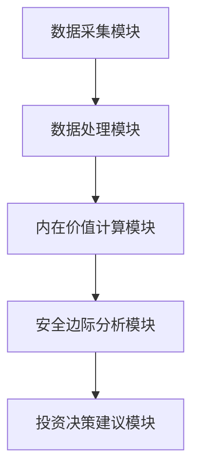
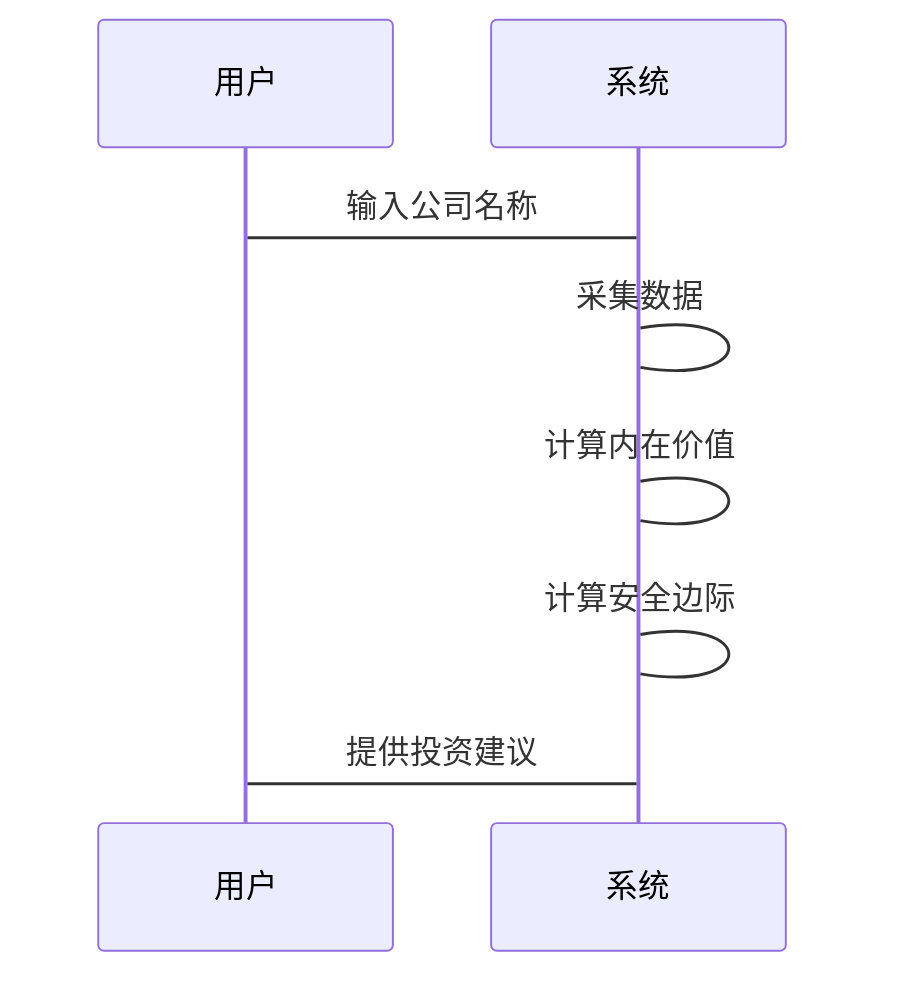

                 


---

# 《格雷厄姆特价股票理论对公司财务政策的影响》

---

## 关键词：
1. 格雷厄姆特价股票理论  
2. 公司财务政策  
3. 安全边际  
4. 内在价值  
5. 股票定价  
6. 投资策略  
7. 财务风险管理  

---

## 摘要：
本文系统地探讨了格雷厄姆特价股票理论对公司财务政策的影响。文章从格雷厄姆理论的核心概念出发，分析其对资本结构、股利政策、风险管理等财务决策的具体影响。通过数学模型、算法原理和实际案例，本文揭示了格雷厄姆理论如何帮助企业在复杂市场环境中制定更科学的财务政策。同时，本文还结合系统架构设计和项目实战，展示了如何将格雷厄姆理论应用于实际投资决策中，为企业财务管理提供新的思路和方法。

---

# 第一部分: 格雷厄姆特价股票理论的背景与核心概念

## 第1章: 格雷厄姆特价股票理论的起源与背景

### 1.1 问题背景
#### 1.1.1 投资者在股票市场中的困境
- 投资者在股票市场中面临的主要问题：
  - 市场波动性大，难以预测。
  - 信息不对称，难以做出明智决策。
  - 投资者心理偏差对决策的影响。

#### 1.1.2 传统投资理论的局限性
- 传统投资理论的不足：
  - 技术分析的不确定性。
  - 基本面分析的复杂性。
  - 市场情绪对价格的短期影响难以量化。

#### 1.1.3 格雷厄姆特价股票理论的提出
- 格雷厄姆的理论背景：
  - 20世纪初的市场波动与投资者损失。
  - 基于价值投资的思想，提出安全边际概念。

### 1.2 格雷厄姆特价股票理论的核心概念
#### 1.2.1 安全边际
- 安全边际的定义：
  - 安全边际 = 内在价值 - 市场价格。
  - 通过购买低于内在价值的股票，降低投资风险。

#### 1.2.2 内在价值计算
- 内在价值的定义：
  - 内在价值是企业未来现金流的现值。
  - 通过股息贴现模型（DDM）计算内在价值。

#### 1.2.3 市场先生与投资者心理
- 市场先生的概念：
  - 市场先生代表市场的波动性。
  - 投资者应避免受市场情绪影响，专注于价值投资。

### 1.3 格雷厄姆特价股票理论的理论基础
#### 1.3.1 股票定价的基本原理
- 股票定价的三要素：
  - 现金流预测。
  - 折现率。
  - 时间价值。

#### 1.3.2 股票市场的波动性与非理性
- 市场波动的来源：
  - 市场情绪的波动。
  - 市场参与者的非理性行为。

#### 1.3.3 投资者行为分析
- 投资者行为的分类：
  - 投机者 vs. 投资者。
  - 羊群效应与市场泡沫。

### 1.4 格雷厄姆特价股票理论与传统投资理论的对比
#### 1.4.1 价值投资与投机的区别
- 价值投资的核心：
  - 买入低于内在价值的股票。
  - 长期持有优质资产。

- 投机的核心：
  - 短期价格波动。
  - 利用市场情绪赚取差价。

#### 1.4.2 技术分析与基本面分析的对比
- 技术分析的局限性：
  - 依赖历史价格数据，忽视基本面。
  - 市场波动可能掩盖基本面问题。

- 基本面分析的优势：
  - 通过分析企业财务状况，找到真正有价值的股票。

#### 1.4.3 格雷厄姆理论的独特性
- 格雷厄姆理论的独特之处：
  - 强调安全边际，降低投资风险。
  - 结合价值投资与风险管理，提供全面的投资策略。

### 1.5 本章小结
- 本章介绍了格雷厄姆特价股票理论的背景、核心概念以及其与传统投资理论的区别。
- 强调了安全边际和内在价值在投资决策中的重要性。

---

## 第2章: 格雷厄姆特价股票理论的核心原理

### 2.1 安全边际的数学模型
#### 2.1.1 内在价值公式
$$ V = \frac{E}{k} $$
其中，\( V \) 表示内在价值，\( E \) 表示企业的预期收益，\( k \) 表示折现率。

#### 2.1.2 股息贴现模型（DDM）
$$ V = \frac{D}{k - g} $$
其中，\( D \) 表示股息，\( k \) 表示股息折现率，\( g \) 表示股息增长率。

### 2.2 内在价值的计算方法
#### 2.2.1 股息贴现模型的实现
- 示例计算：
  - 假设股息为 $2，折现率为 8%，股息增长率为 3%。
  - 内在价值 = 2 / (0.08 - 0.03) = 2 / 0.05 = $40。

#### 2.2.2 市场价格与安全边际的计算
- 示例计算：
  - 市场价格 = $30。
  - 安全边际 = 内在价值（$40）- 市场价格（$30）= $10。

### 2.3 安全边际与投资决策
- 安全边际的意义：
  - 买入时的价格低于内在价值，降低投资风险。
  - 安全边际越大，投资的安全性越高。

---

## 第3章: 格雷厄姆特价股票理论对公司财务政策的影响

### 3.1 资本结构优化
#### 3.1.1 资本结构对股价的影响
- 资本结构与股价的关系：
  - 股价受资本结构的影响，尤其是负债和股权的比例。

#### 3.1.2 格雷厄姆理论对资本结构的优化
- 通过安全边际和内在价值，优化资本结构，降低企业风险。

### 3.2 股利政策
#### 3.2.1 格雷厄姆理论对股利政策的影响
- 股利政策与股价的关系：
  - 稳定的股利政策有助于提高股价的稳定性。

#### 3.2.2 安全边际与股利分配
- 安全边际的计算影响股利分配的决策。

### 3.3 风险管理
#### 3.3.1 格雷厄姆理论与风险管理
- 风险管理的核心：
  - 通过安全边际降低市场波动对股价的影响。

#### 3.3.2 投资组合的分散化
- 分散化投资的意义：
  - 降低投资组合的整体风险。

---

## 第4章: 格雷厄姆特价股票理论的实际应用案例

### 4.1 案例分析
#### 4.1.1 公司概况
- 公司名称：某公司。
- 主要业务：制造业。

#### 4.1.2 内在价值计算
- 使用股息贴现模型计算公司股票的内在价值。

#### 4.1.3 安全边际计算
- 计算公司股票的安全边际。

### 4.2 案例结论
- 案例分析得出的结论：
  - 买入价格低于内在价值，存在安全边际。
  - 投资该公司的股票具有较高的安全性和收益性。

---

## 第5章: 系统分析与架构设计

### 5.1 问题场景介绍
#### 5.1.1 系统目标
- 建立一个基于格雷厄姆理论的股票分析系统。

#### 5.1.2 系统功能需求
- 提供内在价值计算、安全边际分析、投资决策建议等功能。

### 5.2 系统架构设计
#### 5.2.1 系统功能模块
- 数据采集模块：
  - 收集公司财务数据、市场数据等。
- 内在价值计算模块：
  - 使用股息贴现模型计算股票的内在价值。
- 安全边际分析模块：
  - 计算安全边际，评估投资风险。
- 投资决策建议模块：
  - 提供基于安全边际的买卖建议。

#### 5.2.2 系统架构图


### 5.3 系统接口设计
#### 5.3.1 数据接口
- 数据接口的定义：
  - 数据来源：财务报表、市场数据等。

#### 5.3.2 用户接口
- 用户界面的设计：
  - 提供用户友好的操作界面，展示分析结果。

### 5.4 系统交互设计
#### 5.4.1 用户操作流程
- 用户操作流程：
  1. 用户输入公司名称。
  2. 系统采集公司数据。
  3. 系统计算内在价值和安全边际。
  4. 系统提供投资建议。

#### 5.4.2 系统交互图


---

## 第6章: 项目实战

### 6.1 环境安装
#### 6.1.1 系统要求
- 操作系统：Windows/Mac/Linux。
- 开发工具：Python、Jupyter Notebook。

#### 6.1.2 依赖安装
- 安装Python库：pandas、numpy、scikit-learn。

### 6.2 核心代码实现
#### 6.2.1 数据采集模块
```python
import pandas as pd

def get_data(company):
    # 数据采集逻辑
    pass
```

#### 6.2.2 内在价值计算模块
```python
def calculate_intrinsic_value(dividends, discount_rate, growth_rate):
    return dividends / (discount_rate - growth_rate)
```

#### 6.2.3 安全边际分析模块
```python
def calculate_margin_of_safety(intrinsic_value, market_price):
    return intrinsic_value - market_price
```

### 6.3 案例分析
#### 6.3.1 案例数据
- 假设公司A的股息为$2，折现率为8%，股息增长率为3%。
- 市场价格为$30。

#### 6.3.2 计算结果
- 内在价值 = 2 / (0.08 - 0.03) = $40。
- 安全边际 = $40 - $30 = $10。

### 6.4 项目小结
- 项目实现的意义：
  - 展示了如何将格雷厄姆理论应用于实际投资决策中。
  - 提供了基于安全边际的投资建议。

---

## 第7章: 总结与展望

### 7.1 本章总结
- 本章总结了格雷厄姆特价股票理论的核心内容及其对公司财务政策的影响。
- 强调了安全边际和内在价值在投资决策中的重要性。

### 7.2 最佳实践 tips
#### 7.2.1 投资策略
- 建议投资者在买入股票时，确保价格低于内在价值。

#### 7.2.2 风险管理
- 通过分散化投资降低整体风险。

#### 7.2.3 持续学习
- 关注市场动态，不断更新投资策略。

### 7.3 未来展望
- 未来研究方向：
  - 结合人工智能技术，优化内在价值计算模型。
  - 探索格雷厄姆理论在量化投资中的应用。

---

## 参考文献
1. 格雷厄姆, B. (1974). *The Intelligent Investor*.  
2. 巴菲特, W. (1984). *The Essays of Warren Buffett*.  
3. 葛拉汉姆, D. (2006). *Security Analysis*.  

---

## 附录
- 附录A：股息贴现模型的详细公式。
- 附录B：安全边际计算的步骤。
- 附录C：系统架构设计的详细说明。

