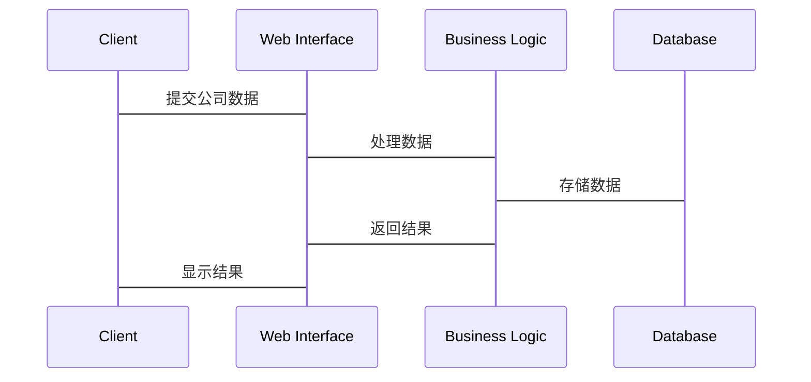

                 


# 格雷厄姆特价股票策略在高科技行业的应用挑战

## 关键词：格雷厄姆，特价股票，价值投资，高科技行业，投资策略，技术挑战

## 摘要：  
格雷厄姆的价值投资策略，尤其是特价股票策略，在传统投资领域取得了显著成功。然而，将其应用于高科技行业时，面临着技术风险、市场波动和财务指标适用性等多重挑战。本文通过详细分析这些挑战，并结合数学模型和算法，探讨如何调整和优化格雷厄姆策略以适应高科技行业的特点。通过实际案例和系统设计，本文为投资者提供了实用的解决方案和最佳实践建议。

---

## 第一部分：格雷厄姆特价股票策略概述

### 第1章：格雷厄姆特价股票策略的核心概念

#### 1.1 格雷厄姆投资理论基础
- **1.1.1 价值投资的定义与核心原则**  
  格雷厄姆的价值投资理论强调以低于内在价值的价格购买优质资产。核心原则包括安全边际、长期投资和逆向思维。

- **1.1.2 格雷厄姆的“特价股票”概念**  
  特价股票是指市场价格远低于其内在价值的股票，通常出现在市场恐慌或公司困境时期。

- **1.1.3 格雷厄姆策略在现代投资中的地位**  
  格雷厄姆策略为价值投资奠定了基础，但需根据市场变化进行调整。

#### 1.2 高科技行业的特点与挑战
- **1.2.1 高科技行业的定义与范围**  
  高科技行业涵盖信息技术、人工智能、生物技术等领域，具有高增长和高波动性。

- **1.2.2 高科技行业的高增长与高风险**  
  高增长意味着高回报，但也伴随着技术过时和市场竞争加剧的风险。

- **1.2.3 高科技行业与传统行业的区别**  
  高科技行业更依赖技术创新，财务指标如研发投入占比、技术专利数量等更为重要。

#### 1.3 格雷厄姆策略在高科技行业的适用性
- **1.3.1 格雷厄姆策略的基本假设**  
  市场价格最终会回归内在价值，但高科技行业的技术更新可能改变这一规律。

- **1.3.2 高科技行业的特殊性对策略的影响**  
  技术创新周期快，传统财务指标如市盈率可能无法准确评估企业价值。

- **1.3.3 策略适用性的初步结论**  
  格雷厄姆策略在高科技行业仍有一定适用性，但需结合行业特点进行调整。

---

## 第二部分：核心概念与联系

### 第2章：核心概念的原理与联系

#### 2.1 价值投资与成长投资的对比
- **2.1.1 价值投资的核心要素**  
  以低于内在价值的价格买入，注重安全边际和长期持有。

- **2.1.2 成长投资的核心要素**  
  买入高成长性股票，注重未来收益潜力，愿意支付溢价。

- **2.1.3 两者的异同点对比**  
  对比表格展示了价值投资注重安全边际，而成长投资注重成长潜力。

#### 2.2 高科技公司的评估标准
- **2.2.1 传统公司的评估指标**  
  市盈率（P/E）、市净率（P/B）、股息率等。

- **2.2.2 高科技公司的特殊评估指标**  
  研发投入占比、技术专利数量、市场增长率等。

- **2.2.3 标准对比表格**  
  制作一个对比表格，展示传统与高科技公司的评估指标差异。

#### 2.3 格雷厄姆策略与高科技行业的关系
- **2.3.1 格雷厄姆策略的核心要素**  
  安全边际、内在价值、低估股票。

- **2.3.2 高科技行业的核心要素**  
  技术创新、市场扩展、竞争格局。

- **2.3.3 两者的联系与区别**  
  制作一个ER图，展示两者在核心要素上的联系与区别。

---

## 第三部分：格雷厄姆策略在高科技行业的应用挑战

### 第3章：格雷厄姆策略在高科技行业的应用挑战

#### 3.1 技术风险的影响
- **3.1.1 技术创新的不确定性**  
  新技术可能导致原有技术迅速过时，影响企业价值。

- **3.1.2 技术落后带来的风险**  
  技术落后可能导致市场份额流失，影响企业盈利能力。

- **3.1.3 技术风险对策略的影响**  
  需在评估中加入技术生命周期分析，动态调整投资决策。

#### 3.2 市场波动的影响
- **3.2.1 高科技行业的高波动性**  
  市场波动大，投资者需具备较强的心理承受能力。

- **3.2.2 市场波动对策略的影响**  
  高波动可能导致策略失效，需调整投资期限和仓位管理。

- **3.2.3 如何应对市场波动**  
  通过分散投资、动态调整和风险管理工具来应对。

#### 3.3 财务指标的适用性
- **3.3.1 传统财务指标的局限性**  
  高科技公司研发投入高，传统指标如市盈率可能失真。

- **3.3.2 高科技公司的特殊财务指标**  
  无形资产、研发投入资本化等需要特别关注。

- **3.3.3 如何调整财务指标以适应高科技行业**  
  建议采用动态市盈率、调整后的ROE等指标。

---

## 第四部分：格雷厄姆策略的数学模型与算法

### 第4章：格雷厄姆策略的数学模型

#### 4.1 价值投资的数学模型
- **4.1.1 市盈率模型**  
  $$ P/E = \frac{\text{股价}}{\text{每股收益}} $$
- **4.1.2 市净率模型**  
  $$ P/B = \frac{\text{股价}}{\text{每股净资产}} $$
- **4.1.3 股息率模型**  
  $$ \text{股息率} = \frac{\text{每股股息}}{\text{股价}} $$

#### 4.2 高科技行业的调整模型
- **4.2.1 调整市盈率模型**  
  $$ \text{调整后 } P/E = \frac{\text{股价}}{\text{调整后每股收益}} $$
- **4.2.2 调整市净率模型**  
  $$ \text{调整后 } P/B = \frac{\text{股价}}{\text{调整后每股净资产}} $$
- **4.2.3 调整股息率模型**  
  $$ \text{调整后股息率} = \frac{\text{每股股息}}{\text{调整后股价}} $$

#### 4.3 数学模型的对比与选择
- **4.3.1 模型的优缺点对比**  
  表格展示不同模型在高科技行业的适用性。
- **4.3.2 如何选择合适的模型**  
  根据公司具体情况选择，注重技术与市场的动态调整。
- **4.3.3 模型的适用场景**  
  针对不同行业阶段和公司特点，灵活应用模型。

---

## 第五章：格雷厄姆策略的算法实现

### 5.1 算法原理
- **5.1.1 算法的基本原理**  
  通过筛选低于内在价值的股票，寻找投资机会。

- **5.1.2 算法的实现步骤**  
  1. 计算公司内在价值。  
  2. 对比市场价格与内在价值。  
  3. 筛选出低估股票。

### 5.2 Python源代码实现
```python
def calculate_intrinsic_value(company_data):
    # 假设company_data包含收入、利润等数据
    # 简单模型：内在价值 = 收入 / 资本成本
    return company_data['收入'] / company_data['资本成本']

def greaham_strategy(company_list, margin_of_safety=0.3):
    selected_stocks = []
    for company in company_list:
        iv = calculate_intrinsic_value(company)
        price = company['股价']
        if price <= iv * (1 - margin_of_safety):
            selected_stocks.append(company)
    return selected_stocks
```

### 5.3 算法的数学模型和公式
- **5.3.1 核心公式**  
  $$ \text{内在价值} = \frac{\text{未来现金流的现值}}{\text{折现率}} $$
- **5.3.2 筛选标准**  
  $$ \text{股价} \leq \text{内在价值} \times (1 - \text{安全边际}) $$

---

## 第六章：系统分析与架构设计

### 6.1 问题场景介绍
- **6.1.1 投资者面临的挑战**  
  如何在高科技行业应用格雷厄姆策略，实现稳健投资。

### 6.2 系统功能设计
- **6.2.1 领域模型（Mermaid 类图）**  
  ```mermaid
  classDiagram
      class Company {
          股价
          内在价值
          安全边际
      }
      class InvestmentStrategy {
          calculate_intrinsic_value()
          greaham_strategy()
      }
      class MarketData {
          提供公司数据
      }
      InvestmentStrategy --> Company: 计算内在价值
      InvestmentStrategy --> MarketData: 获取数据
  ```

- **6.2.2 系统架构设计（Mermaid 架构图）**  
  ```mermaid
  architecture
      Client --> Web Interface
      Web Interface --> Business Logic
      Business Logic --> Database
      Database --> Data Source
  ```

### 6.3 系统接口设计
- **6.3.1 输入接口**  
  提供公司数据，如收入、利润、股价等。
- **6.3.2 输出接口**  
  返回符合格雷厄姆策略的股票列表。

### 6.4 系统交互（Mermaid 序列图）  


---

## 第七章：项目实战

### 7.1 环境安装
- **7.1.1 安装Python和相关库**  
  使用Anaconda安装Python和pandas、numpy等库。

### 7.2 系统核心实现源代码
```python
import pandas as pd

def calculate_intrinsic_value(data):
    return data['收入'] / data['资本成本']

def greaham_strategy(dataframe, margin=0.3):
    iv = dataframe.apply(lambda x: calculate_intrinsic_value(x), axis=1)
    return dataframe[iv * (1 - margin) >= dataframe['股价']]

# 示例数据
data = {
    '公司': ['A', 'B', 'C'],
    '收入': [100, 150, 200],
    '资本成本': [50, 60, 70],
    '股价': [40, 50, 60]
}
df = pd.DataFrame(data)

result = greaham_strategy(df)
print(result)
```

### 7.3 代码应用解读与分析
- **7.3.1 代码功能**  
  根据公司数据计算内在价值，并筛选出符合格雷厄姆策略的股票。

- **7.3.2 代码优化建议**  
  结合高科技行业特点，动态调整安全边际和评估指标。

### 7.4 实际案例分析
- **7.4.1 案例背景**  
  某高科技公司，收入增长快，研发投入高。

- **7.4.2 数据分析与结果**  
  计算内在价值，筛选出符合策略的股票。

- **7.4.3 结果解读**  
  结合市场情况和公司前景，进行投资决策。

### 7.5 项目小结
- **7.5.1 成功经验**  
  理论与实践结合，优化模型适应行业特点。

- **7.5.2 遇到的挑战**  
  数据获取难，模型调整复杂。

- **7.5.3 解决方案**  
  使用公开数据，动态调整模型参数。

---

## 第八章：最佳实践与小结

### 8.1 最佳实践 tips
- **8.1.1 理解行业特点**  
  深入研究高科技行业的技术趋势和市场动态。

- **8.1.2 动态调整模型**  
  根据市场变化和公司情况，灵活调整安全边际和评估指标。

- **8.1.3 保持长期视角**  
  高科技行业波动大，需具备长期投资耐心。

### 8.2 小结
- **8.2.1 核心观点**  
  格雷厄姆策略在高科技行业仍具价值，但需结合行业特点进行调整。

- **8.2.2 未来展望**  
  随着技术进步，策略应用将更加精准和动态。

### 8.3 注意事项
- **8.3.1 风险提示**  
  高科技行业波动大，投资需谨慎。

- **8.3.2 数据可靠性**  
  确保数据来源可靠，避免误导性结论。

### 8.4 拓展阅读
- **8.4.1 推荐书籍**  
  《证券分析》、《投资学原理》。

- **8.4.2 网络资源**  
  提供相关博客、论坛和研究报告链接。

---

## 结语
格雷厄姆特价股票策略在高科技行业的应用虽然面临挑战，但通过理论与实践的结合，投资者仍能有效利用该策略。未来，随着技术进步和市场发展，策略的应用将更加多样化和精准化。

---

**注：本文部分内容需根据实际数据和市场情况进一步验证和完善。**

