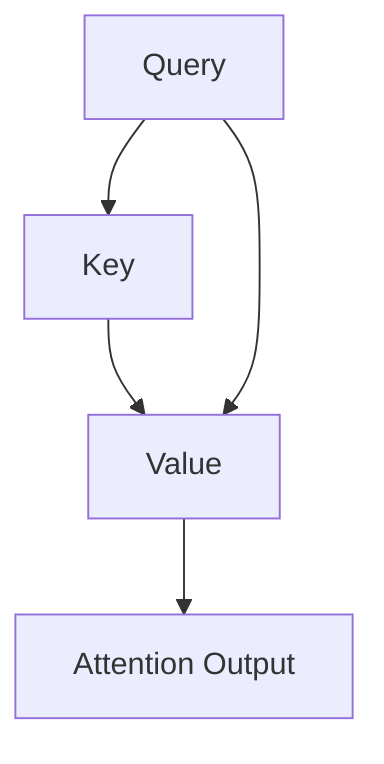
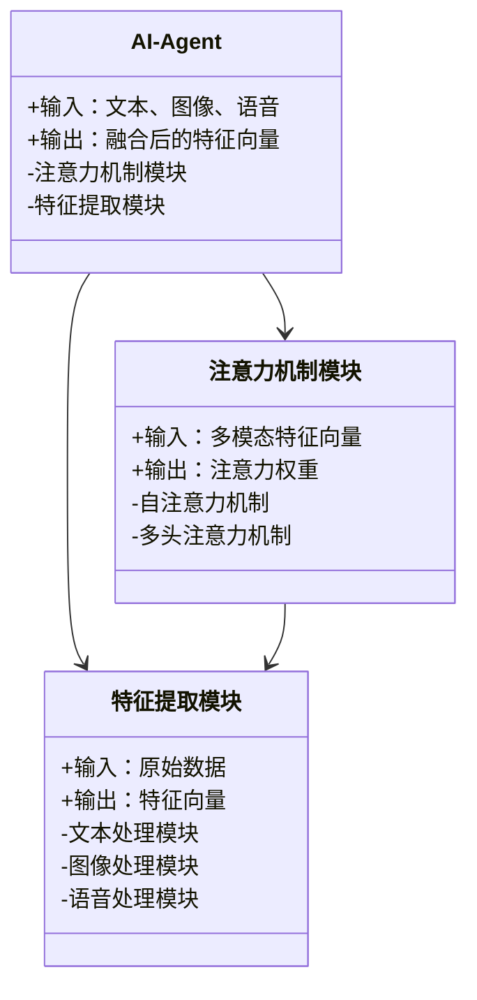
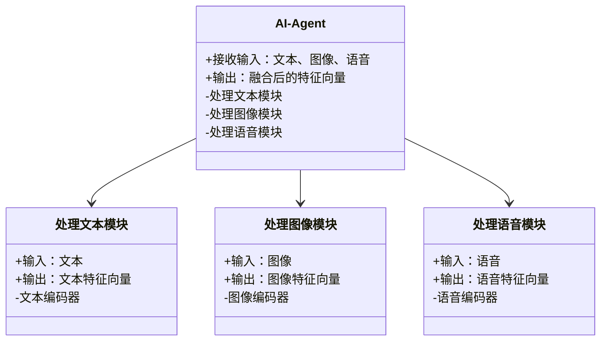
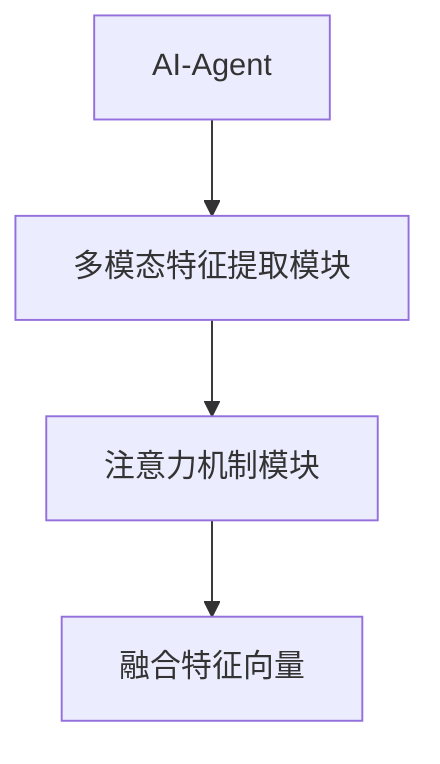
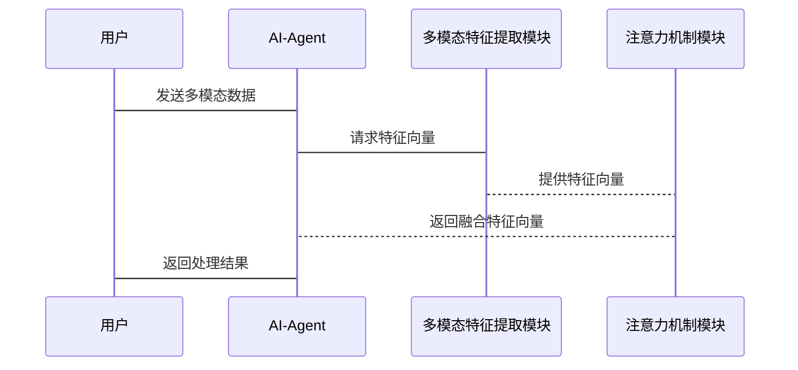

                 


# 注意力机制在AI Agent多模态融合中的应用

## 关键词：注意力机制、AI Agent、多模态融合、Transformer、自注意力、多头注意力

## 摘要

本文深入探讨了注意力机制在AI Agent多模态融合中的应用。从注意力机制的基本概念到其在多模态数据处理中的具体应用，文章详细分析了注意力机制的核心原理、算法实现、数学模型以及在实际系统中的架构设计。通过结合具体的项目实战，本文为读者提供了从理论到实践的全面指导，帮助读者理解如何在AI Agent中有效地应用注意力机制来处理多模态数据。

---

## 第1章：注意力机制的基本概念

### 1.1 从Transformer到注意力机制的提出

注意力机制源于自然语言处理领域的Transformer模型。在传统的循环神经网络（RNN）中，序列处理能力有限，而Transformer通过引入自注意力机制，彻底改变了文本处理的方式。自注意力机制允许模型在处理每个词时，自动关注序列中其他相关词的信息，从而提高了模型的表达能力。

### 1.2 注意力机制的核心思想

注意力机制的核心思想是通过计算输入数据中每个部分的重要性权重，从而决定在后续处理中对这些部分的关注程度。在多模态数据融合中，注意力机制可以帮助模型同时关注文本、图像、语音等多种模态信息中的重要部分，从而实现更高效的特征提取和信息融合。

### 1.3 AI Agent的定义与特点

AI Agent（智能体）是一种能够感知环境、自主决策并执行任务的智能系统。AI Agent可以通过多模态传感器获取多种类型的数据（如文本、图像、语音等），并利用这些数据进行分析和决策。其特点是具备自主性、反应性、目标导向性和社交能力。

### 1.4 多模态融合的背景与挑战

多模态数据融合是指将多种类型的数据（如文本、图像、语音）进行整合，以提高信息处理的效果。在AI Agent中，多模态融合可以帮助智能体更全面地理解环境信息，从而做出更准确的决策。然而，多模态数据的异构性和多样性也为数据融合带来了挑战。

---

## 第2章：注意力机制的数学模型与算法原理

### 2.1 自注意力机制的数学推导

自注意力机制的计算过程可以分为以下几个步骤：

1. **查询（Query）、键（Key）、值（Value）的计算**：
   - 对于输入序列中的每个元素，计算其对应的查询、键和值向量。
   - 公式表示为：
     $$ Q = W_q X $$
     $$ K = W_k X $$
     $$ V = W_v X $$

2. **注意力权重的计算**：
   - 计算查询与所有键的点积，然后除以嵌入维度的平方根。
     $$ \text{score}(i, j) = \frac{Q_i \cdot K_j}{\sqrt{d_k}} $$
   - 应用Softmax函数计算注意力权重。
     $$ \alpha_{i,j} = \text{softmax}(\text{score}(i,j)) $$

3. **加权求和**：
   - 根据注意力权重对所有值向量进行加权求和。
     $$ \text{Attention}(i) = \sum_{j=1}^{n} \alpha_{i,j} V_j $$

### 2.2 多头注意力机制的原理

多头注意力机制通过并行计算多个子空间中的注意力，进一步提高了模型的表达能力。具体步骤如下：

1. **将查询、键和值向量分割为多个子空间**：
   - 将输入向量分割为多个子向量，每个子向量的维度为原始维度的1/num_heads。
   
2. **在每个子空间中独立计算注意力权重**：
   - 对每个子空间，分别计算查询、键和值的点积，然后计算注意力权重。
   
3. **将多个子空间的注意力结果拼接**：
   - 将所有子空间的注意力结果拼接成一个向量，然后通过全连接层进行变换。

### 2.3 注意力机制的核心属性对比

以下是不同注意力机制的核心属性对比：

| 注意力机制 | 是否考虑位置信息 | 是否并行计算 | 表现效果 |
|------------|----------------|------------|----------|
| 单头注意力 | 否 | 否 | 表现一般 |
| 多头注意力 | 否 | 是 | 表现优异 |
| 带位置编码的多头注意力 | 是 | 是 | 表现最优 |

### 2.4 ER实体关系图架构

以下是注意力机制在实体关系图中的应用示意图：



---

## 第3章：多模态数据融合的注意力机制设计

### 3.1 多模态数据融合的场景分析

在AI Agent中，多模态数据融合的场景可以包括：

- **文本与图像融合**：结合文本描述和图像内容，用于图像问答任务。
- **文本与语音融合**：结合文本和语音信息，用于语音辅助文本理解任务。
- **图像与语音融合**：结合图像和语音信息，用于多模态语音识别任务。

### 3.2 多模态数据融合的系统架构设计

以下是多模态数据融合的系统架构设计：



### 3.3 多模态融合中的注意力机制实现

以下是多模态融合的注意力机制实现代码：

```python
import tensorflow as tf

def multi_head_attention(inputs, num_heads, d_model):
    # 分割查询、键、值
    query, key, value = tf.split(inputs, num_or_size_splits=3, axis=-1)
    
    # 线性变换
    query = tf.layers.dense(query, d_model // num_heads)
    key = tf.layers.dense(key, d_model // num_heads)
    value = tf.layers.dense(value, d_model // num_heads)
    
    # 展开维度
    query = tf.reshape(query, (-1, tf.shape(query)[1], num_heads, d_model // num_heads))
    key = tf.reshape(key, (-1, tf.shape(key)[1], num_heads, d_model // num_heads))
    value = tf.reshape(value, (-1, tf.shape(value)[1], num_heads, d_model // num_heads))
    
    # 计算注意力权重
    attention_weights = tf.matmul(query, key, transpose_b=True)
    attention_weights = attention_weights / tf.sqrt(d_model // num_heads)
    attention_weights = tf.nn.softmax(attention_weights)
    
    # 加权求和
    output = tf.matmul(attention_weights, value)
    output = tf.reshape(output, (-1, tf.shape(output)[1], num_heads * (d_model // num_heads)))
    
    # 输出线性变换
    output = tf.layers.dense(output, d_model)
    return output
```

### 3.4 多模态融合的数学模型

多模态融合的数学模型如下：

$$ \text{Output} = \text{Multi-head}(Q, K, V) $$

其中，$Q$、$K$、$V$分别是查询、键、值向量，$\text{Multi-head}$表示多头注意力机制。

---

## 第4章：系统分析与架构设计方案

### 4.1 问题场景介绍

在实际应用中，AI Agent需要处理多种模态的数据。例如，在智能音箱中，AI Agent需要同时处理用户的语音指令和相关联的文本信息。

### 4.2 系统功能设计

以下是系统功能设计的领域模型：



### 4.3 系统架构设计

以下是系统架构设计的架构图：



### 4.4 系统接口设计

系统接口设计如下：

- **输入接口**：接收多种模态的数据（如文本、图像、语音）。
- **输出接口**：输出融合后的特征向量。
- **内部接口**：特征提取模块与注意力机制模块之间的接口。

### 4.5 系统交互流程图

以下是系统交互流程图：



---

## 第5章：项目实战

### 5.1 环境安装

需要安装以下环境和库：

```bash
pip install tensorflow
pip install numpy
pip install matplotlib
pip install mermaid
```

### 5.2 系统核心实现源代码

以下是注意力机制在多模态融合中的实现代码：

```python
import tensorflow as tf
import numpy as np

def multi_head_attention(inputs, num_heads, d_model):
    # 分割查询、键、值
    query, key, value = tf.split(inputs, num_or_size_splits=3, axis=-1)
    
    # 线性变换
    query = tf.layers.dense(query, d_model // num_heads)
    key = tf.layers.dense(key, d_model // num_heads)
    value = tf.layers.dense(value, d_model // num_heads)
    
    # 展开维度
    query = tf.reshape(query, (-1, tf.shape(query)[1], num_heads, d_model // num_heads))
    key = tf.reshape(key, (-1, tf.shape(key)[1], num_heads, d_model // num_heads))
    value = tf.reshape(value, (-1, tf.shape(value)[1], num_heads, d_model // num_heads))
    
    # 计算注意力权重
    attention_weights = tf.matmul(query, key, transpose_b=True)
    attention_weights = attention_weights / tf.sqrt(d_model // num_heads)
    attention_weights = tf.nn.softmax(attention_weights)
    
    # 加权求和
    output = tf.matmul(attention_weights, value)
    output = tf.reshape(output, (-1, tf.shape(output)[1], num_heads * (d_model // num_heads)))
    
    # 输出线性变换
    output = tf.layers.dense(output, d_model)
    return output

# 示例代码
inputs = tf.random.normal([1, 10, 128])
outputs = multi_head_attention(inputs, num_heads=8, d_model=128)
print(outputs.shape)
```

### 5.3 代码应用解读与分析

上述代码实现了多头注意力机制，其中输入是一个张量，输出是经过注意力机制处理后的张量。代码的关键部分包括：

- **分割查询、键、值**：将输入张量分割为查询、键、值三部分。
- **线性变换**：对查询、键、值进行线性变换，降低维度。
- **计算注意力权重**：通过点积和Softmax函数计算注意力权重。
- **加权求和**：根据注意力权重对值向量进行加权求和。
- **输出线性变换**：对结果进行全连接变换，恢复原始维度。

### 5.4 实际案例分析和详细讲解

以图像问答任务为例，假设输入是一张图像和一个文本描述，通过多模态注意力机制，模型可以同时关注图像中的关键区域和文本中的关键词汇，从而生成更准确的答案。

### 5.5 项目小结

通过上述代码和分析，我们可以看到注意力机制在多模态数据融合中的强大能力。通过合理设计和实现注意力机制，AI Agent能够更高效地处理多模态数据，提升其智能性和准确性。

---

## 第6章：最佳实践 tips、小结、注意事项、拓展阅读

### 6.1 小结

本文详细介绍了注意力机制在AI Agent多模态融合中的应用，从基本概念到算法实现，再到系统设计和项目实战，为读者提供了全面的指导。

### 6.2 注意事项

- 在实际应用中，需要注意不同模态数据的异构性，合理设计特征提取模块。
- 注意力机制的计算复杂度较高，需要在模型优化和计算效率之间进行权衡。
- 在多模态数据融合中，可以结合其他机制（如对比学习）进一步提升模型性能。

### 6.3 拓展阅读

- 《Attention Is All You Need》：深入了解注意力机制的原理和应用。
- 《Multi-Modal Transformer for Image Captioning》：学习多模态Transformer在图像描述生成中的应用。
- 《A Survey on Multi-Modal Deep Learning》：了解多模态深度学习的最新进展。

---

## 总结

通过本文的详细讲解，读者可以全面理解注意力机制在AI Agent多模态融合中的应用，并能够将其应用到实际项目中。希望本文能够为相关领域的研究和实践提供有价值的参考。

