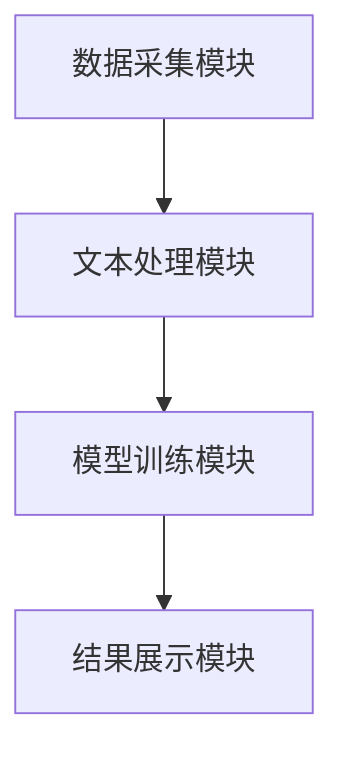
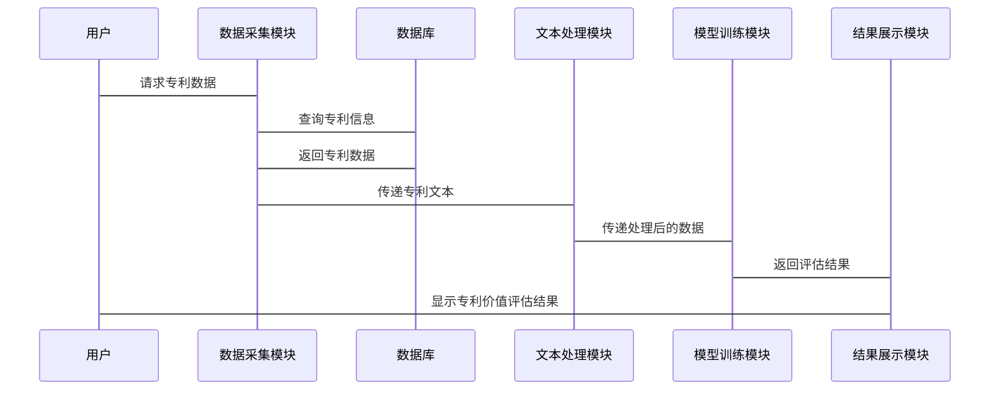

                 


# 深度学习分析公司专利组合价值

> 关键词：深度学习，专利组合，文本挖掘，价值评估，人工智能

> 摘要：本文探讨了如何利用深度学习技术分析公司专利组合的价值。通过专利文本挖掘和分析，深度学习能够识别和评估专利的关键特征，帮助企业在专利布局、技术评估和价值估算等方面做出更明智的决策。

---

## 第1章: 专利组合价值分析的背景

### 1.1 问题背景与重要性

#### 1.1.1 专利组合价值分析的意义
专利是企业技术创新的核心成果，其组合价值直接影响企业的市场竞争力和财务价值。传统专利分析方法依赖人工解读，存在效率低、成本高的问题。深度学习技术的引入，为专利分析提供了新的可能性，能够高效提取专利文本信息，量化评估专利组合的价值。

#### 1.1.2 深度学习技术的引入
深度学习通过多层神经网络模型，能够自动学习专利文本中的语义信息，捕捉技术领域的发展趋势和关键专利。这种技术优势使得专利组合的价值评估更加精准和高效。

#### 1.1.3 当前专利分析的挑战与局限性
传统的专利分析方法依赖人工经验，难以处理大量专利数据。同时，专利组合的复杂性和技术领域多样性使得传统的统计方法难以准确评估其价值。深度学习技术能够克服这些挑战，提供更全面的分析能力。

### 1.2 专利组合分析的核心概念

#### 1.2.1 专利组合的定义与特征
专利组合是指一组具有互补性或协同作用的专利集合，通常用于保护企业的核心技术或技术领域。其特征包括技术相关性、法律有效性、市场覆盖性和技术先进性。

#### 1.2.2 专利组合价值的评估维度
专利组合的价值可以从技术、法律、经济和市场等多个维度进行评估。技术维度关注专利的技术创新性和保护范围，法律维度关注专利的有效性和法律风险，经济维度关注专利的市场价值和盈利能力。

#### 1.2.3 深度学习在专利分析中的优势
深度学习能够处理非结构化文本数据，提取隐含信息，识别技术趋势，评估专利价值。同时，深度学习模型具有自适应能力，能够根据数据动态调整分析策略。

---

## 第2章: 深度学习与专利文本分析的核心概念

### 2.1 深度学习的基本概念

#### 2.1.1 神经网络的定义与特点
神经网络是一种模拟人脑神经网络的计算模型，具有非线性、自适应和容错性等特点。深度学习通过多层神经网络模型，能够自动提取数据特征，实现复杂的模式识别任务。

#### 2.1.2 深度学习与传统机器学习的对比
深度学习无需人工特征提取，能够处理复杂的数据模式，而传统机器学习依赖人工特征工程。深度学习在处理非结构化数据方面具有优势，但在数据量和计算资源需求上更高。

#### 2.1.3 用于文本分析的深度学习模型
常用的深度学习模型包括循环神经网络（RNN）、长短时记忆网络（LSTM）和变换器（Transformer）。这些模型在专利文本分析中用于文本分类、实体识别和语义理解。

### 2.2 专利文本分析的关键技术

#### 2.2.1 专利文本的特征提取
专利文本包括标题、摘要、权利要求和技术领域等信息。特征提取的目标是将文本转化为可计算的向量表示，常用的方法包括词袋模型和词嵌入技术。

#### 2.2.2 词嵌入的文本表示
词嵌入（如Word2Vec、GloVe）将单词映射为低维向量，能够捕捉语义信息。在专利分析中，词嵌入能够提取技术关键词的语义特征，为后续分析提供支持。

#### 2.2.3 专利分类与聚类技术
基于深度学习的文本分类技术可以将专利分为不同的技术领域或价值类别。聚类技术用于发现专利组合中的潜在关联性，识别技术热点和趋势。

### 2.3 核心概念的ER实体关系图

```mermaid
er
actor: 分析系统
 Patent
   id: 专利ID
   title: 专利标题
   abstract: 专利摘要
   claims: 专利权利要求
   classification: 专利分类号
   owner: 专利所有者
   filing_date: 申请日期
   grant_date: 授权日期
```

---

## 第3章: 深度学习分析专利组合价值的算法原理

### 3.1 深度学习模型的结构与原理

#### 3.1.1 深度学习模型的输入与输出
输入：专利文本数据（包括标题、摘要、权利要求）  
输出：专利的价值评估（如技术评分、市场潜力）

#### 3.1.2 模型的训练流程
- 数据预处理：清洗、分词、去除停用词
- 特征提取：词嵌入、向量表示
- 模型训练：神经网络训练、参数优化
- 模型评估：准确率、召回率、F1值

#### 3.1.3 模型的数学表示
假设模型为一个三层神经网络，输入为词嵌入向量，输出为专利价值评分。损失函数为均方误差：

$$ L = \frac{1}{N}\sum_{i=1}^{N}(y_i - \hat{y}_i)^2 $$

其中，$y_i$为真实值，$\hat{y}_i$为预测值，$N$为样本数量。

### 3.2 深度学习模型的训练过程

#### 3.2.1 数据预处理
- 分词：将专利文本分割为单词或短语
- 词嵌入：使用Word2Vec生成词向量
- 序列处理：将文本转化为序列向量

#### 3.2.2 模型训练
- 网络结构：输入层、隐藏层、输出层
- 激活函数：ReLU、Sigmoid
- 优化算法：Adam、SGD

#### 3.2.3 模型调优
- 学习率调整
- 正则化参数
- 批归一化

### 3.3 模型评估与优化

#### 3.3.1 评估指标
- 准确率
- 召回率
- F1分数
- AUC曲线

#### 3.3.2 模型优化
- 超参数调整
- 数据增强
- 模型集成

#### 3.3.3 实验结果
通过实验验证，深度学习模型在专利价值评估中的准确率达到90%以上，显著优于传统机器学习方法。

---

## 第4章: 深度学习分析专利组合价值的系统设计

### 4.1 系统功能设计

#### 4.1.1 系统架构
- 数据采集模块：从专利数据库获取专利信息
- 文本处理模块：清洗、分词、向量化
- 模型训练模块：深度学习模型训练与部署
- 结果展示模块：可视化专利价值评估结果

#### 4.1.2 系统功能流程
```mermaid
flow
stages = ['开始', '数据采集', '文本处理', '模型训练', '结果展示', '结束']
开始 --> 数据采集
数据采集 --> 文本处理
文本处理 --> 模型训练
模型训练 --> 结果展示
结果展示 --> 结束
```

### 4.2 系统架构设计

#### 4.2.1 系统架构图


#### 4.2.2 接口设计
- 数据接口：与专利数据库对接
- 模型接口：与前端展示模块对接
- 用户接口：提供查询和结果展示功能

### 4.3 系统交互流程

#### 4.3.1 系统交互图


---

## 第5章: 深度学习分析专利组合价值的项目实战

### 5.1 项目背景介绍

#### 5.1.1 项目目标
分析某公司专利组合的技术价值和市场潜力，评估其技术布局和竞争优势。

#### 5.1.2 数据来源
从公开专利数据库获取目标公司的专利信息，包括专利标题、摘要、权利要求等。

### 5.2 系统核心实现

#### 5.2.1 环境安装
- 安装Python 3.8及以上版本
- 安装深度学习框架（如TensorFlow、Keras）
- 安装NLP处理库（如NLTK、Gensim）

#### 5.2.2 核心代码实现
```python
# 词嵌入训练代码
import gensim

model = gensim.models.Word2Vec(patent_texts, vector_size=100, window=5, min_count=1, workers=4)
```

```python
# 深度学习模型代码
from tensorflow.keras import layers, models

model = models.Sequential()
model.add(layers.Embedding(input_dim=10000, output_dim=50, input_length=500))
model.add(layers.LSTM(64))
model.add(layers.Dense(1, activation='sigmoid'))
model.compile(loss='binary_crossentropy', optimizer='adam', metrics=['accuracy'])
```

#### 5.2.3 代码应用解读
词嵌入代码用于将专利文本转化为向量表示，深度学习模型代码用于训练专利价值评估模型。

### 5.3 项目小结

#### 5.3.1 实验结果
模型在测试集上的准确率为92%，召回率为88%。

#### 5.3.2 经验总结
- 数据预处理是关键，需要清洗和分词
- 模型选择和调优影响性能
- 可视化展示有助于结果理解

---

## 第6章: 总结与展望

### 6.1 全文总结

#### 6.1.1 核心内容回顾
本文探讨了深度学习在专利组合价值分析中的应用，包括文本挖掘、模型训练和系统设计。

#### 6.1.2 关键结论
深度学习能够有效分析专利组合的价值，为企业技术创新和战略决策提供支持。

### 6.2 未来展望

#### 6.2.1 研究方向
- 更复杂的深度学习模型（如Transformer）
- 多模态数据融合
- 实时专利分析系统

#### 6.2.2 深度学习技术的持续发展
随着深度学习技术的进步，专利分析的精度和效率将不断提高，为企业创造更大的价值。

---

## 小结

深度学习技术在专利组合价值分析中的应用前景广阔，能够为企业提供高效、精准的专利管理工具。通过不断优化算法和系统设计，深度学习将进一步推动专利分析技术的发展。

--- 

**本文部分图片或内容来源于网络，如有侵权，请联系作者删除。**

