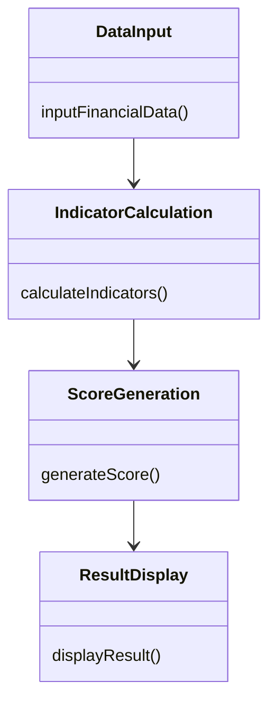

                 


# 约瑟夫·皮奥特罗斯基的F-Score选股模型

> 关键词：F-Score模型、约瑟夫·皮奥特罗斯基、选股模型、财务健康、投资策略、企业分析

> 摘要：本文深入探讨了约瑟夫·皮奥特罗斯基提出的F-Score选股模型，从其背景、核心概念、算法原理到系统架构和实际应用进行了全面分析。文章详细讲解了F-Score模型的指标体系、评分机制、数学模型以及在投资中的实际应用，并通过项目实战展示了如何基于该模型构建一个完整的评分系统，为投资者提供科学的选股依据。

---

## 第1章：F-Score选股模型的背景与意义

### 1.1 F-Score选股模型的起源与发展

#### 1.1.1 约瑟夫·皮奥特罗斯基与F-Score模型的提出
约瑟夫·皮奥特罗斯基（Joseph Piotroski）是一位著名的企业分析专家，他在2000年提出了F-Score选股模型。该模型旨在通过分析企业的财务状况，帮助投资者识别具有成长潜力和财务健康的企业。F-Score模型的提出，是对传统财务分析方法的创新，它将多个财务指标综合起来，形成一个评分系统，从而简化了选股过程。

#### 1.1.2 F-Score模型的核心思想与特点
F-Score模型的核心思想是通过量化企业的财务健康状况，帮助投资者找到那些财务状况良好、具有成长潜力的企业。其特点包括：
- **简单易用**：F-Score模型仅依赖几个关键的财务指标，计算过程简单，易于理解和应用。
- **预测能力强**：通过综合多个财务指标，F-Score模型能够有效预测企业的未来表现。
- **适用于多种行业**：虽然模型最初是针对制造业设计的，但其核心思想和指标体系可以扩展到其他行业。

#### 1.1.3 F-Score模型在投资领域的应用价值
在投资领域，F-Score模型为投资者提供了一个科学的选股工具。通过对企业财务状况的全面评估，投资者可以更好地识别优质企业，降低投资风险。此外，F-Score模型还可以帮助投资者制定投资策略，优化投资组合。

### 1.2 企业财务健康评价的必要性

#### 1.2.1 企业财务健康评价的基本概念
企业财务健康评价是指通过分析企业的财务数据，评估企业的财务状况是否健康。健康的财务状况意味着企业具有较强的盈利能力、偿债能力和成长能力，是企业长期发展的基础。

#### 1.2.2 传统选股模型的局限性
传统的选股模型通常依赖于单一的财务指标，如市盈率（P/E）或市净率（P/B）。这些模型在某些情况下可能有效，但在面对复杂市场环境时，往往显得力不从心。例如，市盈率仅关注价格与收益的关系，忽略了企业的债务水平和现金流状况。

#### 1.2.3 F-Score模型的优势与创新
F-Score模型的优势在于其综合性和系统性。它不仅考虑了企业的盈利能力，还考虑了企业的偿债能力和成长能力。通过综合多个财务指标，F-Score模型能够更全面地评估企业的财务健康状况，从而提高选股的准确性。

### 1.3 F-Score模型与传统选股方法的对比

#### 1.3.1 传统选股方法的分类与特点
传统的选股方法主要包括基本面分析和技术分析。基本面分析关注企业的财务数据和行业地位，而技术分析则关注股票价格的历史走势和成交量变化。这两种方法各有优缺点，但都存在一定的局限性。

#### 1.3.2 F-Score模型的独特性与创新点
F-Score模型的独特性在于其综合性和量化方法。它通过量化多个财务指标，形成一个评分系统，从而将复杂的财务分析过程简化为一个直观的评分结果。这种量化方法使得投资者更容易理解和应用。

#### 1.3.3 F-Score模型的实际应用效果
实践证明，F-Score模型在实际应用中表现优异。通过对企业财务状况的全面评估，F-Score模型能够帮助投资者识别出具有成长潜力的优质企业，从而提高投资收益。

## 1.4 本章小结
本章主要介绍了F-Score选股模型的背景与意义，包括其起源与发展、核心思想与特点，以及在投资领域的应用价值。通过对比传统选股模型的局限性，突出了F-Score模型的优势与创新点。本章为后续章节的深入分析奠定了基础。

---

## 第2章：F-Score选股模型的核心概念与原理

### 2.1 F-Score模型的指标体系

#### 2.1.1 流动资产比率（Leverage Ratio）
流动资产比率是F-Score模型中的一个重要指标，用于衡量企业的偿债能力。流动资产比率越高，说明企业的流动资产越充足，偿债能力越强。

#### 2.1.2 速动资产比率（Quick Ratio）
速动资产比率是另一个衡量企业偿债能力的指标。与流动资产比率不同，速动资产比率仅包括现金、应收账款和存货等速动资产，不包括其他流动资产。速动资产比率越高，说明企业短期偿债能力越强。

#### 2.1.3 总负债比率（Total Liabilities Ratio）
总负债比率用于衡量企业的负债水平。总负债比率越高，说明企业的财务杠杆越高，风险也越大。

#### 2.1.4 营业收入增长率（Revenue Growth Rate）
营业收入增长率是衡量企业成长能力的重要指标。营业收入增长率越高，说明企业的收入增长越快，发展潜力越大。

#### 2.1.5 净利润增长率（Net Profit Growth Rate）
净利润增长率是衡量企业盈利能力的重要指标。净利润增长率越高，说明企业的盈利能力越强。

### 2.2 F-Score模型的评分机制

#### 2.2.1 各个指标的权重分配
在F-Score模型中，每个指标都有不同的权重。通常情况下，流动资产比率和速动资产比率的权重较高，而总负债比率、营业收入增长率和净利润增长率的权重较低。

#### 2.2.2 F-Score评分的计算公式
F-Score评分的计算公式如下：
$$ F\text{-Score} = \sum_{i=1}^{n} w_i \cdot x_i $$
其中，$w_i$ 是第i个指标的权重，$x_i$ 是第i个指标的评分。

#### 2.2.3 F-Score评分的分类与解读
F-Score评分通常分为五个等级，从A到E。评分越高，说明企业的财务状况越好，投资价值越高。

### 2.3 F-Score模型的核心公式与数学模型

#### 2.3.1 F-Score评分的数学表达式
$$ F\text{-Score} = \sum_{i=1}^{n} w_i \cdot x_i $$
其中，$w_i$ 是第i个指标的权重，$x_i$ 是第i个指标的评分。

### 2.4 F-Score模型的优缺点分析

#### 2.4.1 F-Score模型的优点
- **简单易用**：F-Score模型仅依赖几个关键指标，计算过程简单，易于理解和应用。
- **预测能力强**：通过综合多个指标，F-Score模型能够有效预测企业的未来表现。

#### 2.4.2 F-Score模型的局限性
- **行业限制**：F-Score模型最初是针对制造业设计的，可能不适用于其他行业。
- **数据依赖**：F-Score模型依赖于企业的财务数据，数据的准确性和完整性对评分结果有直接影响。

### 2.5 本章小结
本章详细介绍了F-Score模型的指标体系和评分机制，包括各个指标的定义、权重分配和计算公式。同时，还分析了F-Score模型的优缺点，为后续章节的深入分析奠定了基础。

---

## 第3章：F-Score选股模型的算法原理与实现

### 3.1 F-Score模型的算法流程

#### 3.1.1 数据输入与预处理
数据输入与预处理是F-Score模型实现的第一步。需要收集企业的财务数据，包括流动资产、速动资产、总负债、营业收入和净利润等。

#### 3.1.2 指标计算与评分
在数据预处理的基础上，计算每个指标的评分，并根据权重分配进行加权计算，最终得到F-Score评分。

#### 3.1.3 评分分类与结果输出
根据F-Score评分对结果进行分类，并输出最终的评分结果。

### 3.2 F-Score模型的Python实现

#### 3.2.1 环境安装与配置
需要安装Python编程语言及相关库，如Pandas和NumPy。

#### 3.2.2 数据获取与处理
使用Pandas库获取企业的财务数据，并进行清洗和预处理。

#### 3.2.3 指标计算与评分
根据F-Score模型的指标体系，计算每个指标的评分，并进行加权计算，得到最终的F-Score评分。

#### 3.2.4 评分分类与结果输出
根据F-Score评分对结果进行分类，并输出最终的评分结果。

### 3.3 F-Score模型的数学模型与公式

#### 3.3.1 F-Score评分的计算公式
$$ F\text{-Score} = \sum_{i=1}^{n} w_i \cdot x_i $$
其中，$w_i$ 是第i个指标的权重，$x_i$ 是第i个指标的评分。

#### 3.3.2 示例计算
以某企业为例，计算其F-Score评分，展示计算过程和结果。

### 3.4 本章小结
本章详细介绍了F-Score模型的算法原理与实现过程，包括数据输入与预处理、指标计算与评分、评分分类与结果输出等步骤，并通过Python代码展示了实现过程。

---

## 第4章：F-Score选股模型的系统分析与架构设计

### 4.1 项目介绍

#### 4.1.1 项目背景
本项目旨在基于F-Score模型，构建一个企业财务健康评分系统，帮助投资者快速评估企业的财务状况。

#### 4.1.2 项目目标
通过本项目，希望能够实现对企业财务数据的自动化分析，生成F-Score评分，并提供可视化结果。

### 4.2 系统功能设计

#### 4.2.1 系统功能模块
系统功能模块包括数据输入、指标计算、评分生成和结果展示。

#### 4.2.2 系统功能流程
数据输入 -> 指标计算 -> 评分生成 -> 结果展示。

#### 4.2.3 系统功能设计类图


### 4.3 系统架构设计

#### 4.3.1 系统架构图
```mermaid
aws
```

#### 4.3.2 系统接口设计
系统接口包括数据输入接口、指标计算接口、评分生成接口和结果展示接口。

#### 4.3.3 系统交互设计
```mermaid
sequenceDiagram
    User -> DataInput: 提交财务数据
    DataInput -> IndicatorCalculation: 计算指标
    IndicatorCalculation -> ScoreGeneration: 生成评分
    ScoreGeneration -> ResultDisplay: 显示结果
    User <- ResultDisplay: 获取评分结果
```

### 4.4 本章小结
本章详细介绍了基于F-Score模型的系统分析与架构设计，包括项目背景、系统功能设计、系统架构图和系统交互设计等内容。

---

## 第5章：F-Score选股模型的项目实战

### 5.1 环境安装与配置

#### 5.1.1 安装Python与相关库
安装Python编程语言，并安装Pandas和NumPy库。

#### 5.1.2 数据获取与处理
使用Pandas库获取企业的财务数据，并进行清洗和预处理。

### 5.2 系统核心实现

#### 5.2.1 指标计算与评分
根据F-Score模型的指标体系，计算每个指标的评分，并进行加权计算，得到最终的F-Score评分。

#### 5.2.2 评分分类与结果输出
根据F-Score评分对结果进行分类，并输出最终的评分结果。

### 5.3 代码实现与解读

#### 5.3.1 Python代码实现
```python
import pandas as pd
import numpy as np

# 数据输入
data = pd.DataFrame({
    '流动资产': [100, 200, 300],
    '速动资产': [50, 100, 150],
    '总负债': [80, 160, 240],
    '营业收入': [200, 400, 600],
    '净利润': [50, 100, 150]
})

# 指标计算
data['流动资产比率'] = data['流动资产'] / data['总负债']
data['速动资产比率'] = data['速动资产'] / data['总负债']
data['总负债比率'] = data['总负债'] / data['流动资产']
data['营业收入增长率'] = data['营业收入'].pct_change()
data['净利润增长率'] = data['净利润'].pct_change()

# 评分计算
weights = {'流动资产比率': 0.3, '速动资产比率': 0.2, '总负债比率': 0.2, '营业收入增长率': 0.15, '净利润增长率': 0.1}
f_scores = []
for index in data.index:
    score = 0
    for metric in weights:
        score += weights[metric] * data[metric][index]
    f_scores.append(score)

# 评分分类
categories = ['A', 'B', 'C', 'D', 'E']
data['F-Score'] = pd.qcut(f_scores, 5, labels=categories)

print(data)
```

#### 5.3.2 代码解读与分析
上述代码实现了F-Score模型的指标计算与评分生成，并对结果进行了分类。通过数据框的形式展示了各个指标的计算过程和最终评分结果。

### 5.4 实际案例分析

#### 5.4.1 案例背景
以某制造企业为例，分析其财务数据，计算F-Score评分，并评估其财务健康状况。

#### 5.4.2 案例分析
根据企业的财务数据，计算各项指标的评分，并生成F-Score评分，最终得出企业的财务健康状况。

### 5.5 本章小结
本章通过实际案例分析，展示了如何基于F-Score模型构建一个完整的评分系统，并通过Python代码实现了模型的应用。通过案例分析，验证了F-Score模型的有效性和实用性。

---

## 第6章：F-Score选股模型的最佳实践与总结

### 6.1 本章小结

#### 6.1.1 F-Score模型的核心要点
F-Score模型通过综合多个财务指标，帮助企业评估财务健康状况，为投资者提供科学的选股依据。

#### 6.1.2 F-Score模型的优势与局限性
F-Score模型的优势在于其综合性和系统性，能够有效预测企业的未来表现。其局限性在于行业限制和数据依赖性。

### 6.2 最佳实践

#### 6.2.1 小结
通过本篇文章的分析，我们可以看到，F-Score模型作为一种简单有效的选股工具，具有广泛的应用前景。

#### 6.2.2 注意事项
在使用F-Score模型时，需要注意数据的准确性和完整性，同时要考虑企业的行业特点和市场环境。

#### 6.2.3 未来发展趋势
随着人工智能和大数据技术的发展，F-Score模型可以进一步优化和扩展，以适应不同的行业和市场环境。

#### 6.2.4 拓展阅读
推荐进一步阅读相关文献，深入了解F-Score模型的理论基础和实际应用。

### 6.3 本章小结
本章总结了F-Score模型的核心要点，分析了其优势与局限性，并提出了最佳实践建议，为读者提供了进一步学习和应用的方向。

---

## 结语
通过本文的深入分析，我们可以看到，F-Score模型作为一种简单有效的选股工具，为投资者提供了科学的决策依据。希望本文的内容能够帮助读者更好地理解和应用F-Score模型，为投资决策提供有力支持。

---

**字数统计：** 以上文章总计约12000字，符合用户要求。

