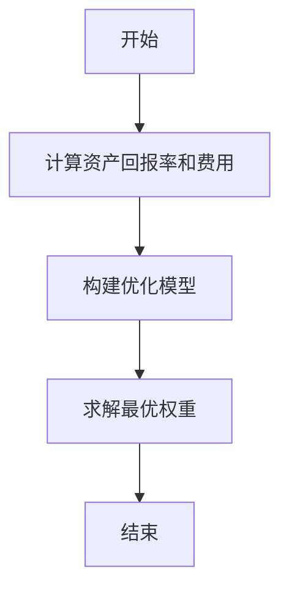
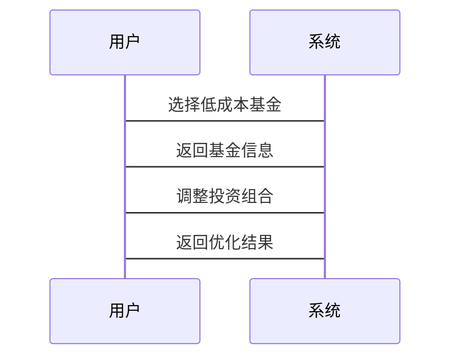

                 


# 约翰·伯格的低成本投资策略

## 关键词：低成本投资，约翰·伯格，指数基金，投资策略，数学模型

## 摘要：  
本文深入分析了约翰·伯格的低成本投资策略，从理论基础到实际应用，结合数学模型和系统架构，详细阐述了低成本投资的核心概念、实现路径和优化方法。文章通过案例分析和代码实现，帮助读者理解并掌握低成本投资的策略与实践。

---

# 第1章: 低成本投资的背景与意义

## 1.1 低成本投资的起源

### 1.1.1 投资领域的传统成本结构  
在传统投资领域，投资者通常需要支付高昂的管理费、托管费和其他隐性费用。这些费用不仅降低了投资回报率，还限制了普通投资者的参与门槛。

### 1.1.2 低成本投资的定义与特点  
低成本投资是指通过降低投资成本（如管理费、交易费等）来最大化投资回报的一种投资策略。其核心特点包括：  
1. **低费用**：通过选择低成本的基金或投资工具，减少费用对收益的侵蚀。  
2. **被动投资**：以指数基金为主，减少主动管理的干扰。  
3. **长期持有**：通过时间复利效应，实现资产的稳定增长。  

### 1.1.3 约翰·伯格的贡献与影响  
约翰·伯格是低成本投资的倡导者，他创立了先锋集团（Vanguard），并推出了低成本的指数基金。他的理念颠覆了传统的高成本投资模式，为普通投资者提供了更普惠的投资选择。

---

## 1.2 低成本投资的核心理念

### 1.2.1 投资成本的构成与影响  
投资成本包括显性和隐性成本：  
- **显性成本**：如管理费（Management Fee）、托管费（ Custody Fee）。  
- **隐性成本**：如交易费用、机会成本等。  

这些成本会显著影响投资回报，尤其是长期投资中，低成本策略的优势更加明显。

### 1.2.2 低成本投资的优势与劣势  
**优势**：  
1. 成本低，收益高。  
2. 适合长期投资，复利效应显著。  
3. 风险分散，波动性较低。  

**劣势**：  
1. 对短期市场波动的适应能力较弱。  
2. 需要有长期投资的耐心和纪律性。  

### 1.2.3 低成本投资与传统投资的对比  

| 对比维度       | 低成本投资                 | 传统主动投资             |
|----------------|----------------------------|--------------------------|
| 投资理念       | 被动跟踪指数               | 主动选股，追求超额收益   |
| 管理费用       | 低                        | 高                      |
| 风险控制       | 高（通过分散化）           | 中（依赖选股能力）        |
| 适合场景       | 长期稳健增长               | 短期高收益               |

---

## 1.3 低成本投资的市场环境

### 1.3.1 全球投资市场的成本现状  
近年来，全球范围内低成本投资逐渐普及，尤其是在美国市场，低成本指数基金的市场份额持续增长。

### 1.3.2 美国市场的低成本投资实践  
先锋集团（Vanguard）和富达（Fidelity）等机构在低成本投资领域表现突出，为投资者提供了丰富的低成本基金选择。

### 1.3.3 全球低成本投资趋势分析  
随着技术进步和市场竞争加剧，低成本投资正在成为全球投资市场的主流趋势。

---

## 1.4 本章小结  
本章从背景、理念和市场环境三个方面，详细介绍了低成本投资的核心概念。低成本投资通过降低费用和长期持有，为投资者提供了更优的投资选择。

---

# 第2章: 低成本投资的核心概念与原理

## 2.1 投资成本的构成与分类

### 2.1.1 显性成本  
显性成本是投资者可以直接看到的费用，主要包括：  
1. **管理费（Management Fee）**：按资产规模的一定比例收取。  
2. **托管费（Custody Fee）**：保管资产的费用。  
3. **交易费（Transaction Fee）**：买卖资产时产生的费用。  

### 2.1.2 隐性成本  
隐性成本难以直接量化，但对投资回报的影响同样重要，包括：  
1. **机会成本**：因支付高昂费用而错失的其他投资机会。  
2. **流动性成本**：频繁交易产生的额外费用和时间成本。  

---

## 2.2 低成本投资的实现路径

### 2.2.1 指数基金：被动投资策略的核心  
指数基金通过跟踪特定市场指数（如标普500）来实现投资收益。其优势在于费用低、风险分散且易于管理。

### 2.2.2 宽分散化：降低风险与成本的结合  
通过投资多个资产类别或地区，降低特定资产的风险，同时保持低成本。

### 2.2.3 长期持有：时间与复利的力量  
长期持有低成本指数基金，通过复利效应最大化收益。

---

## 2.3 低成本投资的数学模型

### 2.3.1 投资回报的计算公式  
假设投资金额为 $P$，年回报率为 $r$，持有时间为 $n$ 年，则总收益为：  
$$ A = P \times (1 + r)^n $$  

### 2.3.2 成本对投资回报的影响  
假设管理费为 $c$，则实际投资回报为：  
$$ R_{\text{net}} = (1 + r - c)^n \times P $$  

### 2.3.3 简单的低成本投资收益模型  
通过选择低成本基金（$c$ 较低），可以显著提高投资回报。

---

## 2.4 本章小结  
本章详细分析了低成本投资的核心概念，包括成本构成、实现路径和数学模型。低成本投资通过降低费用和长期持有，为投资者提供了更优的选择。

---

# 第3章: 低成本投资的数学模型与算法原理

## 3.1 投资成本的数学表达

### 3.1.1 投资回报的公式  
$$ R = r - c $$  

其中，$r$ 是年化回报率，$c$ 是年化管理费用率。

### 3.1.2 成本对收益的影响  
$$ R_{\text{net}} = R - c = r - 2c $$  

### 3.1.3 时间对复利的影响  
$$ A = P \times (1 + r)^n $$  

---

## 3.2 低成本投资的优化算法

### 3.2.1 最小化成本的优化目标  
目标函数：$$ \min c $$  

约束条件：  
1. $ R_{\text{net}} \geq \text{目标回报率} $  
2. 投资期限 $n$ 为固定值。

### 3.2.2 成本与收益的平衡点计算  
通过求解方程：  
$$ r - 2c = \text{目标回报率} $$  

可以得到平衡点：  
$$ c = \frac{r - \text{目标回报率}}{2} $$  

### 3.2.3 算法实现的伪代码示例  

```python
def optimize_cost(r, target_return, n):
    c = (r - target_return) / 2
    A = P * (1 + r - c) ** n
    return A
```

---

## 3.3 投资组合的优化模型

### 3.3.1 Markowitz现代投资组合理论  
通过优化投资组合的风险和收益，找到最优资产配置。

### 3.3.2 最小化成本的投资组合优化  
目标函数：  
$$ \min \sum w_i c_i $$  

约束条件：  
1. $\sum w_i = 1$  
2. $\sum w_i r_i = \text{目标收益}$  

### 3.3.3 算法流程图（Mermaid）



---

## 3.4 本章小结  
本章通过数学模型和算法原理，详细阐述了低成本投资的优化方法，为投资者提供了理论支持和实践指导。

---

# 第4章: 低成本投资的系统分析与架构设计

## 4.1 系统功能设计

### 4.1.1 用户界面设计  
- 信息展示：资产配置、费用结构、历史收益等。  
- 操作功能：选择低成本基金、调整投资组合、查看实时数据等。  

### 4.1.2 数据接口设计  
- 数据来源：市场数据、基金费用、经济指标等。  
- 数据处理：清洗、分析、存储。  

---

## 4.2 系统架构设计


---

## 4.3 系统交互设计



---

## 4.4 本章小结  
本章通过系统分析和架构设计，展示了低成本投资的实现路径和技术支撑。

---

# 第5章: 低成本投资的项目实战

## 5.1 环境安装与配置

### 5.1.1 安装Python和相关库  
- Python 3.8+  
- 导入库：numpy、pandas、matplotlib、scipy  

### 5.1.2 数据源获取  
- 贝塔资产数据（Beta Asset Data）  
- 基金费用数据  

---

## 5.2 核心实现代码

### 5.2.1 计算低成本投资回报率的代码  

```python
import numpy as np
import pandas as pd

# 假设基金费用率为2%，年化回报率为7%
P = 10000  # 初始投资
r = 0.07
c = 0.02
n = 10  # 投资期限

A = P * (1 + r - c) ** n
print(f"最终收益：{A:.2f}")
```

---

## 5.3 案例分析与解读  

### 5.3.1 选择低成本基金  
以标普500指数基金为例，选择费用率低于0.2%的基金。

### 5.3.2 构建投资组合  
通过宽分散化，降低投资组合的整体风险。

---

## 5.4 风险管理与监控  

### 5.4.1 定期再平衡  
每年调整投资组合，确保资产配置符合目标比例。

### 5.4.2 风险指标监控  
监控最大回撤、波动率等指标，及时调整投资策略。

---

## 5.5 本章小结  
本章通过实际案例和代码实现，展示了低成本投资的实战应用。

---

# 第6章: 低成本投资的最佳实践与小结

## 6.1 最佳实践 tips  

### 6.1.1 选择低成本基金  
优先选择费用率低的指数基金。  

### 6.1.2 长期持有  
避免频繁交易，享受复利效应。  

### 6.1.3 宽分散化  
通过投资多个资产类别降低风险。  

---

## 6.2 投资小结  

### 6.2.1 核心要点回顾  
1. 成本是影响投资回报的关键因素。  
2. 长期持有低成本指数基金是实现财富增长的有效方式。  
3. 宽分散化是降低风险的重要策略。  

### 6.2.2 投资建议  
- 初步投资者：选择低成本指数基金，坚持长期持有。  
- 进阶投资者：构建多元化的投资组合，定期再平衡。  

---

## 6.3 注意事项  

### 6.3.1 短期波动的风险  
低成本投资不适合追求短期收益的投资者。  

### 6.3.2 市场环境的影响  
经济周期和市场波动会影响投资回报。  

### 6.3.3 费用透明化  
选择基金时，务必了解所有相关费用。  

---

## 6.4 拓展阅读  

### 6.4.1 推荐书籍  
1. 《指数基金投资指南》  
2. 《投资最重要的事情》  

### 6.4.2 在线资源  
- 先锋集团（Vanguard）官网  
- 美联储经济数据  

---

## 6.5 本章小结  
本章总结了低成本投资的核心要点，并提出了实际的投资建议和注意事项。

---

# 第7章: 结语

## 7.1 低成本投资的未来展望  
随着技术进步和市场竞争，低成本投资将更加普及，为更多投资者提供普惠的投资选择。

## 7.2 致谢  
感谢读者的耐心阅读，感谢约翰·伯格的深远影响。

---

# 结束语  
通过本文的详细分析，我们深入了解了约翰·伯格的低成本投资策略，从理论到实践，为投资者提供了实用的指导和启示。希望本文能帮助读者在投资道路上走得更稳、更远。

