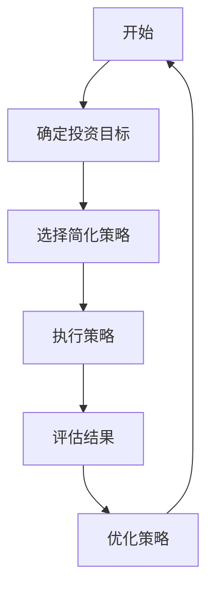

                 


# 约翰·伯格的投资简化论：为什么少即是多

> **关键词**：约翰·伯格，投资简化论，少即是多，价值投资，投资策略

> **摘要**：本文从约翰·伯格的投资简化论出发，分析了“少即是多”的哲学内涵及其在投资领域的应用价值。通过逐步分析简化论的核心原理、算法框架、数学模型、系统架构以及项目实战，揭示了简化论在投资中的巨大优势，并提供了实用的指导建议。

---

## 第一部分：投资简化论的背景与核心概念

### 第1章：投资的基本概念与问题背景

#### 1.1 投资的定义与核心要素

投资是指将资金或资源投入到某种资产或项目中，以期获得超过初始投入的价值的行为。投资的核心要素包括：

- **时间**：投资需要时间来实现价值增长。
- **风险**：投资的收益与风险成正比，风险是投资的必要条件。
- **收益**：投资的最终目标是实现收益最大化。

投资的基本问题可以归结为如何在有限的时间和资源条件下，通过合理的投资策略实现收益的最大化。

#### 1.2 约翰·伯格的简化论背景

约翰·伯格是美国著名投资家，他的简化论理念源于对投资领域复杂性与高效性的思考。投资领域充斥着各种复杂的理论、模型和策略，但这些复杂性往往掩盖了投资的本质。

- **投资领域的复杂性**：投资者面对海量的信息、复杂的市场波动和多变的经济环境，往往陷入决策 paralysis。
- **简化论的提出**：伯格认为，投资的本质是通过简单的策略实现长期的收益最大化。
- **简化论的核心理念**：少即是多，即通过简化投资策略，减少复杂性，提高可操作性和可持续性。

#### 1.3 少即是多的哲学基础

“少即是多”是一种哲学思想，强调简化和专注的重要性。在投资领域，这种思想体现为：

- **大道至简**：投资的本质是通过长期持有优质资产实现财富增长。
- **复杂性与简化性对立统一**：虽然市场复杂，但可以通过简化策略抓住核心问题。
- **简化论对投资者的启示**：简化策略可以帮助投资者避免过度思考和过度交易。

---

### 第2章：简化论的核心原理

#### 2.1 简化论的核心要素

简化论的核心要素包括目标、策略和执行：

- **目标**：明确的投资目标是简化策略的基础。
- **策略**：选择简洁但有效的投资策略。
- **执行**：严格按照策略执行，避免偏离。

简化论的三大支柱是简单性、可操作性和可持续性。

#### 2.2 简化论的属性特征对比

通过对比简化论与复杂论的特征，可以更好地理解简化论的优势。

| 特性        | 简化论             | 复杂论             |
|-------------|--------------------|--------------------|
| 直观性      | 高                 | 低                 |
| 高效性      | 高                 | 低                 |
| 稳定性      | 高                 | 低                 |
| 适用性      | 宽泛               | 狭窄               |

简化论的局限性在于其适用范围和边界条件。

#### 2.3 简化论的ER实体关系图

简化论的ER实体关系图如下：

```mermaid
erd
    投资者
    ----> 简化策略
    简化策略
    ----> 市场
    投资者
    ----> 市场
```

---

### 第3章：简化论的算法原理

#### 3.1 简化论的算法框架

简化论的算法流程图如下：



简化论的核心算法是价值投资模型：

```python
def value_investment(asset, market_conditions):
    if asset.ROE > market_conditions.average_ROE and \
       asset.PE < market_conditions.median_PE and \
       asset.dividend_yield > market_conditions.average_dividend_yield:
        return "买入"
    else:
        return "观望"
```

---

## 第二部分：简化论的算法原理与数学模型

### 第4章：数学模型与公式

简化论的数学模型可以表示为：

$$
\text{收益} = \text{资产质量} \times \text{市场环境} \times \text{策略有效性}
$$

其中：

- 资产质量：资产的基本面分析。
- 市场环境：宏观经济环境。
- 策略有效性：简化策略的有效性。

---

## 第三部分：系统分析与架构设计

### 第5章：系统分析与架构设计

#### 5.1 问题场景介绍

投资者面临复杂的市场环境，需要一个简化的投资系统。

#### 5.2 系统功能设计

领域模型类图如下：


#### 5.3 系统架构设计

系统架构图如下：


---

## 第四部分：项目实战

### 第6章：项目实战

#### 6.1 环境安装

安装Python和相关库：

```bash
pip install numpy pandas matplotlib
```

#### 6.2 核心代码实现

价值投资模型的代码实现：

```python
import pandas as pd
import numpy as np

def calculate_value_investment():
    # 假设市场数据已经加载到market_data中
    # 简化策略条件
    market_data['价值投资信号'] = np.where(
        (market_data['ROE'] > market_data['平均ROE']) &
        (market_data['PE'] < market_data['平均PE']) &
        (market_data['股息率'] > market_data['平均股息率']),
        '买入',
        '观望'
    )
    return market_data

# 示例数据
market_data = pd.DataFrame({
    'ROE': [15, 10, 5],
    'PE': [15, 20, 25],
    '股息率': [3, 2, 1],
    '平均ROE': [12, 12, 12],
    '平均PE': [18, 18, 18],
    '平均股息率': [2, 2, 2]
})

result = calculate_value_investment()
print(result)
```

#### 6.3 实际案例分析

以某股票为例，分析价值投资信号。

---

## 第五部分：总结与展望

### 第7章：总结与展望

#### 7.1 最佳实践

- 专注于核心资产。
- 避免过度交易。
- 定期评估和优化策略。

#### 7.2 小结

简化论是一种高效的投资策略，通过减少复杂性，提高可操作性和可持续性。

#### 7.3 注意事项

- 简化论适用于长期投资。
- 需要结合宏观经济环境。
- 需要不断优化策略。

#### 7.4 拓展阅读

建议阅读约翰·伯格的《投资的奥秘》和彼得·林奇的《投资漫步者》。

---

通过以上分析，我们可以看到，简化论在投资领域具有重要的应用价值。通过减少复杂性，专注于核心要素，投资者可以实现长期的收益最大化。

