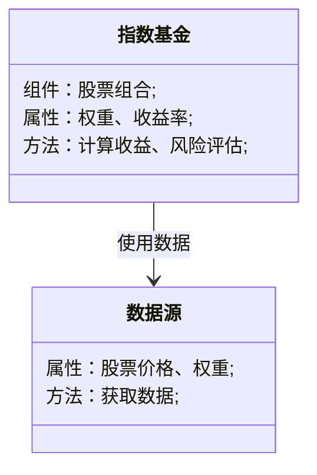
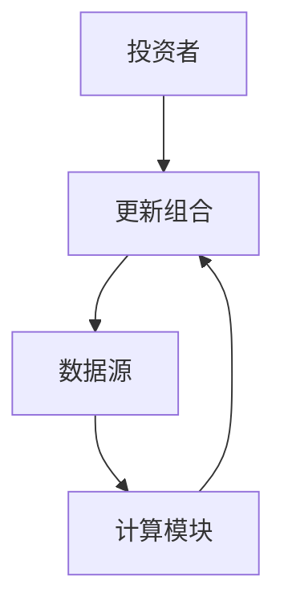

                 


# 约翰·伯格的指数基金投资理念

## 关键词：指数基金，约翰·伯格，投资理念，长期投资，分散投资，风险管理

## 摘要：  
本文系统地阐述了约翰·伯格的指数基金投资理念，从指数基金的基本概念、数学模型、系统架构到实际应用进行了全面分析。文章首先介绍了指数基金的定义、特点及其与其他投资方式的区别，接着深入探讨了约翰·伯格的投资理论，包括“买整个市场”的理念和长期投资策略。随后，文章从数学角度分析了指数基金的收益计算和风险管理，并通过系统架构和项目实战展示了指数基金的实现过程。最后，本文总结了指数基金的最佳实践和未来发展趋势，为投资者提供了实用的指导。

---

## 第1章: 指数基金的基本概念

### 1.1 指数基金的定义与特点

#### 1.1.1 指数基金的定义  
指数基金是一种跟踪特定市场指数的基金，其投资组合按照指数的成分股构成比例进行配置，旨在复制指数的收益表现。指数基金的核心特点是分散投资和低成本运作。

#### 1.1.2 指数基金的核心特点  
- **分散化**：通过投资多个成分股，降低单一股票的风险。  
- **低成本**：指数基金的管理费用通常低于主动管理型基金。  
- **被动管理**：指数基金跟踪指数，不主动选股或择时。  
- **透明性**：投资者可以清晰地了解基金的投资组合构成。  

#### 1.1.3 指数基金与其他投资方式的对比  

| 投资方式   | 主动管理型基金 | 指数基金 |
|------------|----------------|----------|
| 管理方式   | 主动选股       | 被动跟踪指数 |
| 成本       | 高             | 低       |
| 风险       | 高             | 较低     |
| 收益潜力   | 高             | 稳定     |

---

## 第2章: 约翰·伯格的投资理念

### 2.1 伯格的指数投资理论

#### 2.1.1 价值投资与指数投资的区别  

| 理论         | 价值投资       | 指数投资       |
|--------------|----------------|---------------|
| 核心思想     | 买入被低估的资产 | 买入整个市场   |
| 管理方式     | 主动选股       | 被动跟踪指数   |
| 风险         | 高             | 较低           |

#### 2.1.2 伯格的“买整个市场”理念  
伯格认为，普通投资者很难通过选股获得超额收益，而投资整个市场的指数基金能够实现市场平均收益，同时分散了个股风险。

#### 2.1.3 长期投资与分散投资的核心思想  
- **长期投资**：通过持有指数基金，投资者可以避免频繁交易带来的摩擦成本。  
- **分散投资**：通过投资指数基金，投资者可以同时持有数百只股票，降低个股波动带来的风险。

---

## 第3章: 指数基金的数学模型与风险分析

### 3.1 指数基金的收益计算

#### 3.1.1 指数基金的收益来源  
指数基金的收益主要来源于指数成分股的资本增值和分红收益。

#### 3.1.2 指数基金的收益公式  
指数基金的收益率可以表示为：  
$$ R_{\text{fund}} = \sum_{i=1}^{n} w_i R_i $$  
其中，$w_i$ 是第 $i$ 只股票的权重，$R_i$ 是第 $i$ 只股票的收益率。

#### 3.1.3 指数基金的夏普比率计算  
夏普比率衡量的是基金单位收益所承担的风险：  
$$ \text{夏普比率} = \frac{E[R_{\text{fund}}] - R_f}{\sigma_{\text{fund}}} $$  
其中，$R_f$ 是无风险利率，$\sigma_{\text{fund}}$ 是指数基金的收益率标准差。

### 3.2 指数基金的风险管理

#### 3.2.1 指数基金的波动性分析  
指数基金的波动性可以通过标准差来衡量：  
$$ \sigma = \sqrt{\sum_{i=1}^{n} w_i^2 \sigma_i^2 + \sum_{i \neq j} w_i w_j \sigma_{ij}} $$  
其中，$\sigma_i^2$ 是第 $i$ 只股票的方差，$\sigma_{ij}$ 是第 $i$ 和第 $j$ 只股票的协方差。

#### 3.2.2 指数基金的市场风险  
市场风险是指数基金的主要风险来源，可以通过投资多样化来降低。

#### 3.2.3 指数基金的分散化策略  
分散化可以有效降低非系统性风险，但无法降低系统性风险。

---

## 第4章: 指数基金的系统架构与实现

### 4.1 指数基金的系统架构

#### 4.1.1 指数基金的领域模型  


#### 4.1.2 指数基金的系统架构图  


### 4.2 指数基金的实现过程

#### 4.2.1 指数基金的数据采集  
数据源包括历史股价、权重和市场指数数据。

#### 4.2.2 指数基金的计算过程  
通过算法计算指数基金的收益率和风险指标。

#### 4.2.3 指数基金的优化算法  
使用均值-方差优化算法来确定最优投资组合。

---

## 第5章: 指数基金的项目实战

### 5.1 指数基金的环境安装

#### 5.1.1 操作系统与工具安装  
安装Python和必要的库（如pandas、numpy、matplotlib）。

#### 5.1.2 数据源的获取与处理  
从Yahoo Finance获取指数成分股的历史数据。

#### 5.1.3 开发环境的配置  
配置Jupyter Notebook和虚拟环境。

### 5.2 指数基金的核心实现

#### 5.2.1 指数基金的代码实现  
```python
import pandas as pd
import numpy as np

# 获取指数成分股数据
data = pd.read_csv('index_data.csv')

# 计算指数收益率
returns = data.pct_change().dropna()

# 计算指数基金的夏普比率
def sharpe_ratio(returns, risk_free_rate):
    excess_returns = returns - risk_free_rate
    return excess_returns.mean() / excess_returns.std()

sharpe_ratio(returns, 0.01)
```

#### 5.2.2 指数基金的代码解读  
上述代码展示了如何获取数据、计算收益率和夏普比率。

#### 5.2.3 指数基金的优化与改进  
通过调整权重和优化算法，进一步降低风险。

### 5.3 指数基金的实际案例分析  
以标普500指数为例，分析指数基金的长期表现。

### 5.4 指数基金的优化与总结  
通过回测和风险分析，优化投资组合。

---

## 第6章: 指数基金的最佳实践与小结

### 6.1 指数基金的投资策略

#### 6.1.1 长期投资与定期定额投资  
长期持有指数基金，避免频繁交易。

#### 6.1.2 指数基金的资产配置  
根据风险承受能力，合理配置股票、债券等资产。

#### 6.1.3 指数基金的风险管理  
定期评估组合风险，调整投资策略。

### 6.2 指数基金的注意事项

#### 6.2.1 指数基金的费用问题  
选择低费率的指数基金，降低长期成本。

#### 6.2.2 指数基金的流动性管理  
避免短期流动性需求影响长期投资计划。

#### 6.2.3 指数基金的市场波动应对  
保持长期视角，避免短期市场波动干扰。

### 6.3 指数基金的拓展阅读

#### 6.3.1 其他指数基金投资者的案例分析  
分析其他投资者的指数基金投资经验。

#### 6.3.2 指数基金的未来发展趋势  
探讨指数基金在金融科技中的应用。

#### 6.3.3 指数基金与金融科技的结合  
利用大数据和人工智能优化指数基金的投资策略。

---

## 附录: 指数基金相关术语

- **指数**：反映市场整体表现的指标，如标普500指数。  
- **分散化**：通过投资多个资产降低风险。  
- **夏普比率**：衡量投资收益相对于其风险的表现。  

---

以上是《约翰·伯格的指数基金投资理念》的完整内容，涵盖了从基础概念到实际应用的各个方面。希望本文能为投资者提供有价值的参考和指导。

