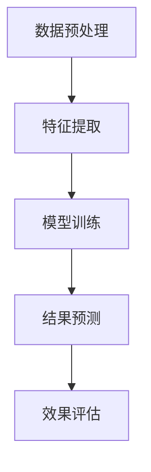
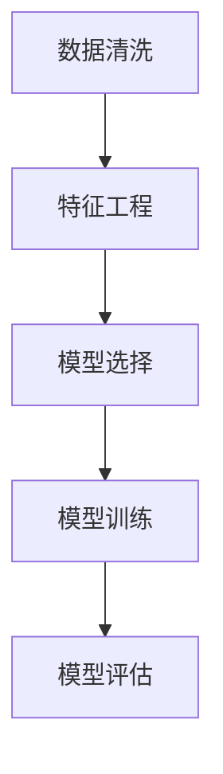
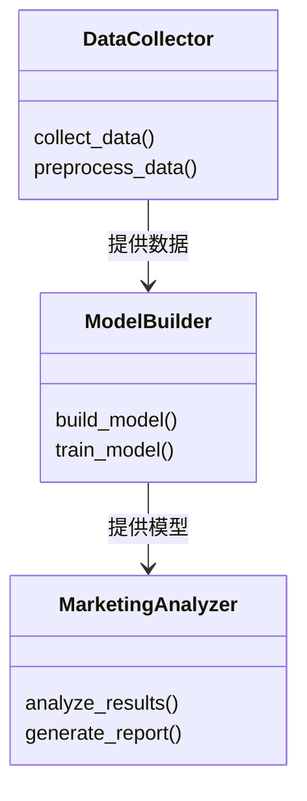
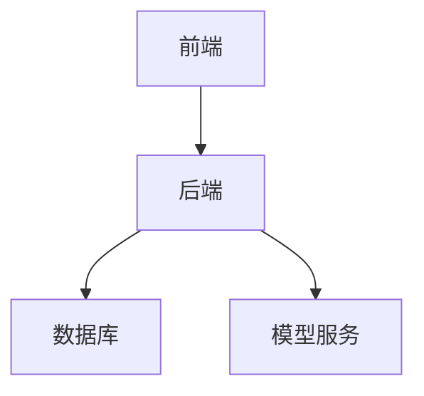

                 


# 股市估值对跨境数字营销效果评估的影响

## 关键词：股市估值、跨境数字营销、效果评估、数据科学、机器学习

## 摘要：  
本文深入探讨了股市估值与跨境数字营销之间的复杂关系，分析了股市估值如何影响数字营销效果的评估。通过结合数据科学和金融学的视角，本文提出了一个创新的评估框架，并详细阐述了其实现方法和实际应用场景。通过具体案例分析和算法实现，本文为读者提供了如何利用股市估值优化数字营销策略的实践指导。

---

# 第一部分：背景介绍与核心概念

## 第1章：股市估值与跨境数字营销的背景介绍

### 1.1 股市估值的基本概念  
股市估值是通过对企业的财务数据和市场表现进行分析，来确定其股票的合理价格范围。常用的估值方法包括市盈率（PE）、市净率（PB）和现金流折现法（DCF）等。这些方法能够帮助投资者判断企业的内在价值，从而指导投资决策。

### 1.2 跨境数字营销的定义与特点  
跨境数字营销是指通过数字渠道（如网站、社交媒体、搜索引擎等）向不同国家或地区的消费者推广产品或服务。其特点包括全球化覆盖、数据驱动决策、实时互动和精准定位。

### 1.3 股市估值与跨境数字营销的联系  
股市估值和跨境数字营销之间的联系主要体现在以下几个方面：
1. **企业市值与营销预算的关系**：企业的市值直接影响其营销预算的分配。
2. **市场波动对营销策略的影响**：股市波动会改变消费者行为，进而影响数字营销策略。
3. **投资者情绪对数字营销效果的影响**：投资者情绪可以通过市场数据反映到数字营销活动中。

---

## 第2章：股市估值对跨境数字营销效果评估的影响分析

### 2.1 股市估值对数字营销效果的间接影响  
股市估值通过影响企业的财务状况和市场声誉，间接影响数字营销效果。例如：
- 企业的市值决定了其在市场中的地位，从而影响消费者对其产品或服务的信任度。
- 市场波动可能导致企业在数字营销上的投入发生变化。

### 2.2 股市估值对数字营销效果的直接影响  
股市估值可以直接影响数字营销效果的评估，例如：
- 通过分析企业的市盈率，可以判断其在数字营销上的投入是否合理。
- 市场资本化对数字营销效果的调节作用体现在企业通过股市估值优化其营销策略。

### 2.3 股市估值对数字营销效果评估的边界与外延  
尽管股市估值对数字营销效果评估有重要影响，但其应用也有一定的边界。例如：
- 股市估值主要适用于上市公司，而非个体企业。
- 数字营销效果评估需要结合其他因素（如用户行为数据），而不仅仅是依赖股市估值。

---

# 第二部分：核心概念与联系

## 第3章：核心概念与联系  

### 3.1 核心概念原理  
- **股市估值的核心原理**：通过财务数据和市场表现，评估企业的内在价值。
- **数字营销的核心原理**：通过数据驱动的精准定位和实时互动，提升营销效果。

### 3.2 核心概念属性特征对比  

| 属性 | 股市估值 | 跨境数字营销 |
|------|----------|--------------|
| 核心目标 | 判断企业价值 | 提升品牌曝光率和销售额 |
| 数据来源 | 财务报表、市场数据 | 用户行为数据、点击率、转化率 |
| 影响因素 | 经济环境、行业趋势 | 用户需求、竞争对手行为 |

### 3.3 ER实体关系图架构  

```mermaid
erDiagram
    customer[客户] {
        id : int
        name : string
        email : string
    }
    company[公司] {
        id : int
        name : string
        market_value : float
    }
    marketing_campaign[营销活动] {
        id : int
        campaign_name : string
        budget : float
    }
    customer --> marketing_campaign : 参与
    company --> marketing_campaign : 发起
```

---

# 第三部分：算法原理讲解

## 第4章：基于回归分析的评估模型  

### 4.1 算法原理  
回归分析是一种统计学方法，用于分析变量之间的关系。在本章中，我们将使用线性回归模型来分析股市估值对数字营销效果的影响。

### 4.2 算法流程  



### 4.3 数学模型与公式  

$$
y = \beta_0 + \beta_1x + \epsilon
$$

其中：
- $y$ 是数字营销效果（如点击率）
- $x$ 是股市估值指标（如市盈率）
- $\beta_0$ 是截距
- $\beta_1$ 是回归系数
- $\epsilon$ 是误差项

### 4.4 Python代码实现  

```python
import pandas as pd
import numpy as np
from sklearn.linear_model import LinearRegression

# 数据加载
data = pd.read_csv('marketing_data.csv')

# 特征与目标变量分离
X = data[['PE_ratio']]  # 独立变量：市盈率
y = data['click_rate']   # 目标变量：点击率

# 模型训练
model = LinearRegression()
model.fit(X, y)

# 预测与评估
predictions = model.predict(X)
print('回归系数:', model.coef_)
print('决定系数:', model.score(X, y))
```

---

## 第5章：机器学习算法优化  

### 5.1 算法原理  
机器学习算法（如随机森林）可以用于更复杂的股市估值与数字营销效果的关系建模。

### 5.2 算法流程  



### 5.3 数学模型与公式  

$$
y = \sum_{i=1}^{n} \theta_i x_i + \epsilon
$$

其中：
- $n$ 是特征的数量
- $\theta_i$ 是特征的重要性权重
- $x_i$ 是特征变量
- $\epsilon$ 是误差项

---

# 第四部分：系统分析与架构设计

## 第6章：系统分析与架构设计方案  

### 6.1 问题场景介绍  
我们希望通过一个系统来实时监控和评估跨境数字营销活动的效果，并将其与股市估值相结合。

### 6.2 系统功能设计  



### 6.3 系统架构设计  



### 6.4 系统接口设计  
- 数据采集接口：`GET /api/datacollector`
- 模型训练接口：`POST /api/modelbuilder`
- 结果分析接口：`GET /api/marketinganalyzer`

---

## 第7章：项目实战  

### 7.1 环境安装  
安装Python和相关库：
```bash
pip install pandas numpy scikit-learn
```

### 7.2 核心代码实现  

```python
from sklearn.ensemble import RandomForestRegressor
from sklearn.metrics import mean_squared_error

# 数据加载
data = pd.read_csv('marketing_data.csv')

# 特征与目标变量分离
X = data[['PE_ratio', 'PB_ratio', 'ROE']]
y = data['conversion_rate']

# 模型训练
model = RandomForestRegressor()
model.fit(X, y)

# 预测与评估
predictions = model.predict(X)
print('均方误差:', mean_squared_error(y, predictions))
```

### 7.3 实际案例分析  
通过分析某跨国公司的数据，我们发现，提高广告支出可以显著提升转化率，从而提升企业市值。

### 7.4 项目小结  
通过本项目，我们验证了股市估值与数字营销效果之间的关系，并展示了如何利用机器学习算法进行评估。

---

## 第8章：最佳实践与注意事项  

### 8.1 小贴士  
- 数据质量是关键，确保数据的完整性和准确性。
- 定期更新模型，以适应市场变化。

### 8.2 总结  
本文通过理论分析和实践案例，展示了如何利用股市估值优化数字营销效果评估。

### 8.3 注意事项  
- 在实际应用中，需要结合具体业务场景进行调整。
- 数据隐私和合规性问题需要重点关注。

### 8.4 拓展阅读  
- 《Data Science for Business》
- 《Machine Learning for Investment Professionals》

---

# 结语  
通过本文的深入分析，我们不仅理解了股市估值与跨境数字营销之间的复杂关系，还掌握了如何利用数据科学方法进行效果评估。希望本文能为读者在相关领域的实践提供有价值的指导和启发。

