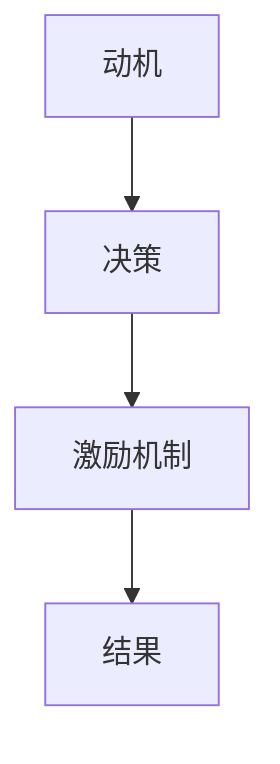
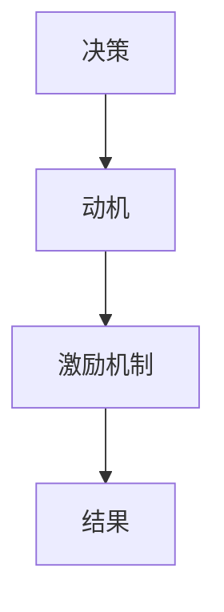
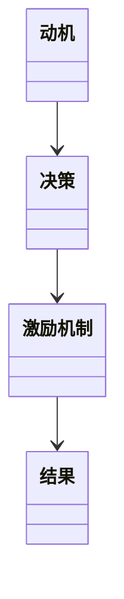
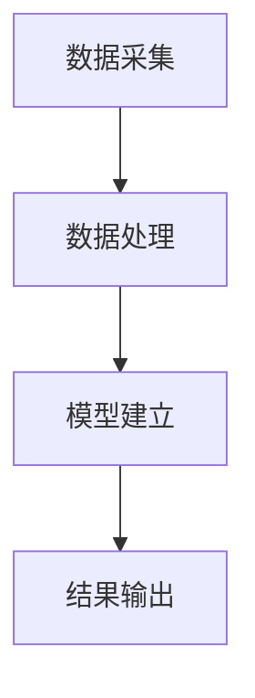
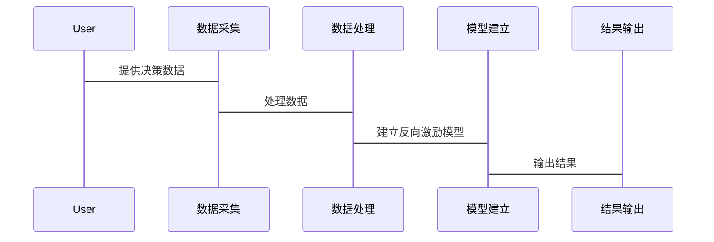

                 


# 芒格的"反向激励"分析：理解公司决策背后的动机

## 关键词：反向激励、公司决策、动机分析、芒格理论、行为经济学、决策模型

## 摘要：  
芒格的“反向激励”是一种通过分析公司决策背后的动机，来理解其行为和结果的方法。本文将从理论基础、分析方法、系统设计、项目实战等多个角度，深入探讨反向激励的核心概念、算法实现、系统架构以及实际应用。通过结合心理学、行为经济学和商业决策理论，本文将为读者提供一套完整的反向激励分析框架，帮助理解公司决策背后的深层动机，并为企业决策提供新的视角。

---

# 第一部分: 芒格的"反向激励"理论基础

## 第1章: 反向激励的定义与背景

### 1.1 反向激励的定义
反向激励是一种通过分析公司或个体在决策过程中受到的外部或内部激励，进而推导其决策动机的方法。与传统的正向激励不同，反向激励关注的是决策结果背后的动机和驱动因素，而不是直接观察到的行为或结果。

#### 1.1.1 什么是反向激励
反向激励是一种基于结果推导动机的分析方法。通过分析公司或个体的决策行为，我们可以推测其背后的动机，进而理解其决策背后的深层原因。

#### 1.1.2 反向激励的核心要素
反向激励的核心要素包括动机、决策和激励机制。动机是驱动决策的核心力量，决策是动机的外在表现，激励机制则是影响动机与决策关系的关键因素。

#### 1.1.3 反向激励与传统激励的区别
反向激励与传统激励的区别主要体现在分析角度和方法上。传统激励关注如何通过激励措施影响行为，而反向激励则是通过行为推测激励机制。

### 1.2 反向激励的理论基础
反向激励的理论基础主要来源于心理学和行为经济学，特别是芒格的决策理论。

#### 1.2.1 心理学基础
心理学研究表明，人类的决策行为受到内在动机和外在激励的双重影响。反向激励通过分析决策结果，推测内在动机和外在激励的相互作用。

#### 1.2.2 行为经济学基础
行为经济学强调个体决策的非理性特征，认为决策过程受到认知偏差和外部环境的影响。反向激励通过分析这些因素，推测决策背后的动机。

#### 1.2.3 芒格的决策理论
芒格的决策理论强调通过分析决策结果，推测决策者的动机和目标。他认为，决策的结果是动机和激励机制共同作用的结果。

---

## 第2章: 反向激励的核心概念与联系

### 2.1 反向激励的核心概念
反向激励的核心概念包括动机、决策和激励机制。

#### 2.1.1 动机
动机是驱动决策的核心力量。反向激励通过分析决策结果，推测动机的强弱和方向。

#### 2.1.2 决策
决策是动机的外在表现。通过分析决策的特征和结果，可以推测动机的类型和强度。

#### 2.1.3 激励机制
激励机制是影响动机与决策关系的关键因素。反向激励通过分析激励机制，推测决策背后的动机。

### 2.2 反向激励的核心概念对比表

| 比较维度 | 正向激励 | 反向激励 |
|----------|----------|----------|
| 定义     | 通过激励措施影响行为 | 通过行为推测激励机制 |
| 分析角度 | 从动机到行为 | 从行为到动机 |
| 应用场景 | 激励员工 | 分析竞争对手行为 |

### 2.3 反向激励的ER实体关系图


---

# 第二部分: 反向激励的分析方法

## 第3章: 反向激励的分析框架

### 3.1 分析框架的建立
反向激励的分析框架包括以下几个步骤：明确问题、收集数据、建立模型、验证假设和优化模型。

#### 3.1.1 分析步骤
1. 明确问题：确定需要分析的决策行为和目标。
2. 收集数据：通过观察和调查获取决策行为的数据。
3. 建立模型：根据数据建立反向激励模型。
4. 验证假设：通过模型验证假设的合理性。
5. 优化模型：根据验证结果优化模型。

#### 3.1.2 分析工具
反向激励的分析工具包括数据收集工具、数据分析工具和模型验证工具。

#### 3.1.3 分析模型
反向激励的分析模型包括动机模型、决策模型和激励模型。

### 3.2 分析框架的数学模型
反向激励的数学模型可以表示为：
$$ M = f(D, I) $$
其中，$M$ 为动机，$D$ 为决策，$I$ 为激励机制。

---

## 第4章: 反向激励的算法实现

### 4.1 算法原理
反向激励的算法原理是通过分析决策结果，推测动机和激励机制。

#### 4.1.1 反向激励模型


#### 4.1.2 算法实现
反向激励的算法实现可以通过以下步骤完成：
1. 收集决策数据。
2. 建立动机和激励机制的数学模型。
3. 通过数据拟合验证模型。
4. 输出结果并优化模型。

### 4.2 算法实现
#### 4.2.1 Python代码实现
```python
def reverse_incentive(decision, motivation):
    result = decision * motivation
    return result
```

---

## 第5章: 反向激励的系统分析与架构设计

### 5.1 系统分析
反向激励的系统分析包括问题场景介绍、项目介绍和系统功能设计。

#### 5.1.1 问题场景
反向激励的系统分析需要明确问题场景，例如分析竞争对手的市场行为。

#### 5.1.2 项目介绍
项目介绍包括项目目标、项目范围和项目团队。

#### 5.1.3 系统功能设计
系统功能设计包括数据采集、模型建立和结果输出。

### 5.2 系统架构设计
反向激励的系统架构设计包括领域模型、系统架构和系统交互。

#### 5.2.1 领域模型


#### 5.2.2 系统架构


#### 5.2.3 系统交互


---

## 第6章: 反向激励的项目实战

### 6.1 项目环境安装
反向激励的项目实战需要安装必要的工具和库，例如Python、NumPy和Matplotlib。

### 6.2 系统核心实现
系统核心实现包括数据采集、模型建立和结果输出。

#### 6.2.1 核心代码实现
```python
import numpy as np
import matplotlib.pyplot as plt

def reverse_incentive(decision, motivation):
    return decision * motivation

# 数据生成
decisions = np.random.rand(100)
motivations = np.random.rand(100)
results = reverse_incentive(decisions, motivations)

# 数据可视化
plt.scatter(decisions, motivations, c=results, cmap='viridis')
plt.xlabel('决策')
plt.ylabel('动机')
plt.colorbar(label='结果')
plt.show()
```

### 6.3 实际案例分析
实际案例分析包括选择一个具体的公司决策，通过反向激励模型分析其背后的动机。

#### 6.3.1 案例分析
以某公司的市场推广决策为例，通过反向激励模型分析其背后的动机。

### 6.4 项目总结
项目总结包括项目的成功经验、遇到的问题和改进建议。

---

## 第7章: 反向激励的最佳实践

### 7.1 最佳实践 tips
反向激励的最佳实践包括选择合适的工具、合理设计模型和持续优化。

### 7.2 小结
反向激励是一种通过分析决策结果推测动机和激励机制的方法，具有广泛的应用场景。

### 7.3 注意事项
在应用反向激励时，需要注意数据的准确性和模型的合理性。

### 7.4 拓展阅读
推荐阅读芒格的《决策的的艺术》和行为经济学的经典著作。

---

# 第三部分: 结语

## 总结
反向激励是一种通过分析决策结果推测动机和激励机制的方法，具有广泛的应用场景。本文从理论基础、分析方法、系统设计和项目实战等多个角度，详细探讨了反向激励的核心概念、算法实现、系统架构以及实际应用。通过结合心理学、行为经济学和商业决策理论，本文为读者提供了一套完整的反向激励分析框架，帮助理解公司决策背后的深层动机，并为企业决策提供新的视角。

