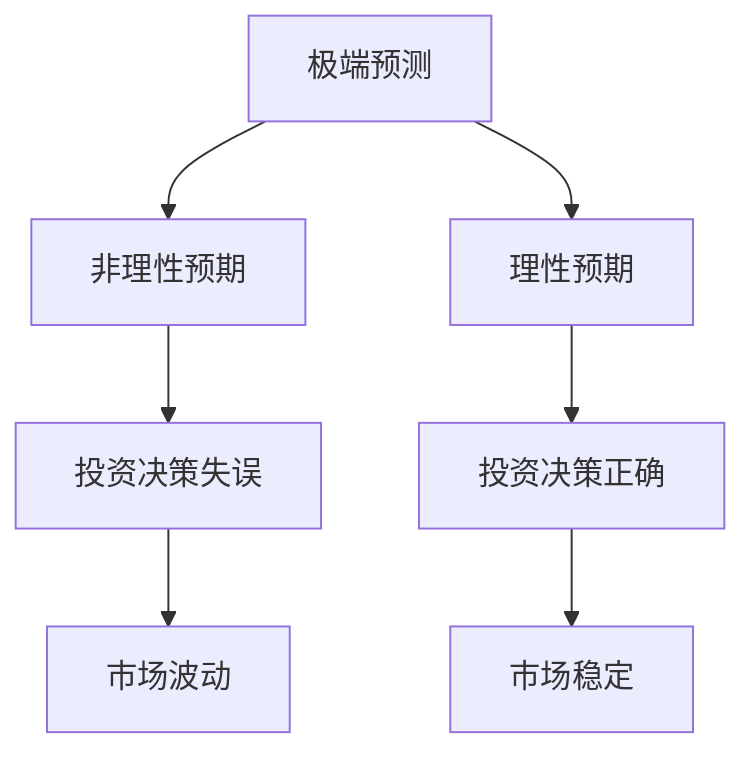
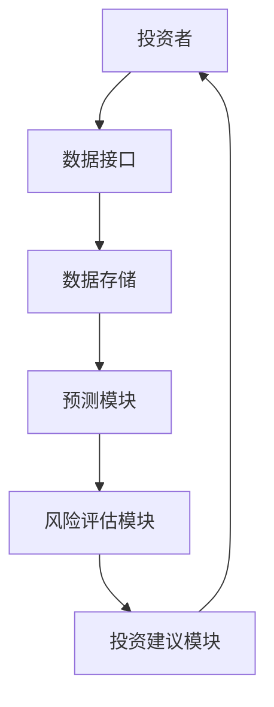
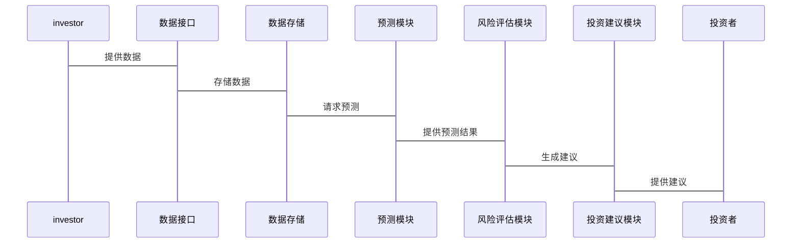

                 


# {{芒格的"避免极端预测"：保持投资预期的理性}}

> 关键词：芒格，避免极端预测，投资预期，理性决策，概率论，期望值，投资系统设计

> 摘要：本文系统地探讨了芒格提出的“避免极端预测”的投资理念，分析其在投资决策中的核心作用，结合概率论和期望值的数学模型，构建了一个基于理性预期的投资决策系统。通过实际案例分析，详细阐述了如何通过避免极端预测来保持投资预期的理性，并为投资者提供了实用的建议和未来研究方向。

## 第1章: 芮格“避免极端预测”概述

### 1.1 芮格“避免极端预测”的核心思想
#### 1.1.1 什么是极端预测
- **定义**：极端预测指的是对未来事件过于乐观或悲观的预测，通常忽视了可能的风险和不确定性。
- **特征**：高波动性、非理性、片面性
- **影响**：可能导致投资决策失误、市场波动加剧

#### 1.1.2 为什么极端预测是危险的
- **投资者心理**：过度自信、从众心理、羊群效应
- **市场表现**：极端预测可能导致资产价格泡沫或崩盘
- **实际后果**：投资损失、市场不稳定

#### 1.1.3 芮格的“避免极端预测”理念
- **核心观点**：投资者应避免极端预测，保持理性和审慎
- **实施方法**：基于事实的分析、多元化投资、风险控制

### 1.2 投资预期的理性与非理性
#### 1.2.1 理性预期的定义
- **理性预期**：投资者基于当前可获得的信息，对未来事件进行的合理预测
- **特征**：客观、全面、动态调整
- **重要性**：有助于做出更合理的投资决策，降低风险

#### 1.2.2 非理性预期的表现
- **过度乐观**：高估资产未来收益
- **过度悲观**：低估资产未来价值
- **从众心理**：跟随市场潮流，忽视个体分析

#### 1.2.3 理性预期在投资中的重要性
- **提高决策质量**：基于事实的分析有助于做出更明智的投资决策
- **降低投资风险**：理性预期有助于识别和规避潜在风险
- **促进市场稳定**：理性预期有助于维护市场的健康发展

## 第2章: 芮格“避免极端预测”的核心概念与联系

### 2.1 核心概念原理
#### 2.1.1 预测的不确定性
- **概率论基础**：任何预测都存在不确定性，可以用概率论来量化
- **贝叶斯定理**：通过不断更新信息来调整预测概率
- **实际应用**：在投资中，不确定性意味着需要考虑多种可能性

#### 2.1.2 极端预测的特征
- **极端性**：预测结果远超出正常范围
- **片面性**：只考虑有利情况，忽视不利因素
- **误导性**：可能导致错误的决策和投资行为

#### 2.1.3 理性预期的构建方法
- **数据驱动**：基于历史数据和市场趋势进行分析
- **多因素分析**：考虑影响投资的多种因素，如经济指标、行业趋势等
- **情景分析**：评估不同情景下的可能结果，制定相应的投资策略

### 2.2 核心概念属性对比表
| 概念       | 极端预测           | 理性预期           |
|------------|-------------------|-------------------|
| 定义       | 过度乐观或悲观的预测 | 基于事实的合理预测 |
| 特征       | 高波动性           | 稳定性             |
| 影响       | 市场波动加剧       | 市场稳定性增强     |

### 2.3 ER实体关系图


## 第3章: 芮格理念的数学模型与算法原理

### 3.1 概率论与期望值
#### 3.1.1 概率论基础
- **基本概念**：概率是某一事件发生的可能性
- **概率计算**：可以通过历史数据和统计方法来估算
- **实际应用**：在投资中，概率论用于评估资产的风险和收益

#### 3.1.2 期望值公式
- **公式**：
$$E[X] = \sum_{i=1}^{n} x_i P(x_i)$$
其中，$x_i$ 是可能的结果，$P(x_i)$ 是结果 $x_i$ 的概率。
- **实际意义**：期望值是未来可能结果的加权平均，帮助投资者评估投资的预期收益

#### 3.1.3 案例分析
- **案例**：假设投资一个股票，有三种可能的结果：
  - 上涨10%：概率0.3
  - 不变：概率0.5
  - 下跌5%：概率0.2
- **计算**：
$$E[X] = 0.3 \times 0.1 + 0.5 \times 0 + 0.2 \times (-0.05) = 0.03 - 0.01 = 0.02$$
即，期望收益率为2%

### 3.2 理性预期模型
#### 3.2.1 预测误差最小化
- **目标**：通过优化模型参数，最小化预测误差
- **数学表达**：
$$\text{最小化} \sum_{i=1}^{n} (y_i - \hat{y}_i)^2$$
其中，$y_i$ 是实际值，$\hat{y}_i$ 是预测值

#### 3.2.2 线性回归模型
- **模型**：
$$y = \beta_0 + \beta_1 x + \epsilon$$
其中，$\beta_0$ 是截距，$\beta_1$ 是斜率，$\epsilon$ 是误差项
- **应用**：用于预测资产价格，其中 $x$ 可以是时间、经济指标等

#### 3.2.3 案例分析
- **案例**：预测某股票的价格
  - 数据：过去10年的股价和相关经济指标
  - 建模：建立线性回归模型，预测未来股价
  - 结果：模型预测未来股价将上涨5%

### 3.3 算法流程图


## 第4章: 投资决策系统的系统分析与架构设计

### 4.1 问题场景介绍
- **背景**：投资者在面对市场波动时，容易受到极端预测的影响，做出非理性决策
- **目标**：构建一个基于理性预期的投资决策系统，帮助投资者避免极端预测

### 4.2 系统功能设计
- **功能模块**：
  - 数据采集：收集市场数据
  - 预测模型：构建和训练预测模型
  - 风险评估：评估投资风险
  - 投资建议：提供理性投资建议
- **领域模型**：
```mermaid
classDiagram
class 投资者 {
  + 资产配置
  + 风险承受能力
}
class 市场数据 {
  + 股价
  + 经济指标
}
class 预测模型 {
  + 预测结果
}
class 风险评估 {
  + 风险等级
}
class 投资建议 {
  + 建议策略
}
investor -> 市场数据: 提供
市场数据 -> 预测模型: 训练
预测模型 -> 风险评估: 输入预测结果
风险评估 -> 投资建议: 生成建议
investor -> 投资建议: 获取
```

### 4.3 系统架构设计
- **架构图**：


### 4.4 系统接口设计
- **数据接口**：
  - 输入：市场数据、投资者信息
  - 输出：预测结果、风险评估、投资建议

### 4.5 系统交互流程


## 第5章: 项目实战——基于理性预期的投资决策系统实现

### 5.1 环境安装
- **工具**：Python、NumPy、Pandas、Scikit-learn、Matplotlib
- **步骤**：
  1. 安装Python
  2. 安装所需的库
  3. 配置开发环境

### 5.2 系统核心实现源代码
```python
import numpy as np
import pandas as pd
from sklearn.linear_model import LinearRegression
from sklearn.metrics import mean_squared_error

# 数据加载
data = pd.read_csv('market_data.csv')

# 数据预处理
X = data[['economic_indicators', 'market_sentiment']]
y = data['stock_price']

# 模型训练
model = LinearRegression()
model.fit(X, y)

# 预测
y_pred = model.predict(X)

# 评估
mse = mean_squared_error(y, y_pred)
print(f'均方误差：{mse}')
```

### 5.3 代码实现解读
- **数据加载**：读取市场数据
- **数据预处理**：选择相关特征
- **模型训练**：使用线性回归模型
- **预测与评估**：计算预测结果和均方误差

### 5.4 实际案例分析
- **案例**：假设市场数据包含过去5年的经济指标和市场情绪，预测未来一年的股价
- **步骤**：
  1. 数据加载和预处理
  2. 模型训练
  3. 预测股价
  4. 评估预测结果

### 5.5 项目小结
- **总结**：通过构建和训练模型，投资者可以基于理性预期做出更明智的投资决策
- **优势**：提高决策的科学性和准确性，降低投资风险

## 第6章: 总结与建议

### 6.1 最佳实践 tips
- **持续学习**：保持对市场的敏感性和对新知识的吸收
- **风险管理**：建立完善的风险评估和控制机制
- **长期视角**：关注长期投资目标，避免短期波动的干扰

### 6.2 项目总结
- **核心内容**：芒格的“避免极端预测”理念在投资中的应用
- **系统设计**：构建了一个基于理性预期的投资决策系统
- **实际意义**：帮助投资者做出更理性的投资决策，降低投资风险

### 6.3 未来研究方向
- **模型优化**：探索更先进的预测模型，如深度学习
- **数据扩展**：引入更多影响投资的因素，如公司基本面、行业趋势等
- **系统集成**：开发一个完整的投资管理系统，实现自动化决策

### 6.4 注意事项
- **数据质量**：确保数据的准确性和完整性
- **模型适用性**：根据实际情况调整模型参数
- **持续监控**：定期更新模型和数据，确保预测的准确性

### 6.5 拓展阅读
- **书籍推荐**：《芒格投资哲学》、《投资学原理》
- **在线资源**：相关投资网站、论坛、博客
- **课程推荐**：投资学、风险管理在线课程

## 第7章: 结语
芒格的“避免极端预测”理念为投资者提供了一个理性的决策框架。通过结合概率论和期望值的数学模型，投资者可以更科学地分析市场趋势，制定合理的投资策略。希望本文能为投资者在复杂多变的市场中提供一些有益的指导和启发。

---

通过以上目录大纲，您可以逐步展开各章节内容，撰写一篇详细、有深度的专业技术博客文章。

