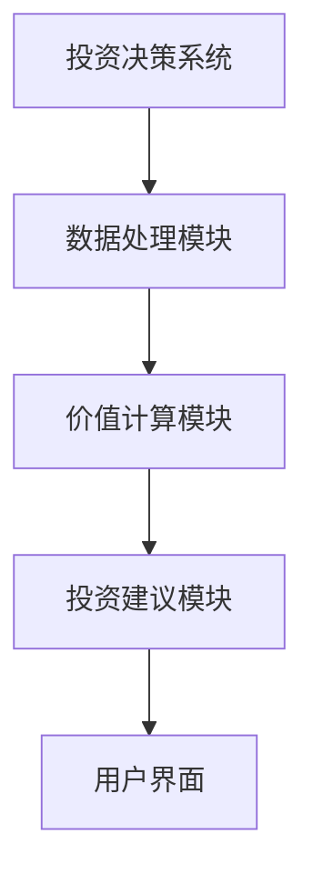

                 


# 费雪的创新企业投资法则

## 关键词：费雪投资法则、创新企业、成长股、价值评估、风险管理、投资策略、系统分析

## 摘要：  
本文系统介绍费雪的创新企业投资法则，涵盖其核心概念、算法原理、系统架构及实战案例，深入分析其在现代投资中的应用，提供结构化的投资策略和风险管理方法。

---

## 第1章 费雪投资法则的背景与核心理念

### 1.1 费雪投资法则的背景

#### 1.1.1 费雪其人  
菲利普·费雪（Philip Fisher）是20世纪著名的投资专家，被誉为“成长股投资之父”。他强调长期投资、深入研究和选择具有强大成长潜力的企业。

#### 1.1.2 费雪投资法则的提出背景  
费雪的投资法则诞生于20世纪中期，当时正值美国经济的高速增长期，许多创新企业崛起，为他的理论提供了实践基础。

#### 1.1.3 费雪投资法则的核心思想  
费雪认为，成功的投资取决于对企业的深入研究，尤其是其成长潜力和竞争优势。

---

### 1.2 创新企业投资的定义与特点

#### 1.2.1 创新企业的定义  
创新企业是指在技术、商业模式或市场策略上具有创新性，能够持续创造价值的企业。

#### 1.2.2 创新企业的核心特点  
- 高成长性  
- 强大的竞争优势  
- 创新的商业模式  

#### 1.2.3 创新企业与传统企业的区别  
创新企业注重技术创新和市场拓展，传统企业则更依赖稳定的运营和成本控制。

---

### 1.3 费雪投资法则与创新企业的关系

#### 1.3.1 费雪投资法则的核心要素  
- 企业基本面分析  
- 企业的成长潜力  
- 管理团队的能力  

#### 1.3.2 创新企业在投资中的重要性  
创新企业是投资的重点，因其高增长潜力和市场领导地位，能够为投资者带来超额收益。

#### 1.3.3 费雪投资法则的适用性  
费雪法则适用于所有行业的创新企业，尤其是科技、医疗和消费品领域。

---

## 第2章 费雪投资法则的核心概念与联系

### 2.1 费雪投资法则的核心概念

#### 2.1.1 投资的定义与分类  
- 投资是将资金投入特定资产以获得收益的行为。  
- 分为短期投资和长期投资，创新企业投资属于长期投资。

#### 2.1.2 创新企业的核心要素  
- 技术创新能力  
- 市场领导地位  
- 可持续的盈利能力  

#### 2.1.3 费雪投资法则的关键指标  
- 营收增长率  
- 净利润率  
- 财务健康状况  

---

### 2.2 费雪投资法则的核心概念联系

#### 2.2.1 费雪投资法则的数学模型  
$$ V = \sum_{t=1}^{n} \frac{CF_t}{(1 + r)^t} $$
其中，\( V \) 是企业价值，\( CF_t \) 是未来现金流，\( r \) 是贴现率。

#### 2.2.2 创新企业的ER实体关系图  

```mermaid
erDiagram
    customer[客户] {
        id : integer
        name : string
    }
    product[产品] {
        id : integer
        name : string
        price : decimal
    }
    order[订单] {
        id : integer
        customer_id : integer
        product_id : integer
        order_date : date
    }
    order --> customer
    order --> product
```

---

## 第3章 费雪投资法则的算法原理

### 3.1 费雪投资法则的算法原理

#### 3.1.1 费雪投资法则的数学模型  
$$ V = \sum_{t=1}^{n} \frac{CF_t}{(1 + r)^t} $$
其中，\( V \) 是企业价值，\( CF_t \) 是未来现金流，\( r \) 是贴现率。

#### 3.1.2 费雪投资法则的算法流程  
1. 收集企业财务数据。  
2. 评估企业的成长潜力。  
3. 计算企业价值。  
4. 判断是否值得投资。  

#### 3.1.3 费雪投资法则的Python源代码实现  

```python
def calculate_value(cash_flows, discount_rate):
    return sum(cf / (1 + discount_rate) ** t for t, cf in enumerate(cash_flows, start=1))

# 示例
cash_flows = [100, 150, 200]
discount_rate = 0.1
value = calculate_value(cash_flows, discount_rate)
print(f"企业价值：{value}")
```

---

## 第4章 费雪投资法则的系统分析与架构设计

### 4.1 费雪投资法则的系统分析

#### 4.1.1 系统功能设计  
- 数据收集与处理  
- 企业价值计算  
- 投资决策支持  

#### 4.1.2 系统架构设计  



#### 4.1.3 系统接口设计  
- 数据接口：接收企业财务数据。  
- 计算接口：返回企业价值。  

---

## 第5章 费雪投资法则的项目实战

### 5.1 费雪投资法则的环境安装

#### 5.1.1 系统环境要求  
- Python 3.8+  
- Jupyter Notebook  

#### 5.1.2 软件安装与配置  
安装Python和相关库（如numpy、pandas）。  

#### 5.1.3 数据库安装与配置  
使用SQLite或MySQL存储企业数据。  

---

### 5.2 费雪投资法则的系统核心实现

#### 5.2.1 核心算法实现  
```python
import numpy as np

def discounted_cash_flow(cash_flows, discount_rate):
    return np.npv(discount_rate, cash_flows)
```

#### 5.2.2 系统功能实现  
```python
def main():
    cash_flows = [100, 150, 200]
    discount_rate = 0.1
    value = discounted_cash_flow(cash_flows, discount_rate)
    print(f"企业价值：{value}")

if __name__ == "__main__":
    main()
```

#### 5.2.3 系统界面实现  
创建一个简单的GUI界面，供用户输入数据并显示结果。  

---

## 第6章 费雪投资法则的最佳实践与小结

### 6.1 费雪投资法则的最佳实践

#### 6.1.1 投资策略的优化  
- 定期评估投资组合。  
- 根据市场变化调整策略。  

#### 6.1.2 风险管理的技巧  
- 分散投资以降低风险。  
- 设定止损点以控制损失。  

---

### 6.2 小结

费雪的创新企业投资法则通过深入分析企业的成长潜力和竞争优势，为投资者提供了科学的投资策略。结合系统的架构设计和实战案例，投资者可以更好地应用这些法则，实现长期稳健的投资收益。

---

### 6.3 注意事项

- 投资需谨慎，建议在专业指导下进行。  
- 数据的准确性和及时性对投资决策至关重要。  

---

### 6.4 拓展阅读

- 《股票作手回忆录》  
- 《投资学》  

---

通过以上步骤，您可以系统地学习和应用费雪的创新企业投资法则，结合实际案例和系统架构，实现高效的投资决策。

