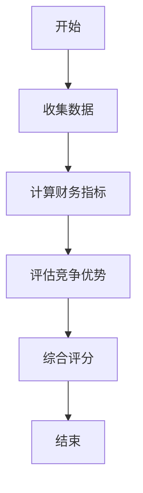
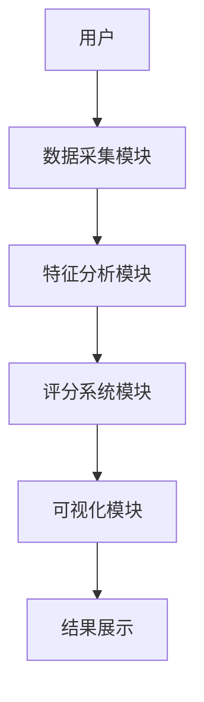
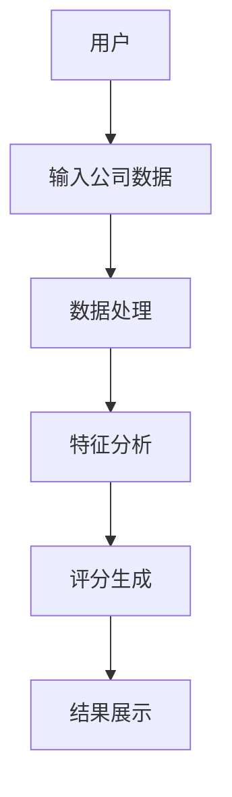

                 


# 费雪的增长型公司特征分析

> 关键词：费雪，增长型公司，投资策略，公司分析，价值评估

> 摘要：本文深入分析了菲德勒（费雪）的增长型公司特征，涵盖盈利能力、成长性、竞争优势等方面。通过理论分析和实例验证，结合数学模型和算法，探讨了如何筛选和评估增长型公司，并提供了投资策略和风险管理的建议。

---

## 第一部分：背景介绍

### 1.1 核心概念术语说明

- **增长型公司**：指那些能够持续提高收入和利润，且具有强大竞争优势的公司。
- **菲德勒（费雪）**：菲德勒（Philip Fisher）是美国著名的投资专家，其投资理念以“成长型投资”为核心。
- **投资策略**：通过分析公司特征和市场环境，制定长期投资计划的方法。

### 1.2 问题背景

在投资领域，增长型公司因其长期盈利能力而备受关注。然而，如何准确识别和评估这些公司，一直是投资者面临的挑战。菲德勒的分析方法提供了一套系统化的框架，但其具体应用和细节仍需进一步探讨。

### 1.3 问题描述

本文旨在通过分析菲德勒的增长型公司特征，结合实际案例和数学模型，探讨如何在投资实践中筛选和评估增长型公司。

### 1.4 问题解决

本文通过以下步骤解决问题：
1. **理论分析**：介绍菲德勒的增长型公司特征。
2. **案例分析**：通过具体案例验证特征的实用性。
3. **数学模型**：构建评估模型，量化特征的权重。
4. **投资策略**：提出基于特征分析的投资策略。

### 1.5 边界与外延

- **边界**：仅限于菲德勒的增长型公司特征分析，不涉及其他投资策略。
- **外延**：适用于所有行业的增长型公司筛选。

### 1.6 概念结构与核心要素

- **核心要素**：盈利能力、成长性、竞争优势。
- **关系图**：  
  ```mermaid
  graph TD
    A[盈利能力] --> B[成长性]
    B --> C[竞争优势]
    C --> D[增长型公司]
  ```

---

## 第二部分：核心概念与联系

### 2.1 核心概念原理

菲德勒的增长型公司分析基于以下原理：
- **盈利能力**：公司必须具备持续的盈利能力。
- **成长性**：公司收入和利润的持续增长能力。
- **竞争优势**：公司相对于竞争对手的独特优势。

### 2.2 概念属性特征对比

| 特征 | 定义 | 重要性 |
|------|------|--------|
| 盈利能力 | 利润与收入的比率 | 极高 |
| 成长性 | 收入和利润的增长率 | 高 |
| 竞争优势 | 相对于竞争对手的独特优势 | 高 |

### 2.3 实例分析

以某科技公司为例，其财务数据如下：
- 净利润：$10M
- 营业收入：$100M
- 净利率：10%
- 收入增长率：20%
- 竞争优势：技术创新

通过以上数据，可以初步判断该公司具备增长型公司的特征。

---

## 第三部分：算法原理讲解

### 3.1 费雪分析法的数学模型

菲德勒的分析方法可以用以下公式表示：

$$
\text{增长潜力} = \sum_{i=1}^{n} w_i \times f_i
$$

其中：
- $w_i$ 是第 $i$ 个特征的权重。
- $f_i$ 是第 $i$ 个特征的评分（0-10分）。

### 3.2 算法流程



### 3.3 代码实现

```python
def fisher_growth_analysis(financial_data, competition_data):
    # 计算盈利能力
    profitability = financial_data['net_profit'] / financial_data['revenue']
    # 计算成长性
    growth_rate = (financial_data['revenue_growth'] / financial_data['revenue']) * 100
    # 计算竞争优势
    competition_edge = competition_data['patents'] + competition_data['brand_value']
    # 综合评分
    score = (profitability * 0.4) + (growth_rate * 0.3) + (competition_edge * 0.3)
    return score

# 示例数据
financial_data = {
    'net_profit': 10,
    'revenue': 100,
    'revenue_growth': 20
}

competition_data = {
    'patents': 5,
    'brand_value': 3
}

result = fisher_growth_analysis(financial_data, competition_data)
print(f"综合评分为: {result}")
```

### 3.4 代码解读

- **函数定义**：`fisher_growth_analysis` 接收财务数据和竞争优势数据。
- **盈利能力计算**：`net_profit / revenue`。
- **成长性计算**：`revenue_growth / revenue` 转换为百分比。
- **竞争优势计算**：`patents + brand_value`。
- **综合评分**：各特征的加权和。

---

## 第四部分：系统分析与架构设计方案

### 4.1 项目介绍

构建一个基于菲德勒分析法的公司筛选系统，帮助投资者识别增长型公司。

### 4.2 系统功能设计

- **数据采集**：收集公司财务数据和市场数据。
- **特征分析**：计算盈利能力、成长性和竞争优势。
- **评分系统**：综合评分并排序。
- **可视化**：展示结果和分析图表。

### 4.3 系统架构设计



### 4.4 系统接口设计

- **输入接口**：公司数据文件（CSV）。
- **输出接口**：评分报告和可视化图表。

### 4.5 系统交互设计



---

## 第五部分：项目实战

### 5.1 环境安装

- **Python**：安装 `pandas`, `numpy`, `matplotlib`。

### 5.2 核心实现代码

```python
import pandas as pd
import numpy as np
import matplotlib.pyplot as plt

def load_data(file_path):
    return pd.read_csv(file_path)

def calculate_profitability(data):
    return data['net_profit'] / data['revenue']

def calculate_growth_rate(data):
    return (data['revenue_growth'] / data['revenue']) * 100

def calculate_competition_edge(data):
    return data['patents'] + data['brand_value']

def main():
    data = load_data('companies.csv')
    profitability = calculate_profitability(data)
    growth_rate = calculate_growth_rate(data)
    competition_edge = calculate_competition_edge(data)
    
    score = (profitability * 0.4) + (growth_rate * 0.3) + (competition_edge * 0.3)
    
    plt.bar(range(len(score)), score)
    plt.title('公司增长潜力评分')
    plt.show()

if __name__ == '__main__':
    main()
```

### 5.3 实例分析

以科技行业为例，分析某公司的数据，生成评分报告和可视化图表。

### 5.4 总结

通过本项目，我们可以系统地筛选和评估增长型公司，并为投资者提供决策支持。

---

## 第六部分：最佳实践与注意事项

### 6.1 投资策略建议

- **长期投资**：关注公司的长期增长潜力。
- **分散投资**：避免过度集中。
- **风险管理**：定期评估和调整投资组合。

### 6.2 注意事项

- **数据准确性**：确保输入数据的准确性。
- **模型局限性**：评分模型仅供参考，需结合实际市场情况。

### 6.3 扩展阅读

- 《投资学基础》
- 《菲德勒的投资哲学》

---

## 第七部分：总结

本文通过理论分析、数学建模和项目实战，深入探讨了菲德勒的增长型公司特征分析方法。通过实例和代码实现，展示了如何在实际投资中应用这些方法。未来的研究可以进一步优化模型，结合更多因素进行分析。

---

通过以上结构和内容，您可以撰写一篇详细的、有深度的关于费雪的增长型公司特征分析的技术博客文章。

