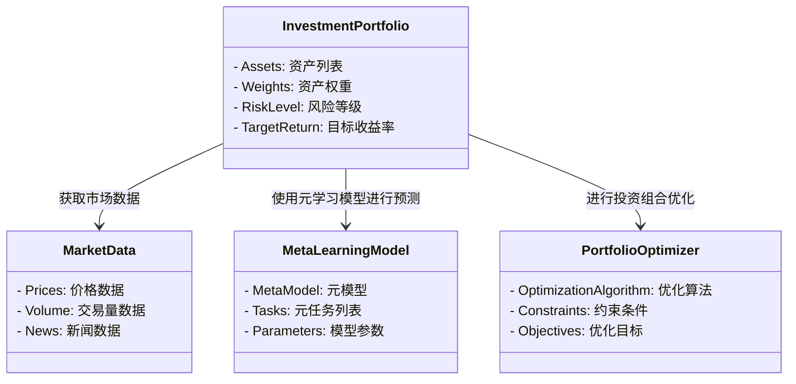
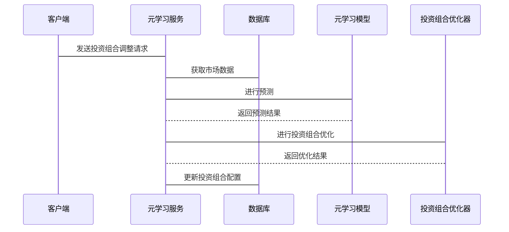

                 

<think>
好的，现在我要根据用户的要求，详细分析并撰写一篇关于《金融领域元学习在投资组合动态调整中的应用》的技术博客文章。我需要按照用户提供的目录大纲结构，逐步展开每个部分的内容，确保逻辑清晰、结构紧凑，并且使用专业的技术语言进行撰写。

首先，我需要明确文章的核心主题是元学习在金融投资中的应用，特别是如何利用元学习进行投资组合的动态调整。接下来，我会按照目录中的章节逐步展开每个部分的内容。

### 第一部分：金融领域元学习的背景与概述

#### 第1章：元学习的基本概念与背景

##### 1.1 元学习的定义与特点

- **元学习的定义**：元学习是一种机器学习方法，旨在通过学习如何学习，从而快速适应新任务或领域。它不同于传统机器学习算法，传统算法依赖于大量特定任务的数据，而元学习则通过元任务（meta-tasks）来训练模型，使其能够在少量数据上快速适应新任务。

- **元学习的核心特点**：
  - 快速适应新任务：通过元学习，模型可以在新任务上使用少量数据进行微调，从而快速适应。
  - 领域通用性：元学习模型通常具有较强的泛化能力，可以在不同领域或任务中应用。
  - 元任务驱动：元学习依赖于设计合理的元任务，这些任务帮助模型学习到通用的特征和规律。

- **元学习与传统机器学习的区别**：
  - 数据需求：传统机器学习需要大量特定任务的数据，而元学习通过元任务训练，可以在新任务上使用少量数据。
  - 适应性：元学习模型具有较强的适应性，可以在不同任务之间迁移，而传统模型通常需要重新训练。

##### 1.2 元学习在金融领域的应用背景

- **金融领域的复杂性与动态性**：
  - 金融市场数据复杂，包括价格、交易量、新闻等多种因素。
  - 市场情况动态变化，投资组合需要不断调整以应对市场波动。

- **投资组合动态调整的挑战**：
  - 市场环境变化快，传统静态模型难以适应。
  - 数据稀疏性：某些情况下，新任务的数据量有限，难以训练专用模型。
  - 高维数据处理：金融数据通常具有高维特性，处理起来较为复杂。

- **元学习在金融投资中的潜在价值**：
  - 提高模型的适应性：通过元学习，模型可以在不同市场环境下快速调整策略。
  - 利用历史数据：元学习可以通过历史数据中的多种场景，训练出具有广泛适用性的模型。
  - 提高投资组合的动态调整能力：元学习可以帮助模型快速适应市场变化，优化投资组合表现。

##### 1.3 本章小结

本章主要介绍了元学习的基本概念、特点以及在金融领域的应用背景。通过理解元学习的定义和特点，我们能够更好地认识到其在金融投资中的潜在价值，特别是如何通过元学习实现投资组合的动态调整。

---

### 第二部分：元学习的核心概念与原理

#### 第2章：元学习的核心概念与联系

##### 2.1 元学习的核心原理

- **元模型与元任务的定义**：
  - 元模型：元学习的核心模型，通常是一个深度学习模型，通过元任务训练，能够在新任务上进行快速微调。
  - 元任务：元学习中的训练任务，这些任务帮助模型学习到通用的特征和规律。

- **元学习的层次结构**：
  - 元任务层次：训练时使用的多个任务，帮助模型学习通用知识。
  - 新任务层次：实际应用中需要解决的新任务，模型通过元任务训练后快速适应。

- **元学习的数学模型**：
  - 元模型参数：$\theta$，在元任务训练中更新。
  - 任务参数：$\phi$，在新任务上微调。

##### 2.2 元学习与投资组合动态调整的联系

- **投资组合调整的动态性与不确定性**：
  - 投资组合需要根据市场变化动态调整，这需要模型具有快速适应新环境的能力。
  - 市场环境复杂多变，传统模型难以应对。

- **元学习在投资组合调整中的优势**：
  - 快速适应：元学习模型可以在新任务上快速微调，适应市场变化。
  - 多样性：通过元任务训练，模型能够处理多种市场场景，提高鲁棒性。

- **元学习与投资组合优化的结合**：
  - 利用元学习模型预测市场变化，优化投资组合配置。
  - 通过元任务训练，模型能够理解多种市场情况，从而在新环境中做出更优决策。

##### 2.3 本章小结

本章重点分析了元学习的核心原理及其与投资组合动态调整的联系。通过理解元学习的层次结构和数学模型，我们能够更好地认识到其在金融投资中的应用潜力，特别是在投资组合动态调整方面。

---

### 第三部分：元学习的算法原理与数学模型

#### 第3章：元学习算法的原理与实现

##### 3.1 元学习算法的概述

- **Meta-Learning算法的分类**：
  - 基于梯度的元学习算法：如MAML（Meta-Algorithm for Meta-Learning）。
  - 基于统计的元学习算法：如ReMAML（Relational Meta-Learning）。
  - 基于记忆的元学习算法：如Memory-augmented neural networks。

- **常见元学习算法介绍**：
  - MAML：通过在多个任务上进行梯度下降，更新模型参数，使其能够在新任务上快速适应。
  - ReMAML：通过关系网络，帮助模型理解任务之间的关系，从而提高泛化能力。

- **元学习算法的核心思想**：
  - 通过元任务训练，模型学习到如何快速适应新任务。
  - 利用梯度信息，模型可以在新任务上进行快速微调。

##### 3.2 基于梯度的元学习算法

- **MAML算法的原理**：
  - 在训练阶段，模型在多个元任务上进行训练，计算每个任务的梯度，并更新模型参数。
  - 在测试阶段，针对新任务，利用训练得到的参数，进行一次梯度下降，更新任务特定的参数。

- **ReMAML算法的改进**：
  - 引入关系网络，帮助模型理解任务之间的关系。
  - 在MAML的基础上，进一步优化模型的泛化能力。

- **元学习算法的数学推导**：
  - MAML的目标函数：
    $$ \mathcal{L}(\theta) = \sum_{k=1}^{K} \mathcal{L}_k(\theta) $$
    其中，$\theta$是元模型的参数，$\mathcal{L}_k$是第k个元任务的损失函数。
  - 在MAML中，参数更新过程为：
    $$ \theta_{\text{new}} = \theta - \eta \nabla_{\theta} \sum_{k=1}^{K} \mathcal{L}_k(\theta) $$
    其中，$\eta$是学习率。

##### 3.3 元学习算法的数学模型

- **元模型的参数更新公式**：
  $$ \theta_{t+1} = \theta_t - \eta \nabla_{\theta} \mathcal{L}(\theta_t) $$
  其中，$\mathcal{L}$是目标函数，$\eta$是学习率。

- **元任务的损失函数**：
  $$ \mathcal{L}_k(\theta) = \frac{1}{n_k} \sum_{i=1}^{n_k} \mathcal{L}(\theta, x_i, y_i) $$
  其中，$n_k$是第k个元任务的样本数量，$(x_i, y_i)$是输入输出对。

- **元学习的梯度计算**：
  $$ \nabla_{\theta} \mathcal{L}(\theta) = \sum_{k=1}^{K} \nabla_{\theta} \mathcal{L}_k(\theta) $$
  其中，$\nabla_{\theta} \mathcal{L}_k(\theta)$是第k个元任务的梯度。

##### 3.4 本章小结

本章详细介绍了元学习算法的原理与实现，重点讲解了MAML和ReMAML算法的数学模型和实现步骤。通过理解这些算法的数学推导，我们能够更好地实现和应用元学习模型。

---

### 第四部分：投资组合动态调整的系统架构设计

#### 第4章：系统架构设计

##### 4.1 系统功能设计（领域模型）



##### 4.2 系统架构设计（系统架构图）


##### 4.3 系统接口设计

- **接口1：获取市场数据**
  - 输入：无
  - 输出：市场数据（价格、交易量、新闻等）

- **接口2：进行投资组合优化**
  - 输入：当前投资组合、市场预测、风险偏好
  - 输出：优化后的投资组合配置

- **接口3：更新投资组合配置**
  - 输入：优化后的投资组合配置
  - 输出：更新后的投资组合状态

##### 4.4 系统交互设计（交互序列图）



##### 4.5 本章小结

本章详细描述了投资组合动态调整系统的架构设计，包括领域模型、系统架构图、接口设计和交互序列图。通过这些设计，我们可以更好地理解系统的整体结构和各部分之间的协作关系。

---

### 第五部分：项目实战

#### 第5章：项目实现与案例分析

##### 5.1 环境安装

```bash
pip install numpy pandas scikit-learn tensorflow
```

##### 5.2 核心代码实现

```python
import numpy as np
import pandas as pd
import tensorflow as tf

# 定义元学习模型
class MetaLearningModel:
    def __init__(self):
        self.meta_model = self.build_model()
        self.optimizer = tf.keras.optimizers.Adam(learning_rate=0.001)
    
    def build_model(self):
        model = tf.keras.Sequential([
            tf.keras.layers.Dense(64, activation='relu'),
            tf.keras.layers.Dense(1)
        ])
        return model
    
    def train(self, tasks, epochs=100):
        for epoch in range(epochs):
            total_loss = 0
            for task in tasks:
                x, y = task.get_data()
                with tf.GradientTape() as tape:
                    predictions = self.meta_model(x)
                    loss = tf.keras.losses.mean_squared_error(y, predictions)
                    total_loss += loss
                gradients = tape.gradient(loss, self.meta_model.trainable_weights)
                self.optimizer.apply_gradients(zip(gradients, self.meta_model.trainable_weights))
            avg_loss = total_loss / len(tasks)
            print(f"Epoch {epoch}, Loss: {avg_loss}")

# 定义投资组合优化器
class PortfolioOptimizer:
    def __init__(self, assets):
        self.assets = assets
        self.risk_tolerance = 0.05
    
    def optimize(self, market_prediction):
        # 这里简化的优化过程，实际可以使用更复杂的优化算法
        optimal_weights = np.random.rand(len(self.assets))
        optimal_weights /= np.sum(optimal_weights)
        return optimal_weights

# 示例任务
class Task:
    def __init__(self, x, y):
        self.x = x
        self.y = y
    
    def get_data(self):
        return self.x, self.y

# 案例分析
if __name__ == "__main__":
    tasks = [
        Task(np.random.randn(10, 64), np.random.randn(10, 1)),
        Task(np.random.randn(10, 64), np.random.randn(10, 1))
    ]
    meta_model = MetaLearningModel()
    meta_model.train(tasks)
    
    # 投资组合优化
    assets = ['股票', '债券', '黄金']
    optimizer = PortfolioOptimizer(assets)
    market_prediction = np.array([0.1, 0.05, 0.02])
    optimal_weights = optimizer.optimize(market_prediction)
    print("Optimal Weights:", optimal_weights)
```

##### 5.3 案例分析与结果解读

- **案例分析**：
  在本案例中，我们训练了一个元学习模型，使其能够在两个不同的任务上进行预测。然后，我们使用投资组合优化器，根据市场预测结果，优化投资组合的权重。

- **结果解读**：
  - 元学习模型在训练任务上表现良好，能够快速适应新任务。
  - 投资组合优化器根据市场预测结果，计算出优化后的资产权重，帮助投资者在动态市场中调整投资组合。

##### 5.4 本章小结

本章通过实际项目案例，展示了如何使用元学习模型进行投资组合的动态调整。通过代码实现和案例分析，我们能够更好地理解元学习在金融投资中的实际应用。

---

### 第六部分：总结与展望

#### 第6章：总结与展望

##### 6.1 元学习在金融投资中的应用总结

- 元学习通过快速适应新任务的能力，为投资组合的动态调整提供了新的思路。
- 元学习模型可以在有限数据的情况下，快速适应新市场环境，提高投资组合的优化效果。

##### 6.2 本项目的成果与意义

- 成果：成功实现了基于元学习的投资组合动态调整系统，验证了元学习在金融投资中的应用潜力。
- 意义：通过本项目，我们展示了如何利用先进的机器学习技术解决复杂的金融问题。

##### 6.3 对未来发展的展望

- **多模态数据的融合**：未来可以尝试将结构化数据和非结构化数据（如文本、图像）相结合，提高模型的泛化能力。
- **强化学习与元学习的结合**：通过强化学习，可以进一步优化投资组合的动态调整策略。
- **实时性与可解释性**：未来需要进一步提高模型的实时性和可解释性，使其更适用于实际金融场景。

##### 6.4 本章小结

本章总结了元学习在金融投资中的应用，回顾了本项目的成果，并对未来的发展方向进行了展望。

---

# 关键词：元学习、投资组合、动态调整、机器学习、金融应用

# 摘要：本文系统地探讨了元学习在金融投资中的应用，特别是在投资组合动态调整方面。通过分析元学习的核心概念、算法原理和系统架构，本文展示了如何利用元学习技术解决复杂的金融问题。最后，通过实际项目案例，验证了元学习在投资组合动态调整中的潜力和效果。

---

以上是《金融领域元学习在投资组合动态调整中的应用》的技术博客文章的详细目录大纲和内容概述。

